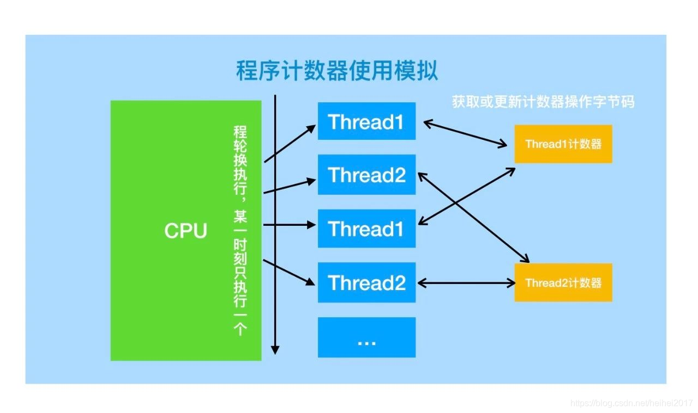

# JVM虚拟机（上）

## 1. ⭐️介绍JVM的内存区域（运行时数据区）

[JVM之内存结构图文详解](https://www.huaweicloud.com/articles/4799df506d5b9ae8bd0a5cb5247723b5.html) 

JVM自动内存管理包含两部分：运行时数据区域、直接内存(Direct Memory 也被称为堆外内存)。

其中运行时数据区包括两个部分，线程共享区域和线程私有区域。


1. `JVM` 分为五个区域：虚拟机栈、本地方法栈、方法区、堆、程序计数器。

2. 其中堆和方法区是线程共享的部分，其它是线程私有/隔离的。
   图中已经用颜色区分，绿色表示“通行”，橘黄色表示停一停（需等待）。
3. JVM不同区域的占用内存大小不同，一般情况下堆最大，程序计数器较小。
   那么最大的区域会放什么？当然就是 `Java` 中最多的 `对象` 了。

### 堆

`Java堆(Heap)` 是用来存放**实例对象和数组对象**的（由于存在[逃逸分析技术](分析这个对象不会被其它方法或线程调用)，实例对象和数组对象也可以分布在栈上，随着出栈而销毁），同时，因为堆占用内存空间最大，**堆也是Java垃圾回收的主要区域**（重点对象），因此也称作 `GC堆`（Garbage Collected Heap）。

由于现在垃圾收集器基本都采用**分代垃圾收集算法**，所以 `Java堆` 还可以细分为新生代和老年代。

`Java堆` 在物理上可以不连续，只要逻辑连续就好。

**堆上分配对象的方法**

在堆上分配对象的方法有：指针碰撞和空闲列表。前者是堆内存规整的情况下，所以用过和空闲的内存中有明确的分界线；而后者用空闲列表来记录内存的使用情况。规整与否是由垃圾回收器是否压缩整理决定。

要增加堆空间时，往上“拼凑”（可扩展性）即可。但当堆中没有内存完成实例分配，并且堆也无法再扩展时，将会抛出 `OutOfMemoryError` 异常（空间不足则抛出 `OutOfMemoryError`）。

**堆上对象的访问方式**

堆上对象的访问方式：通过栈上的 `reference` 数据来操作堆上的具体对象。目前主流的访问方式有使用句柄和直接指针两种。

对于句柄，`Java堆` 中将会划分出一块内存来作为句柄池，`reference` 中储存的就是对象的句柄地址，而句柄中包含了对象实例数据和类型数据各自的具体地址信息。

对于指针，`reference` 中储存的直接就是对象地址。

前者稳定，后者效率高。

### 方法区

`方法区(Method Area)` 与 `Java堆` 一样，是各自线程共享的区域。

它用于已被虚拟机加载的 `类信息`、`常量`、`静态变量`、`即时编译器编译后的代码`、`运行时常量池` 等数据。

其中 `运行时常量池` 用于存放编译器生成的各种[字面量](字面量：1. 文本字符串；2. 八种基本类型的值；3.被声明为 final 的常量等。) 和 [符号引用](1. 类和方法的全限定名；2.字段的名称和描述符；3. 方法的名称和描述符。) 。

`运行时常量池` 相对于 `Class常量池` 具有动态性，可以在运行期间利用 `intern方法` 将常量放入池中。

空间不足则抛出 `OutOfMemoryError`

方法区的内存回收目标主要是针对**常量池的回收**和**对类型的卸载**.

一般来说这个区域的回收“成绩”比较难以令人满意，尤其是类型的卸载，条件相当苛刻，但是回收确实是有必要的。

引申：方法区在虚拟机中的具体实现是怎么样的？Java7 和 Java8 有什么差异？

⭐️永久代(PermGen)和元空间(Metaspace)将回答该引申。


### 虚拟机栈

`虚拟机栈(VM Stack)` 是Java 方法执行的内存模型，线程私有，生命周期与线程相同。

每个方法执行都会创建一个`栈帧(Stack Frame)`，用于储存**局部变量表**、**操作数栈**、[动态链接](运行时将方法区的“符号引用”转化为“直接引用”) 和方法返回地址等信息。

每一个方法从调用至执行完成的过程，都对应着一个栈帧在虚拟机栈里从入栈到出栈的过程。


**局部变量表(Local Variable Table)**是一组变量值存储空间，用于存放方法参数和方法内定义的局部变量。包括8种基本数据类型、对象引用（`reference` 类型）和 `returnAddress` 类型（指向一条字节码指令的地址）。

其中 `64` 位长度的 `long` 和 `double` 类型的数据会占用 `2` 个局部变量空间（`Slot`），其余的数据类型只占用 `1` 个。

`StackOverflowError`：线程请求的栈深度大于虚拟机所允许的深度；

`OutOfMemoryError`：如果虚拟机可以动态扩展，但扩展时无法申请到足够的内存。

**操作数栈(Operand Stack)也称作操作栈**，是一个 `后入先出栈(LIFO)`。随着方法执行和字节码指令的执行，会从局部变量表或对象实例的字段中复制常量或变量写入到操作数栈，再随着计算的进行将栈中元素出栈到局部变量表或者返回给方法调用者，也就是出栈/入栈操作。

**动态链接：**Java虚拟机栈中，每个栈帧都包含一个指向运行时常量池中该栈所属方法的符号引用，持有这个引用的目的是为了支持方法调用过程中的 `动态链接(Dynamic Linking)`。

**方法返回地址：**无论方法是否正常完成，都需要返回到方法被调用的位置，程序才能继续进行。


### 本地方法栈

`本地方法栈(Native Method Stacks)` 与虚拟机栈作用相似，也会抛出 `StackOverflowError` 和 `OutOfMemoryError` 异常。

区别在于虚拟机栈为虚拟机执行 `Java方法（字节码）`服务，而本地方法栈是为虚拟机使用到的 `Native方法` 服务。


### 程序计数器

`程序计数器(Program Counter Register)` 记录当前线程所执行到的字节码的行号。

程序计数器的作用可以看做是当前线程所执行的字节码的行号指示器。字节码解释器工作时就是通过改变计数器的值来选取下一条字节码指令，其中，分支、循环、跳转、异常处理、线程恢复等基础功能都需要依赖计数器来完成。 

每个线程都有一个程序计数器，唯一没有 `OutOfMemoryError` 的区域。

Java虚拟机的多线程是通过线程轮流切换并分配处理器执行时间的方式来实现的，在任何一个确定的时刻，一个处理器（对于多核处理器来说是一个内核）只会执行一条线程中的指令。




**小结**


### 运行时内存区域外 规定的直接内存

`直接内存(Direct Memory)` 并不是虚拟机运行时数据区的一部分，也不是《Java虚拟机规范》中定义的内存区域。但是这部分内存也被频繁地使用，而且也可能导致 `OutOfMemoryError` 异常出现。

**直接内存的引入**
在 `JDK 1.4` 中新加入了 `NIO(New Input/Output)`类，引入了一种基于 `通道(Channel)` 与 `缓冲区(Buffer)` 的 `I/O` 方式，

它可以直接使用 `Native函数库` 直接分配堆外内存，然后通过一个存储在 `Java堆` 中的 `DirectBytebuffer对象` 作为这块内存的引用进行操作。这样就能在一些场景中显著提高性能，因为避免了在 `Java堆` 和 `Native堆` 之间来回复制数据。

**直接内存的分配**
本机直接内存的分配不会受到Java堆大小的限制，但是是会受到本机总内存（包括物理内存、SWAP分区或者分页文件）大小以及处理器寻址空间的限制。


## 2. ⭐️简述永久代(PermGen)和元空间(Metaspace)

### 永久代(PermGen)

永久代是上述 `运行时内存区域` 中 `方法区` 在 `Hospot` 的一种具体实现。

由于方法区主要存储类的相关信息，所以对于动态生成类的情况比较容易出现永久代的内存溢出，抛出异常( `Java.lang.OutOfMemoryError: PermGen space` )。

为了避免这类问题，`Java7` 中永久代中储存的部分数据已经开始转移到 `Java Heap` 或 `Native Memory` 中了。

比如 `符号引用(Symbols)` 转移到了 `Native Memory`；`字符串常量池(internal strings)` 转移到了 `Java Heap`；类的 `静态变量(class statics) ` 转移到了 `Java Heap`。 

最终在 `Java1.8` 中 `Hotspot` 取消了永久代，元空间登上舞台。


### 元空间(Metaspace)

方法区同样存在于元空间(Metaspace)，但是不再与堆连续，而是存在于 [本地内存(Native Memory)](本地内存(Native Memory)，也被称为 C-Heap，是供 JVM 自身进程使用的。当 Java Heap 空间不足时会触发 GC，而 Native Memory 空间不够却不会触发 GC。)。

在默认情况下，元空间是可以无限使用本地内存的，但为了不无限扩展，JVM 同样提供了参数来限制元空间大小。 


**引申：为什么使用元空间代替永久代？**

1. 字符串存在永久代中，容易出现性能问题和内存溢出。
2. 类和方法的信息比较难确认其大小，因此对永久代的大小指定比较困难，太小容易出现永久代溢出；太大则容易导致老年代溢出。
   另外，使用 PermSize 和 MaxPermSize 设置永久代的大小就决定了永久代的上限，但是动态生成类加载容易出现 OOM错误。
   与之相反，当使用元空间时，可以加载多少类的大小不再由 MaxPermSize 控制，而由系统的实际可用空间来控制。
3. 永久代会为 GC 带来不必要的复杂度，并且回收效率偏低。
4. Oracle 可能会将 Hotspot 与 JRockit 合二为一。
   JRockit 从来没有所谓的永久代，也不需要开发人员设置永久代的大小，但仍运行良好、不用担心运行性能。


## 3. ⭐️如何判断对象已经死亡

引用计数法和可达性分析法。

### 引用计数法

每当有一个地方引用它，计数器就加1；当引用失效，计数器就减1；任何时候计数器为0的对象就是不可能再被使用的。

目前主流的虚拟机中并没有选择这个算法来管理内存。

主要的原因是它很难解决对象之间互相循环引用的问题。


### 可达性分析法

这个算法的基本思想就是通过一系列被称为 **`GC Roots`** 的对象作为起点，从这些节点开始向下搜索，节点所走过的路径称为引用链，当一个对象到 `GC Roots` 没有任何引用链相连的话，则证明此对象是不可用的。

可以作为 `GC ROOT` 的对象包括：`虚拟机栈` 中引用对象、`方法区` 中`类静态属性`引用的对象、`方法区` 中`常量`引用对象、`本地方法栈` 中引用对象。


### 真的死了吗？

即使在可达性分析法中不可达的对象，也并非是“非死不可”的，这时候它们暂时处于“死缓阶段”，**要真正宣告一个对象死亡，至少要经过两次标记过程**；可达性分析法中不可达的对象被第一次标记并且进行一次筛选，筛选的条件是此对象是否有必要执行 finalize 方法。

当对象**没有覆盖 `finalize` 方法**或 **`finalize` 方法已经被虚拟机调用过**时，虚拟机将这两种情况视为**没有必要执行**。

被判定为需要执行的对象将会被放在一个队列中进行**第二次标记**，除非这个对象与引用链上任何一个对象建立关联，否则就会被真的回收。


## 4. ⭐️ 简述强、软、弱、虚引用

**强引用**

`=号` 的引用，比如 `User user = new User();`。

如果一个对象具有强引用，垃圾回收器绝不会回收它。当内存空间不足时，Java虚拟机宁愿抛出 OOM错误使程序异常终止，也不会回收它。

**软引用**

`SoftReference user = new SoftReference<>(new User());`

在内存不足、促发 `Full GC` 的时候，软引用会回收掉。只要该对象不被垃圾回收器回收，它就可以被程序使用。软引用可用来实现内存敏感的高速缓存。

**弱引用**

`WeakReference user = new WeakReference<>(new User());`

相对于软引用，弱引用关联的对象只能生存到下一次垃圾回收(比如 `Minor GC`、`Full GC`)之前。

并发工具类 `ThreadLocal` 就用到弱引用，防止 `key` 无法被回收。

**虚引用**

`PhantomReference user = new PhantomReference<>(new User(), new ReferenceQueue());`

虚引用跟没有引用一样，任何时候都有可能被垃圾回收。

虚引用主要用来跟踪对象被垃圾回收器回收的活动。

虚引用与软引用、弱引用的区别在于：虚引用必须和 **`引用队列(ReferenceQueue())`联合使用**。

当垃圾回收器准备回收一个对象时，如果发现它还有虚引用，就会在回收对象的内存之前，把这个虚引用加入到与之关联的引用队列中。这样就可以通过判断引用队列中是否已经加入了虚引用来了解被引用的对象是否**将要被垃圾回收器回收**，可以做一些在回收之前的必要行动。

虚与软、弱引用的区别：软、弱引用都是在引用对象被垃圾回收**后**，Java虚拟机才把引用加入到与之关联的引用队列中(后)；而虚引用对象在垃圾回收**前**，Java虚拟机把引用加入到与之关联的引用队列中(前)。


## 5. ⭐️ 简述垃圾收集算法以及各自的特点

### 标记-清除算法

首先标记出所有需要回收的对象，在标记完成后统一回收所有被标记的对象。

它是最基础的收集算法，会带来两个明显的问题：1. 效率问题；2. 空间问题（标记清除后会产生大量不连续的碎片🧩）


### 复制算法（强行设置边界，Minor GC算法采用）

将新生代区分为大小相同的两块，每次使用其中一块。当这一块的内存使用完后，就将还存活的对象复制到另一块去，然后再把使用的空间一次清理掉。这样就使每次的内存回收都是对内存区的一半进行回收。但是，为了收集而使内存使用量降低为一半，成本较高。

所以一般不会 `1:1` 划分边界，可以分一块比较大的 `Eden空间` 和两块较小的 `Survivor空间`，每次使用 `Eden空间` 和其中一块 `Survivor`。

**当Eden区内存不够的时候就会触发一次Minor GC**，对新生代区进行一次垃圾回收。

当回收时，将 `Eden` 和 `Survivor` 中仍存活的对象一次性复制到另一块 `Survivor` 空间 上，最后清理 `Eden空间` 和 `Survivor空间`。

大小一般是 `8:1:1`，每次浪费 `10%` 的 `Survivor空间`。

但是这里有个问题，就是如果存活的对象所需内存大于 `10%` 怎么办？

这里采用一种分配担保策略：多出来的对象直接进入老年代，**当老年代也满了装不下的时候，就会抛出OOM**。


### 标记-整理/清除算法（整理出边界，Major GC采用）

标记过程仍然与 **`标记-清除`** 算法一样，但后续步骤不是对可回收对象进行回收，而是让所有存活的对象向一端移动，然后直接清理掉端边界以外的内存。

```markdown
触发Minor GC的条件：
 1. 在进行Major GC之前，一般都先进行了一次Minor GC，使得有新生代的对象进入老年代，当老年代空间不足时就会触发Major GC。
 2. 当无法找到足够大的连续空间分配给新创建的较大对象时，也会触发Major GC进行垃圾回收腾出空间。
Major GC的耗时比较长，因为要先整体扫描再回收，Major GC会产生内存碎片。
为了减少内存损耗，一般需要合并或者标记出来方便下次直接分配。
```


### 分代收集法（结合以上部分）

一般将 `Java堆` 分为新生代和老年代，这样我们就可以根据各个年代的特点选择合适的垃圾收集算法。

比如在新生代中，每次手机都会有大量对象死去，所以可以选择复制算法（`Minor GC` 采用该算法），只需要付出少量对象的复制成本，就可以完成每次垃圾收集。

而老年代的对象存活几率是比较高的，所以我们可以选择 **`标记-清理`** 或 **`标记-整理`**算法进行垃圾回收。


## 6. ⭐️常见的垃圾收集器有哪些

如果说收集算法是内存回收的方法论，那么垃圾收集器就是内存回收的具体实现。

垃圾收集器主要有：

新生代收集器： `Serial`、`ParNew`、 `Parallel Scavenge`，一般采用复制算法；

老年代收集器：`Serial Old`、`Parallel Old`、`CMS`，一般采用 **`标记-清除/整理算法`**；

新生代和老年代收集器：`Garbage First收集器 (简称G1收集器)`。

1. **`Serial收集器`**：单线程收集器，不仅仅意味着它只会使用一条垃圾收集线程去完成垃圾收集工作，重要的是它在进行垃圾收集工作的时候必须暂停其他所有的工作线程("Stop The World")，直到它收集结束。

2. **`ParNew收集器`** 其实就是 `Serial收集器` 的多线程版本，随着 CPU 增加，可以显示出优势(并行)。
   补充 并行 和 并发 的知识点

   1. **并行(Parallel)**：指**多条垃圾收集线程并行工作**，但此时用户线程仍处于等待状态。
   2. **并发(Concurrent)**：指用户线程与垃圾收集线程**同时执行**(但不一定是并行，可能会交替执行)，用户程序在继续运行，而垃圾收集器运行在另一颗 CPU 上。

3. **`Parallel Scavenge收集器`** 是一个新生代收集器，使用复制算法，**并行的多线程收集器**。
   与 `ParNew收集器` 类似，但是**侧重点是吞吐量**(CPU 运行用户代码时间/CPU消耗的总时间)。
   可以设置参数来调整最大垃圾收集停顿时间和吞吐量大小。

4. **`Serial Old收集器`** 是 `Serial收集器` 的老年代版本，它同样也是单线程收集器。

5. **`Parallel Old收集器`** 是  `Parallel Scavenge收集器` 的老年代版本，使用多线程和 `标记-整理` 算法。
   在**注重吞吐量以及CPU资源配合**的场合，都可以优先考虑  `Parallel Scavenge收集器` 和  `Parallel Old收集器`。

6. **`CMS收集器(Concurrent Mark Sweep)`**，老年代收集器，采用 **`标记-清除`** 算法，是一种以获取**最短回收停顿时间为目标的收集器**。它非常符合在注重用户体验的应用上的使用。
   整个过程有四个步骤：`初始标记`、`并发标记`、`重新标记` 和 `并发清除`。**`Spark Streaming` 采用这个，最少停顿**。

   1. 初始标记：暂停所有的其它线程，并记录下直接与 GC root 相连的对象，速度很快；
   2. 并发标记：同时开始 GC 和用户线程，从 GC root 继续向下进行标记，但是用户线程会继续更新对象的引用域。
   3. 重新标记：重新标记阶段就是为了修正并发标记期间因为用户程序继续运行而导致标记产生变动的那一部分对象的标记记录，这个阶段的停顿时间一般会比初始标记阶段的时间稍长，远远比并发时间短；
   4. 并发清除：开启用户线程，同时 GC 线程开始对已标记的区域进行清扫；

   优点是并发清除、延迟低
   缺点是 1. 采用“标记-清除”会产生碎片🧩；2. 无法处理浮动垃圾，在并发清除过程中，用户线程还在继续执行，还会不断垃圾，这部分只能等到下次 GC 时处理；3. 对CPU特别敏感，由于并发标记和并发清除时和用户线程并发执行，所以会导致用户程序变慢，总的吞吐量降低。

   1. **`G1收集器`**：唯一一个同时可以用于年轻代和老年代的垃圾收集器，采用 **`标记-整理`** 算法，避免碎片🧩。
      该收集器将内存分配为不同大小相等的 `region`，并**维护了一个优先列表**，每次根据允许的收集时间，优先选择回收价值最大的 `region` ，把它内存化整为零。
      但是由于引用关系的存在，仍然存在如何避免全局扫描的问题。
      这里采用每一个 `region` 用一个 `remembered Set` 进行记录引用关系，避免可达性分析阶段的全区域垃圾扫描。
      整个过程有四个步骤：`初始标记`、`并发标记`、`最终标记` 和 `筛选回收`。
      初始标记和并发标记 与 `CMS收集器` 相似；最终标记，将并发标记阶段对象变化记录在线程 Remembered Set Logs 里面，但是可并行执行。筛选回收，对每一个 `region` 的价值和成本就行筛选，根据用户期望的 GC 停顿时间，得到最好的回收方案并回收。
      特点：并发性强、分代收集、标记整理进行空间整合，可以预测停顿时间。


## 7. 吞吐量优先和响应优先的垃圾收集器如何选择

1. 吞吐优先
   新生代采用 `Parallel Scavenge` ，老年代采用 `Parallel Old`，并配置多个线程进行回收，设置参数来调整最大垃圾收集停顿时间和吞吐量的大小。

2. 响应时间优先
   设置老年代的收集器是 CMS(最短时间，spark streaming采用这个)，年轻代是 `ParNew` （多线程）。

3. 常用组合

   | Young                      | Old                   | JVM Options             |
   | -------------------------- | --------------------- | ----------------------- |
   | Serial                     | Serial                | -XX:+UseSerialGC        |
   | Parallel Scavenge          | Parallel Old / Serial | -XX:+UserParallelGC     |
   |                            |                       | -XX:+UserParallelOldGC  |
   | Serial / Parallel Scavenge | CMS                   | -XX:+UserParNewGC       |
   |                            |                       | -XX:+UseConcMarkSweepGC |
   | G1                         |                       | -XX:+UserG1GC           |

   

## 8. ⭐️ 内存分配与回收策略（对象何时进行老年代？）

大多数情况下，对象在新生代中 `Eden区` 分配。当 `Eden区` 没有足够空间进行分配时，虚拟机将发起一起 `Minor GC`。

1. Minor GC 和 Full GC 有什么不同呢？
   Minor GC：指发生新生代的垃圾收集动作，Minor GC 非常频繁，回收速度一般也比较快。
   Major GC：指发生在老年代的GC。
   Full GC：清理整个空间包括新生代和老年代。
   Major GC 和 Full GC 很难区分，许多 Major GC 是由 Minor GC 触发的，Major GC 要不 Minor GC 慢10倍以上。
2. 什么时候对象进行老年代？
   1. 大对象（需要大量内存连续的）直接进行老年代；
   2. 内存分配担保：新生成的对象放在 Eden，当 Eden 被填满后，垃圾回收后存活的对象复制放入 From(两个 Survivor 中的一个，另一个是 To)；当 From 满了，回收后存活的对象被复制到 To区域，Eden 中存活的对象也直接进入 To区域，原 From区域 被清空；当 To 被填满后，如果 Eden 中之前存活的对象还活着，直接进入老年代（空间分配担保）。
   3. 年龄判定：年龄计数器会为对象记录年龄，每次经过一次 GC 仍然存活的，年龄加一。当年龄超过设定的值，直接进入老年代。
      或者动态对象年龄判定，当如果 Survivor 空间中相同年龄所有对象大小的总和大于 Survivor 空间的一半，年龄大于或等于该年龄的对象就可以直接进入老年代，无需达到要求的年龄。
3. 内存分配担保
   安全的 Minor GC：老年代中最大可用的连续空间大于新生代所有对象的空间；
   冒险的 Minor GC：老年代中最大可用的连续空间大于历代晋升到老年代的平均水平且允许担保失败；如果小于平均水平，则直接进行 Full GC，让老年代腾出空间。


## 9. ⭐️ 虚拟机性能监控和故障处理工具

最好有实战经验，使用过工具，进行 JVM 调优，找个案例学习学习。

1. jps：JVM Process Status Tool，显示指定系统内所有的 HotSpot 虚拟机进程；
2. jstat：JVM Statistics Monitoring Tool，用于收集 HotSpot 虚拟机各方面的运行数据；
3. jinfo：Configuration Info for Java，显示虚拟机配置信息；
4. jmap：Memory Map for Java，生成虚拟机的内存转储快照（heapdump文件）；
5. jhat：JVM Heap Dump Browser，用于分析 heapdump 文件，它会建立一个 HTTP/HTML 服务器，让用户可以在浏览器上查看分析结果；
6. jstack：Stack Trace for Java，显示虚拟机的线程快照；

以上命令是命令行模式的。

1. jvisualvm：可视化来监控 Java 应用程序性能和跟踪。


