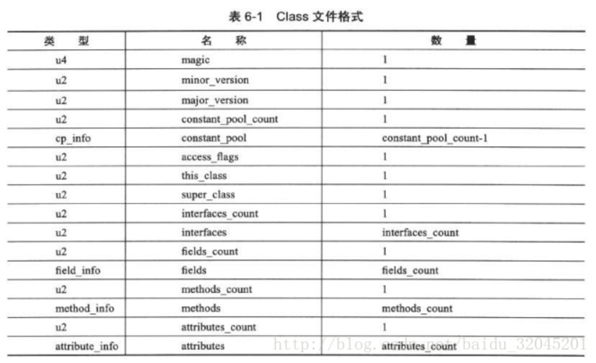
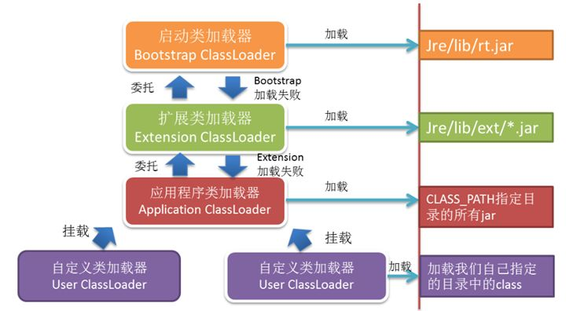
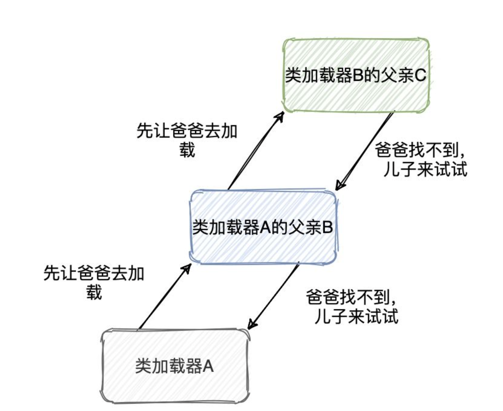

## JVM虚拟机（下）

## 10. Class类文件的结构

class 文件只有两种数据类型：**无符号数，表**

无符号数是基本类型，以 u1, u2, u4, u8 分别代表 1 个字节，2 个字节，4 个字节， 8 个字节的无符号数。

表是由多个无符号数或其他表作为数据项构成的复合数据类型，所有表都以“_info”结尾，甚至可以说整个 class 文件就是一张表。

Class文件是 Java虚拟机执行引擎的数据入口，也是 Java 技术体系的基础构成之一。

包括：[魔数(magic number)](class 文件的第一个数据项是一个 u4 类型，占 4 个字节，它的唯一作用是**用来确定该 class 文件是否可以被虚拟机接受**，这个作用就相当于文件的后缀名，.txt，.jpg，.gif，.mp4等等，那为什么不用后缀名呢？因为这样隐式的更加安全) 与版本号(version)、[常量池(constant_pool)](常量池的大小不固定，它由程序决定，所以在它之前是一个  u2 的常量池容量计数值（constant_pool_count）（后面的数据项都是一样，所有 _info 类型的数据项大小都是由程序决定，所以前面都有一个计数值）。这里需要注意的是，constant_pool_count 是从 1 开始计数的，空出 0 是为了表示“不引用任何一个常量池项目”) （注意和运行时常量池的区别）、访问标志（类定义标志）、类索引、父类索引和接口索引（确定一个类的继承关系）、字段表集合、方法表集合、属性表。

字段表包含什么信息？（就是我们平时定义一个字段的格式）

字段的作用域（**public**、private、protected 修饰符），是实例变量还是类变量（**static 修饰符**）、可变性（**final 修饰符**）、并发可见性（**volatile 修饰符**，是否强制从主内存读写）、可否被**序列化**（transient 修饰符）、字段**数据类型**、字段名称。

## 11. ⭐️ 简述 JVM 中的类加载机制

虚拟机把描述类的数据从 class 文件加载到内存，并对数据进行校验、转换解析和初始化。

类加载过程：加载、验证、准备、解析和初始化。

1. **加载 **
   通过类型的完全限定名，产生一个代表该类型的二进制数据流；解析这个二进制数据流的静态存储结构转化为方法区内的运行时数据结构；创建一个表示该类型的 Java.lang.Class 类的实例，作为方法区这个类的各种数据的访问入口。
2. **验证 **
   为了确保 Class 文件的字节流中包含的信息符合当前虚拟机的要求，并且不会危害虚拟机自身的安全。
3. **准备** 
   正式为类变量（static 修饰的）分配内存并设置类变量初始值的阶段，这些变量所使用的内存都将在**方法区**中进行分配。
   对于：`public static int value = 123;` ，那么变量 `value` 在准备阶段过后的初始值为 `0` 而不是 `123` ，这时候尚未开始执行 Java方法，把 `value` 赋值为 `123` 的动作将在初始化阶段才会被执行。
4. **解析** 
   虚拟机将常量池内的符号引用替换为直接引用的过程。
   主要对类或接口、字段、类方法、接口方法的解析，主要是静态链接，方法主要是静态方法和私有方法。
5. **初始化** 
   开始真正执行定义的 Java代码。执行 `clinit()`，该方法会收集所有类变量的赋值动作和静态语句合并产生，首先会执行父类。

## 12. ⭐️ 简述 JVM 中的类加载器以及双亲委派模型

1. **启动类加载器（Bootstrap ClassLoader）**
   这个类加载器使用C/C++语言实现的，嵌套在JVM内部，java程序无法直接操作这个类。

   它用来加载Java核心类库，如：`JAVA_HOME/jre/lib/rt.jar`、`resources.jar`、`sun.boot.class.path`路径中的，且被虚拟机识别的类库加载到虚拟机内存中，用于提供 JVM 运行所需的包。

   并不是继承自 `java.lang.ClassLoader`，它没有父类加载器。

   它加载`扩展类加载器`和`应用程序类加载器`，并成为他们的父类加载器

   出于安全考虑，启动类只加载包名为：java、javax、sun开头的类

2. **扩展类加载器（Extension ClassLoader）** 
   Java语言编写，由`sun.misc.Launcher$ExtClassLoader`实现，我们可以用Java程序操作这个加载器。

   派生继承自 `java.lang.ClassLoader`，父类加载器为`启动类加载器`。

   从系统属性：`java.ext.dirs`目录中加载类库，或者从JDK安装目录：`jre/lib/ext`目录下加载类库。我们就可以将我们自己的包放在以上目录下，就会自动加载进来了。

3. **应用程序类加载器（Application Classloader）** 
   Java语言编写，由`sun.misc.Launcher$AppClassLoader`实现，父类加载器为`启动类加载器`。
   由于这个类加载器是 `java.lang.ClassLoader` 中的 `getSystemClassLoader()` 方法的返回值，所以一般也称它为 系统类加载器。
   也因此，我们可以通过`ClassLoader#getSystemClassLoader()`获取并操作这个加载器。

   它负责加载`环境变量ClassPath`或者`系统属性java.class.path`指定路径下的类库，开发者可以直接使用这个类加载器。除了顶层的启动类加载器外，其余的类加载器都应该有自己的父类加载器。==这里父子关系通常是子类通过组合关系而不是继承关系来复用父类加载器的代码==。

 

### 双亲委派模型的工作过程

如果一个类加载器收到了类加载的请求，先把这个请求委派给父类加载器去完成（所以所有的加载请求最终都应该传送到顶层的 **启动类加载器** 中），只有当父加载器反馈自己无法完成加载请求时，子加载器才会尝试自己去加载。

原因是，如果用户自己编写了一个称为 `Java.lang.object` 的类，并放在程序的 `ClassPath` 中，那系统中将会出现多个不同的 `obejct` 类，Java类型体系中最基础的行为也就无法保证，应由程序也将会变得一片混乱。

引申：如果自己编写一个  `Java.lang.String` 会被加载吗？

答案是否定的，我们不能实现。

具体原因就是因为针对 `Java.*` 开头的类，JVM 的实现中以及保证了必须要由 **启动类加载器（Bootstrap ClassLoader）** 来加载。

不过双亲委派也可以被破坏，比如自定义一个 string 类但是包名不是 `Java.*`，可以放在用户目录下进行加载。

### 双亲委派模型的四次破坏

#### 第一次破坏：历史原因

在 JDK1.2 之前，那时候还没有双亲委派模型，不过已经有了 ClassLoader 这个抽象类，所以已经有人继承这个抽象类，重写 `loadClass()` 方法来实现用户自定义类加载器。

而在 1.2 的时候要引入双亲委派模型，为了向前兼容， `loadClass()` 这个方法还得保留着使之得以重写，新搞了个 `findClass()` 方法让用户去重写，并呼吁大家不要重写 `loadClass()` 只要重写 `findClass()`。

这就是第一次对双亲委派模型的破坏，**因为双亲委派的逻辑在 `loadClass()` 上，但是又允许重写 `loadClass()`，重写了之后就可以破坏委派逻辑了**。

#### 第二次破坏：反向加载

这个模型自身的缺陷所导致的，双亲委派模型很好地解决了各个类加载器的基础类统一问题(越基础的类由越上层的加载器进行加载)，基础类之所以被称为“基础”，是因为它们总是作为被调用代码调用的API。

但是，如果基础类又要调用用户的代码，那该怎么办呢?

为了解决这个困境，Java设计团队只好引入了一个不太优雅的设计：线程上下文件类加载器(`Thread Context ClassLoader`)。这个类加载器可以通过 `java.lang.Thread` 类的 `setContextClassLoader()` 方法进行设置，如果创建线程时还未设置，它将会从父线程中继承一个；如果在应用程序的全局范围内都没有设置过，那么这个类加载器默认就是 `应用程序类加载器`。

有了线程上下文类加载器，JNDI服务使用这个线程上下文类加载器去加载所需要的SPI代码，也就是父类加载器请求子类加载器去完成类加载动作，这种行为实际上就是打通了双亲委派模型的层次结构来逆向使用类加载器，已经违背了双亲委派模型，但这也是无可奈何的事情。Java中所有涉及SPI的加载动作基本上都采用这种方式，例如我们最常用的JDBC。

#### 第三次破坏：结构复杂化

**由于用户对程序的动态性的追求导致的**，比如**代码热替换**、**模块热部署** 等，简单地说就是机器不重启，只要部署上就能用。

`OSGi` 实现模块化热部署的关键是它自定义的类加载机制。

每一个程序模块(Bundle)都有一个自己的类加载器，当需要更换一个 Bundle 时，就把 Bundle 连同类加载器一起换掉以实现代码的热替换。 

在 `OSGi` 环境下，类加载器不再是双亲委派模型中的树状结构，而是进一步发展为网状结构。

#### **第四次破坏：JDK1.9 引入模块系统**

在 JDK9 引入模块系统之后，类加载器的实现其实做了一波更新。

像扩展类加载器被重命名为平台类加载器，核心类加载归属了做了一些划分，平台类加载器承担了更多的类加载，上面提到的 -Xbootclasspath、java.ext.dirs 也都无效了，rt.jar 之类的也被移除，被整理存储在 jimage 文件中，通过新的 JRT 文件系统访问。

当收到类加载请求，会先判断该类在具名模块中是否有定义，如果有定义就自己加载了，没的话再委派给父类。

## 13. 简述 JVM 中静态分派和动态分派（引申：重载和重写）

**静态分派** 

依赖静态类型定位方法的分派，发生在编译时期，典型应用为方法的重载。

重载的参数是通过静态类型确定的，直接调用父类。

**动态分派** 

在运行时期根据实际类型来确定方法的分派，发生在程序运行时，典型应用是方法的重写，也是多态的一种体现。

根据转型来确定是否调用父类还是子类的方法。

### 非虚方法和虚方法

**非虚方法** 

包括**所有 static 方法 + final/private 方法**，通过 `invokespecial` 指令调用，对这个非虚方法的符号引用将转为对应的直接引用，即转为直接方法，在编译完成时就确定唯一的调用方法。

**虚方法** 

通过 `invokevirtual` 指令调用，且会有**静态或动态分派**。

具体先根据编译期时方法接收者和方法参数的静态类型来分派，再在运行期根据指根据方法接收者的实际类型来分派（多态实现原理，可以理解为被重写，一般指实例方法）。

## 14. JVM 启动模式之 client 与 server

**指定 JVM 启动模式**

JVM 启动时，通过 `-server` 或 `-client` 指定启动模式。

**client 模式与 server 模式的区别**

1. 编译器方面
   当虚拟机运行在 client 模式时，使用的是一个代号为 c1 的轻量级编译器；
   而 server 模式启动时，虚拟机采用的是相对重量级、代号为 c2 的编译器。
   c2 编译器比 c1 编译器编译得相对彻底，服务起来之后，性能更高。
2. GC 方面
   client 模式下的新生代(Serial收集器) 和 老年代(Serial Old)选择的是 **串行 GC**；
   server 模式下新生代选择**并行回收GC** (默认是Parallel Scavenge，内存分配和回收的算法和串行相同，唯一不同**仅在于回收时为多线程**)，老年代选择 **并行GC**(默认是Parallel MSC)。
3. 启动方面
   client 启动快，编译快，内存占用少，针对桌面应用程序设计，**优化客户端环境的启动时间**。
   server 模式启动慢，编译更完全，编译器是自适应编译器，效率高，针对服务端应用设计，**优化服务器环境的最大化程序执行速度**。

注：一般来说，系统应用选择有两种方式：吞吐量优先和停顿时间优先，对于吞吐量优先的采用 server 默认的 并行GC (Parallel Scavenge)，对于时间优先的选择 并发GC (CMS)。

## 15. ⭐️ 如何进行 GC 调优

[如何优化Java GC](https://www.cnblogs.com/ityouknow/p/7653129.html)

这个属于较为开放的题目，可以结合自己项目实战出发，体现 JVM 调优。

1. 可以先说 GC 是什么，可以提及 垃圾回收算法、收集器等
2. 优化目标
   1. 将进入老年代的对象数量降至最低
   2. 减少 Full GC 的执行时间
   3. 优化 JVM 参数：比如堆和栈大小，设置垃圾收集器模式
3. 优化策略
   1. 将新对象预留在新生代
      由于 Full GC 的成本远高于 Minor GC，因此尽可能将对象分配在新生代，实际项目中根据 GC 日志分析新生代空间大小分配是否合理。
      适当通过 `-Xmn` 命令调节新生代大小，最大限度降低新对象直接进入老年代的情况。
   2. 大对象进入老年代
      虽然大部分情况下，将对象分配在新生代是合理的。但是对于大对象，这种做法却值得商榷。大对象如果首次分配在新生代，可能会出现空间不足导致很多年龄不够的小对象被分配进老年代，破坏新生代的对象结构，可能会出现频繁的 Full GC。
      因此，对于大对象，可以设置直接进入老年代（当然，短命的大对象对于垃圾回收来说简直是噩梦）。
      `-XX:PretenureSizeThreshold` 可以设置直接进入老年代的对象大小。
   3. 合理设置进入老年代对象的年龄
      `-XX:MaxTenuringThreshold` 设置对象进入老年代的年龄大小，减少老年代的内存占用，降低 Full GC 发生的频率。
   4. 设置稳定的堆大小
      堆大小设置有两个参数：`-Xms` 初始化堆大小，`-Xmx` 最大堆大小。
   5. 满足以下指标，则一般不需要进行 GC 优化
      1. Minor GC 执行时间不到 50ms；
      2. Minor GC 不频繁，约 10s 一次；
      3. Full GC 执行时间不到 1s；
      4. Full GC 执行频率不算频繁，不低于 10分钟一次。

## 16. JVM 进程有哪些线程启动

[JVM进程启动会启动哪些线程？](https://www.cnblogs.com/jiangwangxiang/p/9094006.html) 

1. **main 主线程** 
   执行我们指定的启动类的main方法

2. **Reference Handler 处理引用的线程** 
   它主要用于处理引用对象本身（软引用、弱引用、虚引用）的垃圾回收问题。

3. **Finalizer  垃圾回收的线程** 
   调用对象的finalize方法的线程，就是垃圾回收的线程。
   JVM在垃圾收集时会将失去引用的对象包装成Finalizer对象（Reference的实现），
   并放入ReferenceQueue，由Finalizer线程来处理；
   最后将该Finalizer对象的引用置为null，由垃圾收集器来回收。

4. **Signal Dispatcher 分发处理发送给JVM信号的线程** 
   attach Listener线程的职责是接收外部jvm命令，当命令接收成功后，会交给signal dispather线程去进行分发到各个不同的模块处理命令，并且返回处理结果。
   signal dispather线程也是在第一次接收外部jvm命令时，进行初始化工作。　

5. **Attach Listener 负责接收外部的命令的线程** 
   该线程是负责接收到外部的命令，执行该命令，并且把结果返回给发送者。
   通常我们会用一些命令去要求jvm给我们一些反馈信息，如：java -version、jmap、jstack等等。
   如果该线程在jvm启动的时候没有初始化，那么，则会在用户第一次执行jvm命令时，得到启动。

