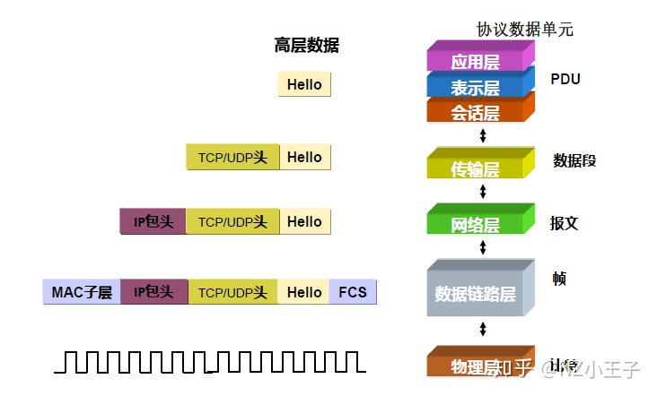
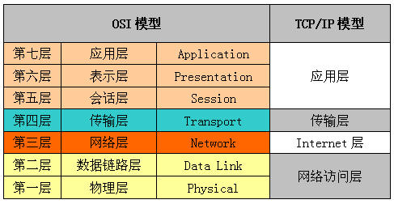

# Java 基础语法（下）15-18


## 15. `IO` 流

### 1⃣️概念

- 输入流和输出流：将数据从外部介质输入到内存为输入流，将数据从内存输入到外部介质为输出流。
- 字节流和字符流：以字节为单位的输入输出流；字节流在读取文字字节数据后，不直接操作而是查询指定编码表，获取相应文字，这样为字符流，即字节流+编码表。
- 字节流的顶层父类：InputStream 和 OutputStream
- 字符流的顶层父类：Reader 和 Write


### 2⃣️字符流操作

- **FileWrite** 

  ```java
  FileWrite fw = new FileWrite("demo.txt"); //创建一个文件，若存在则覆盖
  FileWrite fw = new FileWrite("demo.txt", true); // 在文件内容后追加
  fw.write("abcdefa"); // 写入
  fw.flush(); // 刷洗保存，相当于不关闭文件，点击保存
  fw.close(); // 相当于关闭文件前保存，只能保存一次，流就关闭了
  ```

  输出流异常输出方式

  ```java
  FileWrite fw = null;
  try{
    fw = new FileWrite("demo.txt");
    fw.write("abdefa");
  
  }catch{
    if(fw != null) {
      // 因为下面每段处理都是封闭的，所以需要将引用变量初始化在外面
      try{
        fw.close(); // 因为必须关闭流，所以放在 finally 里面
      } catch (IOException){
        throw new RuntimeException("关闭失败")
      }
    }
  }
  ```

- **FileReader** 

  按照单个字符取

  ```java
  FileReader fr = new FileReader("demo.txt");
  int ch;
  while ((ch = fr.read())!=-1){
    System.out.println(ch);
  }
  ```

  按照数组取

  ```java
  char[] chr = new char[3];
  int len = 0;
  while ((len=fr.read(chr))!=-1){
    System.out.println(new String(chr, 0, len));
  }
  ```


### 3⃣️缓冲区 —— BufferedWrite

缓冲区：将数据缓存，提高对数据读写的效率

```java
FileWriter fw = new FileWriter("buf.txt"); // 建立一个写入流
BufferedWriter bf = new BufferedWriter(fw); // 提高效率，将写入流与缓冲区连接。在内存上建一个缓冲区，先通过流写入到缓冲区，然后再用缓冲区的方法对缓冲区进行操作。
bf.write("dashdjfa"); // 读取的是缓冲区的内容
bf.newLine(); // BufferedWriter 特有方法
bf.write("dashdjfa"); 
bf.close(); //实际是关闭了流
```


### 4⃣️缓冲区 —— BufferedReader

```java
FileReader fr = new FileReader("buf.txt"); 
BufferedReader br = new BufferedReader(fr);
String line; // 按照行来读 readLine() 为特有方法，当没数据了，返回 null
while ((line = br.readLine())!=null){
  system.out.println(line);
}
```


### 5⃣️流操作和缓冲区操作的区别

1. 流操作

   直接将内存和硬盘建立连接。

   比如，你去厨房拿一个包子（数据），回到餐厅吃（处理），吃完一个，再回去拿。

2. 缓冲区

   以读数据来说，先将数据从硬盘当中通过流操作读入到内存中缓冲区中，然后通过缓冲区方法区处理缓冲区中的数据。

   比如，你拿着篮子去厨房，先把包子（数据）装在篮子（缓冲区）里，然后拿到餐厅，去吃（处理）。

3. 利用缓冲区操作，效率更高。

4. 缓冲区中读写具备特有方法，比如可以读取一行数据，写个换行符等。


### 6⃣️装饰设计模式

**概念** 

对一组对象的功能进行增强时，就可以使用该模式解决。

**继承和装饰设计模式的区别** 

继承如果只是为了添加功能，功能多了就会使继承体系变得臃肿；

装饰设计模式就是为了将对象的功能增强，比如缓冲区的原理就是装饰设计模式，为了将读取操作变的高效。

缓冲区读取操作中，将流操作进行了装饰，使读取功能变成缓冲区的方法，提高了读取效率。

**装饰类和被装饰类都在同一接口或父类** 
`java.io.Reader`

`java.io.FileReader ` 被装饰的对象，基本流操作

`java.io.BufferedReader` 装饰设计的对象，将基本流操作装饰成缓冲区方法，高效

总结：二者都属于同一体系，装饰为了让原先的对象功能增强。


### 7⃣️字节流

字节流的顶层父类：InputStream 和 OutputStream

基本操作和字符流差不多，也存在缓冲区方法。

例子：通过字节流对音乐文件进行复制。(里面用到缓冲区提高效率，下面介绍)

```java
public static void (String[] args) throws IOException {
    //读取
    FileInputStream fis = new FileInputStream("E:\ceshi.mp3");
    BufferedInputStream bis = new BufferedInputStream(fis);
    //写入
    FileOutputStream fos = new FileOutputStream("E:\ceshi1.mp3");
    BufferedOutputStream bos = new BufferedOutputStream(fos);
    /*按单个字节*/
    /*int ch = 0;
    while((ch = bis.read())!= -1){
        bos.write(ch);
    }*/

    /*按照数组来复制*/
    int len =0;
    byte[] chr = new byte[1024];
    while ((len = bis.read(chr))!= -1){

        bos.write(chr,0,len);
    }
    bis.close();
    bos.close();
}
```


### 8⃣️键盘输入方法

1. 打开一个键盘输入流：`InputStream in = System.in;`

2. 利用 in.read() 方法读取字节，可以放在缓冲区或者数组来进行转换成字符串。

   键盘输入，每次按下回车键 `\r\n` 就会调用一次输入流进行读取，对于字节的话，一个回车符号为一个字节，字符流的话，回车是两个字符 `\r\n`。


### 9⃣️转换流（便于键盘录入）

将字节流和字符流进行互相转换

```java
/*缓冲区  <--  字符流  <--  字节流（键盘输入），解码*/
BufferedReader br = new BufferedReader(new InputStreamReader(System.in));
/*缓冲区  -->  字符流  -->  字节流（控制台显示），编码*/
BufferedWriter bw = new BufferedWriter(new OutputStreamWriter(System.out));
String line = null;
while ((line = br.readLine())!=null){//检测到换行符就读取
    if(line.equals("over"))
        break;
    bw.write(line.toUpperCase());
    bw.newLine();//字符流缓冲区特有方法
    bw.flush();
}
```

一个文件内容输入到另一个文件内（发现 IO 流技术也是有规律）

```java
/*缓冲区  <--  字符流  <--  字节流（源文件）*/
BufferedReader br = new BufferedReader(new InputStreamReader(new FileInputStream("buf.txt")));
/*缓冲区  -->  字符流  -->  字节流（目的文件）*/
BufferedWriter bw = new BufferedWriter(new OutputStreamWriter(new FileOutputStream("b.txt")));
```


### 🔟`IO` 流的操作规律

1. 两大体系两大高效：字节流、字符流、缓冲区方法 Buffered 和转换流
   - 字符流的体系：Reader 和 Writer
   - 字节流的体系：InputStream 和 OutputStream
   - 缓冲区的高效：加上 Buffered
   - 转换流的高效：键盘输入和键盘输出的流转换

2. 操作的具体设备
   - 硬盘：File
   - 键盘和控制台：System.in 和 System.out
   - 内存：数组
   - 网络：Socket 流


### 1⃣️1⃣️转换流的编码解码

编码规则发展历史

计算机是美国先发明的，所以最初用 1 个字节表达英文字母和符号(**ASCII**)，后来中国开始使用计算机，显示对 ASCII 进行了扩充，用 2 个字节表示一个汉字，先后出现了 **GB2312（常用简体）、GBK（包括繁体和生僻字）、GB18030（少数民族）**编码格式。

后来 ISO 国际标准组织开始统一世界编码，最初是 **UNICODE**（所有字符都是 2 个字节，英文就浪费存储资源了），由于某些原因长时间很难推广。直到互联网出现，网络传输 UTF-8 和 UTF-16 对 UNICODE 进行了算法转换，而且是采用**可变字节** 的编码方式，比如一个字母就是一个字节，汉字是三个字节，这样就统一了。


编码和解码

FileWriter 和 FileReader 是转换流的子类，采用的是 UTF-8。

但是如果想要指定编码表进行操作，必须使用转换流操作。

例如：将中文字符串按照 UTF-8 写入到文件中，并将文件内容读取到控制台。

关键词：输出转换流，字节输出流，输入转换流，字节读取流

```java
public static void outFileUTF() throws IOEeception{
  BufferedWriter bw = new BufferedWriter(new OutputStreamWriter(new FileOutputStream("utf.txt"), "UTF-8")); // 编码
  bw.write("你好");
  bw.close();
}
```

```java
public static void readFileByUTF() throws IOEeception{
  BufferedReader br = new BufferedReader(new OutputStreamReader(new FileInputStream("utf.txt"), "UTF-8")); // 解码
  String line = br.readLine();
  System.out.println(line);
}
```

分析：如果采用指定编码格式，必须使用转换流进行操作（从字符数据到字节数据中间存在一个编码表，这个编码表可以指定），不能直接使用 FileWrite 等操作，因为其是默认本地编码的。


### 1⃣️2⃣️File 类

File 类对文件和文件夹进行操作

- 获取

  文件名称 getName、相对路径 getPath、绝对路径 getAbsolutePath、文件大小 length、文件修改时间 lastModified

- 创建与删除

  创建文件 createNewFile、创建目录 mkdir、和 mkdirs（可以创建多级目录）、删除文件 delete

- 判断

  存在性 exists、是否为文件 isFile 和目录 isDirectory

- 重命名：renameTo

- 获取系统根目录和磁盘容量

  File.listRoots()、getTotalSpace等方法

- 获取目录内容

  获取当前目录中的文件和目录 list、只获取文件 listFile

- 过滤器

  在获取目录或文件时，过滤出自己想要的。过滤器是一种接口。

  ```java
  File file = new File("E:\\");
  // list 接受一个过滤器对象，内部不断调用 accept 方法对数组进行过滤
  String[] str = file.list(new FilterByExt(".mp3"));
  // 实现过滤器接口，覆盖过滤的方法
  class FilterByExt implements FilenameFilter{
    private String ext;
    FilterByExt(String ext){
      this.ext = ext;
    }
    
    @Override
    public boolean accept(File fir, String name) {
      return name.endsWith(ext);
    }
  }
  ```

- 深度遍历文件夹（递归学习）

  理解：这个方法的功能就是列出目录内的所有文件和文件夹，所以自己调用自己进行递归。

  ```java
  public static void listAll(File dir) {
    File[] list = dir.listFiles();
    for(int x-0; x<list.length;x++){
      if(list[x].isDirectory()){
        System.out.println(list[x].getname());
        listAll(list[x]); // 递归调用
      }
      else{
        System.out.println(list[x].getName());
      }
    }
  }
  ```

  说明递归就是自己调用自己，但是要注意递归的退出条件以及递归次数（因为需要不断进栈，所以次数太多可能会导致栈溢出）。程序里面用递归实现斐波那契数列。

  方法1:递归实现，但是效率低

  ```java
  public static int getNum(int n){
    if(n==0)
      return 0;
    if(n==1)
      return 1;
    return getNum(n-1) + getNum(n-2);
  }
  ```

  方法2:循环实现，效率高

  ```java
  public static int fibonacci(int n){
    int[] result = {0, 1};
    if (n < 2)
      return result[n];
    int fibNMinusOne = 1;
    int fibNMinusTwo = 0;
    int fibN = 0;
    for (i = 2; i <= n; i ++){
      fibN = fibNminusOne + fibNMinusTwo;// 将前面的结果向后移动一位，求和
      fibNMinusTwo = fibNMinusOne;
      fibNMinusOne = fibN;
    }
    return fibN;
  }
  ```

- 删除目录（目录里面有内容）

  原理：从目录最内层的文件开始删除，这层文件都删除以后在删除这层的文件夹

  方法：深度搜索，深度删除

  ```java
  // 深度搜索，从内到外进行删除
  public static void removeAll(File dir){
    File[] file = dir.listFiles(); // 从一层目录内的所有内容
    for(File f: file){
      if (f.isDirectory()){
        removeAll(f); // 是目录就递归，一直递归到最内层，然后找到文件删除掉
      }
      else{
        System.out.println(f.getAbsolutePath() + "---" + f.delete());
      }
    }
    // 当这层文件都删除以后，就把这层的目录都删除了
    System.out.println(dir.getAbsolutePath() + "---" + dir.delete());
  }
  ```


### 1⃣️3⃣️Properties 集合

Properties 集合属于 map 的 hashtable，用来和流相结合。


**特点** 

集合的键和值都是字符串类型；集合中的数组可以保存到流中，或者从流中获取数据；通常处理以键值对形式存在的配置文件。

**集合的存取操作和修改 ** 

存：`pro.setproperty("zhangsan1", "21");` 

取只能用键的集合来取键值

```java
Set<String> key = pro.stringPropertyNames();
for(String k:key){
  String val = pro.getProperty(k);
  System.out.println(k + ":" + val);
}
```

**持久化** 

原理：集合的数据本来在内存中，如果内存一旦释放，数据就会消失，所以将数据通过流操作输出到文件中，进行硬盘保存，达到持久化。

实现

```java
FileOutputStream fos = new FileOutputStream("prop.txt");
pro.store(fos, "name+age"); // 持久化方法
```

修改配置信息

1. 读取配置信息（必须是键值对存储的文件）

   ```java
   private static void loadFileProperties() throws IOException{
     Properties pro = new Properties();
     FileInputStream fis = new FileInputStream("prop.txt");
     pro.load(fis);
     pro.list(System.out); // 用于测试打印输出
   }
   ```

2. 修改配置信息

   ```java
   private static void modifyFileProperties() throws IOException{
     File file = new File("prop.txt"); // 判断文件是否存在
     if (!file.exists()){
       file.createNewFile(); // 不存在则创建
     }
     FileReader fr = new FileReader(file);
     Properties prop = new Properties();
     prop.load(fr); // 读取到集合
     // 修改集合
     prop.setProperty("zhangsan4", "34");
     // 重新写入到文件中去
     FileWriter fw = new FileWriter(file);
     prop.store(fw, "name + age");
     fw.close();
   }
   
   ```


### 1⃣️4⃣️`IO` 包的其它类

[IO 包中的其他类](https://www.cnblogs.com/linkworld/p/7519270.html)  

1. 打印流
   - PrintWriter 和 PrintWriter
   - 直接操作输入流和文件
2. 序列流
   - SequenceInputStream
   - 对多个输入流进行合并
3. 操作对象
   - ObjectInputStream 和 ObjectOutputStream
   - 被操作的对象需要实现 Serializable (标记接口)
4. RandomAccessFile
   - 随机访问文件, 自身具备读写的方法
   - 不是 IO 体系的子类,继承自 Object
5. 管道流
   - PipedInputStream 和 PipedOutputStream
   - 输入和输出可以直接进行连接, 通过结合线程使用


### 1⃣️5⃣️文件切割与合并

思想

一般按照大小来切割，将一个文件按照一定大小（比如 1 M）进行切割（一个输入流，多个文件输出流），并生成配置文件，文件中表明源文件的名称和碎片数量；

合并，先读取配置文件，确定源文件名以及碎片数量，再利用序列流江多个文件合并到一个文件中去（多输入流单输出）。

#### 切割

知识储备

基础知识非常重要，再复杂的功能也是由一个个基础的方法组成的，熟练，深刻的理解，掌握基础知识

- 关于File 的构造函数的理解

  `File(File parent,String Child)` 

  `File(String parent,String child)` 

  根据给定 parent路径名 和 child路径名 创建一个新的 File实例

- 关于 count++ 的理解

  命名切割的文件是 1 2 3 4 ，为什么 count =5

  很简单 i++; 先使用，再加1

  ```java
  int x=1;
  int y= x++;
  for(int i=0;i<4;i++){
    System.out.println(“y=”+y);
    System.out.println(“x=”+x);
  }
  ```

带着配置信息的切割

```java
/* 切割文件时，必须记录住被切割文件的名称，以及切割出来碎片文件的个数。 以方便于合并
这个信息为了进行描述，使用键值对的方式。用到了properties对象 */
Properties prop = new Properties();
/* 将被切割文件的信息保存到prop集合中 */
prop.setProperty("partcount", count+""); // 碎片文件的个数
prop.setProperty("filename", file.getName());
/* 如果有N个碎片，properties命名为 N+1.properties */
fos = new FileOutputStream(new File(dir,count+".properties"));
/* 将prop集合中的数据存储到文件中 */
prop.store(fos, "save file info");
fos.close();
fis.close();
```

完整切割代码示例

```java
/* 切割文件并写出切割配置文件信息 */
public class SplitFileDemo {
	
	// 定义一个 3M大小的 缓冲区  写 3145728比较好，写 1024*1024*3,
	// 程序在运行的时候，还要先运算一遍，影响效率
	private static final int SIZE = 3145728;
	
	public static void main(String[] args) throws IOException {
		
		File file = new File("E:\\tm.mp3");
		splitFile(file);

	}

	private static void splitFile(File file) throws IOException {
		
		// 用读取流 关联源文件
		FileInputStream fis = new FileInputStream(file);
		// 定义一个 3M的缓冲区
		byte[] buf = new byte[SIZE];
		
		// 创建目的
		FileOutputStream fos = null;
		int len = 0;
		int count = 1;
		
		/*
		 *  切割文件时，必须记住被切割的文件的名称，以及切割出来的碎片文件的个数
		 *  以方便合并。
		 *  这个信息为了进行描述，使用键值对的方式，用到了 properties对象
		 */
		
		Properties prop = new Properties();
		
		File dir = new File("E:\\partFiles"); // 定义切割文件存放的位置
		if(!dir.exists()){
			dir.mkdirs();
		}
		
		while((len=fis.read(buf))!=-1){
			
			fos = new FileOutputStream(new File(dir,(count++)+".part"));
			fos.write(buf,0,len);
			fos.close();
		}
		
		// 将被切割文件的信息 保存到 prop集合中
		/*
		 *  setProperty(String value,String key)
		 *  调用 Hashtable的方法 put
		 */
		prop.setProperty("partcount",count+"");
		prop.setProperty("filename",file.getName());
		
		// 如果有N个碎片，properties命名为 N+1.properties
		fos = new FileOutputStream(new File(dir,count+".properties"));
		
		// 将 prop集合中的数据 存储到文件中
		prop.store(fos,"save file info");
		
		fos.close();
		fis.close();
	}
}
```


#### 合并

1. 先拿到该目录下的 配置文件对象

   配置信息拿不到，或者文件不存在，就不用合并了
   配置文件怎么拿

   我们不知道配置文件的信息，但是知道配置文件的扩展名是 .properties
   所以要准备一个过滤器

   ```java
   File[] files = dir.listFiles(new SuffixFilter(".properties")); // 获取指定目录下的配置文件对象
   ```

2. 记录配置文件对象

   ```java
   File confile = files[0];
   ```

3. 获取该文件中的信息

   ```java
   Properties prop = new Properties();
   FileInputStream fis = new FileInputStream(confile);
   prop.load(fis);
   String filename = prop.getProperty(“filename”);
   int count = Integer.parseInt(prop.getProperty(“partcount”));
   ```

4. 获取该目录下的所有碎片文件

   ```java
   File[] partFiles = dir.listFiles(new SuffixFilter(".part"));
   ```

5. 将碎片文件和流对象关联 并存储到集合中

   ```java
   ArrayList al = new ArrayList();
   for(int x=0; x<partFiles.length; x++){
   al.add(new FileInputStream(partFiles[x]));
   }
   ```

6. 将多个流合并成一个序列流

过滤器代码

```java
public class SuffixFilter implements FilenameFilter{
	
	private String suffix;
	
	public SuffixFilter(String suffix){
		super();
		this.suffix = suffix;
	}

	public boolean accept(File dir, String name) {
		return name.endsWith(suffix);
	}
}
```

完整合并代码示例

```java
public class MergeFileDemo {

	/**
	 *    文件合并
	 * @throws IOException 
	 */
	public static void main(String[] args) throws IOException {
		
		File dir = new File("E:\\partFiles"); // 先关联 要合并的文件
		mergeFile(dir);
	}

	private static void mergeFile(File dir) throws IOException {
		
		// 合并文件，给的是文件夹，里面有一堆文件/目录
		// 获取指定目录下的 配置文件对象
		File[] files = dir.listFiles(new SuffixFilter(".properties"));
		
		if(files.length !=1){
			throw new RuntimeException(dir+",该目录下没有properties扩展名的文件或者不唯一");
		}
		// 记录配置文件对象
		File confile = files[0];
		
		// 获取该文件中的信息
		Properties prop = new Properties();
		FileInputStream fis = new FileInputStream(confile);
		prop.load(fis);
		
		String filename = prop.getProperty("filename");
		int count = Integer.parseInt(prop.getProperty("partcount"));
		
		// 获取该目录下的所有碎片文件
		File[] partFiles = dir.listFiles(new SuffixFilter(".part"));
		if(partFiles.length !=(count-1)){
			throw new RuntimeException(" 碎片文件不符合要求，个数不对!应该"+count+"个");
		}
		
		// 将碎片文件 和 流对象 关联，并存储到集合中
		ArrayList<FileInputStream> al = new ArrayList<FileInputStream>();
		for(int x=0;x<partFiles.length;x++){
			al.add(new FileInputStream(partFiles[x]));
		}
		
		// 将多个流 合并成一个流
		Enumeration<FileInputStream> en = Collections.enumeration(al);
		SequenceInputStream sis = new SequenceInputStream(en);
		FileOutputStream fos = new FileOutputStream(new File(dir,filename));
		
		byte[] buf = new byte[1024];
		int len = 0;
		while((len=sis.read(buf))!=-1){
			fos.write(buf,0,len);
		}
		fos.close();
		sis.close();
	}
}
```


### 1⃣️6⃣️对象序列化和反序列化

**Java序列化**是指把Java对象转换为字节序列的过程；而**Java反序列化**是指把字节序列恢复为Java对象的过程。

**原理** 

将对象按照序列的方式存储到文件中，进行持久化保存，然后也可以进行反序列化，将对象读出（对象所对应的类必须实现序列化接口 Serializable）。

**操作实例** 

```java
public static void readObj() throws IOException, ClassNotFoundException{
  ObjectInputStream ois = new ObjectInputStream(new FileInputStream(PATH));
  Person p  = (Person)ois.readObject();
  System.out.println(p.getName() + "|" + p.getAge());
  ois.close();
}
```

```java
public static void writeObj() throws IOException {
  // 对象输出流和文件输出流相结合，把对象输出到文件
  ObjectOutputStream oos = new ObjectOutputStream(new FileOutputStream(PATH));
  oos.writeObject(new Person("张三", 30));
  oos.close();
}
```

**序列化接口** Serializable

作用：每个类只有实现这个接口才能进行序列化，在每个类进行序列化时，会默认计算出一份 serializableVersionID 用来控制类的版本，如果进行反序列化的时候，发现当前的类发生了变化（序列化也会自己变化），就会发生异常。因为文件中存储的序列号和当前类的序列号不一致。

不过序列号的数字也可以是自己设置的：

`ANY-ACCESS-MODIFIER static final long serializableVersionID = 42L; ` 

定义后不管类如何变化，版本号都是固定的。

**关键字 transient** 

非静态数据不想被序列化可以使用这个关键字修饰。

静态数据也是不写入序列化的，但是如果有个数据不想静态化也不想写入序列化，就用这个关键字。


### 1⃣️7⃣️ RandomAccessFile

**特点** 

**支持随机访问文件的读取和写入** ；里面维护着一个大型的 byte 数组，可以通过指针操作数组中的元素；可以利用 getFilePointer 方法读取指针的位置，并通过 seek 方法设置指针的位置；其实是对字节输出流的输入流进行封装；源和目的只能是文件。

从操作上看，就是将数据写到一个 byte 数组中，读取的话，也是在操作做个数组，这个数组存储在文件中，并且可以随机指定位置。

**操作实例** （对文件进行读写）

```java
private static void readFile() throws Exception {
  RandomAccessFile ras = new RandomAccessFile("ran.txt", "rw");
  byte[] name = new byte[6];
  raf.seek(1*10); // 可以指定位置进行随机读取
  raf.read(name);
  int age = raf.readIn(); // 读整数
  String n = new String(name); // 将数组转成字符串
  System.out.println(n + ":" + age);
  raf.close();
}
```

```java
private static void writeFile() throws Exception {
  RandomAccessFile ras = new RandomAccessFile("ran.txt", "rw");
  raf.write("小明".getBytes()); // 汉字默认是 UTF-8 编码 6 个字节
  raf.writeInt(100); // 4 个字节
  raf.write("小强".getBytes());
  raf.writeInt(101);
  raf.close();
}
```


### 1⃣️8⃣️管道流

原理：在输出和输入之间建立联系；一端利用管道输出流输出数据，另一端利用管道输入流进行读取数据，两个管道流分别在两个线程中，这样也就实现了多线程之间的通信。

操作实例

```java
public class PipeStreamDemo {
  public static void main(String[] args) throws IOException {
    PipedInputStream pis = new PipedInputStream(); // 管道输入流
    PipedOutputStream pos = new PipedOutputStream();
    pos.connect(pis); // 将输入流和输出流进行连接
    /* 创建线程并运行，管道输出流线程将数据输出，管道读取流读取数据*/
    new Thread(new Output(pos)).start();
    new Thread(new Input(pis)).start();
  }
}
```

```java
/* 管道输出流由线程来维护 */
class Output implements Runnable{
  private PipeOutputStream pos;
  Output(PiprOutStream pos){
    this.pos = pos;
  }
  @Override
  public void run(){
    try{
      pos.write("我是管道，我来给你数据".getBytes());
    }catch(IOException){
      e.printStackTrace();
    }
  }
}
```

```java
class Input implements Runnable{
  private PipeInputStream pis;
  Input(PiprInStream pis){
    this.pis = pis;
  }
  @Override
  public void run(){
    byte[] b = new byte[1024];
    try{
      int len = pis.read(b);
      String str = new String(b, 0, len);
      System.out.println();
    }catch (IOException) {
      e.printlnStackTrace();
    }
  }
}
```


### 1⃣️9⃣️DataInputStream 和 DataOutputStream

只用来存储基本数据类型的


### 2⃣️0⃣️ByteArrayInputStream 和 ByteArrayOutputStream

利用流的思想处理数组


### 2⃣️1⃣️编码问题

- 一个汉字如果解码出错，还有可能读出真正汉字内容的，需要将解码之后的内容编码为字节码，再用 GBK 进行解析

  ```java
  byte[] byt = "谢谢".getBytes("GBK");
  String str = new String(byt, "UTF-8");
  byte[] byt1 = str.getBytes("UTF-8");
  String str1 = new String(byt1, "GBK");
  System.out.println(str1);
  ```

- 小练习

  编写一个截取字符串的函数，在一个中英文混合的字符串中，截取有效字节，显示出正确的中英文字符。

  输入为一个字符串和字节数，输出为按字节截取的字符串。 但是要保证汉字不被截半个，如“我ABC”4，应该截为“我AB”，输入“我ABC汉DEF”，6，应该输出为“我ABC”而不是“我ABC+汉的半个”。

  GB2312、GBK、GB18030，CP936以及CNS11643都满足条件 -- 中文是占用2个字节的，英文是占用1一个字节 。

  因为中文转换为byte字节，随着编码的不同，转换的字节长度也会不同，如编码为UTF-8，一个中文字符串转换为byte占三个字节.

  ```java
  package com.suanfa;
   
  import java.io.UnsupportedEncodingException;
   
  public class CharactersSplit {
  	/**
  	 * @param text
  	 *            目标字符串
  	 * @param length
  	 *            截取长度
  	 * @param encode
  	 *            采用的编码方式
  	 * @return
  	 * @throws UnsupportedEncodingException
  	 */
   
  	public static String substring(String text, int length, String encode)
  			throws UnsupportedEncodingException {
  		if (text == null) {
  			return null;
  		}
  		StringBuilder sb = new StringBuilder();
  		int currentLength = 0;
  		for (char c : text.toCharArray()) {
  			currentLength += String.valueOf(c).getBytes(encode).length;
  			if (currentLength <= length) {
  				sb.append(c);
  			} else {
  				break;
  			}
  		}
  		return sb.toString();
  	}
   
  	public static void main(String[] args) throws UnsupportedEncodingException {
  		String text = "我ABC汉DEF";
  		int length1 = 3;
  		int length2 = 6;
  		String[] encodes = new String[] { "GB2312", "GBK", "GB18030", "CP936",
  				"CNS11643", "UTF-8" };
   
  		for (String encode : encodes) {
  			System.out.println(new StringBuilder().append("用").append(encode)
  					.append("编码截取字符串 -- 【").append(text).append("】")
  					.append(length1).append("个字节的结果是【")
  					.append(substring(text, length1, encode)).append("】")
  					.toString());
  			System.out.println(new StringBuilder().append("用").append(encode)
  					.append("编码截取字符串 -- 【").append(text).append("】")
  					.append(length2).append("个字节的结果是【")
  					.append(substring(text, length2, encode)).append("】")
  					.toString());
  		}
   
  	}
  }
  ```


## 16. 网络编程

### 1⃣️OSI参考模型（七层）

1. **物理层** 

   各种**传输介质**等。传输比特流，将数字信号转成店信号进行传输，到目的地后再转成数字信号。

2. **数据链路层** 

   将从物理层接受的数据进行 **MAC地址** 的封装与解封装。这层数据叫做**帧**，设备为**交换机**。

3. **网络层** 

   主要下层的数据进行 **IP地址** 的封装和解封装。这层数据叫做**数据包**，设备为**路由器**。

4. **传输层**

   定义了一些**传输协议**与端口号，这层数据叫做**段**。

5. **会话层**

   设备之间互相认识

6. **表示层** 

   将数据进行解析（把计算机数据转成人能够认识的信息，如视频、图片等）。

7. **应用层** 

   终端应用，比如浏览器等。

从应用层 ——> 物理层，叫做封装（封包），反过来叫做解封装（拆包）。




### 2⃣️TCP/IP 参考模型（四层）

将 OSI 模型进行合并。



 

### 3⃣️网络三要素

网络三要素 —— IP地址、端口号、传输协议

- IP 地址

  计算机上网的网络标识，有 Ipv4 （4部分，每部分数值为 0-255），最新有 Ipv6 （地址不够分配，加上字母了），IP 地址不好记忆，后面用主机名描述。

- 端口号

  有效端口 0 - 65535，其中 0 - 1024 系统保留。用来标识进程的逻辑地址，发送数据给某个软件，需要知道这个软件端口值。

- 传输协议

  最常见的 TCP（传输控制协议）和 UDP（传输报文协议）。

  1. TCP

     需要建立连接，三次握手（1. 在？ 2. 嗯。 3. 好的。）

  2. UDP

     把数据封装成数据包，不需要建立连接（直接发出去，不管对方在不在），大小限制 64K，无连接、不可靠，但速度快。


### 4⃣️IP对象 —— InetAddress

可以获得主机名和 IP 地址等操作

```java
// 获取本地 IP
InetAddress ip = InetAddress.getLocalHost();
System.out.println(ip.getHostName());
System.out.println(ip.getHostAddress());
```


### 5⃣️域名解析

IP 地址和域名一一对应，便于访问

DNS 域名解析服务器

当我们访问域名时，先去找到 DNS 服务器进行域名解析。实际先访问本地的解析文件，解析之后访问对应 IP 地址的服务器。


### 6⃣️UDP

- Socket：通信的两端，数据在 Socket 直接进行通信，Socket 之间进行 `IO` 传输。
- UDP 传输发送端

UDP发送端

```java
/*
1. 建立 UDP 的 socket 服务
2. 将发送的数据封装在数据包中
3. 通过 UDP 的 scoket 服务将数据发送出去
4. 关闭 socket 服务
*/

public class UDPServer { 
	public static void main(String[] args)throws IOException{
		String str_send = "Hello UDPclient";
		byte[] buf = new byte[1024];
		//服务端在3000端口监听接收到的数据，也可以不指定、随机发送
		DatagramSocket ds = new DatagramSocket(3000);
		//接收从客户端发送过来的数据
		DatagramPacket dp_receive = new DatagramPacket(buf, 1024);
		System.out.println("server is on，waiting for client to send data......");
		boolean f = true;
		while(f){
			//服务器端接收来自客户端的数据
			ds.receive(dp_receive);
			System.out.println("server received data from client：");
			String str_receive = new String(dp_receive.getData(),0,dp_receive.getLength()) + 
					" from " + dp_receive.getAddress().getHostAddress() + ":" + dp_receive.getPort();
			System.out.println(str_receive);
			//将数据、目的和端口封装成包，发送到客户端的3000端口
			DatagramPacket dp_send= new DatagramPacket(str_send.getBytes(),str_send.length(),dp_receive.getAddress(),9000);
			ds.send(dp_send);
			//由于dp_receive在接收了数据之后，其内部消息长度值会变为实际接收的消息的字节数，
			//所以这里要将dp_receive的内部消息长度重新置为1024
			dp_receive.setLength(1024);
		}
		ds.close();
	}
}
```

创建 UDP 接收端

```java
/*
1. 建立 UDP 的 socket 服务
2. 创建数据包，用来接收数据
3. 使用 scoket 将数据存储在数据包中
4. 关闭 socket 服务
*/
public class UDPClient {
	private static final int TIMEOUT = 5000;  //设置接收数据的超时时间
	private static final int MAXNUM = 5;      //设置重发数据的最多次数
	public static void main(String args[])throws IOException{
		String str_send = "Hello UDPserver";
		byte[] buf = new byte[1024];
		//客户端在9000端口监听接收到的数据
		DatagramSocket ds = new DatagramSocket(9000);
		InetAddress loc = InetAddress.getLocalHost();
		//定义用来发送数据的DatagramPacket实例
		DatagramPacket dp_send= new DatagramPacket(str_send.getBytes(),str_send.length(),loc,3000);
		//定义用来接收数据的DatagramPacket实例
		DatagramPacket dp_receive = new DatagramPacket(buf, 1024);
		//数据发向本地3000端口
		ds.setSoTimeout(TIMEOUT);              //设置接收数据时阻塞的最长时间
		int tries = 0;                         //重发数据的次数
		boolean receivedResponse = false;     //是否接收到数据的标志位
		//直到接收到数据，或者重发次数达到预定值，则退出循环
		while(!receivedResponse && tries<MAXNUM){
			//发送数据
			ds.send(dp_send);
			try{
				//接收从服务端发送回来的数据
				ds.receive(dp_receive);
				//如果接收到的数据不是来自目标地址，则抛出异常
				if(!dp_receive.getAddress().equals(loc)){
					throw new IOException("Received packet from an umknown source");
				}
				//如果接收到数据。则将receivedResponse标志位改为true，从而退出循环
				receivedResponse = true;
			}catch(InterruptedIOException e){
				//如果接收数据时阻塞超时，重发并减少一次重发的次数
				tries += 1;
				System.out.println("Time out," + (MAXNUM - tries) + " more tries..." );
			}
		}
		if(receivedResponse){
			//如果收到数据，则打印出来
			System.out.println("client received data from server：");
			String str_receive = new String(dp_receive.getData(),0,dp_receive.getLength()) + 
					" from " + dp_receive.getAddress().getHostAddress() + ":" + dp_receive.getPort();
			System.out.println(str_receive);
			//由于dp_receive在接收了数据之后，其内部消息长度值会变为实际接收的消息的字节数，
			//所以这里要将dp_receive的内部消息长度重新置为1024
			dp_receive.setLength(1024);   
		}else{
			//如果重发MAXNUM次数据后，仍未获得服务器发送回来的数据，则打印如下信息
			System.out.println("No response -- give up.");
		}
		ds.close();
	}  
} 
```


### 7⃣️TCP —— 客户端

向服务器发送数据。

1. 创建客户端 Socket 的服务。
2. 获得 socket 中的输出流。（因为这是 Socket 网络流，所以是底层的）。
3. 通过输出流将指定数据发送出去。
4. 关闭资源。

```java
Socket s = new Socket("192.168.137.1",8888);
// 发送数据
OutputStream os = s.getOutputStream();
os.write("你好，服务器".getBytes());
// 读取数据
InputStream is = s.getInputStream();
byte[] buff = new byte[1024];
int len = is.read(buff);
System.out.println(new String(buff,0,len));
s.close(); //关闭客户端
```


### 8⃣️TCP —— 服务端

接收客户端数据。

1. 创建服务端 Socket 的服务，通过 ServerSocket 建立。
2. 服务器必须对外提供一个端口，否则客户端不能连接。
3. 获取连接过来的客户端对象。
4. 通过客户端对象获取 Socket 流，读取客户端发来的数据。
5. 关闭资源。关客户端、关服务端。

```java
// 服务器，监听端口
ServerSocket ss = new ServerSocket(8888);
Socket s = ss.accept();//  阻塞式：一直等待客户端对象到来
InputStream is = s.getInputStream();//客户端的输入流
// 读数据
byte[] buff = new byte[1024];
int len = is.read(buff);
String str = new String(buff,0,len);
System.out.println(str);
// 发送数据给客户端
OutputStream os = s.getOutputStream();
os.write("再见，客户端".getBytes());
s.close();//关闭客户端，释放资源
ss.close();//关闭服务器
```


### 9⃣️关于 TCP 传输的小练习

#### 问题 1

客户端发送一段字母给服务器，服务器接收到字母后转换成大写，发送给客户端。当客户端发送 “over” 时，断开连接。

客户端

```java
// 客户端：键盘录入字母，并发送字母并接受服务器返回的大写字母并打印
private static void () throws IOException {
  Socket s = new Socket("192.168.137.1", 8888);
  //接受键盘输入的数据
  BufferedReader br = new BufferedReader(new InputStreamReader(System.in));
  //发送给服务器
  PrintWriter outpw = new PrintWriter(s.getOutputStream(), true); 
  //读取服务器的数据
  BufferedReader inbr = new BufferedReader(new InputStreamReader(s.getInputStream()));

  String str = null;
  while ((str = br.readLine()) != null) {  
    //这个阻塞式方法，必须以换行标记结束
    if (str.equals("over")){
      System.out.println("通信结束！");
      break;
    }
		//发送给服务器  结合自动刷新
    outpw.println(str);  
    System.out.println("转换成功！。。。" + inbr.readLine());
  }
  s.close();  
}
```

服务器端

```java
/*服务器端：读取来自客户端的字母，将其转化成大写，返回给客户端*/
private static void () throws IOException {
  /*服务器，监听端口*/
  ServerSocket ss = new ServerSocket(8888);
  // 阻塞式：一直等待客户端对象到来
  Socket s = ss.accept();
  // 读取客户端的数据源
  BufferedReader inbr = new BufferedReader(new InputStreamReader(s.getInputStream()));
	// 装饰，发送给客户端
  PrintWriter outpw = new PrintWriter(s.getOutputStream(),true);  
  String str = null;
  while ((str = inbr.readLine())!=null){  
    // 当客户端的Socket结束后，这个就会读到空，所以服务器也会结束
    System.out.println(str);
    //使用自动刷新流，要注意指定打印的方法
    outpw.println(str.toUpperCase());  
  }
  ss.close();
  s.close();
}
```


#### 问题 2

客户端上传一个文本文件（字符文件）到服务器，服务器保存到硬盘内。

客户端

```java
/*客户端：上传一个文本文件，到服务器。*/
private static void uploadFile() throws IOException{
  //读取文本的输入流
  BufferedReader br = new BufferedReader(new FileReader("client.txt"));
  //创建客户端Socket
  Socket s = new Socket("192.168.137.1", 8888);
  PrintWriter outpw = new PrintWriter(s.getOutputStream(), true);  //发送给服务器
  String line = null;
  while((line = br.readLine())!=null){
    outpw.println(line);
  }
  s.shutdownOutput();  //在流的末尾处加上结束标记,告诉服务器传送结束
  BufferedReader inbr = new BufferedReader(new InputStreamReader(s.getInputStream()));//读取服务器的数据
  line = inbr.readLine();
  System.out.println(line);
  s.close(); //这个结束，也会告诉服务器结束
}
```

服务器端

```java
/*服务器：将客户端发送的文本文件数据，接受并存到硬盘中*/
private static void uploadFile() throws IOException {
  //输出到文件
  PrintWriter pw = new PrintWriter(new FileWriter("server.txt"),true);
  //创建服务端socket
  ServerSocket ss = new ServerSocket(8888);
  Socket s = ss.accept();//获取socket对象
  String ip = s.getInetAddress().getHostAddress();
  System.out.println(ip+"......连接成功");
  //用于读取客户端发来的数据
  BufferedReader inbr = new BufferedReader(new InputStreamReader(s.getInputStream()));//读取客户端的数据源
  String line = null;
  while((line = inbr.readLine())!=null){
    pw.println(line);  //输出到文件
  }
  System.out.println("文件保存成功");
  PrintWriter outpw = new PrintWriter(s.getOutputStream(),true);  //装饰：发送给客户端
  outpw.println("上传成功！");

  ss.close();
  s.close();
}
```


### 1⃣️0⃣️网络架构

- C/S 架构 （客户端和服务器）

  在计算机上的应用程序，比如游戏客户端等，开发成本较高，因为客户端和服务端都要开发。

- B/S  架构 （浏览器和服务器）

  很明显就是浏览器直接和服务端童子尿。浏览器不需要开发，直接使用。


## 17. 反射

**概念** 

能够动态地获取类中信息并调用类中对象的方法的功能称之为 Java 的反射机制。对类进行解剖。

**基本应用举例** 

如果想让Tomcat服务器运行开发者写的程序来处理具体的请求和应答，不修改tomcat已经写好的程序。

可以写一个类文件，这个类实现Servlet接口，然后修改tomcat的配置文件web.xml。

这样就可以执行开发者写的类文件了。

即tomcat中的程序代码中没有new一个Servlet的这个类，而是动态的获取类的内容，在运行时可以获取到定义了处理请求和应答方式的MyServlet类的相关。

这里就用了反射机制去动态获取类的内容。

**反射机制的内部原理** 

有一个类叫 Class （这是一个获取**字节码**类），可以读出一个类文件的字节码文件的内容。反射就是依靠这个 Class 来完成的，只要获取字节码文件，通过 Class 类就可以获取其中的内容，比如字段、函数、构造方法等。


**获取字节码文件对象** 

```java
// 1.通过字符串获取Class对象，这个字符串必须带上完整路径名
Class studentClass = Class.forName("com.test.reflection.Student"); // 根据类名转成字节码对象
// 2.通过类的class属性
Class studentClass2 = Student.class;
// 3.通过对象的getClass()函数
Student studentObject = new Student();
Class studentClass3 = studentObject.getClass();
```

- 第一种方法是通过类的全路径字符串获取 Class 对象，这也是我们平时最常用的反射获取 Class 对象的方法；
- 第二种方法有限制条件：需要导入类的包；
- 第三种方法已经有了 Student 对象，不再需要反射。

通过这三种方式获取到的 Class 对象是同一个，也就是说 Java 运行时，每一个类只会生成一个 Class 对象。


**获取构造方法** 

把构造函数封装成 Constructor。

- 获取空参数构造函数：

  ```java
  Class cla = Class.forName("CollectionDemo.Person"); // 根据类名转换成字节码对象
  Object obj = cla.newInstance(); // 根据空参数构造函数创建对象
  ```

  但如果字节码中类没有空参数构造函数就会发生 `InstantiationException`。

- 获取指定参数的构造函数

  获取构造方法同样包含了两个 API：用于获取所有构造方法的 `getDeclaredConstructors`和用于获取公有构造方法的`getConstructors`:

  ```java
  // 根据字节码对象获取指定参数的构造函数对象
  Constructor constructor = cla.getConstructor(String.class, int.class);
  // 根据构造函数对象的初始化方法，建立类的一个新实例
  Object obj = constructor.newInstance("小明", 20);
  ```


**获取字节码文件中的字段** 

把所有字段封装装成了对象 field

```java
// 可获取所有字段包括私有
Field field = cla.getDeclaredField("age");
// 不可获取私有字段
// Field field = cla.getField("age");
// 暴力访问，取消 private 私有化权限，之后就可以获取指定对象字段的值
field.setAccessible(true);
// 指定对象的值
System.out.println(field.get(obj));
```


**获取字节码文件中的方法** 

```java
// 获取字节码对象的某个方法对象
Method method = cla.getDeclaredField("getName", null);
// 调用某个对象的方法
Object name = method.invoke(obj, null);
```


**总结**

对于一个给定类名的 class 文件，可以通过 Class 中的 forName 方法获取该类的字节码对象，根据字节码对象可以获取该类中的构造函数对象 Constructor、字段对象 Field 以及方法对象 Method。

根据构造函数对象可以创建该类的一个实验对象，根据这个实例化对象，调用 Field 和 Method，可以调用该对象的字段和方法。

上述当中，在几乎完全不知类中字段和方法名称的情况，完成对象对其的调用，这样大大提高了扩展性。

**扩展性的体现** 

比如 Tomcat，不需要修改 Tomcat 内部的程序，就可以运行外部添加的 class 文件，只需修改 Tomcat 相应的配置文件即可。


## 18. 正则表达式

**概念** 

用于操作字符串（匹配任意格式的字符串），通过特定的符号来体现的。简化书写。

**作用** 

- 匹配

  使用 String 类中的 matches 方法

- 切割

  使用 String 类中的 split 方法，其中正则有个捕获组的概念。

- 替换

  使用 String 类中的 replaceAll 方法

  ```java
  // 替换成 123****7890
  String tel = "12300007890";
  // 一个括号为一组，后面用$符号可以调用组
  String str = tel.replaceAll("(\\d{3})(\\d{4})(\\d{4})", "$1****$3");
  ```

- 获取(Java.util.regex)

  ```java
  // 将正则对象进行封装
  Pattern p = Pattern.compile("a*b");
  // 正则对象和字符串进行关联，获得 Matcher 对象
  Matcher m = p.matcher("aaaaab");
  // 使用 Matcher 对象的匹配方法，进行匹配
  boolean b = m.matcher();
  ```

  例子

  ```java
  // 取出其中只有三个字符的单词
  String str = "wo shi yi ge hao ren, ming tian jian";
  // 指定正则对象
  Pattern pattern = Pattern.compile("\\b[a-z]{3}\\b");
  // 将正则对象和字符串进行绑定
  Matcher matcher = pattern.matcher(str);
  // 进行匹配
  while(matcher.find()){
    // 获取匹配的子串
    System.out.println(matcher.group());
  }
  ```

  


