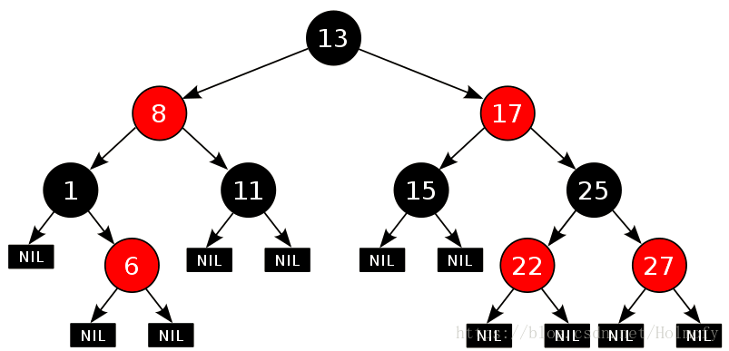
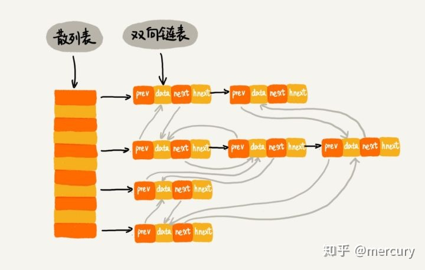

# Java 基础之HashMap底层实现

## 22. ⭐️HashMap 底层实现（结合源码学习，面试必问）

[Java集合源码分析（四）HashMap](https://www.cnblogs.com/zhangyinhua/p/7698642.html)

[JDK 1.8 HashMap源码分析](https://www.cnblogs.com/xiaoxi/p/7233201.html) ⭐️

[Java 所有集合源码分析](https://www.cnblogs.com/xujian2014/tag/Java)

[JDK1.8 HashMap工作原理和扩容机制(源码解析)](https://blog.csdn.net/u010890358/article/details/80496144)

[Java 8系列之重新认识HashMap](https://tech.meituan.com/2016/06/24/java-hashmap.html) ⭐️⭐️

建议结合 JDK 源码和博客链接学习源码（重点看 put 和 resize 方法），然后掌握下面的常见面试题

### 1. HashMap 原理，内部数据结构

`HashMap` 的内部储存结构其实是数组和链表的结合（`JDK 1.8` 后加入红黑树，`O(n)` 到 `O(logn)` 的时间开销）。

当实例化一个 `HashMap` 时，系统会创建一个长度为 `Capacity` 的 `Entry` 数组，这个长度被称为容量(`Capacity`)；
在这个数组中可以存放元素的位置，我们称之为“桶”(`bucket`)，每个 `bucket` 都有自己的索引，系统可以根据索引快速地查找 `bucket` 元素。
每个 `bucket` 中存储一个元素，即一个 `Entry` 对象，但每一个 `Entry` 对象可以带一个引用变量，用于指向下一个元素，因此在一个桶中就有可能生成一个 `Entry` 链。

### 2. HashMap 中的 put 方法过程

对 `key` 求哈希值然后计算下标，如果没有哈希碰撞则直接放入槽中，如果碰撞了以链表形式链接到后面，如果链表长度超过阈值（默认阈值是`8`），就把链表转成红黑树。

如果节点已存在就替换旧值，如果槽满了（`容量*加载因子`），就需要 `resize`。

#### putVal方法执行过程

①. 判断键值对数组 `table[i]` 是否为 `空` 或为 `null`，否则执行 `resize()` 进行扩容； 

②. 根据键值 `key` 计算 `hash` 值得到插入的数组索引 `i`，如果 `table[i]==null`，直接新建节点添加，转向⑥，如果 `table[i]` 不为 `空`，转向③； 

③. 判断  `table[i]` 的首个元素是否和 `key` 一样，如果相同直接覆盖 `value`，否则转向④，这里的相同指的是 `hashCode` 以及 `equals`； 

④. 判断 `table[i]` 是否为 `treeNode`，即 `table[i]` 是否是红黑树，如果是红黑树，则直接在树中插入键值对，否则转向⑤；

⑤. 遍历 `table[i]`，判断链表长度是否大于 `8`，大于 `8` 的话把链表转换为红黑树，在红黑树中执行插入操作，否则进行链表的插入操作；遍历过程中若发现 `key` 已经存在直接覆盖 `value` 即可；

⑥. 插入成功后，判断实际存在的键值对数量 `size`是否超多了最大容量 `threshold`，如果超过，进行扩容。

### 3. HashMap 中哈希函数是怎么实现的？还有哪些 hash 实现过？

`(h = key.hashCode()) ^ (h >> 16)` 高 16bit 不变，低 16bit 和 高 16bit 做 异或 获得 hash值，然后 `(n-1) & hash` 获得下标。

1. 直接寻址法：取关键字或关键字的某个线性函数值为散列地址。即 `H(key) = key` 或 `H(key) = a ? key + b`，其中 `a` 和 `b` 为常数（这种散列函数叫做自身函数）
2. 数字分析法：数字分析法就是找出数字规律，尽可能利用这些数据来构造冲突几率较低的散列地址。分析一组数据，比如一组员工的出生年月日，这时我们发现出生年月日的前几位数字大体相同，这样的话，出现冲突的几率就会很大，但是我们发现年月日的后几位表示月份和具体日期的数字差别很大，如果用后面的数字来构成散列地址，则冲突的几率会降低。
3. 平方取中法：取关键字平方后的中间几位作为散列地址。
4. 折叠法：将关键字分割成位数相同的几部分，最后一部分位数可以不同，然后取这几部分的叠加和（去除进位）作为散列地址。
5. 随机数法：选择一随机函数，取关键字的随机值作为散列地址，通常用于关键字长度不同的场合。
6. 除留余数法：取关键字被某个不大于散列表表长 `m` 的数 `p` 除后所得的余数为散列地址。

### 4. 为什么 HashMap 中的 & 位必须为奇数 (Length - 1)

长度是 `16` 或者是其它 `2 的幂`，`Length - 1` 的值是所有二进制位全为 `1`，这种情况下，`index` 的结果等同于 `HashCode` 后几位的值。

只要输入的 `HashCode` 本身分布均匀，`Hash` 算法的结果就是均匀的。

然后使用 `index = (length-1) & HashCode`，相当于求出余数，比 `%` 快，确定在桶中的位置 `tab[i = (n-1) & hash];`

**Example**

下面我们以 `book` 的 `Key` 来演示整个过程：

1. 计算 `book` 的 `hashcode`，结果为十进制的 `3029737`，二进制的 `101110001110101110 1001`。

2. 假定 `HashMap` 长度是默认的 `16`，计算 `Length-1` 的结果为十进制的 `15`，二进制的 `1111`。

3. 把以上两个结果做与运算，`101110001110101110 1001 & 1111 = 1001`，十进制是 `9`，所以  `index=9`。

可以说，`Hash` 算法最终得到的 `index` 结果，完全取决于 `Key` 的 `Hashcode` 值的最后几位。

假设 `HashMap` 的长度是 `10`，重复刚才的运算步骤：

单独看这个结果，表面上并没有问题。我们再来尝试一个新的 `HashCode`  `101110001110101110 1011 ` ：

让我们再换一个 `HashCode`  `101110001110101110 1111` 试试 ：

是的，虽然 `HashCode` 的倒数第二第三位从 `0` 变成了 `1`，但是运算的结果都是 `1001`。也就是说，当 `HashMap` 长度为 `10` 的时候，有些 `index` 结果的出现几率会更大，而有些 `index` 结果永远不会出现（比如`0111`）。

这样，显然不符合 `Hash` 算法均匀分布的原则。

反观长度 `16` 或者其他 `2` 的幂，Length-1的值是所有二进制位全为 `1`，这种情况下，`index` 的结果等同于 `HashCode` 后几位的值。只要输入的 `HashCode` 本身分布均匀，`Hash` 算法的结果就是均匀的。

### 5. 如何解决 hash 冲突？

`Hash` 冲突：`HashCode` 一样但 `key` 不一样，就导致了冲突；如果 `key` 一样，就是相同值覆盖了。

`HashMap` 的冲突处理是用的**链地址法**，将所有的**哈希地址相同**的记录都链接在**同一链表**中（同一个桶的链表中）。

还有其它方法：开放地址（外加增量 `d`）、再哈希（`hash` 函数不同）、链地址法、建立公共溢出区。

###  6. HashMap 线程并发安全性问题

`HashMap` 在并发时可能出现的问题主要是两方面：

1. 如果多个线程同时使用 `put` 方法添加元素，而且假设正好存在两个 `put` 的 `key` 发生了碰撞（根据 `hash` 值计算的 `bucket` 一样），那么根据 `HashMap` 的实现，这两个 `key` 会添加到数组的同一位置，这样最终就会发生其中一个线程 `put` 的数据被覆盖。
2. 如果多线程同时检测到元素个数超过 `数组大小 * loadFactor`，这样就会发生多个线程同时对 `Node` 数组进行扩容，都在重新计算元素位置以及复制数据，但是最终只有一个线程扩容后的数组会赋给 `table`，也就是说其它线程的都丢失，并且各自线程 `put` 的数据也丢失。

### 7. HashMap 底层用到了红黑树，简述红黑树五大特征

**红黑树**是许多**平衡搜索树**中的一种，可以保证在最坏的情况下基本动态集合操作的时间复杂度为**`O(logn)`**，`n`为节点个数。

1. 节点要么为红色，要么为黑色；
2. 根节点为黑色；
3. 叶子节点( `NIL` 或 `空`节点)为黑色；
4. 每个红色节点的左右孩子节点都是黑色（保证从根节点到叶子节点不会出现连续两个红色节点）；
5. 从任意节点到其每个叶子节点的所有路径，都包含相同数目的黑色节点。

4、5是使得红黑树为平衡树的关键。

**从根到最远的叶子节点的路径不超过从根到最近叶子节点路径的两倍**，结果是树**大致上高度平衡**。

### 8. 红黑树和 AVL 比较

1. 红黑树不追求完全平衡 —— 它只要求部分地达到平衡要求，降低了对旋转的要求，从而提高了性能。
   红黑树的算法时间复杂度和 `AVL` 相同，但统计性能比 `AVL` 树更高。
2. 针对插入和删除节点导致失衡后的 `rebalance` 操作，红黑树(RB-Tree) 最多只需要旋转3次就能实现平衡，只需 `O(1)`。降低开销是对 `search`、`insert` 以及 `delete` 的折衷。
   总体来说， `RB-Tree` 的统计性能高于 `AVL`；
3. 实际应用中，若**搜索**的次数远远大于插入和删除，那么选择 `AVL`；如果**搜索**和插入删除的次数差不多，则应该选择 `RB-Tree`。

#### 引申：[红黑树、BST、AVL、伸展树](https://blog.csdn.net/Holmofy/article/details/79692613)

### 9. HashMap、LinkedMap、TreeeMap底层的区别

[深入理解 Map，HashMap，LinkedHashMap，TreeMap](https://blog.csdn.net/haihui_yang/article/details/80642520)

`LinkedHashMap` 拥有 `HashMap` 的所有特性，它比 `HashMap` 多维护了一个**双向链表**，因此可以**按照插入的顺序**从头部或从尾部迭代，是有序的。
不过因为别 `HashMap` 多维护了一个双向链表，它的内存相比 `HashMap` 大，并且性能会差一些。
但是如果需要考虑到元素插入的顺序的话，`LinkedHashMap` 是一种较好的选择。

`TreeMap` 的底层是红黑树，它是按照 `key` 的自然顺序（或者指定排序）排列，所以在需要有序 `map` 集合时候采用。

### 10. HashMap 扩容(resize)的优化，是否会重算 hash？

#### `JDK 1.7` 重算

在`JDK 1.7`时， 扩容会重新计算这个 `key` 值（`key%新的长度`）在新桶的什么位置，这样就会有大量的重复计算。

#### `JDK 1.8` 优化

[HashMap1.8的扩容机制](https://www.jianshu.com/p/0ab3e05b1d23)

##### 重构长度小于等于阈值

桶中的链表**不需要再像 JDK 1.7 的实现那样重新计算 `hash`**，只需要看看原来的 `hash` 值新增的那个 `bit` 是 `1` 还是 `0` 就好了。如果是 `0` 的话，索引没变；如果是 `1` 的话，索引变成 `原索引 + oldCap`。

**详解**

我们使用的是 `2次幂` 的扩展(指长度扩为原来 `2倍` )，所以，元素的位置要么是在原位置，要么是在原位置再移动 `2次幂` 的位置。

看下图可以明白这句话的意思，`n` 为 `table` 的长度，`图(a)`表示扩容前的 `key1` 和 `key2` 两种 `key` 确定索引位置的示例，`图(b)` 表示扩容后 `key1` 和 `key2` 两种 `key` 确定索引位置的示例，其中 `hash1` 是 `key1` 对应的哈希与高位运算结果。

元素在重新计算 `hash` 之后，因为 `n` 变为 `2倍`，那么 `n-1` 的 `mask` 范围在高位多`1bit(红色)`，因此新的 `index` 就会发生这样的变化：

因此，我们在扩充 `HashMap` 的时候，不需要像 `JDK1.7` 的实现那样重新计算 `hash`，只需要看看原来的 `hash` 值新增的那个 `bit` 是 `1` 还是 `0` 就好了，是 `0` 的话索引没变，是 `1` 的话索引变成 `原索引+oldCap`，可以看看下图为 `16` 扩充为 `32` 的 `resize` 示意图：

这个设计确实非常的巧妙，既省去了重新计算 `hash` 值的时间，而且同时，由于新增的 `1bit` 是 `0` 还是 `1` 可以认为是随机的，因此 `resize` 的过程，均匀的把之前的冲突的节点分散到新的 `bucket` 了。

这一块就是 `JDK1.8` 新增的优化点。

有一点注意区别，`JDK1.7` 中 `rehash` 的时候，旧链表迁移新链表的时候，如果在新表的数组索引位置相同，则链表元素会倒置，但是从上图可以看出，`JDK1.8` 不会倒置。

##### 重构长度大于阈值

**引入红黑树**。仍然会采用  `原索引 + oldCap` 的方式去重新构建链表，如果重构长度大于一定值，就会转会成红黑树。

#### 引申：从 HashMap 引申到 HashSet 源码，本质还是 HashMap。

1. `HashSet` 底层是采用 `HashMap` 实现的。
   `HashSet` 的实现比较简单，`HashSet` 的绝大部分方法都是通过调用 `HashMap` 的方法来实现的。
   因此 `HashSet` 和 `HashMap` 两个集合在实现本质上是相同。
2. `HashMap` 的 `key` 就是放进 `HashSet` 中对象，`value` 是 `Object` 类型的。
3. 当调用 `HashSet` 的 `add` 方法时，实际上是向 `HashMap` 中增加了一行 `(key-value对)`，该行的 `key` 就是向 `HashSet` 增加的那个对象，该行的 `value` 就是一个 `Object` 类型的常量。

