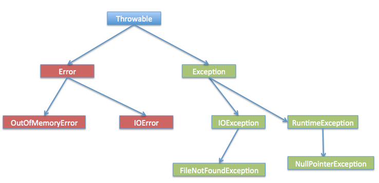
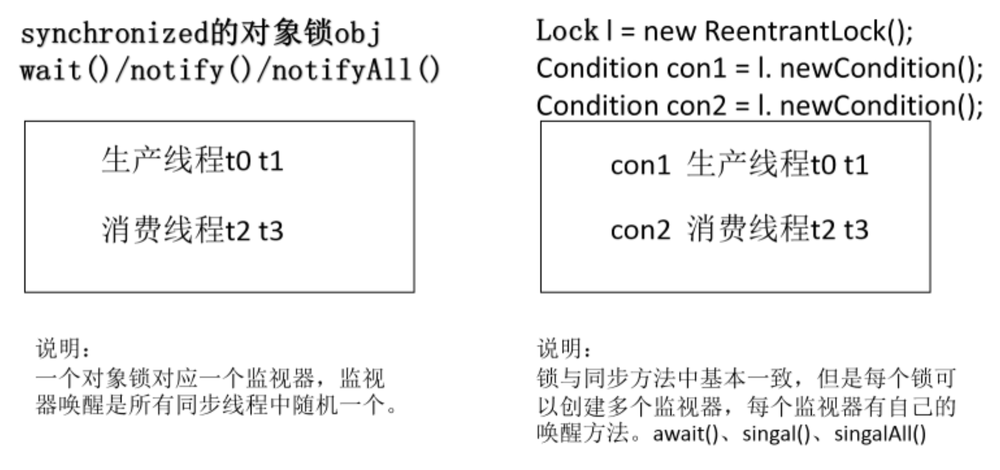

# Java基础语法（上）1-10

==推荐书籍和视频：《Java 核心技术卷 I 》、《毕向东 Java 入门视频》== 

[推荐书籍重点划分](https://www.bilibili.com/video/BV1Ma411w714) 

[TOC]


## 1. 类的概念

### 类包括属性和行为

1. 属性就是**成员变量**（实例的变量），在整个类中都可以被使用。
2. 行为就是**成员函数**（实例的方法），代表这个类的可以进行哪些操作。

打个比方，类就是人的统称，人的肤色和行为就是类的属性和函数。用类建立的一个对象（实例），这个对象就是一个具体的人，比如黄皮肤、会弹钢琴的人，并且可以修改这个对象的属性，使用这个对象的行为（让人改变肤色，让他去弹钢琴）。


### 成员变量和局部变量的区别

成员变量

- 成员变量定义在类中，整个类都可以被访问；
- 成员变量随者对象的建立而建立，存在于对象所在的堆内；
- 成员变量具有默认初始化值。

局部变量

- 只定义在局部范围内，如：函数、语句内等；
- 存在于栈内中；
- 作用的范围结束，变量空间会自动释放；
- 没有默认初始值。


### 构造函数

在一个类中，函数名与类名相同，多个构造函数以重载的方法存在（如果没有带参数的构造函数，则默认为参数为空的构造函数），作用是用来给对象初始化。对象一出现，就会带有构造函数的特点。

```java
class Student3 {
    int id;
    String name;

    void display() {
        System.out.println(id + " " + name);
    }

    public static void main(String args[]) {
        Student3 s1 = new Student3();
        Student3 s2 = new Student3();
        s1.display();
        s2.display();
    }
}
```

**构造函数和一般函数的区别** 

构造函数：在对象创建时，就调用了构造函数，对对象进行初始化；只会调用一次。

一般函数：对象在建立后，在有需要的情况下，调用一般函数；可以调用多次。


## 2. 继承

**概念** 

继承就是子类继承父类的特征和行为，使得子类对象（实例）具有父辈的实例域和方法，或子类从父类继承方法，使得子类具有父类相同的行为。


### 成员变量的特点 

1. 子类存在就不找父类；子类不能直接访问父类的私有变量（但可以间接使用 get 函数访问）。
2. super 关键字：相对于 this 来说，this 是指向自身类中变量，super 是指向父类中的变量。
3. 对于父类中 private 修饰的变量，子类不能继承，不过在创建子类对象时，堆中会出现这些变量。但是不能直接将其初始化，只能通过父类中的 this 对其初始化。


### 成员函数的特点 

1. 当父子类中出现成员函数一模一样的时候，会运行子类的函数，这叫做函数的覆盖（重写）。（重载是在同一类中进行）

2. 覆盖的注意事项：子类权限必须大于等于父类的权限才能覆盖；静态函数只能被静态函数覆盖。

3. 什么时候采用覆盖操作？

   当对一个类 A 中的函数进行扩展时，可以建立一个子类 B 进行对 A 中的函数进行扩展，相对于更新操作。


### 构造函数的特点

1. **子类不能继承父类的构造器**（构造方法或构造函数），但是父类的构造器待遇参数的，必须在子类的构造器中显式地通过 super 关键字**调用**父类的构造器并配以适当的的参数列表。

2. 如果父类有**无参构造器**，则在子类的构造器中用 super 调用父类构造器不是必须的；如果没有使用 super 关键字，系统会**自动调用**父类的无参构造器（隐藏了 `super();` ）。

   （如果父类有参数的构造器，则子类必须用 super 调用并配上参数；若父类有无参构造器，子类不用 super，系统自动调用无参构造器）

3. 子类的成员变量是在父类构造器和变量进行初始化运行完成以后，才会去初始化子类的成员变量（子类出生以后，第一件事就是想着去找父类，找完父类后再去忙自己的事情）。

```java
class FatherClass{
	public FatherClass(){
		System.out.println("父类 无参 构造函数");
	}
	public FatherClass(int i){
		System.out.println("父类 一个参数构造函数super = "+i);
	}
	public FatherClass(int i,String j){
		System.out.println("父类 一个参数构造函数superi = "+i+",superj = "+j);
	}
	
}

class SonClass extends FatherClass{
	public SonClass(){
//		super(22);//line 1
		System.out.println("子类 无参 构造函数");
	}
	public SonClass(int a){
		super(33,"Hello");//line 2
		System.out.println("子类一个参数构造函数sub = "+a);
	}
	public void fun(int a){//子类中定义一个实例函数
		//super(33,"Hello");//构造函数调用必须声明在构造函数中,这行代码不注释的话会报错
		System.out.println("子类一个参数构造函数sub = "+a);
	}
}
public class ConstructorExtend {//测试子类继承父类的构造函数
	public static void main(String args[]){
//	FatherClass fa = new FatherClass();
//	FatherClass fa1 = new FatherClass(100);
//	SonClass son = new SonClass();
	SonClass son1 = new SonClass(200);
	son1.fun(2);
	}
}

```


**final 关键字** 

1. final 关键字可以修饰类、变量、方法；
2. 修饰的类：为最终类不能不继承，若类是 final 的，则其中的方法自动为 final，但是变量不是。
3. 修饰的变量为常量，只能被赋值一次；
4. 修饰的方法不可以被覆盖（不能被子类重写）。


## 3. 抽象类

**[抽象方法](https://www.jianshu.com/p/0530e14192b4)** 

1. 在所有的普通方法上面都会有一个“{}”，这个表示方法体，有方法体的方法一定可以被对象直接使用。
2. **而抽象方法，是指没有方法体的方法，同时抽象方法还必须使用关键字abstract做修饰。**
3. **抽象方法必须为public或者protected**（因为如果为private，则不能被子类继承，子类便无法实现该方法），缺省情况下默认为public。

抽象类的基本使用示例

```java
//定义一个抽象类
abstract class A{

    //普通方法
    public void fun(){
        System.out.println("存在方法体的方法");
    }

    //抽象方法，没有方法体，但有abstract关键字做修饰
    public abstract void print();
}

//单继承
//B类是抽象类的子类，是一个普通类
class B extends A{

    //强制要求覆写
    @Override
    public void print() {
        System.out.println("Hello World !");
    }

}
public class TestDemo {

    public static void main(String[] args) {
        //向上转型
        A a = new B();

        //被子类所覆写的过的方法
        a.print();
    }
}
// 运行结果
// Hello World !
```

### 抽象类的特性和使用 

- 抽象类（abstract）是对类的抽象，里面可以包含抽象方法（只有声明，没有具体的实现），也可以包含正常类的变量，抽象类不能实例化。
- 抽象类是为了子类继承而存在的，子类**必须继承**父类的抽象方法。
- 抽象类一定是父类，因为抽象类想被使用，就必须有人去继承并覆盖其方法，子类才能进行实例化。
- 子类必须覆盖抽象类中的所有抽象方法，才能进行实例化；否则子类里面还有父类的抽象方法，所以子类是抽象函数，就不能实例化。
- 抽象类可以不存在抽象方法吗？可以的，目的是不让改类创建对象；但如果类中包含抽象方法，就必须将该类声明为抽象类。


### 抽象类的使用限制 

- 抽象类有构造函数吗？

  有，可以用来给子类进行初始化。

> 由于抽象类里会存在一些属性，那么抽象类中一定存在构造方法，其存在目的是为了属性的初始化。
> 并且子类对象实例化的时候，依然满足先执行父类构造，再执行子类构造的顺序。

```java
abstract class A{
    public A(){
        System.out.println("*****A类构造方法*****");
    }

    public abstract void print();
}

class B extends A{
    public B(){
        System.out.println("*****B类构造方法*****");
    }

    @Override
    public void print() {
        System.out.println("Hello World !");
    }
}

public class TestDemo {
    public static void main(String[] args) {
        A a = new B();
    }
}
// 运行结果
// *****A类构造方法*****
// *****B类构造方法*****
```

- **抽象类不能使用final声明，因为抽象类必须有子类，而final定义的类不能有子类、final 修饰的方法无法覆盖**。

- 抽象类能否使用static声明吗？

  > **外部抽象类不允许使用static声明，而内部的抽象类可以使用static声明。**
  > 使用static声明的内部抽象类相当于一个外部抽象类，继承的时候使用“外部类.内部类”的形式表示类名称。

  内部抽象类使用示例：

  ```java
  abstract class A{
      //static定义的内部类属于外部类
      static abstract class B{
          public abstract void print();
      }
  }
  
  class C extends A.B{
      public void print(){
          System.out.println("**********");
      }
  }
  
  public class TestDemo {
      public static void main(String[] args) {
          //向上转型
          A.B ab = new C();
          ab.print();
      }
  }
  // 执行结果
  // **********
  ```

  - **抽象类中的static方法可以直接调用**。

  示例代码

  ```java
  abstract class A{
      public static void print(){
          System.out.println("Hello World !");
      }
  }
  
  public class TestDemo {
      public static void main(String[] args) {
          A.print();
      }
  }
  // 执行结果
  // Hello World !
  ```

- 有时候由于抽象类中只需要一个特定的系统子类操作，所以可以忽略掉外部子类。这样的设计在系统类库中会比较常见，目的是对用户隐藏不需要知道的子类。

  ```java
  abstract class A{
      public abstract void print();
  
      //内部抽象类子类
      private static class B extends A{
          //覆写抽象类的方法
          public void print(){
              System.out.println("Hello World !");
          }
      }
  
      //这个方法不受实例化对象的控制
      public static A getInstance(){
          return new B();
      }
  }
  
  public class TestDemo {
      public static void main(String[] args) {
          //此时取得抽象类对象的时候完全不需要知道B类这个子类的存在
          A a = A.getInstance();
          a.print();
      }
  }
  // 
  // Hello World !
  ```

  


## 4. 接口（interface）

1. 接口是行为的抽象，接口中的变量被隐性制定为 `public static final` ，方法被执行为 `public abstract` 所以方法是不具体实现的。子类可以实现多个接口内容，这叫“多[实现](Implements)”。

2. 接口不能实例化。只有子类覆盖了接口中的所有抽象方法，子类才能实例化对象，否则这个子类一定是个抽象类（因为里面有抽象方法）。

3. 本质上提高了子类的扩展性，让子类可以实现更多功能的方法。

4. 接口直接可以多继承

   因为不能多继承的本质是容易造成方法体的不确定性。但是接口内没有方法体，只有方法，所以不存在不确定性。

5. 接口具有对外暴露的规则、功能扩展、降低耦合性、多实现。


## 5. 抽象类和接口的区别理解

### 语法层面的区别

1. 抽象类可以提供成员方法的实现细节，而接口中只能存在 `public static` 方法（接口更加抽象）；

2. 抽象类中的成员变量可以是各种类型的，而接口中的成员变量只能是 `public static final` 类型的；
3. 接口中不能含有静态代码块以及静态方法(Java 8 中可以了)，而抽象类可以有静态代码块和静态方法；
4. 一个类只能继承一个抽象类，而一个类却可以实现多个接口；


### 设计层面的区别

1. 抽象类是对一种事务的抽象，即对类抽象；而接口是对行为抽象。

   抽象类是对整个类整体进行抽象，包括属性、行为，但是接口却是对类局部（行为）进行抽象。

2. 抽象类作为很多子类的父类，它是一种模版式设计；而接口是一种行为规范。

   例子：门🚪都有开和关的状态，可以把门🚪的开关抽象为一个抽象类；但不是所有门🚪都有具有报警功能，所以把报警抽象为接口，当作一种抽象的方法来实现。

3. 继承是一个“是不是”关系，即共性关系；而接口实现则是“有没有”关系，额外功能。

   如果一个类继承了某个抽象类，则子类必定是抽象类的种类；而接口实现则是有没有、具备不具备的关系。

   打个比方，一条导盲犬，肯定是属于犬类的，不能定义成犬的接口，因为犬类里面还有一半实现方法，是共性关系。但是可以把导盲功能定义为接口，因为这是犬类的额外功能，其它导盲设备也可以去实现导盲功能。


## 6. 多态

**概念** 

一个对象对应着不同的类型。比如，猫这类食物既具备着猫的形态，又具备着动物的形态。


**代码体现** 

父类或者接口的引用指向子类的对象。（一种对象两种形态，子类和父类的形态）


**多态的理解** 

多态是为什么而存在的？

简单的例子，有一个方法，就是动物进食的方法，多态的存在，让只要是动物就可以调用，就不需要单独去制作猫进食的方法、狗进食的方法，这就提高了代码的扩展性。


**多态使用的前提** 

1. 有关系，继承或实现；
2. 要有覆盖。


### 向上转型 upcasting 

[Java向上转型的作用](https://blog.csdn.net/TNTZS666/article/details/80273986) 

前期定义的内容不能调用后期子类的特有内容。举个例子，对于猫来说，相当于把猫类型提升到动物类型（向上转型），所以只能使用动物所有的方法（进食），而不能使用猫的特有方法（抓老鼠）。

**向上转型限制功能**，转型之后只能使用子类与父类共有的方法 —— 那就是父类的方法了；不过也可以使代码更简洁。

语法规则：`<父类型> <引用变量名> = new <子类型>();` 

等于 `<父类型> <引用变量名> = <父类型> new <子类型>();`。

```java
class Car {
    public void run() {
        System.out.println("这是父类run()方法");
    }
}

public class Benz extends Car {
    public void run() {
        System.out.println("这是Benz的run()方法");

    }

    public void price() {
        System.out.println("Benz:800000$");
    }

    public static void main(String[] args) {
        Car car = new Benz();
        car.run();
       //car.price();程序报错
    }
}
// 运行结果
// 这是Benz的run()方法
```

本程序实现了一个对象的向上转型操作，虽然最后调用`run()`方法的是 `Car` 类对象，但是由于此时**实例化的是子类对象**“`new Benz();`”，而且`run()`方法被子类覆写了，所以最终调用的就是被 `Benz` 类覆写过的`run()`方法。

但是当我们用 `car` 这个对象去调用 `Benz` 类中 `price` 这个方法时，就会报错。这就是因为我们此处进行的向上转型，`car` 这个对象虽然指向子类，但是子类由于进行了向上转型，就失去了使用父类中所没有的方法的“权利”，在此处就是不能调用 `price()` 这个方法。

那么向上转型到底有什么用呢，到目前为止我们不仅看不到它的好处，反而发现使用了向上转型后反而不能调用子类所特有的方法了。那么向上转型的作用到底是什么呢，我们一起来看下面的代码：

```java
class Car {
    public void run() {
        System.out.println("这是父类run()方法");
    }

    public void speed() {
        System.out.println("speed:0");
    }

}

class BMW extends Car {
    public void run() {
        System.out.println("这是BMW的run()方法");
    }

    public void speed() {
        System.out.println("speed:80");
    }
}

public class Benz extends Car {
    public void run() {
        System.out.println("这是Benz的run()方法");

    }

    public void speed() {
        System.out.println("speed:100");
    }

    public void price() {
        System.out.println("Benz:800000$");
    }

    public static void main(String[] args) {
        show(new Benz());//向上转型实现
        show(new BMW());
    }

    public static void show(Car car) {//父类实例作为参数
        car.run();
        car.speed();
    }
}

```

上面代码中

```java
public static void main(String[] args) {
  show(new Benz());
  show(new BMW());
}

public static void show(Car car) {
  car.run();
  car.speed();
}
```

就体现了向上转型的优点，这也体现了Java抽象编程的思想。如果此处没有向上转型，要实现show每个子类的功能，那么有几个子类就要写多少函数。代码如下：

```java
public static void main(String[] args) {
  show(new Benz());
  show(new BMW());
}

public static void show(Benz benz) {
  benz.run();
  benz.speed();
}
public static void show(BMW bmw) {
  bmw.run();
  bmw.speed();
}
```


### 向下转型 downcasting

[Java向下转型以及如何判断能否向下转型](https://blog.csdn.net/TNTZS666/article/details/80274526)

==向下转型必须是在向上转型之后才能进行== 

向上转型之后，如果想要实现子类的特有功能，可以实现向下转型（把猫从动物类型转型为原来的猫类型）。转型之后，不仅能使用父类的方法，还能使用自己原来的方法。

```java
class Car {
    public void run() {
        System.out.println("这是父类run()方法");
    }
}

public class Benz extends Car {
    public void run() {
        System.out.println("这是Benz的run()方法");
    }

    public void price() {
        System.out.println("Benz:800000$");
    }

    public static void main(String[] args) {
        Car car = new Benz();// 先进行向上类型转换
        // car.price(); 此时还不能调用子类独有方法
        Benz benz = (Benz) car;// 向下类型转换
        benz.price();// 经过向下类型转换后可以调用子类中独有的方法
    }
}
// 运行结果
// Benz:800000$
```

此时我们通过向下转型成功的调用了子类中独有的方法，但是倘若我们没有先进行向上转型，也就是如下的代码

```java
public static void main(String[] args) {
  Car car2 = new Car();
  Benz benz2 = (Benz)car2;
  benz2.price();
}
```

编译使未报错，但运行后程序出现错误

```java
Exception in thread "main" java.lang.ClassCastException: com.practice.Car
at com.practice.Benz.main(Benz.java: 20)
```

这个是指类型转换异常，因为我们一开始直接new了一个父类的对象，当我们后面去使用Benz去强制类型转换的时候，由于benz2是子类的对象，而car2是父类的对象，前者的域小于后者，这个时候我们直接向下转型就会发生这个错误。

所以使用向下转型之前必须先进行向上转型。

对于上面这个异常，我们可以通过使用 **instanceof** 这个关键字来解决。


### 多态的判断

instanceof 用法：

对象名 instanceof 类名 ，判断一个引用数据类型是什么、判断这个对象是否是属于这个类或是其子类。一般用在向下转型时，增强程序的健壮性。

代码如下

```java
public static void main(String[] args) {
  Car car2 = new Car();
  // 判断car2这个对象是否是Benz的类（或是其子类），返回的是一个布尔值
  boolean result = car2 instanceof Benz;
  if (result) {
    // 如果是(true)，则可以进行向下类型转换
    Benz benz2 = (Benz) car2;
    benz2.price();
  } else {
    // false,输出
    System.out.println("不能进行向下类型转换");
  }
}
// 运行结果
// 不能进行向下类型转换
```

向下转型在Java的泛型编程中应用较多，只要记住向下转型之前必须进行向上转型，且配合instanceof关键字一起使用就可以了。


### 多态调用成员变量，成员函数，静态函数的特点

```java
class Fu
{
	int num = 3;
	void show()
	{
		System.out.println("fu show");
	}
	static void method()
	{
		System.out.println("fu static method");
	}
}
 
class Zi extends Fu
{
	int num = 4;
	void show()
	{
		System.out.println("zi show");
	}
	static void method()
	{
		System.out.println("zi static method");
	}
}
 
class DuoTaiDemo
{
	public static void main(String[] args)
	{
		//1 成员变量被调用的情况。
		Fu f = new Zi();
		System.out.println(f.num);  // 输出3
		
		//2 成员变量被调用的情况
		f.show();    // zi show
		
		//3 静态函数被调用的情况
		f.method();  // fu static method
	}
}
```

**多态中的成员变量** 

编译时，参考引用型变量所属的类中的是否有调用的成员变量。有，编译通过；没有，编译失败。

运行时，参考引用型变量所属的类中的是否有调用的成员变量，并运行该所属类中的成员变量。

简单说，编译和运行都参考等号左边的引用变量（变量没有覆盖）。


**多态中的成员函数（非静态）** 

编译时，参考引用型变量所属的类中的是否有调用的成员变量。有，编译通过；没有，编译失败。

运行时，参考的是对象所属的类中是否有调用的函数。

简单的说，编译看左边的引用变量，运行看右边的对象。


**多态中的静态函数** 

编译时，参考引用型变量所属的类中的是否有调用的成员变量

运行时，参考引用型变量所属的类中的是否有调用的成员变量

简单说，编译和运行都看左边的引用变量。

其实对于静态方法，是不需要对象的，直接用类名调用即可。


## 7. 内部类（需重写）

[内部类](https://www.cnblogs.com/dolphin0520/p/3811445.html) 

在Java程序中，通常情况下，我们把不同的类组织在不同的包下面，对于一个包下面的类来说，它们是在同一层次，没有父子关系。

还有一种类，它被定义在另一个类的内部，所以称为内部类（Nested Class）。

如果一个类定义在另一个类的内部，这个类就是Inner Class。

Java的内部类可分为 Inner Class、Anonymous Class 匿名内部类和 Static Nested Class 静态内部类三种：

- Inner Class和Anonymous Class本质上是相同的，都必须依附于Outer Class的实例，即隐含地持有`Outer.this`实例，并拥有Outer Class的`private`访问权限；
- Static Nested Class是独立类，但拥有Outer Class的`private`访问权限。


```java
class Outer {
    class Inner {
        // 定义了一个Inner Class
    }
}
```

上述定义的`Outer`是一个普通类，而`Inner`是一个Inner Class，它与普通类有个最大的不同，就是Inner Class的实例不能单独存在，必须依附于一个Outer Class的实例。示例代码如下：

1. 内部类的访问特点：内部类可以直接访问外部类的内容，但是外部类想要访问内部类必须建立内部类的对象。

2. 内部类的修饰符：内部类可以修饰为 static，那里面访问外部类的变量必须是 static 的。
   - 若内部类不加 static，则相当于外部类的成员。`Outer.Inner inner = outer.new Inner();`
   - 若内部类加上 static，外部类就不需要建立对象进行访问类。`Out.Inner inner = new Outer.Inner();`
   - 若内部类中的函数是 static（内部类必须是 static），那么内部类和外部类都不需要建立对象了。`Outer.Inner.func();` 

3. 如果在外部类和内部类均有同样变量名的变量，则想在内部调用外部的变量，需要使用 `外部类名.this`。

4. 内部类在局部位置上只能访问局部中被 final 修饰的局部变量。内部类在外部类的成员函数中，被称作局部位置。

5. 匿名内部类Anonymous Class

   还有一种定义Inner Class的方法，它不需要在Outer Class中明确地定义这个Class，而是在方法内部，通过匿名类（Anonymous Class）来定义。

   在使用匿名内部类时，要记住以下几个原则：

   - 匿名内部类不能有构造方法；
   - 匿名内部类不能定义任何静态成员、方法和类； 
   - 匿名内部类不能使用 public、protected、private 和 static；
   - 只能创建匿名内部类的一个实例；
   - 一个匿名内部类一定是在 new 后面，用其隐含实现一个接口或实现一个类；
   - 因匿名内部类为局部内部类，所以局部内部类的所有限制都对其有效；
   - 匿名内部类只能访问外部类的静态变量或静态方法；
   - 匿名内部类中的 this 指的是匿名内部类本身，如果使用外部类中的 this，则“外部类.this”。

6. 最后一种内部类和Inner Class类似，但是使用`static`修饰，称为静态内部类（Static Nested Class）

   用`static`修饰的内部类和Inner Class有很大的不同，它不再依附于`Outer`的实例，而是一个完全独立的类，因此无法引用`Outer.this`，但它可以访问`Outer`的`private`静态字段和静态方法。

   如果把`StaticNested`移到`Outer`之外，就失去了访问`private`的权限。


## 8. 异常

[异常](https://www.runoob.com/java/java-exceptions.html) 

**概念** 

- 异常：在运行时期发生的不正常的情况

- 异常类：描述不正常的类

- 将各个异常类的共性向上提取，形成体系

- 最终不正常的情况就分为两类

  Throwable（可抛性）：将问题抛出让调用者知道并处理。凡是 throw/throws 关键字可以操作的类或对象就具有可抛性。

  Error（一般不可处理）和 Exception（可以处理的）；

  Error：由 JVM 抛出的严重问题，一般不针对性修改，直接修改程序。


**异常体系** 

一个超类 Throwable，下面有两个子类 Error、Exception，每个子类下面还有很多子类。

 


**异常的原理和抛出** 

- 原理

  当出现异常时，JVM 会建立相关对象并将异常信息抛给调用者，如果该调用者没有对信息进行处理，则继续将信息抛给 JVM，最终 JVM 将信息打印在控制台。

- 抛出

  throw new 类：将指定类的内容抛出；

  throw 和 throws 的区别：throw用在函数内，而throws 用在函数上；throw 用来抛出异常对象，throws 用来抛出异常类、且抛出多个。


**异常分类** 

Java 编译器先检查语法错误，在进行异常等问题检测。

1. 编译时异常（可查异常）

   Exception 中的子类（除去 RuntimeException）；

   这种问题希望在编译时进行检测，进行对于的处理方式（必须使用 try-catch 捕获 或者 throws 抛出）

2. 运行时异常（不可查异常之一）

   RuntimeException 和 其子类

   这种问题让功能无法继续，这种问题编译器不会检测，运行时让调用者调用程序强制停止，让调用者修改程序。不需要 throws 进行声明，也不需要捕获，但是可以捕获。


**异常转换** 

将一个内部异常转化为对方可以理解的异常，也可以叫做异常封装，对外不暴露出内部的异常，转换出外面可以处理的异常。


**异常的注意事项** 

1. 子类覆盖父类方法时，如果父类的方法抛出异常，子类的方法只能抛出父类的异常或者该异常的子类。
2. 如果父类抛出多个异常子类只能抛出父类异常的子类。

总之，子类覆盖父类只能抛出父类异常或者子类或者子集。

如果父类的方法没有抛出异常，子类一定不能抛吗，只能 try。


### 自定义异常 

1. 创建自定义异常类；

   在 Java 中你可以自定义异常。编写自己的异常类时需要记住下面的几点。

   - 所有异常都必须是 Throwable 的子类。
   - 如果希望写一个检查性异常类，则需要继承 Exception 类。
   - 如果你想写一个运行时异常类，那么需要继承 RuntimeException 类。

   可以像下面这样定义自己的异常类：

   ```java
   class MyException extends Exception{}
   ```

   只继承Exception 类来创建的异常类是检查性异常类。

   下面的 InsufficientFundsException 类是用户定义的异常类，它继承自 Exception。

   一个异常类和其它任何类一样，包含有变量和方法。

2. 在方法中通过 throw 来抛出异常对象；

3. 如果在当前抛出异常的方法中处理异常，可以使用 try-catch 语句捕获并处理；否则在方法的声明处通过 throws 关键字指明要抛出给方法调用者的异常，继续进行下一步操作。

4. 在出现异常方法的调用者中捕获并处理异常。


### 异常捕获 

#### try-catch

使用 try 和 catch 关键字可以捕获异常。try/catch 代码块放在异常可能发生的地方。

try/catch代码块中的代码称为保护代码，使用 try/catch 的语法如下：

```java
try
{
   // 程序代码，待检测部分
}catch(ExceptionName e1)
{
   //Catch 块
}
```

Catch 语句包含要捕获异常类型的声明。当保护代码块中发生一个异常时，try 后面的 catch 块就会被检查。

如果发生的异常包含在 catch 块中，异常会被传递到该 catch 块，这和传递一个参数到方法是一样。

**多重捕获块**  

一个 try 代码块后面跟随多个 catch 代码块的情况就叫多重捕获。

多重捕获块的语法如下所示：

```java
try{
   // 程序代码
}catch(异常类型1 异常的变量名1){
  // 程序代码
}catch(异常类型2 异常的变量名2){
  // 程序代码
}catch(异常类型3 异常的变量名3){
  // 程序代码
}
```

上面的代码段包含了 3 个 catch块。

可以在 try 语句后面添加任意数量的 catch 块。

如果保护代码中发生异常，异常被抛给第一个 catch 块。

如果抛出异常的数据类型与 ExceptionType1 匹配，它在这里就会被捕获。

如果不匹配，它会被传递给第二个 catch 块。

如此，直到异常被捕获或者通过所有的 catch 块。


#### finally关键字

finally 关键字用来创建在 try 代码块后面执行的代码块。

无论是否发生异常，finally 代码块中的代码总会被执行。

在 finally 代码块中，可以运行清理类型等收尾善后性质的语句。

finally 代码块出现在 catch 代码块最后，语法如下：

```java
try{
  // 程序代码
}catch(异常类型1 异常的变量名1){
  // 程序代码
}catch(异常类型2 异常的变量名2){
  // 程序代码
}finally{
  // 程序代码
}
```

注意下面事项：

- catch 不能独立于 try 存在。
- 在 try/catch 后面添加 finally 块并非强制性要求的。
- try 代码后不能既没 catch 块也没 finally 块。
- try, catch, finally 块之间不能添加任何代码。


#### throws/throw 关键字

如果一个方法没有捕获到一个检查性异常，那么该方法必须使用 throws 关键字来声明。throws 关键字放在方法签名的尾部。

也可以使用 throw 关键字抛出一个异常，无论它是新实例化的还是刚捕获到的。

下面方法的声明抛出一个 RemoteException 异常：

```java
import java.io.*;
public class className
{
  public void deposit(double amount) throws RemoteException
  {
    // Method implementation
    throw new RemoteException();
  }
  //Remainder of class definition
}
```

一个方法可以声明抛出多个异常，多个异常之间用逗号隔开。

例如，下面的方法声明抛出 RemoteException 和 InsufficientFundsException：

```java
import java.io.*;
public class className
{
   public void withdraw(double amount) throws RemoteException,
                              InsufficientFundsException
   {
       // Method implementation
   }
   //Remainder of class definition
}
```


## 9. 多线程

**概述** 

[面试必问——线程与进程](https://www.huaweicloud.com/articles/d90c9bf248c8f1731946d65786c95379.html) 

进程：正在进行的程序。本质上，在内存里面开辟了一片运行空间

多线程：进程中的一个负责程序执行的路径，可以有多个路径，就叫多线程。一个进程中至少有一个线程。它可以和同一进程下的其他线程共享全部资源。

任务：每个线程都有自己运行的内容，这个内容就是线程要执行的任务。

多线程的优劣：一方面，解决了多个部分同时运行的问题（实际上是 CPU 在多个线程之间切换完成的，这个切换是随机的）；另一方面，线程太多会使效率降低。

进程和线程的区别

1. 根本区别：进程是操作系统资源调度的基本单位，线程是任务的调度执行的基本单位
2. 开销方面：进程都有自己的独立数据空间，程序之间的切换开销大；线程也有自己的运行栈和程序计数器，线程间的切换开销较小。
3. 共享空间：进程拥有各自独立的地址空间、资源，所以共享复杂，需要用IPC（Inter-Process Communication，进程间通信），但是同步简单。而线程共享所属进程的资源，因此共享简单，但是同步复杂，需要用加锁等措施。


### 设计线程的原因

操作系统模型中，进程有两个功能：

1. 任务的调度执行基本单位

2. 资源的所有权

线程的出现就是将这两个功能分离开来了：thread 执行任务的调度和执行 ； process 资源所有权

这样的好处是：

操作系统中有两个重要概念：并发和隔离

- 并发：提高硬件利用率，进程的上下文切换比线程的上下文切换效率低，所以线程可以提高并发的效率
- 隔离：计算机的资源是共享的，当程序发生奔溃时，需要保证这些资源要被回收。进程的资源是独立的，奔溃时不会影响其他程 序的进行；线程资源是共享的，奔溃时整个线程也会奔溃

线程和并发有关系，进程和隔离有关系。


### JVM中多线程解析

JVM 虚拟机存在多线程：至少有两个，一个主线程，另一负责垃圾回收线程。


### 线程名称

1. 可以使用 getName() 来获取当前线程的名字，默认名字是 Thread-序号
2. Thread.currentThread() 获取当前线程的对象
3. Thread 有带字符串的构造函数，可以对线程的对象进行命名，子类用 super 进行调用。


### 多线程的运行栈内存情况

当开启多个线程时，每个线程在栈内存中都开辟一个单独的栈区（一条单独的路，用于该线程中方法的进栈出栈），多个线程就有多个栈区（多条路）。

其中，如果一个线程出现问题了，只是当前问题线程的栈区弹出总栈区，其他线程仍然在栈内（一条路不通了，其他路还在继续啊）。

 

图中多线程，每个线程在栈内就是一个路径，main 线程、线程 0、线程 1 都是单独的栈区。


### 多线程的状态

 

1. sleep(time):是带有时间的冻结，到了时间就会进入运行或者临时阻塞（排队）状态。
2. wait 和 notify:是不带时间的，冻结之后，只有人为去唤醒才行，之后进入运行或者临时阻塞（排队）状态。


### 多线程的第一种创建方式 —— 继承 Thread 类

1. 定义一个类继承 Thread 类
2. 覆盖 Thread 类中的 run 方法
3. 直接创建 Thread 的子类对象创建线程
4. 直接调用 start 方法来开启线程并调用线程的任务 run 方法执行。调用 start 自动就会去执行 run。

注意：直接调用 start 和 直接调用 run 的区别：start 是开启一个线程，会自动去运行 run 中的任务；但是如果直接调用 run，并没有开启一个线程，只是简单调用一个类中的方法，线程仍然是主线程。


### 多线程的第二种创建方式——实现 Runnable 接口

第二种方式存在原因：如果想要仅仅实现类中的一部分任务进行多线程，所以，使用接口将这段任务进行了对象封装。
**实现 Runnable 接口的步骤** 

1. 定义类实现 Runnable 接口；
2. 覆盖接口的 run 方法，将任务代码封装到 run 内；
3. 通过 Thread 类创建对象，并将 Runnable 接口的**子类对象**作为 Thread 类中构造函数的参数进行传递；（为什么要这样搞？是为了将定义类中的 run 方法与 Thread 类中 run 建立联系）
4. 调用线程对象的 start 的方法开启线程。

**实现 Runnable 接口的好处** 

1. 将线程的任务从线程的子类中分离出来，进行了单独的封装。（面向对象的思想，**将任务封装成了对象，相当于将任务从类中抽取出来进行封装**）。
2. 避免了单继承的局限性。


### 多线程安全问题产生的原因

1. 多个线程在操作共享的数据。
2. 操作共享数据的代码有多条。

总之，**多个线程**同时执行操作**共享数据**的**多行**代码。


### 两种同步方法解决安全隐患

**同步代码块解决安全隐患** 

**解决思想** 

就是将多条操作共享数据的代码封装起来。

当一个线程处理这些封装代码，其他线程不得参与运算，必须当前线程执行完之后，才可以执行其他的线程。

**同步代码块格式** 

//所谓的对象锁，将这段代码锁住，同一时间，只有一个线程在处理。类似于火车的卫生间。。。。

```java
synchronized(对象)  
{
//需要同步代码，也就是多线程去处理的任务代码。
}
```

**同步的前提** 

同步中必须有多个线程并且使用**同一个对象锁**。

**同步的弊端** 

相对以前**效率低**，因为同步外的线程都会判断同步锁。（对象锁住后，其他线程也会取得执行权，并会不断判断同步锁的状态）。


**同步函数解决安全隐患** 

1. 方法：直接在函数名前加上修饰符 synchronized。
2. 同步函数的锁：就是**this**。


**以上二者的区别** 

1. 同步函数和同步代码块区别：同步函数锁是固定 this，同步代码块锁是任意的对象。
2. **静态同步函数**的锁：该函数所属字节码文件对象，可以用 this.getclass() 方法获取，也可以用 **类名.class** 表示。


### 多线程下单例设计模式

1. 饿汉式不会出现安全问题，懒汉式会出现

2. 懒汉式安全隐患解决

   ```java
   public static SingleDemo1 getInstance(){ // 多线程问题解决
     if (s == null) { // 只有在空的时候，才会有隐患，不空就不要判断锁
       synchronized (SingleDemo1.class){
         if (s == null) 
           s = new SingleDemo1();
       }
     }
     return s;
   }
   ```

   注意，如果使用同步函数的方法，每次调用方法都会判断同步锁导致降低效果。


### 多线程死锁示例

1. 产生的原因：同步锁的嵌套是导致死锁的原因之一。
2. 死锁代码分析：自己写一个死锁代码。（证明你确实是懂死锁了）。

死锁示例

```java
public class  implements Runnable {

    private boolean flag;

    DeadLock(boolean flag) {
        this.flag = flag;
    }
    public void run() {
        if (flag) {
            while (true) {
                synchronized (Lockab.locka) {
                  System.out.println(Thread.currentThread().getName() + "--if--locka"); //如果一个线程在这里的时候，另外一个线程在下面的这个位置，就导致两个线程死锁。
                    synchronized (Lockab.lockb) {
                        System.out.println(Thread.currentThread().getName() + "--if--lockb");
                    }
                }
            }
        } else {
            while (true) {
                synchronized (Lockab.lockb) {
                  System.out.println(Thread.currentThread().getName() + "--if--lockb");
                    synchronized (Lockab.locka) {
                        System.out.println(Thread.currentThread().getName() + "--if--locka");
                    }
                }
            }
        }

    }
}

class Lockab {
    //两个对象锁
    static final Object locka = new Object();
    static final Object lockb = new Object();
}

class DeadTest {
    public static void main(String[] args) {
        //创建两个对象，分别用来执行true和false
        DeadLock d1 = new DeadLock(true);
        DeadLock d2 = new DeadLock(false);
        //两个线程
        Thread t1 = new Thread(d1);
        Thread t2 = new Thread(d2);
        t1.start();
        t2.start();
    }
}
```

分析：

1. 有两个锁 a 和 b。
2. 线程 0 需要通过 a 锁、b 锁去接触内容，线程 1 需要通过 b 锁、a 锁去接触内容。
3. 但是如果线程 0 在 a 锁和 b 锁之间时、线程 1 在 b 锁和 a 锁之间时，就导致了死锁。
4. 因为线程 0 手里拿着 a 锁，线程 1 手里拿着 b 锁，互相不给、互相竞争。


## 10. 线程间通信

**概念** 

多个线程处理同一资源，但是任务不同。


### 多线程通信的 —— 等待唤醒机制

涉及的方法

1. wait():让线程处于冻结状态，被 wait 的线程会被存储到线程池中。
2. notify():唤醒线程池中的一个线程（任意）。
3. notiyAll():唤醒线程池中的所有线程。

注意事项

1. 以上涉及的方法都必须定义在同步内；
2. 因为这些方法都是用于操作线程的状态，必须要明确到底是操作**哪个锁**上的线程。
3. 为什么操作线程的方法是定义在 object 类中？

因为这些方法是监视器的方法，其实就是锁的方法，也就是任意对象的方法，所以定义在 object 类中。


### 多线程通信的 —— 多生产者多消费者

问题备注说明：

1. 问题：用 if 只判断一次，如果线程 0 和线程 1 都在线程池，然后线程 0 被唤醒执行之后，接着又唤醒了线程 1，这样就造成了生产多个馒头的情况。

   解决办法：需要在线程 1 醒来之后在去判断一下标志位 (while)。

2. 问题：用 while 时，如果出现消费的线程都在线程池内，并生产线程 0 在线程内，线程 1 执行完后唤醒的是线程 0 那么线程 0 也会立即进入到线程池中，所以，导致所有线程都在线程池中，造成死锁。

   解决办法：进行所有线程唤醒动作 notifyAll();。

```java
/*
生产一个馒头就消费一个馒头
两个线程生产馒头，两个线程消费馒头
*/
class  {   //公共资源
    private String name;
    private int count = 0;
    private boolean flag = false;

    private void setName(String name) {
        this.name = name;
        count++;
    }

    //生产方法
    public synchronized void producer() {
        // if(flag)  //有馒头就等待
        while (flag) { //备注问题1
            try {
                this.wait();
            } catch (InterruptedException e) {
            }
        }

        setName("馒头");
        System.out.println(name + "...生产者..." + count);
        notifyAll();
        flag = true;
    }

    //消费方法
    public synchronized void consumer() {
        //if(!flag)  //没有馒头就等待
        while (!flag) {
            try {
                this.wait();
            } catch (InterruptedException e) {
            }
        }
        System.out.println(name + "...消费者..." + count);
        notifyAll(); //备注问题2
        flag = false;

    }
}

//生产线程
class TreadPro implements Runnable {
    private Resource3 r;

    TreadPro(Resource3 r) {
        this.r = r;
    }
    //生产方法
    public void run() {
        while (true) {
            r.producer();
        }
    }

}
//消费线程
class TreadCon implements Runnable {
    private Resource3 r;

    TreadCon(Resource3 r) {
        this.r = r;
    }
    //消费方法
    public void run() {
        while (true) {
            r.consumer();
        }
    }
}


public class TreadCom3 {

    public static void main(String[] args) {
        //同一资源
        Resource3 r = new Resource3();
        //不同任务
        TreadPro p = new TreadPro(r);
        TreadCon c = new TreadCon(r);
        //多个线程，两个生产，两个消费
        Thread t0 = new Thread(p);
        Thread t1 = new Thread(p);
        Thread t2 = new Thread(c);
        Thread t3 = new Thread(c);
        t0.start();
        t1.start();
        t2.start();
        t3.start();

    }
}

/*
输出结果：
。
。
。
馒头...生产者...44187
馒头...消费者...44187
馒头...生产者...44188
馒头...消费者...44188
馒头...生产者...44189
馒头...消费者...44189
。
。
*/
```


### “多生产多消费”问题

**Lock** 

用面向对象的思想，用 Lock 对象显性锁替换了原来的 synchronized 的隐性锁。
代码示例：

```java
Lock l = new ReentrantLock();
l.lock(); //获得锁
try {
  // 需要同步的代码
} 
finally {
  	l.unlock(); //必须释放锁
}
```


**Condition** 

里面有三个方法：await()、singal()、singalAll();相对于 object 中的唤醒方法。但是，这些方法是和 Lock 对象通过其方法 newCondition 绑定在一起的。
`Condition con = l. newCondition();` （l 是 Lock 的对象）
`con. await();`  

`con. singal(); `

`con. singalAll();` 


**锁的对比** 

 


### 多线程中 wait 和 sleep 方法

1. wait 可以指定时间，也可不指定；sleep 必须指定时间。

2. 在同步中，wait 之后释放执行权，释放锁；sleep 释放执行权，不释放锁。

3. 如果在同步中，三个线程都被 wait 了，如果又同时被 notifyAll，会不会造成问题？

   不会，因为同一时间只有一个线程获得执行权，然后获得同步中的锁，去向下执行程序；其它线程只有在当前线程释放锁之后，才有可能执行。


### 线程停止的方式

1. stop：可以停止线程，但是很不安全

2. run 方法结束：

   一般 run 当中一般有循环结束，只要控制住循环就可以结束任务。

   定义标记，让循环在一定条件下结束就行。

3. 强制唤醒：可以使用 interrupt() 方法线程从冻结状态中恢复到运行状态中，但是会发生 `InterruptedException`。

4. 守护线程：setDaemon()，也被称作后台线程，只要其它线程结束，后台线程就会自动消失。


### 多线程的其它方法

1. join()：临时加入一个线程运算时可以使用。加入到当前线程的话，当前线程就会进入冻结状态，等加入的线程执行完之后，才结束冻结状态。
2.  线程优先级（ 1 - 10 ）：默认是 5，最高是 10。
3. yield()：暂停当前线程。


