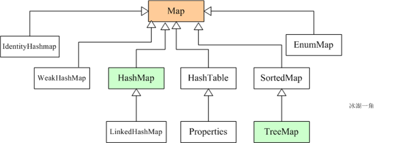
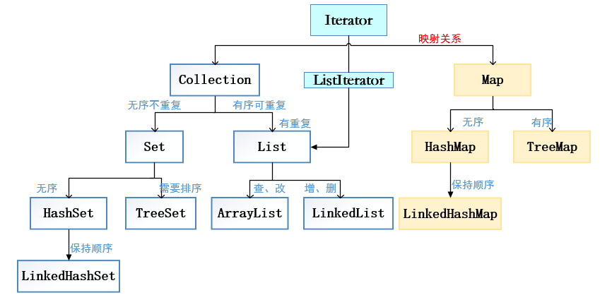

# Java基础语法（中）11-14

[TOC]


## 11. String 类

**特点** 

字符串对象一旦初始化就不会被改变（指等号右边）。

`String s = "abc";`，创建一个字符串对象"abc"在常量池中。

`String s1 = new String("abc");`  ，创建两个对象，一个new对象和一个字符串对象在堆内存。


**String 类中常见方法：获取、转换、比较** 

```java
String s = "abcdef";
// String s = new String("abcdef") // 创建两个对象
String s1 = s.intern(); // 判断字符串常量池中有没有 s 的字符串，有就返回字符串；咩呀就创建 s 的一个字符串
```

1. 获取 —— 字符串的长度、位置、字符、子串

   ```java
   System.out.println("length=" + s.length()); //获取字符串的长度
   System.out.println("index=" + s.cha rAt(1)); // 某个位置的字符
   System.out.println("c=" + s.indexOf('c')); // 某个字符的位置
   System.out.println("bc=" + s.indexOf("bc")); // 某个字符串的位置
   System.out.println("substring=" + s.substring()); // 获取子串，位置1-4
   ```

2. 转换 —— 字符、字节数组、大小写、替换、连接

   ```java
   char[] arr = s.toCharArray();
   for(int i=0; i < arr.length; i++) // 字符串转成字符数组
     System.out.println(arr[i]);
   byte[] byt = s.getBytes();
   for(int i=0; i < byt.length; i++) // 字符串转成字节数组
     System.out.println(byt[i]);
   System.out.println(s.toUpperCase()); // 字符串转成大写
   System.out.println(s.replace('a', 'A')); // 字符串中某个字符替换
   System.out.println(s.replace("ab", "AB")); // 字符串中某个字符串替换
   System.out.println("-" + " ab c ".trim() + "-"); // 将字符串两端空格删除
   System.out.println(s.concat("ABCD")); // 字符串连接
   System.out.println(String.valueOf(4) + 5); // 将数字转换成字符
   ```

3. 比较 —— 相等、包含、开头和结尾、大小

   ```java
   System.out.println(s.equals("abcdef")); // 字符串相等
   System.out.println(s.equalsIgnore("ABCDEF")); // 忽略大小写
   System.out.println(s.contains("abc")); // 是否包含，indexOf
   System.out.println(s.startsWith("abc")); // 是否以某个字符串开头
   System.out.println(s.endsWith("ef")); // 是否以某个字符串结尾
   System.out.println("abc".compareTo("aqw")); // 比较两个字符的大小
   ```


## 12. StringBuffer 类

**特点** 

长度是可变的；可以存放不同类型的数据；最终将整合的数据以字符串输出；可以对字符串修改。


**功能** 

1. 添加
   - append(data)：在缓冲区中添加数据，从尾部追加
   - insert(index, data)：在指定位置插入数据
2. 删除
   - delete(start, end)：删除数据，包含开始、不包含结束[start, end)
   - deleteChatAt(index)：删除指定位置的数据
3. 查找
   - indexOf：给出指定字符的位置
   - charAt：给出指定位置的字符
4. 修改
   - replace(start, end, data)：把指定区间内数据替换
   - reverse()：逆序缓冲器
5. 其它
   - setLength(int newLength)：设定缓冲区的长度
   - revese()：逆序缓冲器


**可变长数组** 

StringBuffer 是线程安全的可变字符，序列的长度是可变的，调用 StringBuffer 的 append 方法，来改变 StringBuffer 的长度。

如果知道数据长度，可以直接创建指定长度的缓冲区，这样相对需要延长的缓冲区效率高


**StringBuilder 类**

StringBuilder 是一个可变的字符序列。建议优先采用该类，因为在大多数实现中，它比 StringBuffer 要快。

1. 三者在执行速度方面的比较：

   StringBuilder > StringBuffer > String

2. String <（StringBuffer，StringBuilder）的原因

   String是“字符串常量”，是不可改变的对象。

   由于这种机制，每当用 String 操作字符串时，实际上是在不断的创建新的对象，而原来的对象就会变为垃圾被 ＧＣ 回收掉，效率大大降低。

   而 StringBuffer 与 StringBuilder 就不一样了，他们是字符串变量，是可改变的对象。

   每当我们用它们对字符串做操作时，实际上是在一个对象上操作的，这样就不会像 String 一样创建一些对象外的对象进行操作，当然速度就快了。

3. StringBuilder与 StringBuffer

   StringBuilder：线程非安全的

   StringBuffer：线程安全的

   StiringBuffer 跟 StringBuilder 类似，只不过为了实现同步，很多方法使用 Synchronized 修饰。

   当我们在字符串缓冲区被多个线程使用时，JVM不能保证 StringBuilder 的操作是安全的，虽然它的速度最快，但是可以保证 StringBuffer 是可以正确操作的。

   当然大多数情况下就是我们是在单线程下进行的操作，所以大多数情况下是建议用 StringBuilder 而不用 StringBuffer 的，就是因为速度的缘故。


## 13. 基本数据类型对象类型

**主要作用** 

将基本类型和字符串类型进行互相转换

- 基本类 ——> 字符串类型

  `基本类型 + ""`，或者使用 `valueOf`  方法

- 字符串 ——> 基本类型

  使用包装类中的静态方法 `parseXxx("xxx")` xxx是数据类型

  先封装成对象，然后调用 `intValue()` 方法


**进制转换** 

整数转成其它进制：`toXxxString(int i)` ：将整数转成 Xxx 进制

其它进制转成整数：`paeseInt(String s, int radix) 


**自动装箱** 

`i = new Integer(4);` 自动装箱，如果装箱一个字节，则数据会共享，不会开辟新空间。如果对 `i` 进行操作，就会拆箱，变成数据类型进行换算。 


## 14. 集合

### 1⃣️集合概念和特点

**概念** 

对对象进行存储，如果对象个数不确定，就出现了**集合容器**进行存储。

**特点**

- 用于存储对象的容器
- 集合的长度是可以变化的
- 集合中不可以存储基本数据类型

**数组与集合的区别** 

1. 数组长度不可变化而且无法保存具有映射关系的数据；集合类用于保存数量不确定的数据，以及保存具有映射关系的数据。
2. 数组元素既可以是基本类型的值，也可以是对象；集合只能保存对象。

**Collection 和 Collections 的区别** 

1. collection是上级接口，继承他的子类有List和Set;

2. collections是集合的工具类，提供一系列静态方法对集合的搜索、查找、同步操作；

**Enumeration 和 Iterator 接口的区别** 

Iterator代替了Enumeration接口，Enumeration是个旧的迭代器；

1. Iterator的方法名比Enumeration更科学；
2. Iterator比Enumeration更安全，因为当一个集合被遍历时它会阻止其他线程对集合的修改；
3. Iterator能够删除元素，而Enumeration不能删除元素；


### 2⃣️集合框架

集合容器因为内部的数据结构不同，有多种具体容器，不断向上抽取，就形成了集合框架。

框架的顶层就是 Collection 接口

 

 

Java集合类主要由两个根接口Collection和Map派生出来的。

Collection派生出了三个子接口：List、Set、Queue（Java5新增的队列），因此Java集合大致也可分成List、Set、Queue、Map四种接口体系，（注意：Map不是Collection的子接口）。

其中

- List代表了有序可重复集合，可直接根据元素的索引来访问；
- Set代表无序不可重复集合，只能根据元素本身来访问；
- Queue是队列集合；
- Map代表的是存储key-value对的集合，可根据元素的key来访问value。

上图中淡绿色背景覆盖的是集合体系中常用的实现类，分别是ArrayList、LinkedList、ArrayQueue、HashSet、TreeSet、HashMap、TreeMap等实现类。


### 3⃣️Collection 的常见方法

- 增加

  `boolean add(Object)` 

  `boolean addAll(Collection coll)` 

- 删除

  `remove`、`removeAll` 删除二者集合的交集、`clear` 

- 判断

  `contains`、`containsAll`、`isEmpty`

- 获取

  `size` 集合大小、`iterator` 迭代器

- 其它

  `retainAll` 取交集、`toArray` 集合转数组


### 4⃣️迭代器

**原理** 

每一个容器内部的数据结构不同，所以该迭代器对象应该是在容器内部实现的。对于使用容器而言，具体的实现不重要，只要通过容器获取到该实现的迭代器对象即可，也就是 iterator 方法

Iterator 接口就是对所有 Collection 容器进行元素取出的公共接口

```java
Collection c1 = new ArrayList(); // 创建一个 ArrayList 容器 c1
// c1.iterator() 调用该容器中的方法，返回迭代器对象，相应的调用对象中操作内容的方法
for (Iterator it = c1.iterator(); it.hashNext()){
  System.out.println(it.next());
}
```

个人理解

Collection 和 Iterator 都是接口，Collection 接口里面放着所有类型容器都有的方法（向上抽取得到），Iterator 接口内放着处理容器内容 hashNext、next 等抽象方法。

任意一个类型的容器，都实现了 Collection 和 Iterator 接口内容，并对上面的接口中的方法进行覆写，针对自身容器特点进行数据元素操作。

打个比方，容器类似抓娃娃机，里面的爪子是迭代器，但只提供外部的操纵杆对内进行操作。


### 5⃣️Collection 的子类接口 List

**特点** 

List 有序（存入和取出顺序不一致），有索引，元素可重复；Set 元素不可重复

List 功能操作：相对于 Collection，除了增删查，还扩展了**位置索引**和修改数据（set）

List 迭代器：除了 iterator 的功能外，还有自己特定的 list Iterator 功能。因为 iterator 不允许在遍历操作过程中修改或添加数据，所以有了自己的 listIterator，可以在遍历过程中使用 listIterator 中的方法进行修改或添加操作。

```java
List l1 = new Array();
l1.add("abc1");
l1.add("abc2");
l1.add("abc3");
l1.add("abc4");
ListIterator it = l1.listIterator(); // 创建 list 迭代器
while(it.hasNext()){
  Obejct obj = it.next();
  if(obj.equals("abc1")){
    it.set("123"); // 将“abc1”修改“123”
  }
  else if (obj.euqals("abc2")){
    it.add("456"); // 将“abc2”修改“456”
  }
  else {
    System.out.println(obj);
  }
}
System.out.println(l1);
```

**List 的实现类** 

Vector：内部是数组数据结构，是同步的。最老版本，几乎不用了。

ArrayList：内部是数组数据结构，是不同步的。带来 Vector，查询速度很快。

LinkedList：内部是链表数据结构，是不同步的。增删元素很快。


**LinkedList 类链表操作** 

- 添加

  `addFirst(E e)`、`addLast(E e)` 

- 获取

  `getFisrt()`、`getLast()`：获取但不移除，如果列表为空，抛出 `NoSuchElementException` 

  `peekFirst()`、`peekLast()` ：获取但不移除，如果列表为空，返回 `null` 。

  `removeFirst()`、`removeLast()`：获取元素并移除，如果列表为空，抛出 `NoSuchElementException` 

  `pollFirst()` 、`pollLast()` ：获取元素并移除，如果列表为空，返回 `null` 。

- 用列表实现队列的数据结构

  队列：先进先出

  堆栈：先进后出

  ```java
  class DuiLie{
    private LinkedList li;
    public DuiLie(){
      li = new LinkedList();
    }
    public void addDL(Object obj){
      li.addLast(obj);
    }
    public Object getDL(){
      return li.removeFirst();
    }
    public boolean DListEmpty(){
      return li.isEmpty();
    }
  }
  ```


**ArrayList 类的数据操作** 

数据添加、删除等与上面相似。


### 6⃣️Collection 的子类接口 Set 中的 HashSet

Set元素不可重复，无序。

HashSet：内部数据结构是哈希表、不同步。

HashSet 是无序的，但是它的子类 LinkedHashSet 是有序的，怎么存进去、怎么读出来，用了链表连接。


**哈希算法** 

给一个元素，通过哈希算法，就可以得出该元素的位置，这样比遍历算法要快得多。

```java
function(element){
  // 通过哈希算法
  return index;
}
```

**哈希表判断元素是否相同** （HashCode ——> equals）

1. 先通过哈希算法（HashCode），得出哈希值，哈希值不同则元素不同；
2. 若哈希值相同，则需要 equals 方法判断。

**如果两个对象 equals() 相同，那么它们的 hashCode() 值一定相同**；

**如果两个对象 hashCode() 不同，那么它们的 equals() 值一定不同**。


**HashSet 存放自定义对象** 

```java
import Java.util.HashSet;
import Java.util.Iterator;

public class Hashset1{
  public static void main(String[] args){
    HashSet h = new HashSet(); // 里面存放的是哈希值
    // 每次创建对象会调用 HashCode 方法得出哈希值，即存放位置
    h.add(new Person("xx1", 14));
    h.add(new Person("xx2", 12));
    h.add(new Person("xx3", 13));
    // 得出哈希值相等，则用哈希值相等已存的对象与当前要存入的对象进行 equals 方法比较。若 equals 比较相等，则不存。
    h.add(new Person("xx1", 14));
    
    Iterator it = h.iterator();
    while(it.hasNext()){
      Person p = (Person) it.next();
      System.out.println(p.getName() + "--结果--" + p.getAge());
    }
  }
}

class Person implements Comparable{
  private String name;
  private int age;
  Person(String name, int age){
    this.name = name;
    this.age = age;
  }
  
  @Override /* 对 Object 中的哈希算法进行了重写 */
  public int hashCode(){
    System.out.println(this + "...hashcode()"); // 哪个对象调用 this，this就代表这个对象
    return name.hashCode()+age;
  }
  
  @Override /* 对 Object 中的 equals 算法进行了重写 */
  public boolean equals(Object obj){ // 当哈希值相等时，当前要写入的对象(this)会调用该方法与原来对象(obj)进行比较
    Person p = (Person) obj;
    System.out.println(this + "...euqals");
    return this.name.equals(p.name) && this.age = p.age;
  }
  
  public String getName(){
    return name;
  }
  public int getAge(){
    return age;
  }
  
  @Override /* 用来输出当前对象 this 的字符串形式*/
  public String toString(){
    return name + ":" + age;
  }
  
  @Override /* 这个函数给 TreeSet 调用，对 Person 对象进行比较 */
  public int compareTo(Object o){ // this 表示当前对象。谁调用就代表谁
    int temp;
    Person p = (Person) o;
    temp = this.name.compareTo(p.name);
    return temp == 0 ? this.age - p.age : temp; // 先安装姓名排序，若相等，则按照年龄
  }
}
```


### 7⃣️Collection 的子类接口 Set 中的 TreeSet

TreeSet：可以对 Set 中的元素进行排序，不同步。元素是以二叉树的形式存放的。

判断元素的唯一性的方式：根据比较方法的返回结果判断，结果 0 就为相等。

排序方法之一：让 TreeSet 中的元素的类实现 Comparable 接口的 compareTo 比较方法（类直接实现接口）

排序方法之二：给 TreeSet 构造函数传入比较器对象，则使用实现 Comparator 接口的子类对象方法（创建比较器）

```java
import Java.util.Comparator;
import Java.util.Iterator;
import Java.util.TreeSet;

public class TreeSet1 {
  public static void main(String[] args){
    // 传入比较器对象，则使用实现 Comparator 接口子类对象的方法
    TreeSet tr = new TreeSet(new TreeCompare); 
    // 若不传入比较器对象，则使用 Person 对象中的比较方法 compareTo
    // TreeSet tr = new TreeSet();
    // 存放的对象会调用，对象中的比较方法
    tr.add(new Person("yy1", 11));
    tr.add(new Person("yy4", 14));
    tr.add(new Person("yy2", 12));
    tr.add(new Person("yy3", 11));
    tr.add(new Person("yy2", 19));
    
    Iterator it = tr.iterator();
    while(it.hasNext()){
      Person p = (Person) it.next();
      System.out.println(p.getName() + "--结果--" + p.getAge());
    }
  }
}

/* 第二种排序方法：利用比较器排序  */
class TreeCompara implements Comparator{
  @Override
  public int compare(Object o1, Object o2){
    int temp;
    Person p1 = (Person) o1;
    Person p2 = (Person) o2;
    temp = p1.getAge() - p2.getAge(); // 按照年龄比，若相等，则按照名字比
    return temp == 0? p1.getName().compareTo(p2.getName()):temp;
  }
}
```


### 8⃣️集合 Collection 的总结



- TreeSet

  内为二叉树，需要用 Comparator 或 Comparable 接口，进行比较排序

- HashSet

  内为哈希表，需要用到 HashCode 和 equals 方法进行计算哈希值和判断相等


### 9⃣️泛型 ⭐️

**特点** 

- 将运行时期的问题（类型转换异常），转到了编译时期，避免了强制转换的麻烦。

- 泛型技术是给编译器使用的技术，用于编译时期，确保类型安全。运行时，会将泛型去掉，生成的 class 文件中不带泛型，这叫泛型的擦除。（为什么擦除，为了兼容类加载器）

- 泛型补偿：在运行中通过获取元素的类型进行转换动作，不用使用者再强制转换了。

  个人理解：泛型就用一个符号或者具体对象指定了各种集合或比较器等中锁操作的元素类型，编译时就能检测操作对象是否符合泛型的指定，提高了安全性。


**作用** 

就是一个用于接受具体引用数据类型的参数范围。在程序中，只要用到了带有 `<>` 类或接口，就要确定引用数据的类型。


**泛型类** 

当类中操作的引用数据类型不确定的时候，就是用泛型来表示。

```java
package GenericClass;
class Student{}
class Worker{}

class Tool<Person> { // 用来对类的引用数据类型进行操作，但是操作类均有多种
  private Person p;
  public Person getObj(){
    return p;
  }
  
  public void setObj(Person p){
    this.p = p;
  }
}

public class GenericClassDemo{
  public static void main(String[] args){
    Tool<Student> t = new Tool<>(); // 明确之后，t 对象只能操作 Student 对象
    t.setObj(new Student());
  }
}
```


**泛型方法** 

在方法上定义泛型，可以接受所以类型的对象。（和 Object 功能一样，后面还有新的运用）。

```java
public <W> void printf(W str){
  System.out.println("str:" + str);
}
```


**泛型接口** 

就在接口声明后面定义泛型，在实现接口时或者实例化对象时知名泛型的具体类型


**泛型的通配符 `<?>` 和泛型的上下限定（方法的传入泛型参数）** 

```java
package GenericClass;
import Java.util.*;

class Person{
  private String name;
  private int age;
  Person(String name, int age){
    this.name = name;
    this.age = age;
  }
  public String getName(){
    return name;
  }
  public int getAge(){
    return age;
  }
}
```

```java
class Student extends Person{
  Student(String name, int age){
    super(name, age);
  }
}
```

```java
class Worker extends Person{
  Worker(String name, int age){
    super(name, age);
  }
}
```

```java
public class GenericClassDemo{
  public static void main(String[] args){
    ArrayList<Student> s = new ArrayList<>();
    s.add(new Student("xx1", 11));
    s.add(new Student("xx2", 12));
    LinkedList<Worker> s1 = new LinkedList<>();
    s1.add(new Student("xx3", 13));
    s1.add(new Student("xx4", 14));
    // 集合类型不一致，操作对象都为 Person 的迭代器
    IteratorMethod(s);
    IteratorMethod(s1);
  }
  // 问题： 将<? extends Person>变为 <Person>为什么不可以？必须要用通配符？
  // 回答：Collection<Person> s = new LinkedList<Worker>(); 很明显不对，泛型不一致。
  // 可以使用 <?>，但是没法对传入对象进行限制
  // <? extends Person> 叫做泛型的限定（上限）
  public static void IteratorMethod(Collection<? extends Person> s){
    Iterator<? extends Person> it = s.iterator(); // 
    while (it.hasNext()){
      Person p = it.next();
      System.out.println(p.getName() + "..." + p.getAge());
    }
  }
}
```

注意：一般存储元素的时候，都是用泛型上限的。这样取出都是按照上限类型来运算的，不会出现类型安全隐患。


**extend 和 super 的区别** 

```java
package GenericClass;
import Java.util.Comparator;
import java.util.TreeSet;

public class GenericClassDemo1{
  public static void main(String[] args){
    //
    /*
    *
    */
    TreeSet<Student> s = new TreeSet<>(new CompaByStu());
    s.add(new Student("yy1", 11));
    s.add(new Student("yy13", 13));
    s.add(new Student("yy22", 12));
    //
    TreeSet<Worker> w = new TreeSet<>(new CompaByPer());
    w.add(new Student("yy1", 11));
    w.add(new Student("yy13", 13));
    w.add(new Student("yy22", 12));
    //
    TreeSet<Worker> p = new TreeSet<>(new CompaByPer());
    /*
    *
    */
    p.addAll(s);
    p.addAll(w);
    GenericClassDemo.iteratorMethod(s); //
    System.out.println("----华丽分界线----");
    GenericClassDemo.iteratorMethod(w); 
    System.out.println("----华丽分界线----");
    GenericClassDemo.iteratorMethod(p); 
  }
}
```

人类比较器

```java
class CompaByPer implements Comparator<Person>{
  @Override
  public int compare(Person p1, Person p2){
    int temp;
    temp = p1.getAge() - p2.Age(); // 按照年龄比，若相等，则按照名字比
    return temp==0 ? p1.getName().compareTo(p2.getName()):temp;
  }
}
```

学生比较器

```java
class CompaByStu implements Comparator<Student>{
  @Override
  public int compare(Student p1, Student p2){
    int temp;
    temp = p1.getAge() - p2.Age(); // 按照年龄比，若相等，则按照名字比
    return temp==0 ? p1.getName().compareTo(p2.getName()):temp;
  }
}
```

分析：一般而言，extend 用于存储数据，比如人类的容器，学生和工人都可以往里面存储；

super 一般用于取出数据，比如学生数据智能用学生比较器和人类比较器取出。


**泛型总结** 

泛型既具有广泛的概念，也具有具体的概念，可以将各种类型进行广泛化，比如泛型类、泛型方法等；不过有时也要具体化，比如在集合中明确要存储什么类型的对象。


### 🔟Map 集合 ⭐️

**特点** 

双列集合，存储的是键值对，必须保存键的唯一性。

打个比方，一对夫妻 Map 集合，终结的映射关系就是结婚证 entrySet。


**常用方法** 

- 添加

  `v put(key, value)` ：返回前一个和 key 关联的值，如果没有返回 null。

- 删除

  `void clear()` ：清空 `map` 集合；

  `v remove(key)` ：根据指定的 key 删除这个键值对，并返回该 key 的键值。

- 判断

  `boolean containsKey(key)` 

  `boolean containsValue(value)` 

  `boolean isEmpty()` 

- 获取

  `v get(key)` ：返回指定 key 的值，如果没有键值，则返回值。

  `int size()` ：获取键值对的个数


**KeySet 的运用** 

利用迭代器返回所有按键和键值。

首先利用 KeySet 方法获取所有按键，然后利用迭代器和 get 方法获取所有键值。

获取键值也可以直接使用 values()，返回所有键值的集合。

```java
HashMap<Integer, String> m = new HashMap<>();
m.put(1, "aaa1");
m.put(3, "aaa3");
m.put(2, "aaa2");
m.put(4, "aaa4");
Set<Integer> keyset = m.keySet(); // 获取所有按键
Iterator<Integer> it = keyset.iterator();
while(it.hasNext()){
  System.out.println(m.get(it.next())); // 获取键值
}
```


**entrySet 的运用** 

取出映射关系与所有按键及其键值

```java
HashMap<Integer, String> m = new HashMap<>();
m.put(1, "aaa1");
m.put(3, "aaa3");
m.put(2, "aaa2");
m.put(4, "aaa4");
// 返回值是映射关系对象的集合（结婚证类型）
Set<Map.Entry<Integer, String>> me = m.entrySet(); // 获取所有按键
Iterator<Map.Entry<Integer, String>> it = me.iterator();
while(it.hasNext()){
  // mevalue是结婚证类型的对象
  Map.Entry<Integer, String> mevalue = it.next();
  // 结婚证类型的对象调用方法
  Integer k = mevalue.getKey();
  String v = mevalue.getValue();
  System.out.println(k + "::" + v); // 获取键值
}
```


**Map 常用子类** 

- Hashtable

  内部是哈希表，同步，不能空键、空值。（其中有个子类 Properties，后面结合 `IO` 接口，配置文件信息）

- HashMap

  内部是哈希表，不同步，可以空键、空值。（LinkedHashMap 是有序的，怎么存，怎么取）

- TreeMap

  内部是二叉树，不同步，可以对 key 进行排序


**HashMap 存储自定义对象**（HashSet底层就是用 HashMap 设计的）

```java
// 按键是 Person 对象，键值是字符串对象
HashMap<Integer, String> hm = new HashMap<>();
hm.put(new Person("xx1", 11), "上海");
hm.put(new Person("xx3", 13), "广州");
hm.put(new Person("xx6", 16), "南京");
hm.put(new Person("xx5", 15), "北京");
// 自定义哈希算法判断 key 相等，key 相等可以覆盖键值，符合 Map 集合的特点
// 迭代器注意集合内的存储的对象类型
Iterator<Person> it = hm.keySet().iterator();
while(it.hasNext()){
  Person p = it.next();
  System.out.println(p.getName() + ":" + p.getAge() + ":" + hm.get(p));
}
```


### 1⃣️1⃣️ 集合工具类 Collections

- sort 排序

- swap 交换元素

- binarySearch 二分查找

- max、main 返回最大、最小元素

- replaceAll 替换最大元素

- reverseOrder 返回一个比较器，它强行逆转实现了 Comparable 接口的对象 collection 的自然顺序

- shuffle 对元素进行随机排序

- 将非同步方法转成同步方法（给非同步集合加锁）

  `synchronizedCollection(Collection<T> c)` 返回指定 collection 支持的同步（线程安全的）collection。还有其它集合的形式，将非同步集合转换成同步集合，用于多线程。


### 1⃣️2⃣️数组工具类 Arrays

- binarySearch 二分查找
- 复制数组
- equals（数组1，数组2）比较数组相等
- sort 排序
- toString 将数组转成字符串输出（借鉴源码思想，for循环不加判断）
- asList 将数组转成列表 List，可以使用集合的方法操作数组中的元素

注意

- 数组的长度是固定的，所以对集合的增删方法是不可以使用的
- 数组的元素是对象，那么转成集合，直接将数组的元素作为集合的元素进行集合存储
- 数组元素是基本数据类型，那么会将数组作为集合中的元素进行存储（总之，注意基本数据类型和对象的区别）
- 集合当中有 toArray 方法将集合转成数组，可以对集合中的元素进行限定，不允许进行增删。注意传入的参数。


### 1⃣️3⃣️JDK 1.5 特性

1. `for(类型 变量: 数组或者集合)` 遍历的作用，对于集合本质就是迭代器的简化。

   - 传统 for 和高级 for 的区别

     传统的可以完成控制循环增量和条件（操作角标），而高级的是一种简化形式（主要用于遍历），必须有遍历的目标。

   - 高级 for 可以遍历 map 集合吗？

     不能直接用，但是可以将 map 转成 set，就可以了

2. 函数可遍参数

   比如函数的参数是一个整数数组，参数一般为 `int[] arr`，但是这个函数指定传送数组，为了简化书写，可以用 `int... arr` 可以直接在里面传送数组的具体值。


