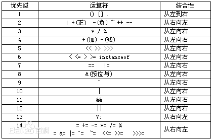

# Java基础（上）

[TOC]


## 1. 8种基本数据类型

`byte`、`short`、`int`、`long`、`float`、`double`、`char`、`boolean`

| 数据类型 | 位数   | 默认值 | 取值范围              |
| -------- | ------ | ------ | --------------------- |
| byte     | 8      | 0      | -2^7 ～ 2^7 - 1       |
| short    | 16     | 0      | -2^15 ～ 2^15 - 1     |
| ==int==  | ==32== | ==0==  | ==-2^31 ～ 2^31 - 1== |
| long     | 64     | 0      | -2^63 ～ 2^63 - 1     |
| float    | 32     | 0.0    | -2^31 ～ 2^31 - 1     |
| double   | 64     | 0.0    | -2^63 ～ 2^63 - 1     |
| char     | 16     | 空     | 0 ～ 2^6 -1           |
| boolean  | 8      | false  | true、false           |

自动转换：低类型的向高类型的转换；

强制转换：高类型的向低类型的转换，但可能会导致数据溢出或者是精度丢失；

`int`的取值范围： -2147483648 ～ 2147483647，20亿左右，存不下地球总人口；

`long`类型的数据初始化的数值后面加上==L==，否则作为整型解析；

**引申**：

1. **String**不是基本类型，而是对象；

2. Java的**泛型**和**类型擦除**
   
   [泛型详解，学习设计模式时再回顾](https://www.cnblogs.com/coprince/p/8603492.html)
   
   Java泛型提供了编译时类型安全检测机制，==泛型的本质是参数化类型==。
   在编译期间，所有的泛型信息都会被擦掉，这也就是所说的类型擦除。
   泛型一般有三种使用方式：泛型类、泛型接口、泛型方法。
   
3. 运算符的优先级
   **单目乘除为关系，逻辑三目后赋值**
   解释：
   单目：例如“正”、“负”这些一次只作用于一个变量的运算符，又叫“一元运算符”；
   乘除：乘、除、模，毫无疑问优先级比加减高一级；
   为：即谐音“位”，指的是位运算中用到的符号：“～”按位取反、“<<”左移、“>>”右移、“^”二进制异或（也可以位运算）；
   关系：大于、大于等于、小于、小于等于； 
   逻辑：指的是“异或”、“与”、“或”三个逻辑运算符；
   三目：即三目运算符：条件运算符 A > B ? X : Y
   赋值：“=”
   

   备注：优先级为1的优先级最高，优先级14的优先级最低


## 2. 自动拆箱和装箱

基本类型都有对应的包装类分别为：`Byte`、`Short`、`Integer`、`Long`、`Float`、`Double`、`Character`、`Boolean`；

装箱是将**值类型**转换为**引用类型** ；拆箱是将**引用类型**转换为**值类型** 
利用装箱和拆箱功能，可通过允许值类型的任何值与`Object` 类型的值相互转换，将值类型与引用类型链接起来。例如：

```java
int val = 100;
object obj = val;
Console.WriteLine ("对象的值 = {0}", obj);

这是一个装箱的过程，是将值类型转换为引用类型的过程
```

装箱过程是通过调用包装器的==valueOf==方法实现的，而拆箱过程是通过调用包装器的==xxxValue==方法实现的（xxx代表对应的基本数据类型）。（看下方源码一目了然）

```java
public static Integer valueOf(int i) {
  if (i >= IntegerCache.low && i <= IntegerCache.high)
    return IntegerCache.cache[i+(-IntegerCache.low)];
  return new Integer(i);
}

public int intValue(){
  return value;
}
```

### 常见面试题

```java
1、Integer 比较大小
Integer i1 = 100;
Integer i2 = 100;
Integer i3 = 200;
Integer i4 = 200;
System.out.println(i1==i2);
System.out.println(i3==i4);
输出结果是多少？true、false
  
引申：Integer比较大小应该使用“==”还是“equals”？

推荐使用“equals”，因为对于"-128～127"范围内的Integer对象，值相同的 integer 对象都是指向的同一块内存空间，所以这个区间内的 integer 值可以直接使用“==”进行判断（上面源码中 i >= IntegerCache.low && i <= IntegerCache.high 部分 ）
```

```java
2、Integer i = new Integer(xxx) 和 i = xxx 的区别
(1)前者不会触发自动装箱的过程，而后者会触发；
(2)在执行效率和资源占用上的区别。后者的执行效率和资源占用在一般情况下要优于前者，但不绝对。
```

```java
3、查看下面代码的结果，明白比较和拆箱的操作
Integer a = 1;
Integer b = 2;
Integer c = 3;
Integer d = 3;
Integer e = 321;
Integer f = 321;
Long g = 3L;
int x = 3;
long y = 3L;
// x、y虽然类型不同但可以直接进行数值比较
System.out.println(x==y);  //true
System.out.println(c == g); //提示出错，不可比较的类型。说明此刻没有自动拆箱
System.out.println(c == d); //true
System.out.println(c == f); //false
System.out.println(c == (a+b)); // true
System.out.println(c.equals(a+b)); //true
// 遇到运算符(此处的“+”)才会自动拆箱
System.out.println(g == (a+b)); //true
System.out.println(g.equals(a+b)); //false
```


## 3. Java常见的关键字

51+2个保留字=53个关键字（Java的关键字都是小写，加粗的是面试重点）

|          |           |                |          |                  |               |              |        |
| -------- | --------- | -------------- | -------- | ---------------- | ------------- | ------------ | ------ |
| 访问控制 | private   | protected      | public   |                  |               |              |        |
| 类相关   | abstract  | class          | extends  | **fianl**        | implements    | interface    | native |
|          | new       | **static**     | strictfp | **synchronized** | **transient** | **volatile** |        |
| 程序控制 | break     | continue       | return   | do               | while         | if           | else   |
|          | for       | **instanceof** | switch   | case             | default       | assert       |        |
| 异常     | try       | catch          | throw    | throws           | finally       |              |        |
| 导包     | import    | package        |          |                  |               |              |        |
| 基本类型 | boolean   | byte           | char     | double           | float         | int          | long   |
|          | short     | null           | true     | false            |               |              |        |
| 引用     | **super** | **this**       | void     |                  |               |              |        |
| 保留字   | goto      | const          |          |                  |               |              |        |

### ⭐️ static 关键字的作用是什么

1. **修饰变量**
   因为类加载进方法区，所以多个对象是共享的；（引申：JVM类加载过程？）
2. **修饰方法**
   工具类的方法，不需要建立多个对象，直接使用**“类名.方法名”**的方式调用；
3. **修饰静态代码块**
   只会在类被初次加载的时候执行一次，可以用于初始化等操作；
4. **静态内部类**
   注意：一般方法可以访问静态方法的，但是静态的方法必须访问静态的。

#### **引申**：静态属性和静态方法可以被继承吗？

[**父类的静态属性和方法可以被子类继承**](https://blog.csdn.net/qdh186/article/details/79807057)


### ⭐️ final 关键字

1. **修饰数据**
   包括成员变量和局部变量，该变量只能被赋值一次且它的值无法被改变。
   对于成员变量来讲，修饰的类变量，必须在声明时初始化；修饰的实例变量，必须在声明时或者构造方法中对它赋值。
2. **修饰方法参数**
   表示在变量的生存期中它的值不能被改变；
3. **修饰方法**
   表示该方法无法被重写；
4. **修饰类**
   表示该类无法被继承；

**引申**

为什么说==String类==是final修饰的？（看String源码）

```java
public final class String
  implements java.io.Serializable, Comarable<String>, CharSequence 
{
  private final char value[];
}
```


### super和this 用法和区别

**super**可以理解为是指向自己超（父）类对象的一个指针，而这个超类指的是离自己最近的一个父类。

**this**是自身的一个对象，代表对象本身，可以理解为：指向对象本身的一个指针。

==super和this的区别==

1. 属性的区别
   `this`访问本类中的属性，如果本类没有此属性则从父类中继续查找。`super`访问父类中的属性。

2. 方法的区别
   `this`访问本类中的方法，如果本类没有此方法则从父类中继续查找。`super`访问父类中的方法。

3. 构造的区别
   `this`调用本类构造，必须放在构造方法的首行。`super`调用父类构造，必须放在子类构造方法首行。
   `super(参数)`：调用基类中的某一个构造函数（放在构造函数中的第一条语句）
   `this(参数)`：调用本类中另一种形成的构造函数（放在构造函数中的第一条语句）

4. 其它区别

   `this`表示当前对象，`super`不能表示当前对象
   A、`this.变量` 和 `super.变量`
   `this.变量` 调用的当前对象的变量；
   `super.变量` 直接调用的是父类中的变量。
   B、`this(参数)` 和 `super(参数)`方法
   `this(参数)` 调用（转发）的是当前类中的构造器；
   `super(参数)` 用于确认要使用父类中的哪一个构造器。

   `super`：引用当前对象的直接父类中的成员，用来访问直接父类中被隐藏的父类中成员数据或函数或函数，基类与派生类中有相同成员定义时如：super变量名，super成员函数据名（实参）

==注意点==

`this()` 和`super()` 不能存在于同一个构造函数中。
第一，`this()` 和 `super()` 都必须写在构造函数的第一行，会起冲突；
第二，`this()`语句调用的是当前类的另一个构造函数，而这个另一个构造函数中必然有一个父类的构造器，再使用`super()`又调用一次父类的构造器， 就相当于调用了两次父类的构造器，编译器不会通过；

`this`和`super`不能用于 `static` 修饰的static变量，static方法，static代码块；
因为`this` 和 `super` 都是指的是对象（实例）。

从本质上讲，`this`是一个指向本对象的指针，而`super`是一个Java关键字。


## 4. Comparable和Comparator的区别

相同点： `Comparable` 和 `Comparator` 都是用来实现集合中元素的比较、排序的。

不同点：

1. 接口定义的方法不同 
   `Comparable`接口里面的方法是 `public int compareTo(T o);` 在 `java.lang` 包下
   `Comparator`接口里面的方法是 `int compare(T o1, T o2);` 在 `java.util` 包下
2. `Comparable` 是在集合内部定义的方法实现的排序，`Comparator` 是在集合外部实现的排序。
   所以如果想实现排序，就需要在集合内实现 Comparable 接口的方法，或在集合外定义 Comparator 接口的方法。
   `Comparable` 是一个对象本身就已经支持自比较所需要实现的接口（如 `String`、`Integer`，`Float`、`Double` 等 自己就可以完成比较大小操作，已经实现了`Comparable`接口），自定义的类要在加入`list`容器中后能够排序，可以实现`Comparable`接口。在用`Collections`类的`sort`方法排序时，如果不指定`Comparator`，那么就以自然顺序排序，这里的自然顺序就是实现`Comparable`接口设定的排序方式。
   而 `Comparator `是一个专用的比较器，在集合外部实现的排序，当这个对象不支持自比较或者自比较函数不能满足你的要求时，你可以写一个比较器来完成两个对象之间大小的比较。
   用 Comparator 是策略模式（strategy design pattern），就是不改变对象自身，而用一个策略对象（strategy object）来改变它的行为。 比如：你想对整数采用绝对值大小来排序，`Integer` 是不符合要求的，你不需要去修改 `Integer` 类（实际上你也不能这么做）去改变它的排序行为，只要使用一个实现了 Comparator 接口的对象来实现控制它的排序就行了。

简单说一个是自已完成比较，一个是外部程序实现比较的差别而已；
或者说`Comparable` 是在集合内部定义的方法实现的排序，`Comparator` 是在集合外部实现的排序。

```java
public interface Comparable<T> 
{ //内部比较器 比较属性 静态绑定
  public int compareTo(T o);
}

public interface Comparator<T> 
{ // 外部比较器 比较器 动态绑定
  int compare(T o1, T o2);
  boolean equals(Object obj);
}
```

（1）关于Comparable

`Comparable` 对实现它的每个类的对象进行整体排序，这个接口的方法需要类本身去具体实现。
一般来说，在创建一个类时，如果这个类具有排序的属性，那么可以去实现这个`comparable`接口，并`override`其`ComparaTo`方法。

举例

```java
public class Person1 implments Comparable<Person1>
{
  private int age;
  private String name;
  
  public Person1(String name, int age)
  {
    this.name = name;
    this.age = age;
  }
  @Override
  public int compareTo(Person1 o)
  {
    return this.age-o.age;
  }
  @Override
  public String t0String()
  {
    return name+":"+age;
  }
}
```

（2）Comparator

如果一个类已经没法修改，那可以采用外部比较器`Comparator`

```java
Person2 p1 = new Person2("zzh", 18);
Person2 p2 = new Person2("jj", 17);
Person2 p3 = new Person2("qq", 19);
List<Person2> list2 = new ArrayList<Person2>();
list2.add(p1);
list2.add(p2);
list2.add(p3);
System.out.println(list2);

Collections.sort(list2, new Comparator<Person2>()
{
  @Override
  public int compare(Person2 o1, Person2 o2)
  {
    if (o1 == null || o2 == null)
    {
      return 0;
    }
    return o1.getAge() - o2.getAge();
  }
});
System.out.println(list2);

```

`Comparable`是排序接口，若一个类实现了`Comparable`接口，就意味着“该类支持排序”。
`Comparator`是比较器，我们如果要控制某个类的次序，可以建立一个“该类的比较器”来进行排序。


## 5. ⭐️ Java中方法的参数传递机制

问：当一个对象被当作参数传递到一个方法后，此方法可改变这个对象的属性，并可返回变化后的结果，那么这里到底是值传递还是引用传递？

答：是值传递，==Java变成语言只有值传递参数==

- **如果参数类型是基本数据类型**，那么传过来的就是这个参数的一个副本，也就是这个原始参数的值。即使在函数中改变了副本的值，也**不会改变原来的值**。

- 如果参数类型是**引用类型（对象的引用）**，那么传过来的就是**引用参数的副本**，这个副本存放的是**参数的地址**。
  如果在函数中没有改变这个副本的地址，而是改变了地址中的值，**那么在函数内的改变也会影响到传入的参数**（比如：传入对象的引用，如果函数内对对象的属性进行了修改，那么传入的对象属性也会发生改变）。
  如果在函数中改变了副本的地址，如`new`一个，那么副本就指向了一个新的地址，此时传入的参数还是指向原来的地址，所以不会改变参数的值。

总之，不管传递什么类型的参数，都是传递它们的副本，**原始/基本类型就传递“值”的副本，引用类型就传递“地址”的副本**。

如果在方法内修改了地址指向的内容，那么就会影响传入地址的内容（即**浅拷贝**）；

但如果在方法内`new`了一个新的指向，副本指向新的内容，那么副本修改不会改变原地址的内容（即**深拷贝**）


## 6. Java的深拷贝和浅拷贝的区别

区别：

如果在拷贝这个对象的时候，只对**基本数据类型进行了拷贝**，但对引用数据类型只进行了引用地址的传递，而没有真实创建一个新的对象，则被认为是浅拷贝（浅度克隆）；

反之，在对引用数据类型进行拷贝的时候，**创建`new`了一个新的对象**，并且复制其内容的成员变量，则被认为是深拷贝（深度克隆）。

`clone()`方法

对当前对象进行浅度克隆，只能克隆对象的基本数据类型（包括基本数据类型的包装类）和`String`类型的属性，引用类型依然是在传递引用。

如何进行一个深度克隆呢？

1. **继续利用`clone()`方法**，除了对当前对象进行克隆，对其内的引用类型的变量再进行一次`clone()`。即：克隆对象持有的引用类型的`Class`也实现了`cloneable`接口。
2. **序列化(serialization)这个对象**，再反序列化回来，也可以得到这个新的对象，无非就是序列化的规则需要我们自己来写。（引申：什么是序列化？）

小结：实现`Cloneable`接口的方式，做浅度克隆还可以；但要做深度克隆的话，需要手动地将对象的引用类型进行单独克隆，维护起来比较麻烦，不适合实际当中使用。


## 7. ⭐️ 什么是序列化和反序列化

序列化：将对象写入到`IO`流中；反序列化，从`IO`流中恢复对象。

意义：序列化机制允许将实现序列化的Java对象转换位字节序列，这些字节序列可以保存在磁盘上，或通过网络传输，以达到未来恢复成原来对象的目的。序列化机制使得对象可以脱离程序的运行而独立存在。

使用场景：所有可在网络上传输的对象都必须是可序列化的（引申：[RPC机制](https://zhuanlan.zhihu.com/p/94983974)），比如RMI(remote method invoke，即远程方法调用)、RPC(Remote Procedure Call Protocol，即远程过程调用协议)调用，传入的参数或返回的对象都是可序列化的，否则会出错；所有需要保存到磁盘的Java对象都必须是可序列化的。

1. 所有需要网络传输的对象都需要实现序列化接口，通过建议所有的 JavaBean 都实现`Serializable`接口。
2. 对象的类名、实例变量（包括基本类型，数组，对其它对象的引用）都会被序列化；
   方法、类变量、`transient`实例变量都不会被序列化。
   如果想让某个变量不被序列化，使用`transient`修饰。
3. 序列化对象的引用类型成员变量，也必须是可序列化的，否则会报错。反序列化时必须有序列化对象的`class`文件。
4. 同一对象序列化多次，只有第一次序列化为二进制流，以后都只是保存序列化编号，不会重复序列化。
5. 建议所有可序列化的类加上`serialVersionUID`版本号，方便项目升级。
   如果反序列化使用的**`class`版本号**与序列化时使用的**不一致**，反序列化会报错**InvalidClassException异常**。


## 8. ⭐️ Java中 “`==`” 和 `equals` 的区别

`“==”`：如果是基本数据类型，则直接对值进行比较；如果是引用数据类型，则是对它们的地址进行比较；遇到运算符才会自动拆箱。

`equals` 方法继承自 `Object` 类，在具体实现时可以覆盖父类中的实现。看一下 `Object` 中 `equals` 的源码发现，它的实现也是对**对象的地址进行比较**，本质就是 `“==”`。
而`JDK`类中有一些类覆盖了 `Object`类的 `equals()` 方法，比较规则为：如果两个对象的类型一致，并且内容一致，则返回 `true`，这些类有：`Java.io.file`，`Java.util.Date`，`Java.lang.string`，包装类（`Integer`，`Double`等）。

在实际开始中总结：

1. 类未复写 `equals`方法，则使用 `equals`方法比较两个对象时，相当于`“==”`比较。即，两个对象的地址是否相等。**地址相等**则返回`true`，地址不相等则返回`false`。
2. 类复写`equals`方法，比较两个对象时，则走复写之后的判断方式。通常，我们会将`equals`复写成：当两个对象**内容相同**时，则`equals`返回`true`，内容不同时，返回`false`。


## 9. 如何判断两个对象相等

1. 首先要明确`equals`的作用以及它和`“==”`的区别；
2. 明确`hashCode`的作用以及它和`equals`的关系；
   对于利用`hash`进行存储对象的集合，比如`HashMap`、`hashset`等，还要重写`hashcode`值。比如`set`判断两个元素相等，会判断`hashcode`和`equals`都相等，则返回`true`；**内容不同**时，返回`false`。

[`hashCode`的作用以及它和`equals`的关系](https://zhuanlan.zhihu.com/p/58337357)

1. 如果两个对象`equals`相等，这两个对象的`hashcode`一定相等；**`hashCode`不相等的两个对象，`equals`一定不相等**
   `equals`相等 ——> `hashcode`一定相等
   `hashcode`不相等 ——>`equals`不相等

   如果两个对象的`hashcode`相等，这两个对象未必相等，只能说这两个对象储存在一个地址上（称作`hash`碰撞）

2. 如果对象的`equals`被重写，那么对象的`hashcode`方法也要被重写override。
   因为 Set 存储的是不重复的对象，依据 hashCode 和 equals 进行判断，所以 Set 存储的对象必须重写这两个方法；
   如果自定义对象做为 Map 的键，那么必须重写 hashCode 和 equals；
   String 重写了 hashCode 和 equals 方法，所以我们可以非常愉快地使用 String 对象作为 key 来使用；

3. 什么时候需要重写
   一般不需要重载hashCode，只有当类需要放在HashTable、HashMap、HashSet等hash结构的集合时才会重载hashCode。

4. 为什么要重写
   如果你重写了equals，比如说是基于对象的内容实现的，而保留hashCode的实现不变，那么很可能某两个对象明明是“相等”，而hashCode却不一样。
   此时，当你用其中的一个作为键保存到hashMap、hasoTable或hashSet中，再以“相等的”找另一个作为键值去查找他们的时候，则根本找不到。

对于需要大量并且快速的对比的话如果都用`equals()`去做显然效率太低。

解决方式是每当需要对比的时候，首先用`hashCode()`去对比。
如果`hashCode()`不一样，则表示这两个对象肯定不相等（也就是不必再用`equals()`去再对比了）；
如果`hashCode()`相同，此时再对比他们的`equals()`，如果`equals()`也相同，则表示这两个对象是真的相同了，这样既能大大提高了效率也保证了对比的绝对正确性

#### 引申：`hashMap`底层是怎么利用`hashcode`的

[**HashMap的实现原理**](https://zhuanlan.zhihu.com/p/79507868)

1. 利用key的`hashCode`重新`hash`计算出当前对象的元素在数组中的下标
2. 存储时，如果出现`hash值`相同的`key`，此时有两种情况。
   (1)如果`key`相同，则覆盖原始值；
   (2)如果`key`不同（出现冲突），则将当前的`key-value`放入链表中
3. 获取时，直接找到`hash值`对应的下标，在进一步判断`key`是否相同，从而找到对应值。
4. 理解了以上过程就不难明白`HashMap`是如何解决`hash`冲突的问题，核心就是使用了数组的存储方式，然后将冲突的`key`的对象放入链表中，一旦发现冲突就在链表中做进一步的对比。
   [HashMap结构](https://blog.csdn.net/u010890358/article/details/80496144?utm_medium=distribute.pc_relevant.none-task-blog-2%7Edefault%7EBlogCommendFromMachineLearnPai2%7Edefault-3.control&depth_1-utm_source=distribute.pc_relevant.none-task-blog-2%7Edefault%7EBlogCommendFromMachineLearnPai2%7Edefault-3.control) 
   数组（table） + 链表 + 红黑树（链表长度大于8时转换为红黑树）

   


## 10. ⭐️  String和StringBuilder、StringBuffer的区别

`String`是不可变字符串对象（`final`的`char`数组），`StringBuilder` 和 `StringBuffer`（线程安全，是因为`synchronized`修饰了方法）是可变字符串对象（其内部的`char`数组长度可变）。
（底层区别在是否是`final`修饰的`char`数组，推荐看下源码）

```java
abstract class AbstractStringBuilder implements Appendable, CharSequence
{
  /**
  * The value is used for character storage
  */
  char[] value; //无final
  
  @Override
  public synchronized StringBuffer append(String str)
  {
    toStringCache = null;
    super.append(str);
    return this;
  }
}
```

当字符串相加操作或者改动较少的情况下，建议使用 `String str == “hello”` 这种形式

当字符串相加操作较多的情况下（2个以上），建议使用 `StringBuilder`。

如果采用了多线程，则使用 `StringBuffer`（内部的方法是利用 `synchronized`修饰的）。维护同步数据的正确性肯定要消耗资源的，所以一般情况下 `Buffer` 性能不如 `Builder`。

**为什么说`String类` 是`final` 修饰的？**

1. 为了实现字符串池。因为只有当字符串是不可变的，字符串池才有可能实现。
2. 为了线程安全。
3. 为了实现String可以创建HashCode不可变性。因为字符串是不可变的，所以在它创建的时候HashCode就被缓存了，不需要重新计算。


## 11. Object类有哪些方法

1. `clone` 方法
   保护方法，实现对象的浅复制，只有实现了`Clonable` 接口才可以调用该方法，否则抛出 `CloneNotSupportedException` 异常。
   主要是 JAVA 中除了8种基本类型传参数是值传递，其它的类对象传参数都是引用传递，我们有时候不希望在方法里将参数改变，这是就需要在类中复写`clone`方法。
2. `getClass` 方法
   final 方法，获得运行时类型
3. `toString` 方法
   该方法用得比较多，一般子类都有覆盖
4. `finalize` 方法（在JVM章节：如何确定对象已死 用到）
   该方法主要用于释放资源。因为无法确定该方法什么时候被调用而很少使用
   为什么不能显示直接调用 `finalize` 的方法？
   `finalize` 方法在垃圾回收时一定会被执行，而如果在此之前显示执行的话（也就是说 `finalize` 会被执行两次以上），而在第一次执行时资源已经被释放了，那么在第二次释放资源时系统一定会报错。因此，一般 `finalize` 方法的访问权限和父类保持一致，为 `protected` 。
5. ⭐️`equals` 方法
   在 Object 中就是 “==”，比较地址是否相等
6. ⭐️`hashCode` 方法（引申：`HashMap`源码实现）
   该方法用于哈希查找，可以减少在查找中使用 `equals` 的次数，重写了 `equals` 方法一般都要重写 `hashCode` 方法。这个方法在一些具有哈希功能的 `Collection` 中用到。
7. `wait` 方法
   `wait` 方法就是使当前线程等待该对象的锁，当前线程必须是该对象的拥有者，也就是具有该对象的锁。`wait()` 方法一直等待，直到获得锁或者被中断。`wait(long timeout)` 设定一个超时间隔，如果在规定时间内没有获得锁就返回。
8. `notify` 方法
   该方法唤醒在该对象上等待的某个线程。
9. `notifyAll` 方法
   该方法唤醒在该对象上等待的所有线程。


神仙问题：为什么操作线程的方法（`wait` 、`notify` 、`notifyAll`）会放在 `Object` 对象中？

1. 如果对象调用了`wait`方法就会使持有该对象的线程把该对象的控制权交出去，然后处于等待状态（执行该方法之前，必须先获得锁；执行该方法后，会释放锁，使线程等待，进入阻塞队列）；

2. 如果对象调用了`notify`方法就会通知某个正在等待这个对象的控制权的线程可以继续运行；
3. 如果对象调用了`notifyAll`方法就会通知所有等待这个对象控制权的线程继续运行；

对于该问题，因为这些方法在**操作同步线程时，都必须要标识它们操作线程的锁**；只有同一个锁上的被等待线程，可以被同一个锁上的 `notify` 唤醒，不可以对不同锁中的线程进行唤醒，也就是说**等待和唤醒必须是同一锁**；而**锁可以是任意“对象”**。所以**可以被任意对象调用的方法是定义在 `Object` 类中**。


为什么`wait()`、`notify()`、`notifyAll()`必须在同步方法/代码块中调用？

1. `wait()`暂停的是持有锁的对象，所以想调用`wait()`必须为: `对象.wait()`
2. `notify()` 唤醒的是等待锁的对象，调用：`对象.notify()`
3. 因为要对持有监视器(锁)的线程操作，所以要使用在同步中，因为只有同步才具有锁。


## 12. package的权限

概念：如果两个类名称一样，可以使用包的概念，进行多层命名空间。进行类的全称：包名.类名（相当于文件夹内放了一个类）

权限关键字问题

|          | public | protected | default | private |
| -------- | ------ | --------- | ------- | ------- |
| 同一类中 | 可访问 | 可访问    | 可访问  | 可访问  |
| 同一包中 | 可访问 | 可访问    | 可访问  |         |
| 子类中   | 可访问 | 可访问    |         |         |
| 不同包中 | 可访问 |           |         |         |

说明：

1. `default` 这不是一个真实存在的权限关键字，空着不写默认就是这个；
2. `“子类中”` 的意思是，在不同包之间的继承关系权限


## 13. 异常体系


1） `Error` 类 

该类代表错误，指**程序无法恢复的异常情况**。对于所有错误类型以及其子类，都不要求程序进行处理。常见的 `Error` 类例如内存溢出 `StackOverflowError` 等。 

2） `Exception` 类 

该类代表异常，**指程序有可能恢复的异常情况**。该类就是整个Java语言异常类体系中的父类。使用该类，可以代表所有异常的情况。在这些异常类中，根据是否是程序自身导致的异常，将所有的异常类分为两种： 

a)  `RuntimeException` 及其所有子类 

该类异常属于程序运行时异常，也就是由于程序自身的问题导致产生的异常，例如数组下标越界异常 `ArrayIndexOutOfBoundsException` 等。 该类异常在语法上不强制程序员必须处理，即使不处理这样的异常也不会出现语法错误。 

b) 其它 `Exception` 子类 

该类异常属于程序外部的问题引起的异常，也就是由于程序运行时某些外部问题导致产生的异常，例如文件不存在异常 `FileNotFoundException` 等。该类异常在语法上强制程序员必须进行处理，如果不进行处理则会出现语法错误。


## ⭐️14. Java的IO、NIO、AIO的区别

**同步与异步的结果（看结果）**
同步：同步就是发起一个调用后，被调用者未处理完请求之前，调用不返回。

异步：异步就是发起一个调用后，立刻得到被调用者的回应表示已接收到请求，但是被调用者并没有返回结果，此时我们可以处理其他的请求，被调用者通常依靠事件、回调等机制来通知调用者其返回的结果。

同步和异步的区别在于异步的被调用会通过回调等机制来获得调用者的返回结果


**阻塞和非阻塞（看过程）**

阻塞：阻塞就是发起一个请求，调用者一直等待请求结果返回，也就是当前线程会被挂起，无法从事其他的任务，只有当条件就绪才能继续。

非阻塞：非阻塞就是发起一个请求，调用者不用一直等待结果返回。


**如何理解同步阻塞、同步非阻塞和异步非阻塞？**

举个生活中的例子，烧水

在那傻等水开（同步阻塞）

在烧水间隙去干其它事，时不时来来看看水开没（同步非阻塞）

使用水开会发声的水壶，听到响声了就是知道水开了、需要去倒水了，在这之前可以随意干任何事情（异步非阻塞）


##### BIO (Blocking I/O)

同步阻塞 `I/O` 模式，数据的读取写入必须阻塞在一个线程内等待其完成。


##### NIO (New I/O)

`NIO` 是一种同步非阻塞的 `I/O` 模型，在 `Java 1.4` 中引入了 `NIO` 框架，对于对应 `Java.nio` 包，提供了 `Channel`、`Selector`、`Buffer` 等抽象（引申：`Netty` 对应 `JDK` 自带的 `NIO` 的 `API` 进行了封装，目前主流的网络通信框架）。

`NIO` 中的 `N` 可以理解为 `Non-blocking`，不单纯是 `New`。

它支持面向缓冲的、基于通道的 `I/O` 操作方法（引申：操作系统的多路复用）


- `Channels and Buffers` (通道和缓冲区)：标准地 `IO` 基于字节流和字符流进行操作，而 `NIO` 是基于通道（`Channel`）和缓冲区（`Buffer`）进行操作，数据总是从通道读取到缓冲区中，或者从缓冲区写入到通道中。
- `Asynchronous IO`（异步`IO`）：`Java NIO` 可以让你异步地使用 `IO`，例如：当线程从通道读取数据到缓冲区时，线程还可以进行其他事情。当数据被写入到缓冲区时，线程可以继续处理它；从缓冲区写入通道也类似。
- `Selectors`（选择器）：`Java NIO` 引入了选择器的概念，选择器用于监听多个通道的事件（比如：连接打开，数据到达）。因此，单个的线程可以监听多个数据通道。
- `IO（BIO）` 与 `NIO` 的区别
  1. 面向流与面向缓冲区
     `IO` 是面向流的，`NIO` 是面向缓冲区的。
     `Java IO` 面向流意味着每次从流中读一个或多个字节，直到读取所有字节，它们没有被缓存在任何地方。此外，它**不能前后移动流中的数据**。如果需要前后移动从流中读取的数据，需要先将它缓存到一个缓冲区。
     `Java NIO` 的缓冲导向方法略有不同。数据读取到一个它稍后处理的缓冲区，需要时**可在缓冲区前后移动**，这就增加了处理过程中的灵活性。但是还需要检查是否该缓冲区中包含所需要处理的数据。而且，需确保当更多的数据读入缓冲区时，不要覆盖缓冲区里尚未处理的数据。
  2. 阻塞与非阻塞 `IO`
     `Java IO` 的各种流是阻塞的。这意味着，当一个线程调用 `read()` 或者是 `write()` 时，该线程被阻塞，直到一些数据被读取，或数据完全写入。该线程在此期间不能再干任何事了。
     `Java NIO` 的非阻塞模式，单线程中从通道读取数据到 `buffer`，同时可以继续干别的事情；当数据读取到 `buffer` 中后，线程再继续处理数据；写数据也是一样的。
  3. 选择器（`Selectors`）
     `Java NIO` 的选择器允许一个单独的线程来监视多个输入通道，你可以注册多个通道使用一个选择器，然后使用一个单独的线程来“选择”通道：这些通发哦里已经有可以处理的输入，或者选择已准备写入的通道。这种选择机制，使得一个单独的线程很容易来管理多个通道。


##### AIO (Asynchronous I/O)

`AIO` 是 `NIO` 的改进版，异步非阻塞的 `IO` 模型，在 `Java 7` 中引入。
`异步 IO` 是基于事件和回调机制实现的，也就是应用操作之后会直接返回，不会阻塞在那里，当后台处理完成，操作系统会通知相应的线程进行后续的操作。（ `AIO` 的思想很好，但是应用还不广泛）

**如何理解 `NIO同步` 和 `AIO异步`？**

虽然 `NIO` 在网络操作中，提供了非阻塞的方法，但是 `NIO` 的 `IO行为`还是同步的。对于 `NIO` 来说，业务线程是在 `IO` 操作准备好后，得到通知，接着就由这个线程自行进行 `IO` 操作，`IO` 操作本身就是同步的。（深入理解需要和操作系统 `IO` 一起学习）

