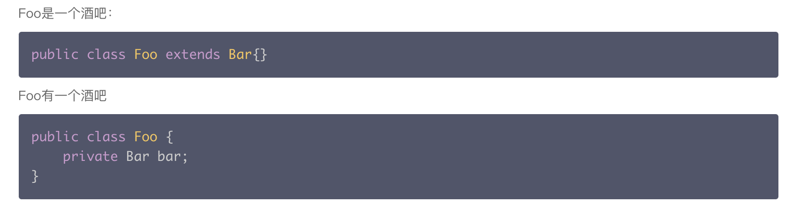
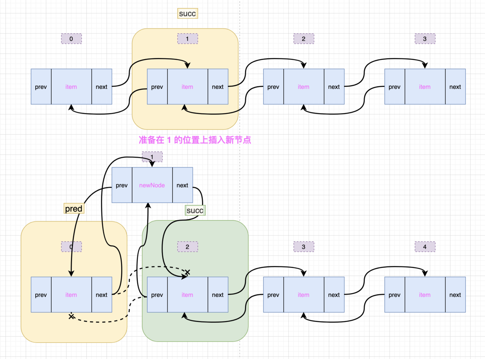

# Java基础（下）

[TOC]


## 15. ⭐️Java反射机制

### 反射的原理

在程序运行时动态加载类并获取类的详细信息，从而操作类或对象的属性和方法。

本质是 JVM 得到 class 对象之后，再通过 class 对象进行反编译，从而获取对象的各种信息。

这种动态获取被加载类的信息以及动态调用对象的方法的功能，被称为 Java 语言的反射机制（引申： 动态代理设计模式也采用了反射机制）。


优点：运行期类型的判断，动态加载类，提高代码灵活度。
在运行时获得类的各种内容进行反编译，对于Java这种先编译再运行的语言，能够让我们很方便的创建灵活的代码。
这些代码可以在运行时装配，无需在组件之间进行源代码的链接，更加容易实现面向对象。

缺点：

1. 性能瓶颈，反射相当于一系列解释操作，通知 `JVM` 要做的事情，性能比直接的 `Java` 代码要慢很多。因此，如果不需要动态地创建一个对象，那么就不需要用反射；
2. 安全问题，反射调用方法时可以忽略权限检查，因此可能会破坏封装性而导致安全问题。
   反射可以动态操作改变类的属性的同时，也增加了类的安全隐患。


#### `Class.forName` 和 `classloader` 的区别（结合 `JVM` 类加载）

`Class.forName` 除了将类的 `.class`文件加载到 `JVM` 中之外，还会对类进行解释，执行类中的 `static` 块。
而 `classloader` 只干一件事情，就是将 `.class` 文件加载到 `JVM` 中。不会执行 `static` 中的内容，只有在 `newInstance` 才会去执行 `static` 块。`forName("")` 得到的 `class` 是已经初始化完成的。

最重要的区别是 `forName` 会初始化 `Class`，而 `loadClass` 不会。
因此，如果要求加载时类的静态变量被初始化或静态块里的代码被执行，就只能用 `forName`，而用 `loadClass` 只有等创建类实例时才会进行这些初始化。


### 反射的用途

1. 反编译：`.class-->.java`

2. 通过反射机制访问 `java` 对象的属性、方法、构造方法等

3. 当我们在使用IDE,比如Ecplise时，当我们输入一个对象或者类，并想调用他的属性和方法是，一按点号，编译器就会自动列出他的属性或者方法，这里就是用到反射。

4. 反射最重要的用途就是开发各种通用框架。
   比如很多框架（Spring）都是配置化的（比如通过XML文件配置Bean），为了保证框架的通用性，他们可能需要根据配置文件加载不同的类或者对象，调用不同的方法，这个时候就必须使用到反射了，运行时动态加载需要的加载的对象。

   1. 例如，在使用Strut2框架的开发过程中，我们一般会在 `struts.xml` 里去配置 `Action`，比如

      ```java
      <action name="login" class="org.ScZyhSoft.test.action.SimpleLoginAction" method="execute">   
          <result>/shop/shop-index.jsp</result>           
          <result name="error">login.jsp</result>       
      </action>
      ```

   2. 比如我们请求 `login.action` 时，那么 `StrutsPrepareAndExecuteFilter` 就会去解析`struts.xml` 文件，从 `action` 中查找出 `name` 为 `login` 的 `Action`，并根据 `class` 属性创建 `SimpleLoginAction` 实例，并用 `Invoke` 方法来调用 `execute` 方法，这个过程离不开反射。
      配置文件与 `Action` 建立了一种映射关系，当 `View` 层发出请求时，请求会被 `StrutsPrepareAndExecuteFilter` 拦截，然后 `StrutsPrepareAndExecuteFilter` 会去动态地创建 `Action` 实例。

   3. 比如，加载数据库驱动的，用到的也是反射。

      ```java
      Class.forName("com.mysql.jdbc.Driver"); // 动态加载mysql驱动
      ```


## 16. ⭐️面向对象的三大特征

### 封装

在面向对象思想中，封装指数据（类成员属性）和对数据的操作（类方法）捆绑到一起，形成对外界的隐藏，同时对外提供可以操作的接口（供外部访问的类成员）。

封装的意义：

1. 低耦合：有助于建立各个系统之间的松耦合关系，提高系统的独立性。当某一个系统的实现发生变化，只要它的接口不变，就不 会影响到其他的系统。
2. “高内聚”：封装细节，便于修改内部代码，提高可维护性。
3. 安全性：保护或者防止代码（数据）被我们无意中破坏，也隐藏方法细节。
4. 复用性：每个系统都是一个相对独立的整体，可以在多种环境中得到重用。例如干电池就是一个可重用的独立系统，在相机、手电筒、电动剃须刀和玩具赛车中都能发挥作用。


### 继承

继承是从已有的类中派生出新的类，新的类能吸收已有类的数据属性和行为，并能扩展新的能力。

为什么要继承：反映现实的真实关系，减少代码冗余，对父类的属性和方法进行扩展和重写。

继承中，子类不可以选择性地继承，而是全部继承父类的属性和方法。

父类又叫超类或者基类，子类又叫派生类。父类是子类的一般化，子类是父类的具体化。

`Java` 不支持多继承，一个类最多只能有一个父类。而在 `Java` 中多继承是通过接口实现的。

**引申**：父类的**静态**属性方法是否可以被子类继承和重写？

父类的静态属性和方法可以被子类继承，但不可以被子类重写。

当父类的引用指向子类时，使用对象调用静态方法或者静态变量，是调用的父类中的方法或者变量。并没有被子类改写。 

原因：

因为静态方法从程序开始运行后就已经分配了内存，也就是说已经写死了。所有引用到该方法的对象（父类的对象也好，子类的对象也好）所指向的都是同一块内存中的数据，也就是该静态方法。

子类中如果定义了相同名称的静态方法，并不会重写，而应该是在内存中又分配了一块给子类的静态方法，没有重写这一说。


### 多态

多态就是同一个接口，使用不同的实例而执行不同操作。父类引用指向不同子类对象。

Java 实现多态有三个必要条件：继承、重写、向上转型。

1. **继承**：在多态中必须存在有继承关系的子类和父类；
2. **重写**：子类对父类中某些方法进行重新定义，在调用这些方法时就会调用子类的方法；
3. **向上转型**：在多态中需要将子类的引用赋给父类对象，只有这样该引用才能够具备能调用父类的方法和子类的方法。
   父类引用指向子类对象，`Parent p = new Child(); `

实现方式：接口多态性，继承多态性，抽象类实现的多态性。

实现原理：动态绑定（和动态分派一起学习）

当使用多态方式调用方法时，首先检查父类中是否有该方法，如果没有，则编译错误；如果有，再去调用子类的同名方法。

多态的好处：可以使程序有良好的扩展，并可以对所有类的对象进行通用处理。

```java
public class Test {
    public static void main(String[] args) {
      show(new Cat());  // 以 Cat 对象调用 show 方法 // 输出“吃鱼”“抓老鼠”
      show(new Dog());  // 以 Dog 对象调用 show 方法 // 输出“吃骨头”“看家”
                
      Animal a = new Cat();  // 向上转型  
      a.eat();               // 调用的是 Cat 的 eat // 输出“吃鱼”
      Cat c = (Cat)a;        // 向下转型  
      c.work();        // 调用的是 Cat 的 work // 输出“抓老鼠”
  }  
            
    public static void show(Animal a)  {
      a.eat();  
        // 类型判断
        if (a instanceof Cat)  {  // 猫做的事情 
            Cat c = (Cat)a;  
            c.work();  
        } else if (a instanceof Dog) { // 狗做的事情 
            Dog c = (Dog)a;  
            c.work();  
        }  
    }  
}
 
abstract class Animal {  
    abstract void eat();  
}  
  
class Cat extends Animal {  
    public void eat() {  
        System.out.println("吃鱼");  
    }  
    public void work() {  
        System.out.println("抓老鼠");  
    }  
}  
  
class Dog extends Animal {  
    public void eat() {  
        System.out.println("吃骨头");  
    }  
    public void work() {  
        System.out.println("看家");  
    }  
}
```


## 17. 简述继承与组合的区别和选择

类继承和对象组合是代码复用的两种常见技术。




### 继承

继承是 `Is-a` 的关系，比如说 `Student` 继承 `Person`，则说明 `Student is Person`。

继承的优点是子类可以重写父类的方法来方便地实现对父类的拓展

优点：

1. 容易进行新的实现，因为其大多数可继承而来；
2. 易于修改或拓展那些被复用的实现；

缺点：

1. 父类内部的细节对子类是可见的；
2. 子类从父类继承的方法在编译时就确定下来了，所以无法在运行期间改变对父类继承的方法的行为；
3. 如果对父类的方法做了修改的话（比如增加了一个参数），则子类的方法必须做出相应的修改。
   所以说子类与父类是高耦合的，违背了面向对象思想；

**InheritTest.java 使用继承方式实现目标**

```java
//InheritTest.java 使用继承方式实现目标  
class Animal{  
    private void beat(){  
        System.out.println("心脏跳动...");  
    }  
    public void breath(){  
        beat();  
        System.out.println("吸一口气，呼一口气，呼吸中...");  
    }  
}  
//继承Animal，直接复用父类的breath()方法  
class Bird extends Animal{  
    //创建子类独有的方法fly()  
    public void fly(){  
        System.out.println("我是鸟，我在天空中自由的飞翔...");  
    }  
}  
//继承Animal，直接复用父类的breath()方法  
class Wolf extends Animal{  
    //创建子类独有的方法run()  
    public void run(){  
        System.out.println("我是狼，我在草原上快速奔跑...");  
    }  
}  
public class InheritTest{  
    public static void main(String[] args){  
        //创建继承自Animal的Bird对象新实例b  
        Bird b=new Bird();  
        //新对象实例b可以breath()  
        b.breath();  
        //新对象实例b可以fly()  
        b.fly();  
        Wolf w=new Wolf();  
        w.breath();  
        w.run();  
/* 
---------- 运行Java程序 ---------- 
心脏跳动... 
吸一口气，呼一口气，呼吸中... 
我是鸟，我在天空中自由的飞翔... 
心脏跳动... 
吸一口气，呼一口气，呼吸中... 
我是狼，我在草原上快速奔跑... 
 
输出完毕 (耗时 0 秒) - 正常终止 
*/  
    }  
}  
```


### 组合

组合是 `has-a` 的关系，组合就是设计类的时候把要组合的类的对象加入到该类中作为自己的成员变量。

组合的优点：

1. 当前对象只能通过所包含的那个对象去调用其方法，所以所包含的对象的内部细节对当前对象是不可见的；
2. 当前对象和包含对象是一个低耦合关系，如果修改包含对象的类中代码，不需要修改当前对象类的代码；
3. 当前对象可以在运行时动态地绑定所包含的对象。可以通过 set 方法给所包含对象赋值；

组合的缺点：

1. 容易产生过多对象；
2. 为了能组合多个对象，必须仔细对接口进行定义；

**CompositeTest.java 使用组合方式实现目标**

```java
//CompositeTest.java  使用组合方式实现目标  
class Animal{  
    private void beat(){  
        System.out.println("心脏跳动...");  
    }  
    public void breath(){  
        beat();  
        System.out.println("吸一口气，呼一口气，呼吸中...");  
    }  
}  
class Bird{  
    //定义一个Animal成员变量，以供组合之用  
    private Animal a;  
    //使用构造函数初始化成员变量  
    public Bird(Animal a){  
        this.a=a;  
    }  
    //通过调用成员变量的固有方法（a.breath()）使新类具有相同的功能（breath()）  
    public void breath(){  
        a.breath();  
    }  
    //为新类增加新的方法  
    public void fly(){  
        System.out.println("我是鸟，我在天空中自由的飞翔...");  
    }  
}  
class Wolf{  
    private Animal a;  
    public Wolf(Animal a){  
        this.a=a;  
    }  
    public void breath(){  
        a.breath();  
    }  
    public void run(){  
        System.out.println("我是狼，我在草原上快速奔跑...");       
    }  
}  
public class CompositeTest{  
    public static void main(String[] args){  
        //显式创建被组合的对象实例a1  
        Animal a1=new Animal();  
        //以a1为基础组合出新对象实例b  
        Bird b=new Bird(a1);  
        //新对象实例b可以breath()  
        b.breath();  
        //新对象实例b可以fly()  
        b.fly();  
        Animal a2=new Animal();  
        Wolf w=new Wolf(a2);  
        w.breath();  
        w.run();  
/* 
---------- 运行Java程序 ---------- 
心脏跳动... 
吸一口气，呼一口气，呼吸中... 
我是鸟，我在天空中自由的飞翔... 
心脏跳动... 
吸一口气，呼一口气，呼吸中... 
我是狼，我在草原上快速奔跑... 
 
输出完毕 (耗时 0 秒) - 正常终止 
*/  
    }  
}  
```


### 组合和继承如何选择

组合比继承更具灵活性和稳定性，所以在设计的时候优先使用“组合”。

只有当下列条件满足时，才考虑使用“继承”：

1. 子类是一种特殊的类型（`String` 类、`Obejct` 类、包装类），而不只是父类的一个角色；
2. 子类的实例不需要变成另一个类的对象；
3. 子类是父类的拓展；

**为什么优先选择组合**

1. 扩展性

   继承是在编译时刻静态定义的，即是静态复用，在编译后子类和父类的关系就已经确定了。

   而组合这是运用于复杂的设计，它们之间的关系是在运行时候才确定的，即在对象没有创建运行前，整体类是不会知道自己将持有特定接口下的哪个实现类。

   在扩展方面组合比继承更具有广泛性。

2. 单一性

   “继承”中父类定义了子类的部分实现，而子类中又会重写这些实现，修改父类的实现，在设计模式中认为这是一种破坏了父类封装性的表现。这个结构导致的结果是 父类实现的任何变化，必然导致子类的改变。

   然而“组合”就不会出现这种现象。对象的组合就是有助于保持每个类被封装，并被集中在单个类上（符合类设计的单一原则）。这样类的层次结构不会扩大，一般不会出现不可控的庞然大类，而类的“继承”就可能出来这些问题。

   所以一般编码规范都要求类的层次结构不要超过3层。组合是大型系统软件实现即插即用时的首选方式。

3. 按需选择

   “优先使用对象组合，而不是继承” 是面对对象设计的第二原则。
   但并不是什么设计都用“组合”，只是优先考虑“组合”，更不是说“继承”是不好的设计，应该根据它们各自的优势进行选择。


## 18. ⭐️Java中方法重载和重写的区别（多态体现）

Java的三大特性：封装、继承、多态

下面是**多态**的体现：[重载](http://c.biancheng.net/view/998.html)  [重写](http://c.biancheng.net/view/1000.html)


### 重载（Overloading）

**同一类中同名函数**，具有**不同参数个数或类型（方法返回值类型、修饰符等，与方法重载没有任何关系）**，是**一个类**中多态性的体现。由静态类型确定的在**类加载**的时候就确定，属于**静态分派**。
允许同一个类中定义多个同名方法，只要它们的形参列表不同即可。如果同一个类中包含了两个或两个以上方法名相同的方法，但形参列表不同，这种情况被称为方法重载（overload）。
使用方法重载其实就是避免出现繁多的方法名，有些方法的功能是相似的，如果重新建立一个方法，重新取个方法名称，会降低程序可读性。

```java
public class OverLoading {
    public void max(int a, int b) {
        // 含有两个int类型参数的方法
        System.out.println(a > b ? a : b);
    }
    public void max(double a, double b) {
        // 含有两个double类型参数的方法
        System.out.println(a > b ? a : b);
    }
    public void max(double a, double b, int c) {
        // 含有两个double类型参数和一个int类型参数的方法
        double max = (double) (a > b ? a : b);
        System.out.println(c > max ? c : max);
    }
    public static void main(String[] args) {
        OverLoading ol = new OverLoading();
        System.out.println("1 与 5 比较，较大的是：");
        ol.max(1, 5);
        System.out.println("5.205 与 5.8 比较，较大的是：");
        ol.max(5.205, 5.8);
        System.out.println("2.15、0.05、58 中，较大的是：");
        ol.max(2.15, 0.05, 58);
    }
}
```


### 重写（Override）

**子类**中含有与父类**相同名字、相同返回类型和相同参数表**，所以重写是在**继承**中体现多态性，属于**动态分派**。
子类中含有与父类相同名字、相同返回类型和相同参数表，只是方法体中的实现不同，以实现不同于父类的功能，这种方式被称为方法重写（override），又称为方法覆盖。
当父类中的方法无法满足子类需求或子类具有特有功能的时候，需要方法重写。

```java
public class Animal {
    public String name; // 名字
    public int age; // 年龄
    public Animal(String name, int age) {
        this.name = name;
        this.age = age;
    }
    public String getInfo() {
        return "我叫" + name + "，今年" + age + "岁了。";
    }
}
```

```java
public class Cat extends Animal {
    private String hobby;
    public Cat(String name, int age, String hobby) {
        super(name, age);
        this.hobby = hobby;
    }
    public String getInfo() {
        return "喵！大家好！我叫" + this.name + "，我今年" + this.age + "岁了，我爱吃" + hobby + "。";
    }
    public static void main(String[] args) {
        Animal animal = new Cat("小白", 2, "鱼");
        System.out.println(animal.getInfo());
    }
}
// 喵！大家好！我叫小白，我今年2岁了，我爱吃鱼。
```

方法的重载和重写都是实现多态的方式，区别在于前者实现的是编译时的多态性，而后者实现的是运行时的多态性。

重载发生在一个类中，同名的方法如果有不同的参数列表（参数类型不同、参数个数不同或者二者都不同）则视为重载。重载对返回类型没有特殊的要求，不能根据返回类型进行区分。

重写发生在子类和父类之间，重写要求子类被重写方法与父类被重写方法有相同的参数列表，有兼容的返回类型，比父类被重写方法更好访问，不能比父类被重写方法声明更多的异常（里氏替换原则）。

**引申：构造器可以被重写吗？**

**Constructor(构造器)**不能被继承，所以不能被**override(重写)**，但是可以被**overloading(重载)**。

构造器就是[构造方法](构造函数是一种特殊的函数。其主要功能是用来在创建对象时初始化对象， 即为对象成员变量赋初始值，总与new运算符一起使用在创建对象的语句中。构造函数与类名相同，可重载多个不同的构造函数。在JAVA语言中，构造函数与C++语言中的构造函数相同，JAVA语言中普遍称之为构造方法。)，构造方法是**不能被继承**的。因为每个类的类名都不相同，而构造器名称与类名相同，所以根本谈不上继承。 又由于构造器不能继承，所以就**不能被重写**。
但是，在同一个类中，构造器是可以被**重载**的（同类中不同参数列表的构造器）；同时，子类使用super方法可以**调用**父类的构造器。

如果父类有**无参构造器**，则在子类构造器中用 `super` 调用父类构造器不是必须的，如果没有使用 `super` 关键字，系统会自动调用父类的无参构造器（隐藏了 `super();` .）

若父类有参数的构造器，子类必须用 `super` 调用并配上参数；
若父类有无参构造器，子类不用 `super`，系统自动调用无参构造器。


## 19. Java 中静态属性和静态方法

Java 中静态属性和静态方法可以被继承但不能被重写，而是隐藏。

只有非静态的方法可以被继承并且被重写Override。

**表面原因**

1. 静态方法和属性是属于**类**的，调用的时候直接通过 `类名.方法名` 完成对，不需要继承机制及可以调用。
   如果子类里面定义了静态方法和属性，那么父类的静态方法或属性称之为“隐藏”。
   如果想要调用父类的静态方法和属性，直接通过 `父类名.方法名` 或变量名完成，至于是否继承一说，子类可以继承静态方法和属性，但是跟非静态方法和属性不太一样，存在“隐藏”这种情况。
2. 静态属性、静态方法都可以被继承和隐藏而不能被重写，因此不能实现多态（父类引用指向不同子类对象）。非静态方法可以被继承和重写，可以实现多态。

**深层原因**

静态方法和属性是按“编译时期的类型”进行调用的，而不是按“运行时期的类型”进行调用的，而非 `static` 方法，才是按“运行时期的类型”进行调用的。

拓展：JVM 中的非虚方法和虚方法理解


## 20. ⭐️抽象类和接口的区别

**抽象类**

1. 抽象方法必须为 `public` 或者 `protected` （因为如果为 `private`，则不能被子类继承，子类便无法实现该方法），缺省情况下默认为 `public`。
2. 抽象类不能用来创建对象；
3. 如果一个类继承于一个抽象类，则子类必须实现父类的抽象方法。如果子类没有实现父类的抽象方法，则必须将子类也定义为 `abstract` 类。

**接口（更加抽象）**

1. 变量只能定义为 `public`  `static`  `final` ；

2. 方法只能为抽象的；

**抽象类和接口的区别**

语法层面

1. 抽象类可以提供成员方法的实现细节，而接口只能存在 `public`  `abstract` 方法；
2. 抽象类中的成员变量可以是各种类型的，而接口中的成员变量只能是 `public`  `static`  `final` 类型的；
3. 接口中不能含有静态代码块以及静态方法，而抽象类可以有静态代码块和静态方法；
4. 一个类只能继承一个抽象类，而一个类却可以实现多个接口；

设计层面

1. 类是“是不是关系”，接口是“有没有关系”；

2. 抽象类作为很多子类的父类，它是一种模版式设计。而接口是一种行为规范，它是一种辐射式设计。


## 21. ⭐️ `ArrayList` 和 `LinkedList` 的区别

[面试：ArrayList和LinkedList的区别](https://cloud.tencent.com/developer/news/700913)

### **ArrayList 底层实现**

`ArrayList` 底层使用的是数组，新增了 ==动态扩容 + size作为上限进行序列化== 功能。

`ArrayList` 底层使用的是数组，而数组是定长的，即数组一旦声明了，长度（容量）就是固定的。

ArrayList 不想像数组这样活着，它想能屈能伸，所以它实现了动态扩容。一旦在添加元素的时候，发现容量用满了 ，就按照原来数组的 1.5 倍进行扩容。扩容之后，再将原有的数组复制到新分配的内存地址上。

动态扩容意味着数组的实际大小可能永远无法被填满的，总有多余出来空置的内存空间。所以序列化的时候， ArrayList 使用它的实际大小 size 而不是数组的长度（`elementData.length`）来作为元素的上限进行序列化。


### **LinkedList 底层实现**

`LinkedList` 底层是双向链表数据结构（`JDK 1.6` 之前为循环链表），==只序列化 item + linkLast() 重连==。

LinkedList 在序列化的时候只保留了元素的内容 item，并没有保留元素的前后引用。

它的 readObject() 方法中的 linkLast() 方法可以把链表重新链接起来。

和 ArrayList 相比，LinkedList 没有实现 RandomAccess 接口，这是因为 LinkedList 存储数据的内存地址是不连续的，所以不支持随机访问。


### ArrayList 和 LinkedList 新增元素时究竟谁快

当两者的起始长度是一样的情况下：

- 如果是从集合的头部新增元素，ArrayList 花费的时间应该比 LinkedList 多，因为需要对头部以后的元素进行复制。
- 如果是从集合的中间位置新增元素，ArrayList 花费的时间搞不好要比 LinkedList 少，因为 LinkedList 需要遍历。
- 如果是从集合的尾部新增元素，ArrayList 花费的时间应该比 LinkedList 少，因为数组是一段连续的内存空间，也不需要复制数组；而链表需要创建新的对象，前后引用也要重新排列。
  

ArrayList 在添加元素的时候如果不涉及到**扩容**，性能在两种情况下（中间位置新增元素、尾部新增元素）比 LinkedList 好很多，只有头部新增元素的时候比 LinkedList 差，因为数组复制的原因。

当然了，如果涉及到数组扩容的话，ArrayList 的性能就没那么可观了，因为扩容的时候也要复制数组。


### ArrayList 和 LinkedList 删除元素时究竟谁快

- 从集合头部删除元素时，ArrayList 花费的时间比 LinkedList 多很多。只要删除的不是最后一个元素，ArrayList 都需要数组重组。删除的元素位置越靠前，代价就越大。
- 从集合中间位置删除元素时，ArrayList 花费的时间比 LinkedList 少很多。LinkedList 在查询时需要从头或者尾遍历至查询元素，和新增元素操作一样。
- 从集合尾部删除元素时，ArrayList 花费的时间比 LinkedList 少一点。


### ArrayList 和 LinkedList 遍历元素时究竟谁快

for 循环遍历的时候，ArrayList 花费的时间远小于 LinkedList；迭代器遍历的时候，两者性能差不多。

遍历 ArrayList 找到某个元素的话，通常有两种形式：

1. 根据索引找元素，由于 ArrayList 是由数组实现的，所以根据索引找元素非常的快，一步到位。
2. 根据元素找索引，根据元素找索引的话，就需要遍历整个数组了，从头到尾依次找。

遍历 LinkedList 找到某个元素的话，通常也有两种形式：

1. 找指定位置上的元素，需要从头或者尾遍历至查询元素，所以说 LinkedList 不支持快速随机访问。

2. 找元素所在的位置，需要遍历整个链表。

   如果使用的是 for 循环，性能会非常差，因为每一次外层的 for 循环，都要执行一次 `node(int)` 方法进行前后半段的遍历；而迭代器只会调用一次 `node(int)` 方法。

   因此，**遍历 LinkedList 的时候，千万不要使用 for 循环，要使用迭代器。**


