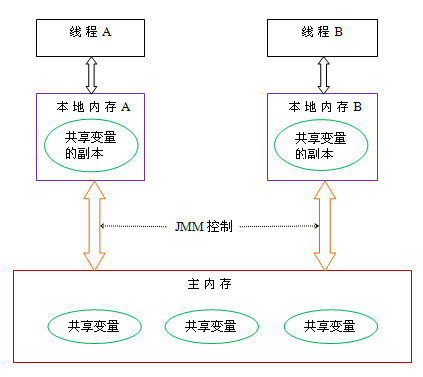

# Java并发（上）基础概念与线程


## 1. 简述 Java 内存模型（JMM）

JVM 中存在一个主内存（Main Memory 或 Java Heap Memory）。

Java 中所有变量都是存在主内存中的，对于所有线程进行共享，而每个线程又存在自己的工作内存（本地内存/Working Memory）。

工作内存中保存的是主内存中某些变量的拷贝，线程对所有变量的操作并非发生在主存区，而是发生在工作内存中。

但是线程之间是不能直接互相访问的，变量在程序中的传递是依赖主内存来完成的。

**引申：Java 线程之间是如何通信的？（联想到操作系统中进程间的通信方式）**

不同线程之间无法直接访问对方工作内存中的变量，线程间的通信一般有两种方式进行。

一是通过消息传递，二是共享内存。

在共享内存的并发模型里，线程之间共享程序的公共状态，线程之间通过写-读内存中的公共状态来隐式进行通信，典型的共享内存通信方式就是通过**共享对象**进行通信。

在消息传递的并发模型里，线程之间没有公共状态，线程之间必须通过明确的发送消息来显式进行通信，在java中典型的消息传递方式就是wait()和notify()。

Java的并发采用的是共享内存模型，即 Java 线程间的通信采用的是**共享变量**的方式。

 


## 2. Java 内存模型中的可见性、原子性和有序性

### 可见性（重点 volatile）

可见性是一种复杂的属性，因为可见性中的错误总是会违背我们的直觉。通常，我们无法确保执行读操作的线程能适时地看到其他线程写入的值，有时甚至是根本不可能的事情。为了确保多个线程之间对内存写入操作的可见性，必须使用同步机制。

**可见性，是指线程之间的可见性，一个线程修改的状态对另一个线程是可见的。**也就是一个线程修改的结果，另一个线程马上就能看到。**Java 内存模型是通过“在变量修改后，将新值同步回主内存；在变量读取前，从主内存刷新变量值”这种依赖主内存作为传递媒介的方法来实现可见性的**。

比如：用volatile修饰的变量，就会具有可见性。volatile修饰的变量不允许线程内部缓存和重排序，即直接修改内存，所以对其他线程是可见的。但是这里需要注意一个问题，volatile只能让被他修饰内容具有可见性，但不能保证它具有原子性。比如 `volatile int a = 0;` 之后有一个操作 `a++;` 这个变量 `a` 具有可见性，但是 `a++;` 依然是一个非原子操作，也就是这个操作同样存在线程安全问题。

在 Java 中 `volatile`、`synchronized` 和 `final` 实现可见性。


### 原子性（重点是各种锁🔒）

**原子性，是指一个操作或多个操作要么全部执行且执行的过程中不会被任何因素打断，要么就全部都不执行**。`synchronized` 块直接的操作就具备原子性，`volatile` 可以保证变量的可见性，但是不能保证复合操作的原子性。 

比如 `a=0;`（a非long和double类型） 这个操作是不可分割的，那么我们说这个操作时原子操作。再比如：`a++;` 这个操作实际是 `a = a + 1;` 是可分割的，所以他不是一个原子操作。非原子操作都会存在线程安全问题，需要我们使用同步技术（sychronized）来让它变成一个原子操作。

一个操作是原子操作，那么我们称它具有原子性。

java的concurrent包下提供了一些原子类，我们可以通过阅读API来了解这些原子类的用法。比如：AtomicInteger、AtomicLong、AtomicReference等。

在 Java 中 `synchronized` 在 `lock`、`unlock` 中操作保证原子性。


### 有序性（重点是指令重排）

有序性，即执行的顺序按照代码的先后顺序执行。

Java 内存模型中的程序天然有序性可以总结为一句话：**如果在本线程内观察，所有操作都是有序的；如果在一个线程中观察另一个线程，所有操作都是无序的**。

前半句指的是“线程内表现为串行语义”，后半句是指“指令重排序”现象和“工作内存与主内存同步延迟”现象。

有序性的句意有几层：

1. 最常见的就是保证多线程运行的串行顺序；
2. 防止重排序引起的问题；
3. 程序运行的先后顺序。比方 JMM 定义的一些 Happens-before 规则。


## 3. ⭐️ happens-before 的规则是什么

### 定义：哪些指令不能重排

**happens-before “先行发生”** 的八大规则

1. **程序次序规则** 
   **单线程**的 happens-before 原则：一个线程内，按照代码顺序，书写在前面的操作先行发生于书写在后面的操作。
2. **锁定规则** 
   **锁**的 happens-before 原则：同一个锁的 unLock 操作先行发生于后面对同一个锁的 lock 操作；
3. **volatile 变量规则 ** 
   **Volatile** 的happens-before原则：对一个 volatile 变量的写操作先行发生于后面对这个变量的任意操作（包括写操作）；
   这是一条比较重要的规则，它标志着volatile保证了线程可见性。
   通俗点讲就是如果一个线程先去写一个volatile变量，然后一个线程去读这个变量，那么这个写操作一定是happens-before读操作的。
4. **传递规则** 
   happens-before 的**传递性**原则：如果操作A先行发生于操作B，而操作B又先行发生于操作C，则可以得出操作A先行发生于操作C；
5. **线程启动规则** 
   **线程启动**的 happens-before 原则：同一个线程 Thread 对象的 start() 方法先行发生于此线程的其它方法；
   假定线程A在执行过程中，通过执行ThreadB.start()来启动线程B，那么线程A对共享变量的修改在接下来线程B开始执行后确保对线程B可见。
6. **线程中断规则** 
   **线程中断**的 happens-before 原则：对线程 interrupt() 方法的调用先行发生于被中断线程的代码检测到中断事件的发生；
7. **线程终结规则 ** 
   **线程终结**的 happens-before 原则：线程中所有的操作都先行发生于线程的终止检测。
   我们可以通过 Thread.join() 方法结束、Thread.isAlive() 的返回值手段检测到线程已经终止执行；
   假定线程A在执行的过程中，通过制定ThreadB.join()等待线程B终止，那么线程B在终止之前对共享变量的修改在线程A等待返回后可见。
8. **对象创建规则** 
   **对象创建**的 happens-before 的原则：一个对象的初始化完成先行发生于他的 finalize() 方法的开始；

### 拓展：推导出哪些指令不能重排

上面八条是原生Java满足 Happens-before 关系的规则，但是我们可以对它们进行推导出其他满足 happens-before 的规则：

1. 将一个元素放入一个线程安全的队列的操作 Happens-Before 从队列中取出这个元素的操作
2. 将一个元素放入一个线程安全容器的操作 Happens-Before 从容器中取出这个元素的操作
3. 在 CountDownLatch 上的倒数操作 Happens-Before CountDownLatch#await() 操作
4. 释放 Semaphore 许可的操作 Happens-Before 获得许可操作
5. Future 表示的任务的所有操作 Happens-Before Future#get() 操作
6. 向 Executor 提交一个 Runnable 或 Callable 的操作 Happens-Before 任务开始执行操作

这里再说一遍happens-before的概念：**如果两个操作不存在上述（前面8条 + 后面6条）任一一个happens-before规则，那么这两个操作就没有顺序的保障，JVM可以对这两个操作进行重排序。如果操作A happens-before操作B，那么操作A在内存上所做的操作对操作B都是可见的。** 下面就用一个简单的例子来描述下 happens-before 原则：

```java
private int i = 0;

public void write(int j ){ i = j;
}

public int read(){ return i;
}
```

我们约定线程A执行 write()，线程B执行 read()，且线程A优先于线程B执行，那么线程B获得结果是什么？；

我们就这段简单的代码一次分析 happens-before 的规则（规则5、6、7、8 + 推导的6条可以忽略，因为他们和这段代码毫无关系）：

1. 由于两个方法是由不同的线程调用，所以肯定不满足程序次序规则；
2. 两个方法都没有使用锁，所以不满足锁定规则；
3. 变量 i 不是用volatile修饰的，所以volatile变量规则不满足；
4. 传递规则肯定不满足；

所以我们无法通过 happens-before 原则推导出线程 A happens-before 线程B，虽然可以确认在时间上线程A优先于线程B指定，但是就是无法确认线程B获得的结果是什么，所以这段代码不是线程安全的。那么怎么修复这段代码呢？满足规则2、3任一即可。

> **happen-before原则是JMM中非常重要的原则，它是判断数据是否存在竞争、线程是否安全的主要依据，保证了多线程环境下的可见性。**

下图是 happens-before 与JMM的关系图（摘自《Java并发编程的艺术》）


### 引申：哪些指令会进行重排序

在执行程序时为了提高性能，编译器和处理器常常会对指令做重排序。

重排序分三种类型：

1. **编译器优化**的重排序
   编译器在不改变单线程程序语义的前提下，可以重新安排语句的执行顺序。
2. **指令集并行**的重排序
   现代处理器采用了指令集并行技术（Instruction-Level Parallelism，ILP）来讲多条指令重叠执行。
   如果不存在数据依赖性，处理器可以改变语句对应机器指令的执行顺序。
3. **内存系统**的重排序
   由于处理器使用缓存和读/写缓冲区，这使得加载和存储操作看上去可能是在乱序执行。


## 4. ⭐️ 线程的状态有哪些

[Java线程的6种状态及切换](https://blog.csdn.net/pange1991/article/details/53860651) 

### Java线程的6种状态

1. 新建状态（NEW）；新创建了一个线程对象，但还没有调用start()方法。
2. 可运行（RUNNABLE）：可能正在等待 CPU 时间片(READY)，也可能正在运行(RUNNING)；
   Java线程中将就绪（ready）和运行中（running）两种状态笼统的称为“运行”。
   1. 线程对象创建后，其他线程(比如main线程）调用了该对象的start()方法。该状态的线程位于可运行线程池中，**等待被线程调度选中，获取CPU的使用权**，此时处于就绪状态（ready）。
   2. 就绪状态的线程在**获得CPU时间片**后变为运行中状态（running）。
3. 阻塞（BLOCKED）：等待获取一个排它锁，如果其线程释放了锁，就会结束此状态。
4. 无限期等待（WAITING）：等待其它线程（通知或中断）显式地唤醒，否则不会被分配 CPU 时间片。
5. 限期等待（TIME_WAITING）：无需等待其它线程显式地唤醒，在一定时间之后会被系统自动唤醒。
6. 终止（TERMINATED）：可以是线程结束任务之后自己结束，或者是产生了异常而结束。


### Java线程状态的切换

 

1. 线程创建之后它将处于 **NEW（新建**）状态。

2. 调用 start() 方法后开始运行，线程这时候处于 **READY（可运行）**状态。可运行状态的线程获得了 CPU时间片 后就处于 **RUNNING（运行）**状态。操作系统隐藏 JVM 中的 READY 和 RUNNING 状态，只能看到 RUNNABLE 状态。

3. 当线程执行 wait() 方法之后，线程进入 **WAITING（等待）**状态。进入等待状态的线程需要依靠其它线程的通知才能返回到运行状态，而 **TIME_WAITING（超时等待）**状态相当于在等待状态的基础上增加了超时限制。比如通过 sleep(long millis)方法或 wait(long millis)方法可以将 Java 线程置于 TIME WATITING 状态。

4. 当超时时间到达后，Java 线程将会返回 RUNNABLE 状态。

5. 当线程调用同步方法时，在没有获取到锁的情况下，线程将会进入到 **BLOCKED（阻塞）**状态。

6. 线程在执行 Runnable 的 run() 方法之后将会进入到 **TERMINATED（终止）**状态。


## 5. 并发级别有哪些

阻塞、无饥饿、无障碍、无锁、无等待。

**临界区**

临界区用来表示一种公共资源或者说是共享数据，可以被多个线程使用。但是每一次，只能有一个线程使用它，一旦临界区资源被占用，其他线程要想使用这个资源，就必须等待。

1. **阻塞（Blocking）** 
   一个线程是阻塞的，那么在其它线程释放资源之前，当前线程无法继续执行。
   当我们使用 synchronized 关键字，或者重入锁🔒时就会产生阻塞的线程。无论是 synchronized 或者 重入锁🔒，都会试图在执行后续代码前得到临界区的锁。如果得不到，线程就会被挂起等待，直到占有了所需资源为止。

2. **无饥饿（Starvation-Free）** 

   - 公平锁， 不管新来的线程优先级高低都需要排队

   这个取决于线程之间是否有优先级的存在，如果系统允许搞优先级的线程插队，这样有可能导致低优先级线程产生饥饿。

3. **无障碍（Obstruction-Free）** 
   无障碍是一种最弱的非阻塞调度。相对来说非阻塞的调度就是一种乐观的策略。
   从这个策略中也可以看到，当临界区存在严重冲突时，所有的线程可能都会不断地回滚自己的操作，而没有一个线程可以走出临界区。这种情况会影响系统的正常执行。
   这也是**利用 [cas](CAS是 compare and swap 的缩写，即比较交换。cas是一种基于锁的操作，而且是乐观锁🔒) 理论的思想**：一种可行的无障碍实现可以依赖一个“一致性标记”来实现。
   线程在操作过程中与其它写线程冲突，需要重试操作。而任何对资源有修改操作的线程，在修改数据前，都需要更新这个一致性标记，表示数据不再安全。

   完整步骤：
   线程在操作之前，先读取并保存这个标记，在操作完成后，再次读取，检查这个标记是否被更改过，如果两者是一致的，则说明资源访问没有冲突。如果不一致，则说明资源可能在操作过程中与其他写线程冲突，需要重试操作。而任何对资源有修改操作的线程，在修改数据前，都需要更新这个一致性标记，表示数据不再安全。

4. **无锁🔒（Lock-Free）** 
   无锁的并行都是无障碍的。
   在无锁的情况下，所有的线程都能尝试对临界区进行访问，但不同的是，无锁的并发保证必然有一个线程能够在有限步内完成操作离开临界区，一个典型的特点是可能会包含一个无穷循环。在这个循环中，线程会不断尝试修改共享变量。如果修改成功，程序退出，否则继续尝试修改。但无论如何，无锁的并行总能保证有一个线程是可以胜出的。至于临界区中竞争失败的线程，它们则不断重试，直到自己获胜。如果总是尝试不成功，则会出现类似饥饿的现象，线程会停止不前。

5. **无等待（Wait-Free）** 
   **无锁只要求有一个线程可以在有限步内完成操作**，而无等待则在无锁的基础上更进一步进行扩展——它要求**所有的线程都必须在有限步内完成**，这样就不会引起饥饿问题。
   如果限制这个步骤上限，还可以进一步分解为有界无等待和线程数无关的无等待几种，它们之间的区别只是对循环次数的限制不同。
   一种典型的无等待结构就是 RCU(Read-Copy-Update)。它的基本思想是，对数据的读可以不加控制。因此，所有的读线程都是无等待的，它们既不会被锁定等待也不会引起任何冲突。但在写数据的时候，先取得原始数据的副本，接着只修改副本数据(这就是为什么读可以不加控制)，修改完成后，在合适的时机回写数据。


## 6. ⭐️ 创建线程的几种方法

### 继承 Thread 类创建线程 

1. 定义 Thread 类的子类，并重写该类的 run 方法，该 run 方法的方法体就代表了线程完成的任务。因此把 run() 方法称为执行体。
2. 创建 Thread 子类的实例，即创建了线程对象。
3. 调用线程对象的 start() 方法来启动该线程

代码示例

```java
public class MyThread extends Thread{ @Override public void run() 
{ 
  System.out.println(Thread.currentThread().getName()); }
}

public class MyThreadTest 
{ 
  public static void main(String[] args) 
  { 
  // 创建线程 MyThread thread = new MyThread(); 
  // 启动线程 thread.start(); 
  }
}
```


### 实现 Runnable 接口创建线程 

1. 定义 Runnable 实现类的实例，并重写该接口的 run() 方法，该 run() 方法的方法体同时是该线程的线程执行体。
2. 创建 Runnable 实现类的实例，并以此实例作为 Thread 的 target 来创建 Thread 对象，该 Thread 对象才是真正的线程对象。
3. 调用线程对象的 start() 方法来启动该线程。

代码示例

```java
public class MyRunnable implements Runnable{ 
  @Override public void run() 
  { 
    System.out.println(Thread.currentThread().getName()); 
  }
}

public class MyRunnableTest { 
  public static void main(String[] args) 
  { 
    MyRunnable myRunnable = new MyRunnable(); 
    // 创建线程 Thread thread = new Thread(myRunnable); 
    // 启动线程 thread.start(); 
  }
}
```


### 使用 Callable 和 Future 创建线程 

与 Runnable 相比，Callable 可以有返回值，返回值通过 FutureTask 进行封装。

1. 创建 Callable 接口的实现类，并实现 call() 方法，该 call() 方法将作为线程执行体，并且有返回值。
2. 创建 Callable 实现类的实例，使用 FutureTask 类来包装 Callable 对象，该 Future Task 对象封装了该 Callable 对象的 call() 方法的返回值。
   Future Task 是一个包装器，它通过接收 Callable 来创建，同时实现了 Future 和 Runnable 接口。
3. 使用 Future Task 对象作为 Thread 对象的 target 创建并启动新线程。
4. 调用 Future Task 对象的 get() 方法来获得子线程执行结束后的返回值。

代码示例

```java
public class MyCallable implements Callable<Integer>
{
  public Integer call()
  {
    return 123;
  }
}

public static void main(String[] args) throws ExecutionException, InterruptedException
{
  MyCallable mc = new MyCallable();
  FutureTask<Integer> ft = new FutureTask<>(mc);
  Thread thread = new Thread(ft);
  thread.start();
  System.out.println(ft.get());
}
```


### 使用线程池例如用 Executor 框架 

（工厂方法）（详情🔎看后续 J.U.C 中线程池相关内容）

Executors 提供了一系列工厂方法用于创先线程池，返回的线程池都实现了ExecutorService 接口。

主要有四种：

1. newFixedThreadPool
2. newCachedThreadPool
3. newSingleThreadExecutor
4. newScheduledThreadPool

代码示例：

```java
public class MyRunnable implements Runnable
{ 
  @Override public void run() 
  { 
    System.out.println(Thread.currentThread().getName()); 
  }
}

public class SingleThreadExecutorTest 
{ 
  public static void main(String[] args) 
  { 
    ExecutorService executorService = Executors.newSingleThreadExecutor(); 
    MyRunnable myRunnable = new MyRunnable(); 
    for(int i = 0; i < 10; i++)
    { 
      executorService.execute(myRunnable); 
    } 
    System.out.println("=======任务开始======="); 
    executorService.shutdown(); 
  }
}
```


### 创建线程方式的对比 

**采用实现 Runnable、Callable 接口的方式创建多线程** 

线程类只是实现了 Runnable 接口或 Callable 接口，还可以继续继承其它类。

在这种方式下，多个线程可以共享同一个 target 对象，所以非常适合多个相同线程来处理用一份资源的情况，从而可以将 CPU、代码和数据分开。
但是缺点是编程稍微复杂，如果要访问当前线程，则必须使用 Thread.currentThread() 方法。


**使用继承 Thread 类的方式创建多线程** 

如果需要访问当前线程，则无需使用 Thread.currentThread() 方法，直接使用 this 即可获当前线程。
缺点是线程类已经继承了 Thread 类，所以不能再继承其它父类。


**Runnable 和 Callable 的区别** 

1. Callable 规定（重写）的方法是 call()，Runnable 规定（重写）的方法是 run()
2. Callable 的任务执行后可以返回值，而 Runnable 的任务是不能返回值的
3. 运行 Callable 任务可以拿到一个 Future 对象，表示异步计算的结果。它提供了检查计算是否完成的方法，以等待计算的完成，并检索计算的结果。
   通过 Future 对象可以了解任务的执行情况，可以取消任务的执行，还可以获取执行结果


## 7. 线程的基本操作与线程协作

**基本操作** 

1. **Daemon Thread 守护线程** 
   当所有非守护线程结束后，程序也就终止，同时会杀死所有守护线程
2. **sleep()** 
   Thread.sleep(millisec) 方法会休眠当前正在执行的线程，millisec 的单位为毫秒。
3. **yield()** 
   对静态方法 Thread.yield() 的调用声明了当前线程已经完成了生命周期中最重要的部分，可以切换给其它线程来执行。


**线程协作** 

1. **join() 和 yield()** 
   在线程中调用另一个线程的 join() 方法，会将当前线程挂起，而不是[忙等待](指在单CPU情况下，一个进程进入临界区之后，其他进程因无法满足竞争条件而循环探测竞争条件。其缺点是，在单CPU情况下，等待进程循环探测竞争条件，浪费了时间片。) ，直到目标线程结束。
   比如有线程 a 和 b，虽然 b 线程先启动，但是因为在 b 线程中调用了 a 线程的方法，b 线程会等待 a 线程结束才继续进行，因此最后能保证 a 线程的输出先于 b 线程的输出。
2. **wait()、notify()、notifyAll()** 
   使用 wait() 挂起期间，线程会释放锁。这是因为如果没有释放锁，那么其它线程就无法进入对象的同步方法或同步控制块中，那么就无法执行 notify() 或 notifyAll() 来唤醒挂起的线程，造成死锁。
   ==⭐️wait() 和 sleep() 的区别（关键点）== 
   wait() 是 Object 方法，而 sleep() 是 Thread 的静态方法；
   wait() 会释放锁，sleep() 不会。
3. **await()、signal()、signalAll()** 
   Java.util.concurrent 类库中提供了 Condition 类来实现线程之间的协调，可以在Condition 上调用 await() 方法使线程等待，其它线程调用 signal() 或 signalAll() 方法唤醒等待的线程。
   相比于 wait() 这种等待方式，await() 方法可以指定等待的条件，因此要更加灵活。


## 8. ⭐️ 线程同步的几种方式

同步是为了在多线程环境下安全访问临界区（共享区域），程序不会产生设计之外的错误结果。

举个例子，一个银行账户同时被两个线程操作，一个取 100 块，另一个存 100 块。假设银行账户原本有 0 块，如果取钱线程会存钱线程同时发生，会出现什么结果呢？

### ⭐️Synchronized （面试重点，结合Java中的各种锁）

1. 同步方法
   用synchronized关键字修饰方法。 由于java的每个对象都有一个内置锁，当用此关键字修饰方法时，内置锁会保护整个方法。在调用该方法前，需要获得内置锁，否则就处于阻塞状态。

   ```java
   public class Bank 
   { 
     private int count = 0; // 账户余额 
     // 存钱 
     public synchronized void addMoney(int money) 
     { 
       count += money; 
       System.out.println(System.currentTimeMillis() + "存进：" + money); 
     } 
     // 取钱
     public synchronized void subMoney(int money) 
     { 
       if (count - money < 0) 
       { 
         System.out.println("余额不足"); 
         return; 
       } 
       count -= money; 
       System.out.println(+System.currentTimeMillis() + "取出：" + money); 
     } 
     // 查询 
     public void lookMoney() 
     { 
       System.out.println("账户余额：" + count); 
     }
   }
   ```

2. 同步代码块
   用synchronized关键字修饰语句块。被该关键字修饰的语句块会自动被加上内置锁，从而实现同步。

   ```java
   public class Bank 
   { 
     private int count = 0;// 账户余额 
     // 存钱 
     public  void addMoney(int money) 
     { 
       synchronized(this)
       { 
         count += money; 
       } 
       System.out.println(System.currentTimeMillis() + "存进：" + money); 
     } 
     // 取钱 
     public  void subMoney(int money) 
     { 
       synchronized(this)
       { 
         if (count - money < 0) 
         { 
           System.out.println("余额不足"); return; 
         } 
         count -= money; 
       } 
       System.out.println(+System.currentTimeMillis() + "取出：" + money); 
     } 
     // 查询 
     public void lookMoney() 
     { 
       System.out.println("账户余额：" + count); 
     }
   }
   ```

   **同步是一个高开销的操作，因此应该尽量减少同步的内容**。通常没必要同步整个方法，使用 synchronized 代码块同步关键代码即可。
   **引申：锁的优化之减小锁的粒度** 


### ReentrantLock 重入锁🔒

ReentrantLock类是可重入、互斥、实现了Lock接口的锁， 它与使用synchronized方法和快具有相同的基本行为和语义，并且扩展了其能力。

```java
public class Bank 
{ 
  private int count = 0;// 账户余额 
  // 需要声明这个锁 
  private Lock lock = new ReentrantLock(); 
  // 存钱 
  public void addMoney(int money) 
  { 
    lock.lock(); 
    try { 
      count += money; System.out.println(System.currentTimeMillis() + "存进：" + money); 
        } 
    finally 
    { 
      lock.unlock(); 
    } 
  } 
  // 取钱 
  public void subMoney(int money) 
  { 
    lock.lock(); 
    try { if (count - money < 0) 
    { 
      System.out.println("余额不足"); 
      return; 
    } 
         count -= money; System.out.println(+System.currentTimeMillis() + "取出：" + money); 
        } 
    finally 
    { 
      lock.unlock(); 
    } 
  } // 查询 
  public void lookMoney() 
  { 
    System.out.println("账户余额：" + count); 
  }
}
```

引申：[Synchronized 和 ReentrantLock 区别](https://www.cnblogs.com/javastack/p/12787771.html) 

Synchronized的使用比较方便简洁，并且由编译器去保证锁的加锁和释放；

而ReenTrantLock需要手工声明来加锁和释放锁，为了避免忘记手工释放锁造成死锁，所以最好在finally中声明释放锁。也因此 ReenTrantLock 锁的细粒度和灵活度优于 Synchronized。

**使用 Lock 来获取一个 Condition 对象** 
使用`Condition`时，引用的`Condition`对象必须从`Lock`实例的`newCondition()`返回，这样才能获得一个绑定了`Lock`实例的`Condition`实例。

`Condition`提供的`await()`、`signal()`、`signalAll()`原理和`synchronized`锁对象的`wait()`、`notify()`、`notifyAll()`是一致的，并且其行为也是一样的：

- `await()`会释放当前锁，进入等待状态；
- `signal()`会唤醒某个等待线程；
- `signalAll()`会唤醒所有等待线程；
- 唤醒线程从`await()`返回后需要重新获得锁。

**ReenTrantLock独有的能力：**

1. ReenTrantLock可以指定是公平锁还是非公平锁。而synchronized只能是非公平锁。所谓的公平锁就是先等待的线程先获得锁。

2. ReenTrantLock提供了一个Condition（条件）类，用来实现分组唤醒需要唤醒的线程们，而不是像synchronized要么随机唤醒一个线程要么唤醒全部线程。

3. ReenTrantLock提供了一种能够中断等待锁的线程的机制，通过lock.lockInterruptibly()来实现这个机制。

需要实现ReenTrantLock的三个独有功能时，使用ReenTrantLock；否则推荐使用


### 使用 ThreadLocal 管理变量

ThreadLocal的原理
如果使用ThreadLocal管理变量，则每一个使用该变量的线程都获得该变量的副本，副本之间相互独立，这样每一个线程都可以随意修改自己的变 量副本，而不会对其他线程产生影响。
即每个线程运行的都是一个副本，也就是说存钱和取钱是两个账户，只是名字相同而已，两个线程间的count没有关系。

底层原理

1. ThreadLocal 仅仅是个变量访问的入口；

2. 每一个 Thread 对象都有一个 ThreadLocalMap 对象，这个 ThreadLocalMap 持有对象的引用；

3. ThreadLocalMap 以当前的 ThreadLocal 对象为 key，以真正的存储对象为 value。
   get() 方法时，通过 ThreadLocal 实例就能找到绑定在当前线程上的副本对象。

   ```java
   public void set(T value)
   {
     Thread t = Thread.currentThread(); // 1. 首先获取当前线程对象
     ThreadLocalMap map = getMap(t); // 2. 获取该线程对象的ThreadLocalMap
     if (map != null) 
       map.set(this, value); // 如果map不为空，执行set操作，以当前 ThreadLocal对象为key，实际存储对象为value进行set操作
     else
       createMap(t, value); // 如果map为空，则为该线程创建ThreadLocalMap
   }
   ```

#### ThreadLocal 与同步机制

- ThreadLocal与同步机制都是为了解决多线程中相同变量的访问冲突问题
- 前者采用以”空间换时间”的方法，后者采用以”时间换空间”的方式

==ThreadLocal并不能替代同步机制，两者面向的问题领域不同==。

1. 同步机制是为了同步多个线程对相同资源的并发访问，是为了多个线程之间进行通信的有效方式；
2. 而threadLocal是隔离多个线程的数据共享，从根本上就不在多个线程之间共享变量，这样当然不需要对多个线程进行同步了。


### volatile关键字

volatile 关键字是变量修饰符，其修饰的变量具有可见性。


### 并发包中的锁

读写锁、CountDownLatch、信号量等或采用并发集合 ConcurrentHashMap，原子类Atomic、阻塞队列等

==引申：相见 JUC 常用锁的实现，可深入源码研究== 


