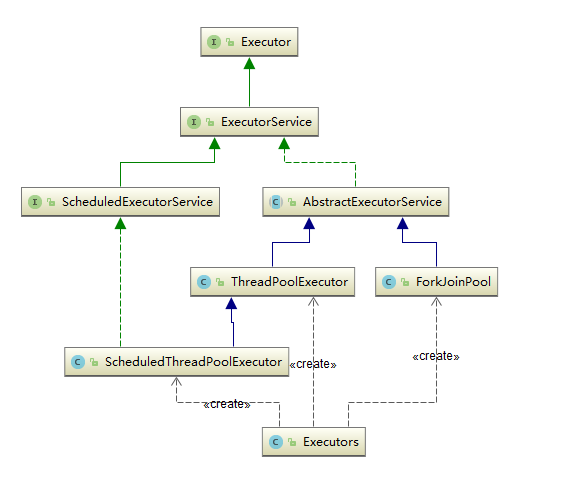
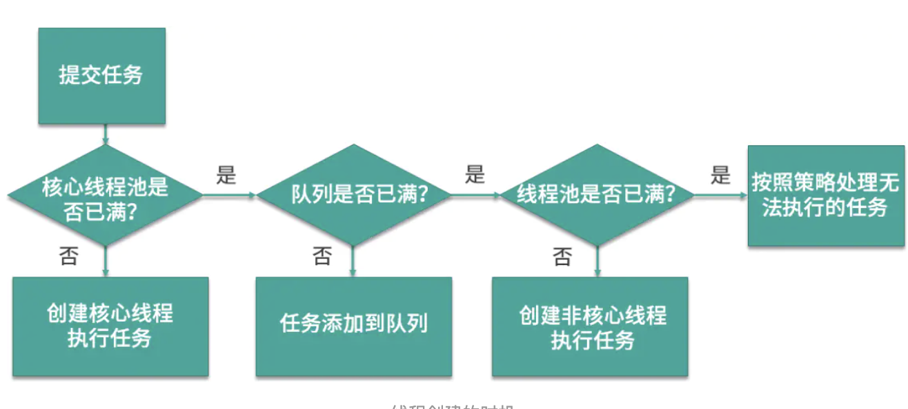
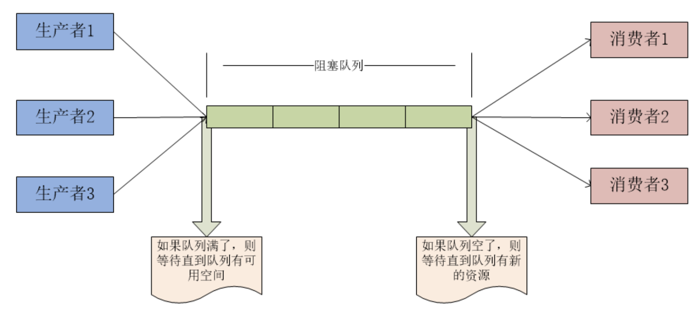
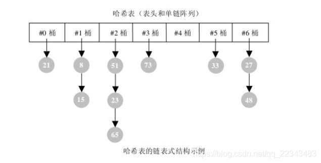
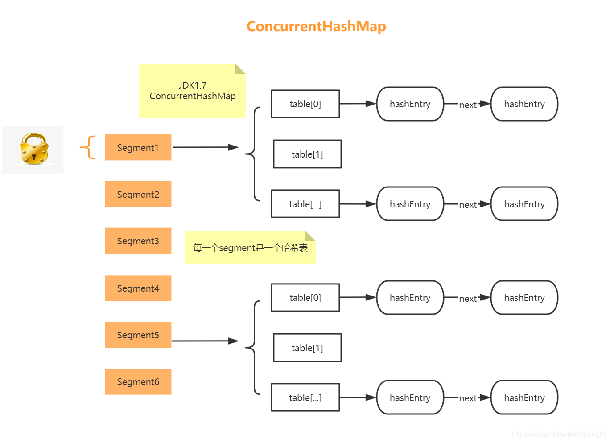
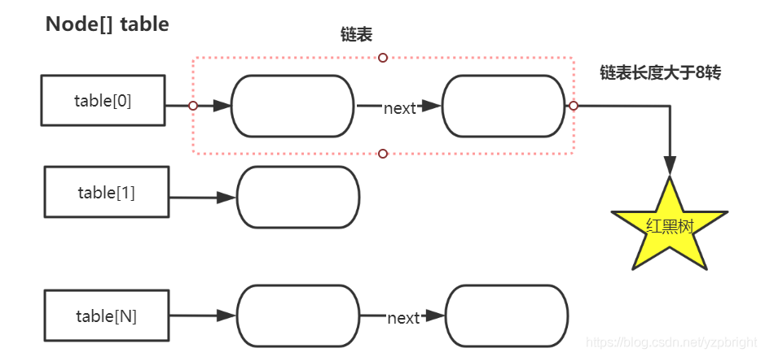
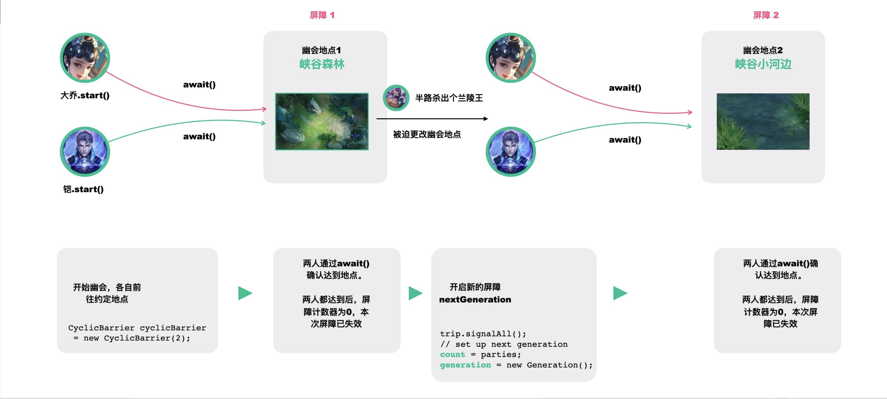
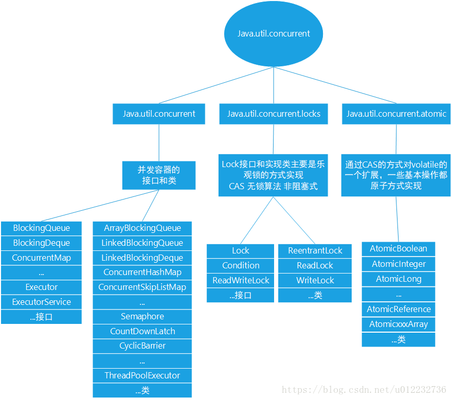

# Java并发（下）J.U.C 并发包

在 Java 5.0 提供了 `java.util.concurrent` (简称JUC)包。

在此包中增加了在并发编程中很常用的工具类，用于定义类似于线程的自定义子系统，包括线程池、异步 `IO` 和轻量级任务框架，还提供了设计用于多线程上下文中的 Collection 实现等。


## 14. 简述线程池

> ⭐️==必看== [Java线程池实现原理及其在美团业务中的实践](https://tech.meituan.com/2020/04/02/java-pooling-pratice-in-meituan.html) 
>
> [ThreadPoolExecutor线程池及线程扩展策略](https://blog.csdn.net/zhongxiangbo/article/details/70882309) 

### 为什么要用线程池？（创建销毁开销大）

- 降低资源消耗
  通过重复利用已创建的线程降低线程创建和销毁造成的消耗。
- 提高响应速度
  当任务达到时，任务可以不需要等到线程创建就能立即执行。
- 提高线程的可管理性
  线程是稀缺资源，如果无限制的创建，不仅会消耗系统资源，还会降低系统的稳定性。
  使用线程池可以进行统一的分配、调优和监控。

**JUC中的线程池体系**

ThreadPoolExecutor 类和 ScheduledThreadPoolExecutor 实现了 ExecutorService 接口和 Executor 接口，并有 Executor 类扮演线程池工厂的角色（工厂设计模式）。





### ThreadPoolExecutor 的创建参数 

```java
public ThreadPoolExecutor(int corePoolSize,  
                              int maximumPoolSize,  
                              long keepAliveTime,  
                              TimeUnit unit,  
                              BlockingQueue<Runnable> workQueue,  
                              ThreadFactory threadFactory,  
                              RejectedExecutionHandler handler) {}
```

| 参数名                   | 作用                                                         |
| ------------------------ | ------------------------------------------------------------ |
| corePoolSize             | 核心线程池大小                                               |
| maximumPoolSize          | 最大线程池大小                                               |
| keepAliveTime            | 线程池中超过corePoolSize数目的空闲线程最大存活时间；可以allowCoreThreadTimeOut(true)使得核心线程有效时间 |
| TimeUnit                 | keepAliveTime时间单位                                        |
| workQueue                | 阻塞任务队列                                                 |
| threadFactory            | 新建线程工厂                                                 |
| RejectedExecutionHandler | 当提交任务数超过maxmumPoolSize+workQueue之和时，任务会交给RejectedExecutionHandler来处理 |

##### 引申：线程池参数如何设置

- 如果任务为 `IO` 密集型，比如读取数据库、文件读写以及网络通信的话，这些任务不会占据很多CPU资源但是会比较耗时。
  可以将线程数量设置为 2 倍CPU数以上，充分地利用CPU资源。
- 如果任务为 CPU 密集型，比如大量计算、解压、压缩等这些操作都会占据大量的CPU。
  这种情况一般设置线程数为 CPU数 + 1。加1是因为备份线程。
- 如果既有 `IO` 密集型又有 CPU 密集型任务
  分开使用线程池处理， `IO` 密集的用 `IO` 密集型线程池处理， CPU 密集的用 CPU 密集型线程池处理。


### Executor 工厂类实现的线程池 

通过创建不同的 ThreadPoolExecutor 对象

1. **newFixedThreadPool 定长线程池** 

   它是一种固定长度的线程池；
   corePoolSize 和 maximumPoolSize 都为用户设定的数量 n Threads；
   keepAliveTime 为 0，意味着一旦有多余的空闲线程，就会立即被停止掉；但这里 keepAliveTime 无效。
   阻塞队列采用了 LinkedBlockingQueue，它是一个无界队列；
   由于阻塞队列是一个无界队列，实际线程数量将永远维持在 n Threads，因此 maximumPoolSize 和 keepAliveTime 将无效。

2. **newCachedThreadPool 可缓存** 
   它是一个可以无限扩大的线程池；它比较适合处理执行时间比较小的任务；
   corePoolSize 为0，maximumPoolSize 为无限大，意味着线程数量可以无限大；
   keepAliveTime 为 60s，意味着线程空闲的时间超过 60s 就会被杀死；
   采用 SynchronousQueue 装等待的任务，这个阻塞队列没有存储空间，这意味着只要有请求到来，就必须要找到一条工作线程处理它。如果当前没有空闲的线程，那么就会再创建一条新的线程。

3. **newSingleThreadExecutor 单一线程池** 
   它只会创建一条工作线程处理任务；采用的阻塞队列为 LinkedBlockingQueue。

4. **ScheduledThreadPool 可调度的线程池** 
   实现周期性线程调度，比较常用。
   scheduleAtFixRate 或 scheduleWithFixedDelay 区别：
   scheduleAtFixRate 表示以固定频率执行的任务，如果当前任务耗时较多，超过定时周期 period，则当前任务结束后会立即执行；
   scheduleWithFixedDelay 表示以固定延时执行任务，延时是相对当前任务结束为起点开始计算时间。

以上创建线程池的缺点：

- FixedThreadPool 和 SingleThreadExecutor 允许的请求队列长度为 Integer.MAX_VALUE，可能会堆积大量的请求，从而引起 OOM 异常。
- CachedThreadPool 允许创建的线程数为 Integer.MAX_VALUE，可能会创建大量的线程，从而引起 OOM 异常。

5. 线程池中使用的 BlockingQueue
   直接提交队列、有界队列、无界队列、优先级队列
   - 直接提交队列
     设置为 SynchronousQueue 队列，SynchronousQueue 是一个特殊的 BlockingQueue，它没有容量，提交的任务不会被真实的保存在队列中，而总是将新任务提交给线程执行。
     每执行一个插入操作就会阻塞，需要再执行一个删除操作才会被唤醒；反之每一个删除操作也都要等待对应的插入操作。
     如果没有空闲的线程，则尝试创建新的线程。
     如果线程数大于最大值 maximumPoolSize，则执行拒绝策略。
   - 有界队列
     有界的任务队列可以使用 ArrayBlockingQueue 实现。
     若有新任务需要执行时，线程池会自动创建新进程；
     若创建的线程数达到 corePoolSize，则会将新任务加入到等待队列中；
     若等待队列已满，即超过 ArrayBlockingQueue 初始化的容量，也会继续创建线程，直到线程数量达到 maximumPoolSize 设置的最大线程数量；
     若超过 maximumPoolSize，则拒绝执行策略。
   - 无界队列
     无界任务队列可以使用 LinkedBlockingQueue 实现。
     使用无界任务队列，线程池的任务队列可以无限制地添加新任务，而线程池创建的最大线程数量就是 corePoolSize 设置的数量，也就是说 maximumPoolSize 是无效的。
     哪怕任务队列中缓存了很多未执行的任务，当线程池的线程数达到 corePoolSize 之后，线程就不会再增加了；若后续有新任务加入，则直接进入队列等待。
     当使用这种任务队列模式时，一定要注意任务提交与处理之间的协调和控制，不然会出现队列中的任务由于无法及时处理导致一直增长，直到最后资源耗尽的问题。
   - 优先级队列
     优先任务队列通过 PriorityBlockingQueue 实现。
     PriorityBlockingQueue 其实是一个特殊的无界队列，无论它其中添加了多少个任务，线程池创建的线程数也不会超过 corePoolSize 的数量。
     只不过其他队列一般是按照先进先出的规则处理任务，而 PriorityBlockingQueue 队列可以自定义规则根据任务的优先级顺序先后执行。


## 15. ⭐️ 线程池的增长策略（任务调度）

当一个任务通过 execute(Runnable) 方法欲添加到线程池时：

1. 当线程池中的线程数量小于 corePoolSize 时，新提交任务将创建一个新线程执行任务，即使此时线程池中存在空闲线程。 

2. 当线程池中的线程数量达到 corePoolSize 时，

   如果 workQueue 未满，新提交任务将被放入 workQueue 中，等待线程池中任务调度执行 ；

   如果 workQueue 已满，且 maximumPoolSize > corePoolSize 时，新提交任务会创建新线程执行任务 。

3. 当提交任务数超过 maximumPoolSize 时，新提交任务由RejectedExecutionHandler处理 

4. 当线程池中的线程数量超过 corePoolSize ，缓冲队列 workQueue 已满，并且线程池中的数量等于 maximumPoolSize，那么通过 handler 所指定的策略来处理此任务。

   也就是：处理任务的优先级为 核心线程 corePoolSize、任务队列 workQueue、最大线程 maximumPoolSize。

   如果这三者都满了，使用 handle 来处理被拒绝的任务。

5. 当线程池中的线程数量超过 corePoolSize时，如果某线程空闲时间达到 keepAliveTime，线程将被终止。

   当设置allowCoreThreadTimeOut(true)时，线程池中corePoolSize线程空闲时间达到keepAliveTime也将关闭。
   这样线程可以动态地调整池中的线程数。

具体增长策略要看使用什么 workQueue

 


## 16. ⭐️ 线程池的拒绝策略

1. AbortPolicy（默认）：这种策略直接抛出异常，丢弃任务（当线程池都满了）；
2. CallerRunsPolicy：策略显然不想放弃执行任务。但是由于池中已经没有任何资源了，所以直接调用该 execute 的线程本身来执行。很可能造成当前线程也被阻塞。
3. DiscardPolicy：不能执行的任务将被删除，这种策略和 AbortPolicy 几乎一样，也是丢弃任务，不能它不抛出异常。
4. DiscardOldestPolicy：如果执行程序尚未关闭，则位于工作队列头部的任务将被删除，然后重试执行程序。如果再次失败，则重复此过程。


## 17. ⭐️ 实现一个阻塞队列

**阻塞队列简介**

阻塞队列（BlockingQueue）是一种支持两个附加操作的队列。

这两个附加操作是：在队列为空时，获取元素的线程会等待队列变为非空；当队列满时，存储元素的线程会等待队列可用。

 

阻塞队列提供了四种处理方法：

|      | 抛异常       | 特定值     | 阻塞     | 超时                                   |
| ---- | ------------ | ---------- | -------- | -------------------------------------- |
| 插入 | add(E e)     | offer(E e) | put(E e) | offer(E e,long timeout, TimeUnit unit) |
| 移除 | remove()     | poll()     | take()   | poll(long timeout, TimeUnit unit)      |
| 检查 | element(E e) | peek(E e)  |          |                                        |

1. 异常
   指当阻塞队列满的时候，再往队列中插入元素，会抛出 `IllegalStateException("Queue full")` 异常。当队列为空时，从队列里获取元素时会抛出 `NoSuchElementException` 异常。
2. 返回特殊值
   插入方法会返回成功，成功则返回 true。移除方法，则是从队列里拿出一个元素，如果没有则返回 null。
3. 一直阻塞
   当阻塞队列满时，如果生产者线程往队列里 put 元素，队列会一直阻塞生产者线程，直到拿到数据，或响应中断退出。当队列空时，消费者线程试图从队列里 take 元素，队列也会阻塞消费者线程，直到队列可用。
4. 超时退出
   当阻塞队列已满时，队列会阻塞生产者线程一段时间，如果超过一定的时间，生产者线程就会退出。


**实现一个阻塞队列** 

直接看 JUC 中 BlockingQueue 的源码

`Java.util.concurrent.BlockingQueue` 接口有以下阻塞队列的实现，基于 ReentrantLock：

- FIFO 队列：LinkedBlockingQueue、ArrayBlockingQueue（固定长度）

- 优先级队列：PriorityBlockingQueue（用于实现最小堆和最大堆，刷题编程可以用）

- 提供了阻塞的 take() 和 put() 方法：如果队列为空 take() 将阻塞，直到队列中有内容；如果队列为满 put() 将阻塞，直到队列有空闲位置。

下面以 ArrayBlockingQueue 和 LinkedBlockingQueue 为例讲解实现：

#### ArrayBlockingQueue 

ArrayBlockingQueue 是一个用数组实现的有界阻塞队列，提供 FIFO 功能。队列头上的元素是在队列中呆了最长时间的元素，队列尾上的元素是在队列中呆了最短时间的元素。新元素会插入在队列尾部，从队列获取元素时会从队列头上获取。

1. 成员变量

   ```java
   /** The queued items 存数据的数组*/
   final Object[] items;
   
   /** items index for next take, poll, peek or remove 拿数据的索引*/
   int takeIndex;
   
   /** items index for next put, offer, or add 放数据的索引*/
   int putIndex;
   
   /** Number of elements in the queue 队列元素个数*/
   int count;
   
   /** Main lock guarding all access 可重入锁*/
   final ReentrantLock lock;
   
   /** Condition for waiting takes 队列不为空的条件*/
   private final Condition notEmpty;
   
   /** Condition for waiting puts 队列没有满的条件*/
   private final Condition notFull;
   ```

   最主要的成员变量是 items，它是一个 Object 类型的数组用于保存阻塞队列中的元素。

   其次是 takeIndex、putIndex、count，分布表示了从队列获取元素的位置，往队列里放元素位置和队列中元素的个数。

   然后是 lock、notEmpty、notFull 三个和锁相关的成员变量。lock 是一个可重入锁，而 notEmpty、notFull 是和 lock 绑定的 2 个 Condition。

2. 构造函数

   ```java
   /**
    * fair为true就表示创建一个公平的队列，即所有等待的消费者或者是生产者按照顺序来访问这个队列
    * 为false就表示不保证这种排序
    */
   public ArrayBlockingQueue(int capacity, boolean fair) {
           if (capacity <= 0)
               throw new IllegalArgumentException();
           this.items = new Object[capacity];
           lock = new ReentrantLock(fair);
           notEmpty = lock.newCondition();
           notFull =  lock.newCondition();
       }
   ```

3. 入队方法
   put 入队，满则等待；offer 入队，满则返回。
   `put()` 

   ```java
   public void put(E e) throws InterruptedException {
       checkNotNull(e);// 非空检查
       final ReentrantLock lock = this.lock;
       lock.lockInterruptibly();//和lock()方法的区别是让它在阻塞时也可抛出异常跳出  ⭐️
       try {
           while (count == items.length)
               notFull.await();//这里就是阻塞了，要注意。如果运行到这里，那么它会释放上面的锁，一直等到notify
           enqueue(e);
       } finally {
           lock.unlock();
       }
   }
   ```

   `enqueue()` ——元素入队列，这个方法调用前都是要上锁的

   ```java
   private void enqueue(E x) {
       // assert lock.getHoldCount() == 1;
       // assert items[putIndex] == null;
       final Object[] items = this.items;
       items[putIndex] = x;
       if (++putIndex == items.length)
           putIndex = 0;
       count++;
       notEmpty.signal();//有一个元素加入成功，那肯定队列不为空
   }
   ```

   `offer(E e)` 

   ```java
   public boolean offer(E e) {
       checkNotNull(e);// 非空检查
       final ReentrantLock lock = this.lock;
       lock.lock();// 上锁 ⭐️
       try {
           if (count == items.length)// 容量已满
               return false;
           else {
               enqueue(e);// 放入元素
               return true;
           }
       } finally {
           lock.unlock();
       }
   }
   ```

   ReentrantLock 的中断和非中断加锁模式的区别在于：线程尝试获取锁失败后，在等待过程中，如果该线程被其它线程中断了，它是如何响应中断请求的。lock 方法会忽略中断请求，继续获取指导成功；而 lockInterruptibly 则直接抛出中断异常来响应中断，由上层调用者处理中断。

4. 出队：take 与 put 相对应，offer 和 poll 相对应
   `poll()` 

   ```java
   public E poll() {
       final ReentrantLock lock = this.lock;
       lock.lock();// 上锁
       try {
           return (count == 0) ? null : dequeue();
       } finally {
           lock.unlock();
       }
   }
   ```

   `take()` 

   ```java
   public E take() throws InterruptedException {
       final ReentrantLock lock = this.lock;
       lock.lockInterruptibly();
       try {
           while (count == 0)
               notEmpty.await();//队列为空，阻塞方法  
           return dequeue();
       } finally {
           lock.unlock();
       }
   }
   ```

   `dequeue()` ——元素出队列，注意调用这个方法时需要先上锁

   ```java
   private E dequeue() {
       // assert lock.getHoldCount() == 1;
       // assert items[takeIndex] != null;
       final Object[] items = this.items;
       @SuppressWarnings("unchecked")
       E x = (E) items[takeIndex];
       items[takeIndex] = null;
       if (++takeIndex == items.length)
           takeIndex = 0;
       count--;
       if (itrs != null)
           itrs.elementDequeued();
       notFull.signal();//有一个元素取出成功，那肯定队列不满  
       return x;
   }
   ```


#### LinkedBlockingQueue

LinkedBlockingQueue：基于链表的阻塞队列，同 ArrayBlockingQueue 类似，其内部也维持着一个数据缓冲队列（该队列由一个链表组成）。

当生产者往队列中放入一个数据时，队列会从生长者手中获取数据，并缓存在队列内部，而生产者立即返回；

只有当队列缓冲区达到最大值缓存容量时（LinkedBlockingQueue 可以通过构造函数指定该值），才会阻塞生产者队列，直到消费者队列中消费掉一份数据，生产者线程会被唤醒，反之对于消费者这端的处理也基于同样的原理。

1. 成员变量
   最大特点是**两把锁和一个原子类的count** （为什么是原子类？因为读写都会操作）

   ```java
   /** Current number of elements 元素个数*/
   private final AtomicInteger count = new AtomicInteger();
   /**
    * Head of linked list.
    * Invariant: head.item == null
    * 头结点
    */
   transient Node<E> head;
   
   /**
    * Tail of linked list.
    * Invariant: last.next == null
    * 尾节点
    */
   private transient Node<E> last;
   
   /** Lock held by take, poll, etc 出队的锁*/
   private final ReentrantLock takeLock = new ReentrantLock();
   
   /** Wait queue for waiting takes 出队的条件对象*/
   private final Condition notEmpty = takeLock.newCondition();
   
   /** Lock held by put, offer, etc 入队的锁*/
   private final ReentrantLock putLock = new ReentrantLock();
   
   /** Wait queue for waiting puts 入队的条件对象*/
   private final Condition notFull = putLock.newCondition();
   ```


## 18. ⭐️ ArrayBlockingQueue 和 LinkedBlockingQueue 的区别

1. 队列大小不同

   ArrayBlockingQueue 是有界的初始化必须指定大小，而 LinkedBlockingQueue 可以是有界的也可以是无界的(Integer.MAX_VALUE)。对于后者而言，当添加速度大于移除速度时，在无界的情况下可能会造成内存溢出等问题。

2. 数据存储容器不同

   ArrayBlockingQueue 采用的是数组作为数据存储容器，而 LinkedBlockingQueue 采用的是 Node 节点作为连接对象的链表。

3. GC

   由于 ArrayBlockingQueue 采用的是数组作为数据存储容器，因此在插入或删除元素是不会产生或销毁任何额外的对象实例；而 LinkedBlockingQueue 则会生成一个额外的 Node 对象。这可能在长时间需要高效并发地处理大批量数据时，对 GC 存在较大影响。

4. 实现队列添加或移除锁

   ArrayBlockingQueue 实现的队列中的锁是没有分离的，即添加操作和移除操作采用的同一个 ReentrantLock 锁；

   LinkedBlockingQueue 实现的队列中的锁是分离的，其添加采用的是 putLock，移除采用的是 takeLock，这样能大大提高队列的吞吐量，也意味着在高并发情况下生产者和消费者可以并行地操作队列中的数据，以此来提高整个队列的性能。


## 19. 生产者和消费者模式（本质还有使用阻塞队列）

1. 用 synchronized 对存储加锁，然后用 Object 原生的 wait() 和 notify() 同步；
2. 用 concurrent.locks.Lock，然后用 Condition 的 await() 和 signal() 同步；
3. 直接使用 concurrent.BlockingQueue。
4. 使用 PipedInputStream/PipedOutputStream。
5. 使用信号量 semaphore。

使用 synchronized 实现生产者消费者问题

```java
import java.util.LinkedList;
import java.util.Queue;

public class ProducerAndConsumer {
    private final int MAX_LEN = 10;
    private Queue<Integer> queue = new LinkedList<Integer>();

    class Producer extends Thread{
        @Override
        public void run(){
            producer();
        }
        private void producer(){
            while(true){
                synchronized(queue){
                    while(queue.size() == MAX_LEN){
                        queue.notify();
                        System.out.println("当前队列满");
                        try{
                            queue.wait();
                        }catch(InterruptedException e){
                            e.printStackTrace();
                        }
                    }
                    queue.add(1);
                    queue.notify();
                    System.out.println("生产者生成一条任务，当前队列长度为" + queue.size());
                    try{
                        Thread.sleep(500);
                    }catch(InterruptedException e){
                        e.printStackTrace();
                    }
                }
            }
        }
    }

    class Consumer extends Thread{
        @Override
        public void run(){
            consumer();
        }
        private void consumer(){
            while(true){
                synchronized(queue){
                    while(queue.size() == 0){
                        queue.notify();
                        System.out.println("当前队列为空");
                        try{
                            queue.wait();
                        }catch(InterruptedException e){
                            e.printStackTrace();
                        }
                    }
                    queue.poll();
                    queue.notify();
                    System.out.println("消费者消费一条任务，当前队列长度为" + queue.size());
                    try{
                        Thread.sleep(500);
                    }catch(InterruptedException e){
                        e.printStackTrace();
                    }
                }
            }
        }
    }
    public static void main(String[] args){
        ProducerAndConsumer pc = new ProducerAndConsumer();
        Producer producer = pc.new Producer();
        Consumer consumer = pc.new Consumer();
        producer.start();
        consumer.start();
    }
}

```


## 20. ⭐️ ConcurrentHashMap 实现原理

源码解析 ⭐️[深入理解HashMap和CurrentHashMap](https://segmentfault.com/a/1190000015726870) 

下面都要结合源码进行理解，面试时讲解出核心原理部分

### 哈希表与链式哈希表

哈希表就是一种以 键-值(key-indexed) 存储数据的结构，我们只要输入待查找的键即 key，即可以查找到其对应的值。

链式哈希表本质上是由一组链表组成。

每个链表都可以看作是一个“桶🪣”，我们将所有的元素通过散列的方式放到具体的不同的“桶🪣”中。

每当插入元素时，首先将其键传入一个哈希函数（该过程称为哈希键），函数通过散列的方式告知元素属于哪个“桶🪣”，然后在相应的链表尾部插入元素。

查找或删除元素时，用同样的方式先找到元素的“桶🪣”，然后遍历相应的链表，直到发现我们想要的元素。

因为每个“桶🪣”都是一个链表，所以链式哈希表并不限制包含元素的个数。然而，如果表变得太大，它的性能会降低。

 


### concurrentHashMap 出现原因

- **线程不安全的 HashMap** 

  在多线程环境下，使用 HashMap 进行 put 操作会引起死循环，导致 CPU 利用率接近 100%，这是 JDK 1.8 之前 HashMap 的扩容并发 bug。

  若当前线程1⃣️此时获得 entry 节点，但是被线程中断无法继续执行；

  此时线程2⃣️进入 transfer 函数，并把函数顺利执行，此时新表中的某个位置有了节点，之后线程一获得执行权继续执行，因为并发 transfer，所以两者都是扩容的同一链表；

  当线程1⃣️执行到 `e.next = new table[i]` 的时候，由于线程2⃣️之前数据迁移的原因导致此时 `new table[i]` 上就有 entry 存在，所以线程1⃣️执行的时候，会将 next 节点设置为自己，导致自己互相使用 next 引用对方，因此产生链表，导致死循环。

- 效率低下的 HashTable

  HashTable 容器使用 synchronized 来保证线程安全，但在线程竞争激烈的情况下 HashTable 的效率非常低下。


### 在 JDK 1.7 与 JDK 1.8 中的区别

- **JDK 1.7 版本 ** 

  JDK 1.7 版本中采用的是 Segment 数组、HashEntry 组成，本质是 ReentrantLock，根据 HashEntry 进行分段加锁。

  不会像 HashTable 那样不管是 put 还是 get 操作都需要做同步处理，理论上 ConcurrentHashMap 支持 CurrentLevel（Segment 数组数量）的线程并发。每当一个线程占用锁访问一个 Segment 时，不会影响到其它的 Segment。

  

- **JDK 1.8** 

  JDK 1.8 中 ConcurrentHashMap 参考了 JDK 1.8 HashMap 的实现，采用了==数组+链表+红黑树== 的实现方式来设计。

  从 JDK 1.7 版本 的 ReentrantLock+Segment+HashEntry，到 JDK 1.8 版本中 ==synchronized+CAS+HashEntry+红黑树== ，主要区别是以下几点：

  1. **数据结构** 

     取消了 Segment 分段锁的数据结构，取而代之的是 数组+链表+红黑树 的结构。

  2. **保证线程安全的机制** 

     JDK 1.7 采用 segment 的分段锁机制实现线程安全，其中 segment 继承自 ReentrantLock；
     JDK 1.8 采用 CAS+synchronized 保证线程安全。

  3. **锁的粒度** 

     原来是对需要进行数据操作的 Segment 加锁，现调整为对每个数组元素加锁（Node）。

  4. **链表转化为红黑树** 

     定位结点的 hash 算法简化会带来弊端，Hash 冲突加剧，因此在链表节点数量大于 8 时，会将链表转化为红黑树进行存储。

  5. **查询时间复杂度** 

     从原来遍历链表 O(n)，变成便利红黑树 O(logN)。

   


### put过程（结合源码学习）

1. 如果没有初始化就先调用 initTable() 方法来进行初始化过程；
2. 如果没有 hash 冲突就直接 CAS 插入；
3. 如果还在进行扩容操作就先进行扩容；
4. 如果存在 hash 冲突，就加锁来保证线程安全，这里有两种情况，一种是链表形式就直接遍历到尾端插入，一种是红黑树就按照红黑树结构插入。
5. 最后一个如果 Hash 冲突时会形成 Node 链表，在链表长度超过 8、Node 数组超过 64 时，会将链表结构转换为红黑树的结构，break 再一次进入循环。
6. 如果添加成功就会调用 addCount 方法统计 size，并且坚持是否需要扩容。

##### 引申：⭐️ 重点看扩容方法 transfer

[扩容方法transfer](https://segmentfault.com/a/1190000021237438) 

扩容 transfer 方法是一个非常牛逼的方法，在看具体的 transfer 源码之前，我们先来了解一下什么时候会触发扩容操作，不出意外的话，**以下两种情况下都有可能触发扩容操作**：

- **调用 put 方法新增元素之后，会调用 addCount 方法来更新 size 大小，并检查是否需要进行扩容，当数组元素个数达到阈值时，会触发transfer方法**。

- **触发了 tryPresize 操作， tryPresize 操作会触发扩容操作**，有两种情况会触发 tryPresize 操作：

  1. 第一种情况：当某节点的链表元素个数达到阈值 8 时，这时候需要将链表转成红黑树，在结构转换之前会，会先判断数组长度 n 是否小于阈值MIN_TREEIFY_CAPACITY，默认是64，如果小于则会调用tryPresize方法把数组长度扩大到原来的两倍，并触发transfer方法，重新调整节点的位置。

  2. 第二种情况：在 putAll 操作时会先触发 tryPresize 操作。

对 transfer 方法进行总结，transfer 大致做了以下几件事件：

1. **第一步**：计算出每个线程每次可以处理的个数，根据 Map 的长度，计算出每个线程（CPU）需要处理的桶（table数组的个数），默认每个线程每次处理 16 个桶，如果小于 16 个，则强制变成 16 个桶。

2. **第二步**：对 nextTab 初始化，如果传入的新 table nextTab 为空，则对 nextTab 初始化，默认是原 table 的两倍

3. **第三步**：引入 ForwardingNode、advance、finishing 变量来辅助扩容，ForwardingNode 表示该节点已经处理过，不需要在处理，advance 表示该线程是否可以下移到下一个桶（true：表示可以下移），finishing 表示是否结束扩容（true：结束扩容，false：未结束扩容） ，具体的逻辑就不说了

4. **第四步**：跳过一些其他细节，直接到数据迁移这一块，**在数据转移的过程中会加 synchronized 锁，锁住头节点，同步化操作，防止 putVal 的时候向链表插入数据**

5. **第五步**：进行数据迁移，**如果这个桶上的节点是链表或者红黑树，则会将节点数据分为低位和高位，计算的规则是通过该节点的 hash 值跟为扩容之前的 table 容器长度进行位运算（&），如果结果为 0 ，则将数据放在新表的低位（当前 table 中为 第 i 个位置，在新表中还是第 i 个位置），结果不为 0 ，则放在新表的高位（当前 table 中为第 i 个位置，在新表中的位置为 i + 当前 table 容器的长度）**。

6. **第六步**：如果桶挂载的是红黑树，不仅需要分离出低位节点和高位节点，还需要判断低位和高位节点在新表以链表还是红黑树的形式存放。


###  JDK 1.8 为什么用 synchronized 替换重入锁

- 因为粒度降低了，在相对而言的低粒度加锁方式，synchronized 并不比 ReentrantLock 差；
  但在粗粒度加锁中，ReentrantLock 可能通过 Condition 来控制各个低粒度的边界，更加灵活；而在低粒度中，Condition 的优势就没有了。
- JVM 的开发团队从来都没有放弃 synchronized（引申：锁的优化），而且基于 JVM 的 synchronized 优化空间更大，使用内嵌的关键字比使用 API 更自然。
- 在大量数据操作下，对于 JVM 的内存压力，基于 API 的 ReentrantLock 会开销更多的内存（毕竟包了一层，synchronized 更加接近底层）。虽然不是瓶颈，但也是一个选择依据。


## 21. ⭐️ 快速失败和安全失败

**快速失败（fail —— fast）** 

在用迭代器遍历一个集合对象时如果遍历过程中对集合对象的内容进行了修改（增加、删除、修改），则会抛出 `Concurrent Modification Exception` 。

场景：`Java.util` 包下的集合类都是快速失败的，不能在多线程下发生并发修改（迭代过程中被修改）。


**安全失败（fail —— safe）** 

采用安全失败机制的集合容器，在遍历时不是直接在集合内容上访问的而是先复制原有集合内容，在拷贝的集合上进行遍历。

原理

由于迭代时是对原集合的拷贝进行遍历，所以在遍历过程中对原集合所做的修改并不能被迭代器检测到，所以不会触发 `Concurrent Modification Exception` 。

缺点

基于拷贝内容的优点是避免了  `Concurrent Modification Exception` ，但同样的，迭代器并不能访问到修改后内容，即：迭代器遍历的是开始遍历那一刻拿到的集合拷贝，在遍历期间原集合发生的修改迭代器是不知道的。

场景

`Java.util.concurrent` 包下的容器都是安全失败，可以在多线程下并发使用、并发修改。


## 22. ⭐️ CAS (Compare and Swap)

CAS 是 Compare and Swap 的缩写，即比较交换。cas 是一种基于锁的操作，而且是乐观锁。

在 Java 中锁分为乐观锁和悲观锁。悲观锁是将资源锁住，等一个之前获得锁的线程释放锁之后，下一个线程才可以访问；而乐观锁采取了一种宽泛的态度，通过某种方式不加锁来处理资源，比如通过给记录加 version 来获取数据，性能比悲观锁有很大的提高。

cas 的思想很简单：三个参数，一个当前内存值 V、旧的预期值 A、即将更新的值 B。当且仅当预期值 A 和 内存值 V 相同时，将内存值修改为 B 并返回 true；否则什么都不做，并返回 false。

在 zookeeper 中 版本号设计遵循 cas，其它很多地方都用到 cas，比如[原子类](java.util.concurrent.atomic包，这个包中的原子操作类提供了更为简单高效、线程安全的方式来更新一个变量的值。例如AtomicBoolean、AtomicLong、AtomicInteger等。)、[chm](Compiled HTML Help，编译的HTML帮助文件)、[AQS](Java中的大部分同步类（Lock、Semaphore、ReentrantLock等）都是基于AbstractQueuedSynchronizer（简称为AQS）实现的。 AQS是一种提供了原子式管理同步状态、阻塞和唤醒线程功能以及队列模型的简单框架) 。


### ABA问题

如果一个变量 V 初次读取的时候是 A 值，并且在准备赋值的时候检查到它仍然是 A 值，那我们就能说它值没有被其它线程改变过吗？如果这段期间它的值被改成了 B，后来又改成了 A，那么 CAS 操作就会误认为它没有发生过改变，这个漏洞被称为 ABA 问题。

解决的核心思想是加上时间戳来标识不同阶段的数值，比如：J.U.C 包为了解决这个问题，提供了一个带有标记的原子引用类“AtomicStampedReference”，它可以通过控制变量值的版本来保证 CAS 的正确性。

如果需要解决 ABA 问题，改用传统的互斥同步（典型的就是 synchronized 和 Lock）可能会比原子类更高效。


## 23. ⭐️ AQS (AbstactQueueSynchronizer) 原理

[从ReentrantLock的实现看AQS的原理及应用](https://tech.meituan.com/2019/12/05/aqs-theory-and-apply.html) 

### AQS核心实现原理

AQS核心思想是，如果被请求的共享资源空闲，那么就将当前请求资源的线程设置为有效的工作线程，将共享资源设置为锁定状态；如果共享资源被占用，就需要一定的阻塞等待唤醒机制来保证锁分配。

这个机制主要用的是 [CLH队列](CLH：Craig、Landin and Hagersten队列，是单向链表，AQS中的队列是CLH变体的虚拟双向队列（FIFO），AQS是通过将每条请求共享资源的线程封装成一个节点来实现锁的分配。) 的变体实现的，将暂时获取不到锁的线程加入到队列中。

该队列由一个个的 Node 节点 组成，每个 Node 结点维护一个 prev 引用 和 next 引用，分别指向自己的前驱和后继节点。AQS 维护两个指针，分布指向队列头部 head 和尾部 tail。

主要原理图如下：

 

本质是双端双向链表。

当线程获取资源失败（比如 tryAcquire时试图设置资源 state 的状态失败），会被构造成一个节点加入 CLH 队列中；同时，当前线程会被阻塞在队列中（通过 LockSupport.park实现，其实是等待态）；当持有同步状态的线程释放同步状态时，会唤醒后续节点，然后此节点线程继续加入到对同步状态的争夺中。


### AQS 源码层面分析（最好结合源码）

[Java并发之AQS详解](https://www.cnblogs.com/waterystone/p/4920797.html) 

- AQS 使用一个 int 成员来表示同步状态，通过内置的 FIFO 队列来完成获取资源线程的排队工作。AQS 使用 CAS 对该同步状态进行原子操作试试对其值的修改。

  ```java
  private volatile int state; // 共享变量，使用 volatile 修饰保证线程可见性；
  ```

- 状态信息通过 `procted` 类型的 getState、compareAndSetState 进行操作

  ```java
  //返回同步状态的当前变量
  protected final int getState(){
    return state;
  }
  ```

  ```java
  // 设置同步状态的值
  protected final void setState(int newState){
    state = newState;
  }
  ```

  ```java
  // 原子地（CAS操作）将同步状态值设置为给定值 update 
  // 如果当前同步状态的值等于 expect（期望值）
  protected final boolean compareAndSetState(int expect, int update){
    return unsafe.compareAndSwapInt(this, stateOffset, expect, update);
  }
  ```

  AQS 使用了**模版设计模式**，自定义同步器时需要重写下面几个 AQS 提供的模版方法：

  ```java
  isHeldExclusively(); // 该线程是否正在独占资源，只有用到 Condition 才需要去实现它。
  tryAcquire(int); // 独占方式。尝试获取资源，成功则返回true，否则返回 flase。
  tryRelease(int); // 独占方式。尝试释放资源，成功则返回true，否则返回 flase。
  tryAcquireShared(int); // 共享方式。尝试获取资源，负数表示失败；0表示成功，但没剩余可用资源；正数表示成功，且有剩余资源。
  tryReleaseShared(int)l // 共享方式。尝试释放资源，成功则返回true，否则返回 flase。
  ```

- 具体例子

  以 ReentrantLock 为例，state 初始化为 0，表示未锁定状态。

  A线程 lock() 时会调用 tryAcquire() 独占该锁并将 state+1；此后，其它线程再 tryAcquire() 就会失败，直到 A 线程 unlock() 到 state=0（即释放锁）为止，其它线程才有机会获取该锁。

  当然，释放锁之前，A 线程自己时可用重复获取此锁的（state 会累加），这就是可重入的概念。但要注意，获取多少次就要释放多少次，这样才能保证 state 锁能回到0⃣️的。


### 总结

AQS 是 JUC 中很多同步组件的构建基础。

比如 ReentrantLock、Semaphere、ReentrantReadWriteLock、SynchronousQueue、FutureTask等，都是基于AQS的。

简单来讲，AQS 内部实现主要是状态变量 state 和一个 FIFO 队列来完成，同步队列的头节点是当前获取到同步状态的节点，获取同步状态 state 失败的线程，会被构造城一个节点（或共享式 或独占式）加入到同步队列尾部（采用 CAS 来保证此操作的线程安全），随后线程会阻塞；释放时唤醒头节点的后继节点，使其加入对同步状态的争夺中。

AQS 定义了顶层的处理实现逻辑，我们在使用 AQS 构建符合我们需求的同步组件时，只需重写 tryAcquire、tryAcquireShared、tryRelease、tryReleaseShared 几个方法，来决定同步状态的释放和获取即可，至于背后复杂的线程排队、线程阻塞/唤醒、如何保证线程安全……都由 AQS 替我们完成了。

以上，这就是非常典型的模版方法的应用。AQS 定义了顶级逻辑的骨架，并提取出公用的线程入队列/出队列，阻塞/唤醒等一系列复杂逻辑的实现，将部分简单的可由使用者决定的操作逻辑延迟到子类中去实现。


## 24. JUC 同步工具 (CountDownLatch、CyclicBarrier、Semaphore)

### ⭐️ CountDownLatch 

**概念** 

CountDownLatch 是一个同步工具类，用来协调多个线程之间的同步，或者说起到线程之间的通信（而不是互斥作用）

CountDownLatch 能够使一个线程在等待另外一些线程完成鸽子工作之后，再继续执行。

使用一个计数器进行实现，计数器初始值为线程的数量；当每一个线程完成自己任务后，计数器的值就会减一；当计数器的值为 0 时，表示所以的线程都已经完成一些任务，然后在 CountDownLatch 上等待的线程就可以恢复执行接下来的任务。

**CountDownLatch 的用法** 

典型用法：

1. 某一线程在开始运行前等待 n 个线程执行完毕。将 CountDownLatch 的计数器初始化为 new CountDownLatch(n)，每当一个任务线程执行完毕，就将计数器减一 CountDownLatch.countDown() ；当计数器的值变为 0 时，在 CountDownLatch 上 await() 的线程就会被唤醒。

   一个典型的应用场景就是启动一个服务时，主线程需要等待多个组价加载完毕，之后再继续执行。

2. 实现多个线程开始执行任务的最大并行性。**注意是并行性，不是并发**，强调的是多个线程在某一时刻同时开始执行。类似于赛跑，将多个线程放到起点，等待发令枪响，然后同时开跑。做法是初始化一个共享的 CountDownLatch(1)，将其计算器初始化为 1，多个线程在开始执行任务前首先 CountDownLatch.await()，当主线程调用 countDown() 时，计数器变为0，多个线程同时被唤醒。

**CountDownLatch 的不足** 

CountDownLatch 是一次性的，计算器的值只能在构造方法中初始化一次，之后没有任何机制再次对其设置值，当 CountDownLatch 使用完毕后，它不能再次被使用。


### CyclicBarrier 循环分界线

**概念** 

允许一组线程互相等待，直到到达某个公共屏障点。因为该 barrier 在释放等待线程后可用重用，所以称它为循环 barrier。例如吃饭时要等全家人都上座了才动筷子，旅游时要等全部游客到齐了再出发，比赛时要等运动员都上场后才开始。

 

**与 CountDownLatch 的区别** 

| CountDownLatch                                               | CyclicBarrier                                                |
| ------------------------------------------------------------ | ------------------------------------------------------------ |
| 减计数方式                                                   | 加计数方式                                                   |
| 计算为0时释放所有等待的线程                                  | 计数达到指定值时释放所有等待的线程                           |
| 计数为0时，无法重置                                          | 计数达到指定值时，计数重置为0重新开始                        |
| 调用 countDown() 方法计数减一，调用 await() 方法只进行阻塞，对计数没有任何影响。 | 调用 await() 方法计数加一，若加一后的值不等于构造方法的值，则线程阻塞。 |
| 不可重复利用                                                 | 可重复利用                                                   |


### Semaphore 信号量

**概念** 

Semaphore 也是一个线程同步的辅助类，可以维护当前访问自身的线程个数，并提供了同步机制。使用 Semaphore 可以控制同时访问资源的线程个数，例如，实现一个文件允许的并发访问数。

**Semaphore 的主要方法** 

`void acquire()`：从此信号量获取一个许可，在提供一个许可前一直将线程阻塞，否则线程被中断；

`void release()`：释放一个许可，将其返回给信号量。

`int availablePermits()`：返回此信号量中当前可用的许可数。

`boolean hasQueueThread()`：查询是否有线程正在等待获取。


## 25. ⭐️ JUC并发包的所有问题小结

### 简述 JUC 体系

主要并发集合、阻塞队列、线程池、并发锁、原子类工具。

外层框架主要有 Lock(ReentrantLock、ReadWriteLock等)、同步器（semaphore等）、阻塞队列（BlockingQueue等）、Executor（线程池）、并发容器（ConcurrentHashMap等），还有 Fork/Join框架。

内层有 AQS（AbstractQueueSynchronizer类，锁功能都由它实现）、非阻塞数据结构、原子变量类（AtomicInteger等无锁线程安全类）三种

##### 引申：⭐️ 面试点

有没有发现上述面试点都是基于并发包进行提问的，所以搞懂 JUC 原理或源码就可以完全掌握并发知识点。



### 其它问题点

1. BlockingQueue（阻塞队列）

2. ReentrantLock（锁）

3. Executor（线程池）

4. 并发集合

   重点是 ConcurrentHashMap，其它集合有 ConcurrentSkipListMap、CopyOnWriteArrayList 和 CopyOnWriteArraySet等。

   CopyOnWrite 容器即写时复制的容器。通俗理解是当我们往一个容器添加元素的时候，不直接往当前容器添加，而是先将当前容器进行 Copy，复制出一个新的容器，然后新的容器里添加元素，添加完元素后，再将原容器的引用指向新的容器。

   这样做的好处是我们可以对 CopyOnWrite 容器进行并发的读，而不需要加锁，因为当前容器不会添加任何元素。

   所以 CopyOnWrite 容器也是一种读写分离的思想，读和写不同的容器。

   CopyOnWrite 并发容器用于读多写少的并发场景。CopyOnWrite 容器有很多优点，但是同时也存在两个问题，即内存占用问题（复制导致）和数据一致性问题（最终一致）。

5. volatile（可见性）

6. AQS 原理

7. CAS 理论

8. 原子类

   Atomic 类主要利用 CAS+volatile 和 native 方法来保证原子操作，从而避免 synchronized 的高开销，执行效率大为提升。

9. 同步器工具（CountDownLatch、CyclicBarrier、Semaphore）


 

