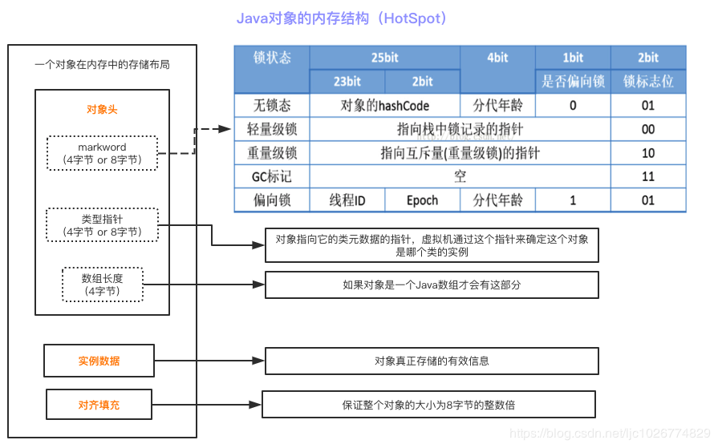

# Java并发（中）并发锁


## 9. ⭐️ Java各种锁：悲观锁、乐观锁、自旋锁、偏向锁、轻量/重量级锁、读写锁、可重入锁、锁粗化、锁消除

### 悲观锁与乐观锁

悲观锁与乐观锁并不是特指某个锁，而是在并发情况下的两种不同策略，是一种宏观的描述。

**悲观锁（Pessimistic Lock）** 
认为冲突一定发生，每次去拿数据的时候都认为别人会修改，所以每次在拿数据的时候都会上锁，这样别人想拿数据就会被阻塞，直到悲观锁被释放。

**乐观锁（Optimistic Lock）** 
认为冲突不会发生，每次去拿数据的时候都认为别人不会修改，所以**不会上锁**。但是如果想要更新数据，则会在更新前检查 在读取至更新 这段时间别人有没有修改过这个数据。如果修改过，则重新读取，再次尝试更新，循环上述步骤指导更新成功（当然也允许更新失败的线程放弃操作）

悲观锁阻塞事务，乐观锁回滚重试，它们各有优缺点，不要认为一种一定好于另一种。

乐观锁时候写操作比较少的情况下，即冲突真的很少发生的时候，这样可以省去锁的开销，加大系统的吞吐量。

但如果经常产生冲突，上层应用会不断地进行重试，这样反倒是降低了性能，所以这种情况下用悲观锁就比较合适。

##### 引申：乐观锁的一种实现方式 [CAS(Compare-and-Swap)](https://www.cnblogs.com/kismetv/p/10787228.html#t3)

CAS操作逻辑如下

如果内存位置V的值等于预期的A值，则将该位置更新为新值B，否则不进行任何操作。

许多CAS的操作是自旋的：如果操作不成功，会一直重试，直到操作成功为止。


### synchronized 锁升级

synchronized 锁升级：无锁 ——> 偏向锁 ——> 轻量级锁 ——> 重量级锁（与锁的优化一起学习）

synchronized 锁升级也被称为锁膨胀。

**偏向锁**

初次执行到 synchronized 代码块的时候，锁对象变成偏向锁（通过 CAS 修改对象头里的锁标志位），字面意思是“偏向于第一个获得它的线程”的锁。

执行完同步代码块后，线程并不会主动释放偏向锁；

当第二次到达同步代码块时，线程会判断此时持有锁的线程是否就是自己（持有锁的线程 ID 也在对象头里），如果是，则正常往下执行。

由于之前没有释放锁，这里也就不需要重新加锁。

如果自始至终使用锁的线程只有一个，很明显偏向锁几乎没有额外开销，性能极高。

##### 引申：[Java 对象的头结构组成](https://blog.csdn.net/lkforce/article/details/81128115) 

java的对象头由以下三部分组成

- Mark Word

  Mark Word记录了对象和锁有关的信息，当这个对象被synchronized关键字当成同步锁时，围绕这个锁的一系列操作都和Mark Word有关。

- 指向类的指针

- 数组长度（只有数组对象才有）


**轻量级锁（自旋锁）** 

一旦有第二个线程加入锁竞争，偏向锁就升级为轻量级锁（自旋锁）。

只有当某线程尝试获取锁的时候，发现该锁已经被占用，只能等待其释放，这才发生了锁竞争。

在锁竞争下，没有抢到锁的线程将自旋，即不停地循环判断锁是否能被成功获取。

长时间的自旋操作是非常消耗资源的，一个线程持有锁，其它线程就只能在原地空耗CPU，执行不了任何有效任务，这种现象叫做忙等（busy-waiting）。

如果多个线程用一个锁，但是没有发生锁竞争，或者发生了很轻微的锁竞争，那么 synchronized 就用轻量级锁，允许短时间的忙等现象。这是一种折衷的想法，短时间的忙等，换取线程在用户态和内核态之间切换的开销

##### 引申：[操作系统中的用户态和内核态的概念](https://blog.csdn.net/youngyoungla/article/details/53106671)

为什么要有用户态和内核态？

由于需要限制不同的程序之间的访问能力，防止他们获取别的程序的内存数据，或者获取外围设备的数据，并发送到网络。CPU划分出两个权限等级 —— 用户态和内核态。


**重量级锁** 

如果锁竞争情况严重，某个达到最大自旋次数的线程会将轻量级锁升级为重量级锁。

之后后续线程尝试获取锁时，发现被占用的锁是重量级锁，则直接将自己挂起（而不是忙等），等待将来被唤醒。


### 公平锁和非公平锁

如果多个线程申请一把公平锁，先申请的先得到，非常公平。

如果是非公平锁，后申请的线程可能先获取到锁，是随机或者按照其它优先级排序的。也因此，有些线程可能会一直获取不到锁而“饿死”。

ReentrantLock，通过构造函数传参可以指定该锁是否是公平锁，默认是非公平锁。一般情况下，非公平锁的吞吐量比公平锁大。如果没有特殊要求，一般使用非公平锁。

synchronized 是非公平锁，没有任何办法使其变成公平锁。


### 读写锁、共享锁、互斥锁

读写锁其实是一对锁，一个读锁（共享锁）和一个写锁（互斥锁、排它锁）。

如果读取值是为了更新它，那么就直接加写锁，持有写锁的时候别的线程无论读还是写都需要等待；

如果读取值是为了查询它，那么就直接加一个读锁，其它线程如果也要加读锁，不需要等待，可以直接获取（读锁计数器+1）。

JDK 提供的唯一一个 ReadWriteLock 接口实现类是 ReentrantReadWriteLock。


### 可重入锁和不可重入锁

不可重入锁：若当前线程执行中已经获取了锁，再次尝试获取该锁时，就会获取不大、被阻塞。

可重入锁：若当前线程执行中已经获取了锁，再次尝试获取该锁时，也可以获取。

ReentrantLock 和 synchronized 都是可重入锁

##### 引申：如何实现可重入锁

当某一线程获取锁后，将state值+1，并记录下当前持有锁的线程；

再有线程来获取锁时，判断这个线程与持有锁的线程是否是同一个线程，如果是，将state值再+1；

如果不是，阻塞线程。


### 锁粗化

JVM会探测到一连串细小的操作都使用同一个对象加锁，将同步代码块的范围放大，放到这串操作的外面，这样只需要加一次锁即可。

锁粗化前

```java
for(int i=0;i<size;i++){
    synchronized(lock){
    }
}
```

锁粗化后

```java
synchronized(lock){
    for(int i=0;i<size;i++){
    }
}
```


### 锁消除

**锁消除是指虚拟机即时编译器在运行时，对一些代码上要求同步，但是被检测到不可能存在共享数据竞争的锁进行消除。** 

[锁消除 逃逸分析](https://houbb.github.io/2018/10/08/jvm-30-lock-optimize) 


## 10. ⭐️ ReentrantLock 和 synchronized 区别

1. **底层实现** 
   **synchronized 是 JVM 实现的、是Java关键字，而 ReentrantLock 是 JDK(API) 实现的**。
   synchronized 是依赖于 JVM 实现的，Java 虚拟机团队在 JDK1.6 为 synchronized 关键字进行了很多的优化，但这些优化都是在虚拟机层面实现的，并没有直接暴露给我们。
   ReentrantLock 是 JDK 层面实现的（也就是 API 层面，需要 lock() 和 unlock() 方法配合 try/finally 语句块来完成），可以通过查看它的源代码，来看它是如何实现的。

2. **性能** 
   新版本 Java 对 synchronized 进行了很多优化，例如自旋锁等，synchronized 与 ReentrantLock 大致相同。

3. **是否可手动释放** 

   **synchronized 不需要用户去手动释放锁**，synchronized 代码执行完后系统会自动让线程释放对锁的占用； 

   **ReentrantLock 则需要用户去手动释放锁，如果没有手动释放锁，就可能导致死锁现象**。一般通过 lock() 和 unlock() 方法配合 try/finally 语句块来完成，使用释放更加灵活。

4. **是否可中断** 
   当持有锁的线程长期不释放锁的时候，正在等待的线程可以选择放弃等待，改为处理其它事情。
   **ReentrantLock 可中断，synchronized不可中断**。

5. **是否公平锁** 
   **synchronized为非公平锁**。
   **ReentrantLock则即可以选公平锁也可以选非公平锁**。通过构造方法new ReentrantLock时传入boolean值进行选择，为空默认false非公平锁，true为公平锁。

6. **是否可绑定条件Condition** 
   synchronized不能绑定，一个 ReentrantLock 可以同时绑定多个 Condition 对象。

7. **都是可重入锁** 

8. **锁的对象** 

   synchronzied锁的是**对象**，锁是保存在对象头里面的，根据对象头数据来标识是否有线程获得锁/争抢锁；

   ReentrantLock锁的是**线程**，根据进入的线程和int类型的state标识锁的获得/争抢。


## 11. ⭐️ volatile 和 synchronized 有什么区别

**二者主要针对的问题** 

volatile：编译器为了加快程序运行的速度，对一些变量的写操作会先在寄存器或 CPU 缓存上进行最后才写入内存，而在这个过程中变量的新值对其它线程是不可见的。volatile 的作用就是使它修饰的变量的读写操作都必须在内存中进行。

synchronized：解决的是多个线程之间访问资源的同步性，synchronized 关键字可以保证被它修饰的方法或代码块在任意时刻只能有一个程序进行。


**二者之间的区别** 

1. volatile 本质是在高速 JVM 当前变量在寄存器中的值是不确定的，需要从内存中读取；
   synchronized 则是锁定当前变量，只有当前线程可以访问该变量，其它线程被阻塞住。
2. volatile 仅能使用在变量级别，synchronized 则可以使用在变量、方法。
3. volatile 仅能实现变量修改的可见性，但不具备原子特性；
   synchronized 则可以保证变量修改的可见性和原子性。
4. volatile 不会造成线程的阻塞，而 synchronized 可能会造成线程的阻塞。
5. volatile 标记的变量不会被编译器优化，而 synchronized 标记的变量可以被编译器优化。

##### 引申：多线程对一个 volatile 变量操作

多线程对一个 volatile 变量进行 ++，最终这个变量结果是准确的吗？

不准确的，因为 volatile 不保证原子性，最终结果是小于真实值的。

原子类的Atomic 可以保证变量的原子性，那么它的原理是怎么实现的呢？采用 CAS 的无锁机制。


## 12. ⭐️ synchronized 关键字所有问题

**简述** 

synchronized 关键字

1. 解决的是多个线程之间访问资源的同步性问题
2. 可以保证被它修饰的方法或代码块在任意时刻只能有一个线程执行

**JDK 1.6 以前** 

synchronized 属于重量级锁，效率低下。

因为监视器锁（monitor）是依赖于底层的操作系统的 MutexLock 来实现的，Java 的线程是反映到操作系统的原生线程之上的。

**如果要挂起或唤醒一个程序，都需要操作系统帮忙完成，而操作系统实现线程之间的切换时需要从用户态转移到内核态，这个状态之间的切换需要比较长时间，时间成本较高**。

这也是为什么早期的 synchronized 效率低下的原因。

**JDK 1.6 开始** 

JDK 1.6 对锁的实现引入了大量的优化，如自旋锁、[锁消除](锁消除是指虚拟机即时编译器（JIT）在运行时，对一些代码上要求同步，但是被检测到不可能存在共享数据竞争的锁进行消除)、锁粗化、偏向锁、轻量级锁来减少锁操作的开销。


**如何使用（面试）** 

synchronized 关键字最主要的三种使用方式

1. 普通同步方法，锁是当前实例的实例对象
2. 静态同步方法，锁是当前类的 class 对象
3. 同步方法块，锁是自己定义的锁对象

synchronized 的具体使用（面试常见）

面试官：“单例模式了解吗？手写一个，再解释一下双重检验锁方式实现单例模式的原理。”

双重检验锁实现对象单例（线程安全）

```java
public class Singleton{
  private volatile static Singleton uniqueInstance;
  private Singleton(){
  }
  public static Singleton getUniqueInstance(){
    // 先判断对象是否已经实例化过，没有实例化过才进入加锁代码
    if (uniqueInstance == null) {
      // 类对象加锁
      synchronized (Singleton.class) {
        if (uniqueInstance == null) {
          uniqueInstance = new Singleton();
        }
      }
    }
    return uniqueInstance;
  }
}
```

另外，需要注意 uniqueInstance 采用 volatile 关键字修饰也是很有必要的。

`uniqueInstance = new Singleton();` 这段代码其实是分三部分执行：

1. 为 uniqueInstance 分配内存空间；
2. 初始化 uniqueInstance；
3. 将 uniqueInstance 指向分配的内存地址。

但由于 JVM 具有指令重排的特性，执行顺序可能变成 `1 ——> 3 ——> 2` 。

指令重排在单线程环境下不会出现问题，但是在多线程环境下会导致一个线程获得还没有初始化的实例。

例如线程 T1 执行了 1和3，此时 T2 调用 getUniqueInstance() 后发现 uniqueInstance 不为空，因此返回 uniqueInstance，但此时 uniqueInstance 还未被初始化。

使用 volatile 可以禁止 JVM 的指令重排，保证在多线程环境下也能正常运行。


### 底层原理 

Java 对象头和 monitor 是实现 synchronized 的基础。

对象头内保存着无锁状态、偏向锁、轻量级锁、重量级锁等状态和运行位；monitor 来标识一个对象的锁定状态（线程与对象之间锁定关系）。

- **同步代码块** 
  使用 **monitorenter 和 monitorexit** 实现。
  monitorenter 指向同步代码块的开始位置，monitorexit执行结束位置。
  **任何对象都有一个 monitor 与之关联**，一个 monitor 被持有之后，将处于锁定状态。
  线程执行到 monitorenter 后会尝试获取对应 monitor，即对象的锁。
  monitorexit 释放 monitor。

- **同步方法** 
  使用方法修饰符 ACC_SYNCHRONIZED 实现。

- **可重入性** 
  重入锁实现可重入性的原理或机制：
  1. 每一个锁关联一个线程持有者和计数器。
  2. 当计数器为0时，表示该锁没有被任何线程持有，那么任何线程都可能获得该锁而调用相应的方法；
  3. 当某一线程请求成功后，JVM 会记下锁的持有线程，并且将计数器置为 1；
  4. 此时其它线程请求该锁，则必须等待；而持有该锁的线程再次请求这个锁，就可以再次拿到这个锁，同时计数器会递增。
  5. 当线程退出同步代码块时，计数器会递减；
  6. 如果计数器为0，则释放该锁。
- **锁的优化** （多线程锁的优化将详细解释）
  偏向锁（使用了 CAS。判断是否为偏向锁，直接判断当前线程的 id，减少同步时间）；轻量级锁（使用了 CAS）；自旋锁；再到重量级锁。
- 另外还有锁消除技术，除去不必要的加锁

 


## 13. ⭐️ 多线程锁的优化

1. 减少锁的持有时间。
2. 减小锁粒度（只对需要的一部分进行加锁），相对是锁的粗化。
3. 读写分离锁（读和读之间不阻塞）
4. JVM 虚拟机对锁的优化（这是 synchronized 优化）

偏向锁：第一个线程请求锁并拿到锁之后，下次再请求锁不需要再进行同步操作，直接拿到锁。

当有第二个线程竞争时，偏向锁失效。

轻量级锁：偏向锁失效后，使用轻量级锁。将对象头部作为指针，指向锁记录，如果成功就获得轻量级锁；否则升级为自旋锁。

自旋锁：轻量级锁失效后，Java 虚拟机会假设在不久的时间内可以拿到锁，所以让线程进行几次空循环。如果可以拿到锁则进入临界区，否则便阻塞等待锁。

锁消除：取出不可能存在共享资源竞争的锁。节省不必要的锁请求的时间。


