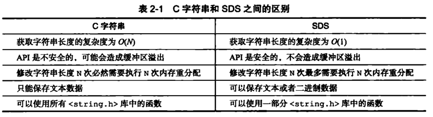

# Redis

- **高性能主线**，包括线程模型、数据结构、持久化、网络框架；
- **高可靠主线**，包括主从复制、哨兵机制；
- **高可扩展主线**，包括数据分片、负载均衡。

## Redis问题画像图

## 1. ⭐️ 简述 Redis（为何选用 Redis）

Redis 是一款开源的使用 C 语言编写、可基于内存、持久化的 Key-Value 数据库。

和 Mencached 类似，它支持存储的 value 类型相对更多，包括 string（字符串）、list（链表）、set（集合）、zset（sorted set -- 有序集合）和 hash（哈希类型）。

优势在于速度快、性能极高、可持久化、丰富的数据类型、之处数据的备份。

Redis 和 Memcached 的区别

1. 数据结构

   Redis 支持字符串、散列、列表、集合、有序集、位图、超级日志和空间索引；

   而 Memcached 只支持简单的key/value数据结构

2. 多线程

   Redis 使用单线程反而避免了多线程的频繁上下文切换问题，预防了多线程可能产生的竞争问题。

   Memcache 存在着支持并发性不好、可运维性欠佳、原子性操作不够、在误操作时产生数据不一致等问题。

   由于 **Redis** 只使用单核，而 **Memcached** 可以使用多核，所以 **Redis** 在存储小数据时比 **Memcached** 性能更高。而在 100k 以上的数据中，**Memcached** 性能要高于 **Redis**，虽然 **Redis** 最近也在存储大数据的性能上进行优化，但是比起 **Memcached**，还是稍有逊色。

3. 持久化

   Memcached无法进行持久化，数据不能备份，只能用于缓存使用，且重启后数据全部丢失。

   而 Redis 支持复制、允许从属 Redis 服务器成为主服务器的精确副本，来自任何 Redis 服务器的数据都可以复制到任意数量的从属服务器。Redis 通过 Replication 进行数据复制，通过 master-slave 机制，可以实时进行数据的同步复制，支持多级复制和增量复制，master-slave 机制是 Redis 进行HA的重要手段。

4. 分布式

   Redis原生支持集群模式，Memcached没有原生的集群模式。

## 2. ⭐️ 为什么 Redis 快

1. **完全基于内存** 

   完全基于内存，绝大部分请求是纯粹的内存操作，非常快速。数据存在内存中，类似于HashMap，HashMap的优势就是查找和操作的时间复杂度都是O(1)；

2. **数据结构专门设计**

   Redis中的数据结构是专门进行设计的（可结合[源码解析](https://www.wmyskxz.com/2020/02/28/redis-1-5-chong-ji-ben-shu-ju-jie-gou/)深入了解），数据结构简单，则对数据操作也简单。

3. **采用单线程** 

   采用单线程，**避免了不必要的上下文切换和竞争条件**，也**不存在多进程或者多线程导致的切换而消耗 CPU**，**不用考虑各种锁的问题**，**不存在加锁释放锁操作**，**没有因为可能出现死锁而导致的性能消耗**；

4. **使用多路 `I/O` 复用模型，非阻塞 `IO`**  

   redis使用多路复用技术，可以处理并发的连接。

   非阻塞 `I/O` 内部实现采用epoll，采用了epoll+自己实现的简单的事件框架。epoll中的读、写、关闭、连接都转化成了事件，然后利用epoll的多路复用特性，绝不在 `I/O` 上浪费一点时间。

   **多路`I/O`复用模型** 

   多路 `I/O` 复用模型是利用 select、poll、epoll 可以同时监察多个流的 `I/O` 事件的能力，在空闲的时候，会把当前线程阻塞掉，当有一个或多个流有 `I/O` 事件时，就从阻塞态中唤醒，于是程序就会轮询一遍所有的流（epoll 是只轮询那些真正发出了事件的流），并且只依次顺序的处理就绪的流，这种做法就避免了大量的无用操作。

   这里“多路”指的是多个网络连接，“复用”指的是复用同一个线程。采用多路 `I/O` 复用技术可以让单个线程高效的处理多个连接请求（尽量减少网络 `I/O` 的时间消耗），且 Redis 在内存中操作数据的速度非常快，也就是说内存内的操作不会成为影响Redis性能的瓶颈，主要由以上几点造就了 Redis 具有很高的吞吐量。

5. **持久化采用了子线程进行磁盘操作** 

6. **RESP协议(Redis Serialization Protocol，Redis 的序列化协议)，解析迅速**

##### 拓展：其它模型

1. 单进程多线程模型：MySQL、Memcached、Oracle（Windows版本）；

2. 多进程模型：Oracle（Linux版本）；

3. Nginx有两类进程，一类称为Master进程(相当于管理进程)，另一类称为Worker进程（实际工作进程）。启动方式有两种：

   1. 单进程启动：此时系统中仅有一个进程，该进程既充当Master进程的角色，也充当Worker进程的角色。

   2. 多进程启动：此时系统有且仅有一个Master进程，至少有一个Worker进程工作。

      Master进程主要进行一些全局性的初始化工作和管理Worker的工作；事件处理是在Worker中进行的。

## 3. 简述 Redis 单线程模型

Redis基于Reactor模式开发了网络事件处理器，这个处理器被称为文件事件处理器。

它的组成结构为4部分：

1. 多个套接字
2. IO多路复用程序
3. 文件事件分派器
4. 事件处理器。

因为文件事件分派器队列的消费是单线程的，所以Redis才叫单线程模型。

**消息处理流程** 

- 文件事件处理器使用 `I/O` 多路复用(multiplexing)程序来同时监听多个套接字，并根据套接字目前执行的任务来为套接字关联不同的事件处理器。
- 当被监听的套接字准备好执行连接应答(accept)、读取(read)、写入(write)、关闭(close)等操作时，与操作相对应的文件事件就会产生，这时文件事件处理器就会调用套接字之前关联好的事件处理器来处理这些事件。

尽管多个文件事件可能会并发地出现，但 `I/O` 多路复用程序总是会将所有产生事件的套接字都推到一个队列里面，然后通过这个队列，以有序（sequentially）、同步（synchronously）、每次一个套接字的方式向文件事件分派器传送套接字：当上一个套接字产生的事件被处理完毕之后（该套接字为事件所关联的事件处理器执行完毕）， `I/O` 多路复用程序才会继续向文件事件分派器传送下一个套接字。

### 事件驱动

Redis 服务器是一个事件驱动程序，并且是单线程处理的。

Redis 有两类事件：文件事件、时间事件。

文件事件处理器使用**IO多路复用程序**来同时监听多个套接字，并根据套接字目前执行的任务来为套接字关联不同的事件处理器。

当被监听的套接字准备好执行连接，应答，读取，写入，关闭等操作时，与操作相对应的文件事件就会产生，这时文件事件处理器就会调用套接字之前关联好的事件处理器来处理这些事件。

虽然文件事件处理器以单线程方式运行，但通过使用**io多路复用程序来监听多个套接字**，文件事件处理器既实现了高性能的网络通信模型，又可以**很好地与redis服务器中同样以单线程方式运行的模块进行对接，这就保持了redis内部单线程设计的简单性**。

## 4. Redis 为什么要使用单线程而不是多线程

[Redis 新特性篇：多线程模型解读](https://cloud.tencent.com/developer/article/1853118) 

Redis 6.0 之前的版本是真的单线程，之后才有了多线程。

官方答复：

- 使用 Redis 时，几乎不存在 CPU 成为瓶颈的情况， Redis 主要受限于内存和网络。
- 在一个普通的 Linux 系统上，Redis 通过使用`pipelining` 每秒可以处理 100 万个请求，所以如果应用程序主要使用 O(N) 或O(log(N)) 的命令，它几乎不会占用太多 CPU。
- 使用了单线程后，可维护性高。多线程模型虽然在某些方面表现优异，但是它却引入了程序执行顺序的不确定性，带来了并发读写的一系列问题，增加了系统复杂度、同时可能存在线程切换、甚至加锁解锁、死锁造成的性能损耗。

Redis 通过 AE 事件模型以及 IO 多路复用等技术，处理性能非常高，因此没有必要使用多线程。

**单线程机制让 Redis 内部实现的复杂度大大降低，Hash 的惰性 Rehash、Lpush 等等『线程不安全』的命令都可以无锁进行**。

## 5. Redis 数据结构

### 不同类型的不同实现

| 类型常量     | 对象类型名称 | 编码常量                  | 编码对应的数据结构                                           |
| ------------ | ------------ | ------------------------- | ------------------------------------------------------------ |
| REDIS_STRING | 字符串对象   | REDIS_ENCODING_INT        | long类型的整数                                               |
| REDIS_STRING | 字符串对象   | REDIS_ENCODING_EMBSTR     | emstr编码的简单动态字符串                                    |
| REDIS_STRING | 字符串对象   | REDIS_ENCODING_RAW        | 简单动态字符串                                               |
| REDIS_LIST   | 列表对象     | REDIS_ENCODING_QUICKLIST  | 快表                                                         |
| REDIS_LIST   | 列表对象     | REDIS_ENCODING_LINKEDLIST | 快表                                                         |
| REDIS_SET    | 集合对象     | REDIS_ENCODING_INRSET     | 整数集合                                                     |
| REDIS_SET    | 集合对象     | REDIS_ENCODING_HT         | 哈希表                                                       |
| REDIS_ZSET   | 有序集合对象 | REDIS_ENCODING_ZIPLIST    | [压缩列表](压缩列表实际上类似于一个数组，数组中的每一个元素都对应保存一个数据。和数组不同的是，压缩列表在表头有三个字段 zlbytes、zltail 和 zllen，分别表示列表长度、列表尾的偏移量和列表中的 entry 个数；压缩列表在表尾还有一个 zlend，表示列表结束。在压缩列表中，如果我们要查找定位第一个元素和最后一个元素，可以通过表头三个字段的长度直接定位，复杂度是 O(1)) |
| REDIS_ZSET   | 有序集合对象 | REDIS_ENCODING_SKIPLIST   | [跳表](跳表在链表的基础上，增加了多级索引，通过索引位置的几个跳转，实现数据的快速定位) |
| REDIS_HASH   | 哈希对象     | REDIS_ENCODING_ZIPLIST    | 压缩列表                                                     |
| REDIS_HASH   | 哈希对象     | REDIS_ENCODING_HT         | 哈希表                                                       |

### ⭐️简单动态字符串 SDS 和 C 语言自带的字符串有什么不同

1. **常数复杂度获取字符串长度** 

   由于 len 属性的存在，我们获取 SDS 字符串的长度只需要读取 len 属性，时间复杂度为 O(1)。而对于 C 语言，获取字符串的长度通常是经过遍历计数来实现的，时间复杂度为 O(n)。通过 strlen key 命令可以获取 key 的字符串长度。

2. **杜绝缓冲区溢出** 

   对于 SDS 数据类型，在进行字符修改的时候，会首先根据记录的 len 属性检查内存空间是否满足需求，如果不满足，会进行相应的空间扩展，然后在进行修改操作，所以不会出现缓冲区溢出。

3. **减少修改字符串的内存重新分配次数** 

   C语言由于不记录字符串的长度，所以如果要修改字符串，必须要重新分配内存（先释放再申请），因为如果没有重新分配，字符串长度增大时会造成内存缓冲区溢出，字符串长度减小时会造成内存泄露。

   而对于SDS，由于len属性和free属性的存在，对于修改字符串SDS实现了空间预分配和惰性空间释放两种策略：

   - **空间预分配** 

     对字符串进行空间扩展的时候，扩展的内存比实际需要的多，这样可以减少连续执行字符串增长操作所需的内存重分配次数。

   - **惰性空间释放** 

     对字符串进行缩短操作时，程序不立即使用内存重新分配来回收缩短后多余的字节，而是使用 free 属性将这些字节的数量记录下来，等待后续使用。（当然SDS也提供了相应的API，当我们有需要时，也可以手动释放这些未使用的空间。）

4. **二进制安全** 

   因为C字符串以空字符作为字符串结束的标识，而对于一些二进制文件（如图片等），内容可能包括空字符串，因此C字符串无法正确存取；而所有 SDS 的API 都是以处理二进制的方式来处理 buf 里面的元素，并且 SDS 不是以空字符串来判断是否结束，而是以 len 属性表示的长度来判断字符串是否结束。

5. **兼容部分 C 字符串函数** 

   虽然 SDS 是二进制安全的，但是一样遵从每个字符串都是以空字符串结尾的惯例，这样可以重用 C 语言库<string.h> 中的一部分函数。

总结

redis使用改数据结构的优点

1. 空间可以预分配
2. 惰性空间释放(使某个键的长度变小时，内存不是立即回收而是增加free的大小)
   1. 二进制安全(redis不是采用c语言字符串的以 `\0` 来判断字符串结束，而 SDS 通过判断len的长度是否为0来计算字符串的长度)
3. redis实际开辟的空间为 len+free

注：一般来说，SDS 除了保存数据库中的字符串值以外，SDS 还可以作为缓冲区（buffer）：包括 AOF 模块中的AOF缓冲区以及客户端状态中的输入缓冲区。

### ⭐ redis 字典的底层实现 hashMap 相关问题

1. 解决冲突：链地址法，和 Java 的 hashMap 一样 
2. 扩容：复制出另外一个 hash 表，并且会重算 hash 值，进行渐进式 hash。这一点和 Java 不同，特别是 Java 8 的不用重算 hash 机制的优点 

> **什么是渐进式rehash？**

也就是说扩容和收缩操作不是一次性，集中式完成的，而是分多次，渐进式完成的。

如果保存在`Redis`中的键值对只有几个几十个，那么`hash`操作可以瞬间完成，但是如果键值对右几百万，几千万甚至几亿，那么要一次性的进行`rehash`，势必会造成`Redis`一段时间内不能进行别的操作。

所以`Redis`采用渐进式`rehash`，这样在进行渐进式`rehash`期间，字典的删除查找更新等操作可能会在两个哈希表上进行，第一个哈夏表上没有找到，就会去第二个哈希表上进行查找。但是进行`增加操作，一定是在新的哈希表上进行的`

### 压缩链表原理

压缩列表实际上类似于一个数组，数组中的每一个元素都对应保存一个数据。和数组不同的是，压缩列表在表头有三个字段 zlbytes、zltail 和 zllen，分别表示列表长度、列表尾的偏移量和列表中的 entry 个数；压缩列表在表尾还有一个 zlend，表示列表结束。在压缩列表中，如果我们要查找定位第一个元素和最后一个元素，可以通过表头三个字段的长度直接定位，复杂度是 O(1)。

### ⭐️ zset 底层跳表原理（为什么不选择平衡树）

==本质就是多级链表，并有序==。

#### skiplist 与平衡树、哈希表的比较

- `skiplist`和各种平衡树（如`AVL`，`红黑树`等）的元素是有序排列的，而哈希表不是有序的，因此在哈希表上只能做单个`key`的查找，不适宜左范围查找。所谓范围查找，指的是查找哪些大小在指定的两个值之间的所有节点
- `在做范围查找的时候，平衡树比skiplisty操作要复杂。在平衡树上，我们找到指定范围的最小值后，还需要以中序遍历的熟悉怒继续寻找其他不超过大值的节点。而在skiplisy上进行范围查找就非常简单，只需要在找到最小值之后，对第一层链表进行若干步的遍历就可以实现
- 平衡树的插入和删除操作可能引发子树的调整，逻辑复杂，而`skiplist`的插入和删除只需要修改相邻节点的指针，操作简单又快速
- 从内存占用上来说，`skiplist`比平衡树更灵活一些。一般来说，平衡树每个节点包含2个指针，而跳表每个节点包含的指针数目平均为
- 查找单个`key`，`skiplist`和平衡树的时间复杂度都为`O(nlogn)`，大体相当；而哈希表在保持较低的哈夏值冲突概率的前提下，查找时间复杂度接近`o(1)`，性能更高一些。所以我们平时要使用的各种`Map`或者`dictionary`结构，大致都是基于哈希表实现的
- 从算法实现复杂度上来比较，`skiplist`比平衡树要简单的多

## 6. ⭐️ 红黑树和跳表

这是 redis 里面的应用，有兴趣研究源码。

跳表就是带多级索引的链表，时间复杂度 `O(logn)`，所能实现的功能和红黑树差不多，但是跳表有一个==区间查找==的优势，红黑树没有，所以 redis 底层选用跳表。

### 跳表结构

[一文彻底搞懂跳表的时间复杂度、实现原理以及应用场景](https://cloud.tencent.com/developer/article/1539038) 

跳表的主要组成部分：

- 表头(head)：负责维护跳跃表的节点指针

- 跳跃表节点：保存着元素值，以及多个层

- 层：保存着指向其它元素的指针。高层指针越过的元素数量大于等于低层指针。

  为了提高查找效率，程序总是从高层先开始访问，然后随着元素值的缩小，慢慢降低层次。

- 表尾：全部由 NULL 组成，表示跳跃表的末尾。

**跳表以空间换取时间，实现快速查找**。

假如原始链表包含 n 个元素，则一级索引元素个数为 n/2、二级索引元素个数为 n/4、三级索引元素个数为 n/8 以此类推。所以，索引节点的总和是：n/2 + n/4 + n/8 + … + 8 + 4 + 2 = n-2，**空间复杂度是 O(n)**。

But，索引结点往往只需要存储 key 和几个指针，并不需要存储完整的对象，所以当对象比索引结点大很多时，索引占用的额外空间就可以忽略了。举个例子：我们现在需要用跳表来给所有学生建索引，学生有很多属性：学号、姓名、性别、身份证号、年龄、家庭住址、身高、体重等。学生的各种属性只需要在原始链表中存储一份即可，我们只需要用学生的学号（int 类型的数据）建立索引，所以索引相对原始数据而言，占用的空间可以忽略。

### 红黑树

**红黑树**是许多**平衡搜索树**中的一种，可以保证在最坏的情况下基本动态集合操作的时间复杂度为**`O(logn)`**，`n`为节点个数。

1. 节点要么为红色，要么为黑色；
2. 根节点为黑色；
3. 叶子节点( `NIL` 或 `空`节点)为黑色；
4. 每个红色节点的左右孩子节点都是黑色（保证从根节点到叶子节点不会出现连续两个红色节点）；
5. 从任意节点到其每个叶子节点的所有路径，都包含相同数目的黑色节点。

4、5是使得红黑树为平衡树的关键。

**从根到最远的叶子节点的路径不超过从根到最近叶子节点路径的两倍**，结果是树**大致上高度平衡**。

## 7. ⭐️ Redis 中过期策略、缓存淘汰机制

### 过期策略

1. **定时删除** 

   在设置某个key 的过期时间同时，我们创建一个定时器，让定时器在该过期时间到来时，立即执行对其进行删除的操作。

   优点

   - 定时删除对内存是最友好的，能够保存内存的key一旦过期就能立即从内存中删除。

   缺点

   - 对CPU最不友好，在过期键比较多的时候，删除过期键会占用一部分 CPU 时间，对服务器的响应时间和吞吐量造成影响。

2. **定期删除** 

   redis 默认是每隔 100ms 就随机**抽取**一些设置了过期时间的 key，检查其是否过期，如果过期就删除。

   优点

   - 可以通过限制删除操作执行的时长和频率来减少删除操作对 CPU 的影响；
   - 有效释放过期键占用的内存。

   缺点

   - 难以确定删除操作执行的时长和频率。
   - 如果执行的太频繁，定期删除策略变得和定时删除策略一样，对CPU不友好。
   - 如果执行的太少，那又和惰性删除一样了，过期键占用的内存不会及时得到释放。
   - 另外最重要的是，在获取某个键时，如果某个键的过期时间已经到了，但是还没执行定期删粗，那么就会返回这个键的值，这是业务不能忍受的错误。

3. **惰性删除** 

   设置该 key 过期时间后，我们不去管它，当需要该key时，我们在检查其是否过期。如果过期，我们就删掉它，反之返回该key。

   优点

   - 对 CPU友好，我们只会在使用该键时才会进行过期检查，对于很多用不到的key不用浪费时间进行过期检查。

   缺点

   - 对内存不友好，如果一个键已经过期，但是一直没有使用，那么该键就会一直存在内存中，如果数据库中有很多这种使用不到的过期键，这些键便永远不会被删除，内存永远不会释放。从而造成内存泄漏。

但是实际上这还是有问题的，如果定期删除漏掉了很多过期 key，然后你也没及时去查，也就没走惰性删除，此时会怎么样？如果大量过期 key 堆积在内存里，导致 redis 内存块耗尽了，咋整？

答案是：走内存淘汰机制。

### redis 内存淘汰机制

1. noeviction: 当内存不足以容纳新写入数据时，新写入操作会报错。

2. **allkeys-lru**：当内存不足以容纳新写入数据时，在键空间中，移除最近最少使用的 key（这个是最常用的）。

3. allkeys-random：当内存不足以容纳新写入数据时，在键空间中，随机移除某个 key。

   这个一般没人用，与其随机不如移除 最近最少使用 key。

4. volatile-lru：当内存不足以容纳新写入数据时，在设置了过期时间的键空间中，移除最近最少使用的 key（这个一般不太合适）。

5. volatile-random：当内存不足以容纳新写入数据时，在设置了过期时间的键空间中，随机移除某个 key。

6. volatile-ttl：当内存不足以容纳新写入数据时，在设置了过期时间的键空间中，有更早过期时间的 key 优先移除。

## 8. ⭐️ Redis 中持久化机制

> Redis的非常快，很大一部分原因是因为Redis的数据存储在内存中。
>
> 既然在内存中，那么当服务器宕机或者断电的时候，数据就会全部丢失了。
>
> 因此，Redis提供了两种机制来保证Redis数据不会因为故障而全部丢失，这种机制称为Redis的持久化机制。

Redis的持久化机制有两种：

- **RDB(Redis Data Base) 内存快照** 

  快照就是一次全量的数据备份，会把所有 Redis 的内存数据进行二进制序列化存储到磁盘

  Redis 会 Fork 一个子进程，快照的持久化就交给子进程去处理，而父进程继续处理线上业务的请求。

- **AOF(Append Only File) 增量日志** 

  AOF 日志记录的数据操作修改的指令记录日志，可以类比 MySQL 的 Binlog，AOF 日志随着时间的推移只会无限增量。

Redis 4.0 之后，引入了新的持久化模式，混合持久化，将 RDB 的文件和局部增量的 AOF 文件相结合。

RDB 可以使用相隔较长的时间保存策略，AOF 不需要每次保存全量日志，只需要保存前一次 RDB 存储开始到这段时间增量 AOF 日志即可，一般来说，这个日志量是非常小的。

## 9. ⭐️ Redis 集群的主从复制

[采用完整重同步和部分重同步两种模式](https://juejin.cn/post/6973928120332058654) 

### 完整同步用于处理初步复制模式

通过让祝福去创建并发送 RDB 文件，以及向从服务器发送保存在缓冲区的写命令来进行同步

**主从库第一次复制过程大体可以分为 3 个阶段：[连接建立阶段（即准备阶段）](该阶段的主要作用是在主从节点之间建立连接，为数据全量同步做好准备。从库会和主库建立连接，从库执行 replicaof 并发送 psync 命令并告诉主库即将进行同步，主库确认回复后，主从库间就开始同步了)、主库同步数据到从库阶段、发送同步期间新写命令到从库阶段**；

### 部分同步用于处理断线后重复制

当从服务器在断线后重新连接主服务器时，主服务可以将主从服务器连接断开期间执行的写命令发给从服务器，从服务器只需要接受并执行这些写命令，就可以将数据库更新至主服务器当前所处的状态。

 

## 10. ⭐️ 缓存污染、雪崩、穿透与击穿问题

### 缓存污染

缓存污染，指留存在缓存中的数据，实际不会被再次访问了，但又占据了缓存空间。

要解决缓存污染的关键点是**能识别出只访问一次或者访问次数很少的数据**。

从能否解决缓存污染这一维度来分析Redis的8种缓存淘汰策略：

- noeviction策略：不会淘汰数据，解决不了。
- volatile-ttl策略：给数据设置合理的过期时间。当缓存写满时，会淘汰剩余存活时间最短的数据，避免滞留在缓存中，造成污染。
- volatile-random策略：随机选择数据，无法把不再访问的数据筛选出来，会造成缓存污染。
- volatile-lru策略：LRU策略只考虑数据的访问时效，对只访问一次的数据，不能很快筛选出来。
- volatile-lfu策略：LFU策略在LRU策略基础上进行了优化，筛选数据时优先筛选并淘汰访问次数少的数据。
- allkeys-random策略：随机选择数据，无法把不再访问的数据筛选出来，会造成缓存污染。
- allkeys-lru策略：LRU策略只考虑数据的访问时效，对只访问一次的数据，不能很快筛选出来。
- allkeys-lfu策略：LFU策略在LRU策略基础上进行了优化，筛选数据时优先筛选并淘汰访问次数少的数据。

| 缓存淘汰策略        | 解决缓存污染 |
| ------------------- | ------------ |
| noeviction策略      | 不能         |
| volatile-ttl策略    | 能           |
| volatile-random策略 | 不能         |
| volatile-lru策略    | 不能         |
| volatile-lfu策略    | 能           |
| allkeys-random策略  | 不能         |
| allkeys-lru策略     | 不能         |
| allkeys-lfu策略     | 能           |

### 缓存雪崩

- **问题来源**

缓存雪崩是指缓存中**数据大批量到过期时间，而查询数据量巨大，引起数据库压力过大甚至down机**。和缓存击穿不同的是，缓存击穿指并发查同一条数据，缓存雪崩是不同数据都过期了，很多数据都查不到从而查数据库。

- **解决方案**

1. 缓存数据的过期时间设置随机，防止同一时间大量数据过期现象发生。
2. 如果缓存数据库是分布式部署，将热点数据均匀分布在不同的缓存数据库中。
3. 设置热点数据永远不过期。

### 缓存穿透

- **问题来源**

缓存穿透是指**缓存和数据库中都没有的数据**，而用户不断发起请求。由于缓存是不命中时被动写的，并且出于容错考虑，如果从存储层查不到数据则不写入缓存，这将导致这个不存在的数据每次请求都要到存储层去查询，失去了缓存的意义。

在流量大时，可能DB就挂掉了，要是有人利用不存在的key频繁攻击我们的应用，这就是漏洞。

如发起为id为“-1”的数据或id为特别大不存在的数据。这时的用户很可能是攻击者，攻击会导致数据库压力过大。

- **解决方案**

1. 接口层增加校验，如用户鉴权校验，id做基础校验，id<=0的直接拦截；
2. 从缓存取不到的数据，在数据库中也没有取到，这时也可以将key-value对写为key-null，缓存有效时间可以设置短点，如30秒（设置太长会导致正常情况也没法使用）。这样可以防止攻击用户反复用同一个id暴力攻击
3. 布隆过滤器。bloomfilter就类似于一个hash set，用于快速判某个元素是否存在于集合中，其典型的应用场景就是快速判断一个key是否存在于某容器，不存在就直接返回。布隆过滤器的关键就在于hash算法和容器大小。

### 缓存击穿

- **问题来源**

缓存击穿是指**缓存中没有但数据库中有的数据**（一般是缓存时间到期），这时由于并发用户特别多，同时读缓存没读到数据，又同时去数据库去取数据，引起数据库压力瞬间增大，造成过大压力。

- **解决方案**

1. 设置热点数据永远不过期。
2. 接口限流与熔断，降级。重要的接口一定要做好限流策略，防止用户恶意刷接口，同时要降级准备，当接口中的某些 服务 不可用时候，进行熔断，失败快速返回机制。
3. 加互斥锁

## 11. 缓存和数据库的数据一致性问题

### 不一致的三种情况

1. 数据库有数据，缓存没有数据
2. 数据库有数据，缓存也有数据，数据不相等
3. 数据库没有数据，但缓存有数据

### 缓存+数据库读写的模式

**缓存策略 Cache Aside Pattern** 

1. 首先尝试从缓存读取，读到数据则直接返回；如果读不到，就读数据库，并将数据写入缓存，并返回。
2. 需要更新数据时，**先更新数据库**，然后使缓存里**对应的数据**失效（**删除**）。

另一种大众化的更新思路：先删除缓存，然后再更新数据库。

这么做引发的问题是，如果A、B两个线程同时要更新数据，并且A、B已经都做完了删除缓存这一步，接下来，A先更新了数据库，C线程读取数据，由于缓存没有，则查数据库，并把A更新的数据，写入了缓存，最后B更新数据库。那么缓存和数据库的值就不一致了。

至于为什么最后是把缓存中对应的数据删掉，而不是把更新的数据写到缓存里。

这么做引发的问题是，如果A、B两个线程同时做数据更新，A先更新了数据库，B后更新数据库，则此时数据库里存的是B的数据。如果更新缓存的时候，是B先更新了缓存，而A后更新了缓存，则缓存里是A的数据。这样缓存和数据库的数据也不一致。

**使用 Cache Aside Pattern 后不一致的三种情况** 

1. 对于第一种，在读数据的时候，会自动把数据库的数据写到缓存，因此不一致自动消除.

2. 对于第二种，数据最终变成了不相等，但他们之前在某一个时间点一定是相等的（不管你使用懒加载还是预加载的方式，在缓存加载的那一刻，它一定和数据库一致）。这种不一致，一定是由于你更新数据所引发的。前面我们讲了更新数据的策略，先更新数据库，然后删除缓存。因此，不一致的原因，一定是数据库更新了，但是删除缓存失败了。

3. 对于第三种，情况和第二种类似，你把数据库的数据删了，但是删除缓存的时候失败了。

因此，最终的结论是，需要解决的不一致，产生的原因是更新数据库成功，但是删除缓存失败。

解决方案大概有以下几种：

1. 对删除缓存进行重试，数据的一致性要求越高，我越是重试得快。

2. 定期全量更新，简单地说，就是我定期把缓存全部清掉，然后再全量加载。

3. 给所有的缓存一个失效期。

第三种方案可以说是一个大杀器，任何不一致，都可以靠失效期解决，失效期越短，数据一致性越高。但是失效期越短，查数据库就会越频繁。因此失效期应该根据业务来定。

并发不高的情况：

- 读: 读redis->没有，读mysql->把mysql数据写回redis，有的话直接从redis中取；

- 写: 写mysql->成功，再写redis；

并发高的情况：

- 读: 读redis->没有，读mysql->把mysql数据写回redis，有的话直接从redis中取；

- 写：异步话，先写入redis的缓存，就直接返回；定期或特定动作将数据保存到mysql，可以做到多次更新，一次保存；

## 12. Redis 6.0 为什么要引入多线程

Redis 将所有数据放在内存中，内存的响应时长大约为 100 纳秒，对于小数据包，Redis 服务器可以处理 80,000 到 100,000 QPS，这也是 Redis 处理的极限了，对于 80% 的公司来说，单线程的 Redis 已经足够使用了。

但随着越来越复杂的业务场景，有些公司动不动就上亿的交易量，因此需要更大的 QPS。

常见的解决方案是在分布式架构中对数据进行分区并采用多个服务器，但该方案有非常大的缺点，例如要管理的 Redis 服务器太多，维护代价大。

某些适用于单个 Redis 服务器的命令不适用于数据分区；数据分区无法解决热点读/写问题；数据偏斜，重新分配和放大/缩小变得更加复杂等等。

从 Redis 自身角度来说，因为读写网络的 Read/Write 系统调用占用了 Redis 执行期间大部分 CPU 时间，瓶颈主要在于网络的 IO 消耗。

**优化主要有两个方向:**

- 提高网络 IO 性能，典型的实现比如使用 DPDK 来替代内核网络栈的方式。
- 使用多线程充分利用多核，典型的实现比如 Memcached。

协议栈优化的这种方式跟 Redis 关系不大，支持多线程是一种最有效最便捷的操作方式。

**所以总结起来，Redis 支持多线程主要就是两个原因：**

- 可以充分利用服务器 CPU 资源，目前主线程只能利用一个核。
- 多线程任务可以分摊 Redis 同步 IO 读写负荷。

