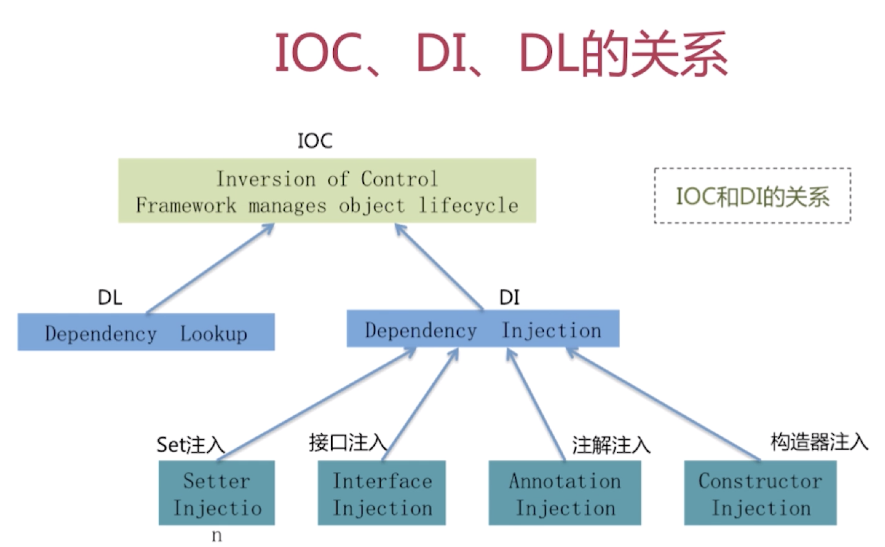
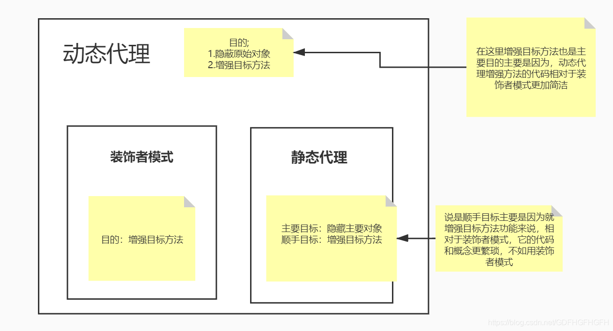

# Spring

为了降低Java开发的复杂性，Spring采取了以下4种关键策略

- 基于POJO的轻量级和最小侵入性编程；
- 通过依赖注入和面向接口实现松耦合；
- 基于切面和惯例进行声明式编程；
- 通过切面和模板减少样板式代码。


## 1. 简述 Spring

Spring是一个轻量级的控制反转（Ioc）和面向切面编程（AOP）的容器框架。

换句话说，Spring 核心容器的主要组件是 Bean 工厂(Bean Factory)，Bean 工厂使用控制反转(IoC)模式来降低程序代码之间的耦合度，并提供了面向切面编程(AOP) 的实现。

主要由以下几个模块组成：

1. Spring Core：核心类库，提供 IoC 服务
2. Spring Context：提供框架式的 Bean 访问方式，以及企业级功能（JNDI、定时任务等）
3. Spring AOP：AOP 服务
4. Spring DAO：对 JDBC 的抽象，简化了数据访问异常的处理
5. Spring ORM：对现有 ORM 框架的支持
6. Spring Web：提供了基本的面向 Web 的综合特性，例如多方文件上传
7. Spring MVC：提供面向 Web 应用的 Model-View-Controller 实现


### ⭐️ Spring 的优点

**轻量级**：Spring 在大小和透明性方面绝对属于轻量级，基础版本的 Spring 框架大约只有 2MB。

**控制反转(IOC)**：Spring 使用控制反转技术实现了松耦合。依赖被注入到对象，而不是创建或寻找依赖对象。

**面向切面对象编程(AOP)**：Spring 支持面向切面编程，可以方便的实现对程序进行权限拦截、运行监控等功能；同时，也把应用的业务逻辑与系统的服务分离开来。

**容器**：Spring 包含并管理应用程序对象的配置及生命周期。

**MVC 框架**：Spring 的 Web 框架是一个设计优良的 web MVC 框架，很好地取代了一些 web 框架。

**事务管理**：Spring 对下至本地业务、上至全局业务(JAT)提供了统一的事务管理接口。

**异常处理**：Spring 提供了一个方便的 API 将特定技术的异常（由 JDBC、Hibernate或 JDO 抛出）转化为一致的、Unchecked 异常


### Spring 应用程序有哪些不同组件

Spring 应用一般有以下组件：

- 接口 - 定义功能。
- Bean 类 - 它包含属性，setter 和 getter 方法，函数等。
- Bean 配置文件 - 包含类的信息以及如何配置它们。
- Spring 面向切面编程（AOP） - 提供面向切面编程的功能。
- 用户程序 - 它使用接口。


### 使用 Spring 有哪些方式

使用 Spring 有以下方式：

- 作为一个成熟的 Spring Web 应用程序。
- 作为第三方 Web 框架，使用 Spring Frameworks 中间层。
- 作为企业级 Java Bean，它可以包装现有的 POJO（Plain Old Java Objects）。
- 用于远程使用。


## 2. 简述 Spring Bean 原理

Spring Bean 是构成 Spring 应用核心的 Java 对象，这些对象由 Spring IOC 容器实例化、组装、管理。

### Bean 的五种作用域

Bean 默认的 scope 属性是 singleton

- singleton

  在 Spring IOC 容器中仅存在一个 Bean 实例，Bean 以单实例的方式存在。

  单实例实现原理：采用单例注册表的方式进行实现的，而这个注册表的缓存是 HashMap 对象，如果配置文件中的配置信息不要求使用单例，Spring 会采用新建实例的方式返回对象实例。

- prototype

  一个 Bean 可以定义多个实例。

- request

  每次 HTTP 请求都会创建一个新的 Bean。该作用域仅适用于 WebApplicationContext 环境。

- session

  一个 HTTP Session 定义一个 Bean。该作用域仅适用于 WebApplicationContext 环境。

- globalSession

  同一个全局 HTTP Session 定义一个 Bean。该作用域仅适用于 WebApplicationContext 环境。


### Bean 生命周期


ApplicationContext容器中，Bean的生命周期流程如上图所示，流程大致如下：

1. 首先容器启动后，会对scope为singleton且非懒加载的bean进行实例化；
2. 按照Bean定义信息配置信息，注入所有的属性；
3. 如果Bean实现了BeanNameAware接口，会回调该接口的setBeanName()方法，传入该Bean的id，此时该Bean就获得了自己在配置文件中的id；
4. 如果Bean实现了BeanFactoryAware接口，会回调该接口的setBeanFactory()方法，传入该Bean的BeanFactory，这样该Bean就获得了自己所在的BeanFactory；
5. 如果Bean实现了ApplicationContextAware接口，会回调该接口的setApplicationContext()方法，传入该Bean的ApplicationContext，这样该Bean就获得了自己所在的ApplicationContext；
6. 如果有Bean实现了BeanPostProcessor接口，则会回调该接口的postProcessBeforeInitialzation()方法；
7. 如果Bean实现了InitializingBean接口，则会回调该接口的afterPropertiesSet()方法；
8. 如果Bean配置了init-method方法，则会执行init-method配置的方法；
9. 如果有Bean实现了BeanPostProcessor接口，则会回调该接口的postProcessAfterInitialization()方法；
10. 经过 流程9 之后，就可以正式使用该Bean了，对于scope为singleton的Bean，Spring的ioc容器中会缓存一份该bean的实例，而对于scope为prototype的Bean，每次被调用都会new一个新的对象，期生命周期就交给调用方管理了，不再是Spring容器进行管理了；
11. 容器关闭后，如果Bean实现了DisposableBean接口，则会回调该接口的destroy()方法；
12. 如果Bean配置了destroy-method方法，则会执行destroy-method配置的方法，至此，整个Bean的生命周期结束。


## 3. 简述 Spring IOC 原理

控制反转，就创建对象的控制权，被反转到了Spring框架上，而不是由用户使用类的构造方法来new一个对象。

IOC 的主要实现方式是依赖注入(DI)，Spring 依赖注入的方式主要有四个，基于注解注入方式、set 注入方式、构造器注入方式、静态工厂注入方式。



- DL 已经被抛弃，因为它需要用户自己去是使用 API 进行查找资源和组装对象。即有侵入性。
- DI 是 Spring使用的方式，容器负责组件的装配。

Spring 的 IoC 设计支持以下功能：

- 依赖注入
- 依赖检查
- 自动装配
- 支持集合
- 指定初始化方法和销毁方法
- 支持回调某些方法（但是需要实现 Spring 接口，略有侵入）

其中，最重要的就是依赖注入，从 XML 的配置上说，即 ref 标签。对应 Spring RuntimeBeanReference 对象。


对于 IoC 来说，最重要的就是容器。容器管理着 Bean 的生命周期，控制着 Bean 的依赖注入。

容器分为

- BeanFactory

  BeanFactory 粗暴简单，可以理解为就是个 HashMap，Key 是 BeanName，Value 是 Bean 实例。

  通常只提供注册（put）、获取（get）这两个功能。我们可以称之为 “低级容器”。

- ApplicationContext

  ApplicationContext 可以称之为 “高级容器”。因为它继承了多个接口，所以它比 BeanFactory 多了更多的功能。

  例如资源的获取，支持多种消息（例如 JSP tag 的支持），对 BeanFactory 多了工具级别的支持等待。


### BeanFactory 和 ApplicationContext有什么区别

BeanFactory和ApplicationContext是Spring的两大核心接口，都可以当做Spring的容器。

其中ApplicationContext是BeanFactory的子接口。

#### 依赖关系

BeanFactory：是Spring里面最底层的接口，包含了各种Bean的定义，读取bean配置文档，管理bean的加载、实例化，控制bean的生命周期，维护bean之间的依赖关系。

ApplicationContext接口作为BeanFactory的派生，除了提供BeanFactory所具有的功能外，还提供了更完整的框架功能：

- 继承MessageSource，因此支持国际化。
- 统一的资源文件访问方式。
- 提供在监听器中注册bean的事件。
- 同时加载多个配置文件。
- 载入多个（有继承关系）上下文 ，使得每一个上下文都专注于一个特定的层次，比如应用的web层。

#### 加载方式

BeanFactroy采用的是延迟加载形式来注入Bean的，即只有在使用到某个Bean时(调用getBean())，才对该Bean进行加载实例化。这样，我们就不能发现一些存在的Spring的配置问题。如果Bean的某一个属性没有注入，BeanFacotry加载后，直至第一次使用调用getBean方法才会抛出异常。

ApplicationContext，它是在容器启动时，一次性创建了所有的Bean。这样，在容器启动时，我们就可以发现Spring中存在的配置错误，这样有利于检查所依赖属性是否注入。 ApplicationContext启动后预载入所有的单实例Bean，通过预载入单实例bean，确保当你需要的时候，你就不用等待，因为它们已经创建好了。

相对于基本的BeanFactory，ApplicationContext 唯一的不足是占用内存空间。当应用程序配置Bean较多时，程序启动较慢。

#### 创建方式

BeanFactory通常以编程的方式被创建，ApplicationContext还能以声明的方式创建，如使用ContextLoader。

#### 注册方式

BeanFactory和ApplicationContext都支持BeanPostProcessor、BeanFactoryPostProcessor的使用，但两者之间的区别是：BeanFactory需要手动注册，而ApplicationContext则是自动注册。

结合源码继续分析：容器创建 —— 对象依赖注入 —— 对象生命周期

[最详细的Spring核心IOC的源码分析(每次看都有不同的感悟)](https://blog.csdn.net/nuomizhende45/article/details/81158383) 


## 4. 简述 Spring AOP 原理

OOP(Object-Oriented Programming)面向对象编程，允许开发者定义纵向的关系，但并适用于定义横向的关系，导致了大量代码的重复，而不利于各个模块的重用。

AOP(Aspect-Oriented Programming)面向切面编程，其实是OOP(Object-Oriented Programing) 思想的补充和完善。我们知道，OOP引进"抽象"、"封装"、"继承"、"多态"等概念，对万事万物进行抽象和封装，来建立一种对象的层次结构，它强调了一种完整事物的自上而下的关系。

但是具体细粒度到每个事物内部的情况，OOP就显得无能为力了，比如日志功能。日志代码往往水平地散布在所有对象层次当中，却与它所散布到的对象的核心功能毫无关系。对于其他很多类似功能，如事务管理、权限控制等也是如此。这导致了大量代码的重复，而不利于各个模块的重用。

而AOP技术则恰恰相反，它利用一种称为"横切"的技术，能够剖解开封装的对象内部，并将那些**影响了多个类但与具体业务无关的公共行为 封装成一个独立的模块（称为切面）**。更重要的是，它又能以巧夺天功的妙手将这些剖开的切面复原，不留痕迹的融入核心业务逻辑中。

这样，对于日后横切功能的编辑和重用都能够带来极大的方便，减少系统中的重复代码，降低了模块间的耦合度，同时提高了系统的可维护性。可用于权限认证、日志、事务处理等。


### AOP 专业术语

#### 切面 Aspect

切面是一个横切关注点的模块化，一个切面能够包含同一个类型的不同增强方法，比如说事务处理和日志处理可以理解为两个切面。切面由**切入点和通知**组成，它既包含了横切逻辑的定义，也包括了切入点的定义。 Spring AOP就是负责实施切面的框架，它将切面所定义的横切逻辑织入到切面所指定的连接点中。

**可以简单地认为, 使用 @Aspect 注解的类就是切面**。

```java
@Component
@Aspect
public class LogAspect{
  // 
}
```

#### 目标对象 Target

目标对象指将要被增强的对象，即包含主业务逻辑的类对象。或者说是被**一个或者多个**切面所通知的对象。

#### 连接点 JoinPoint

程序执行过程中明确的点，如方法的调用或特定的异常被抛出。连接点由两个信息确定：

- 方法(表示程序执行点，即在哪个目标方法)
- 相对点(表示方位，即目标方法的什么位置，比如调用前，后等)

简单来说，连接点就是被拦截到的程序执行点，因为Spring只支持方法类型的连接点，所以在Spring中连接点就是被拦截到的方法。

可以理解为，连接点就是 Spring 允许你使用通知的地方。

```java
@Before("pointcut()")
public void log(JoinPoint joinPoint){
  // 这个 JoinPoint 参数就是连接点
}
```

#### 切入点 PointCut

切入点是对连接点进行拦截的条件定义。切入点表达式如何和连接点匹配是 AOP 的核心，Spring 缺省使用 AspectJ 切入点语法。

一般认为，所有的方法都可以认为是连接点，但是我们并不希望在所有的方法上都添加通知，而切入点的作用就是提供一组规则来匹配连接点，给满足规则的连接点添加通知。

```java
@Pointcut("execution(* com.remcarpediem.test.aop.service..*(..))")
public void pointcut() {
}
```

上边切入点的匹配规则是`com.remcarpediem.test.aop.service`包下的所有类的所有函数。

#### 通知 Advice

Spring AOP 包括以下类型的通知：

- 前通知（Before advice）：在连接点之前运行的通知，但没有能力阻止执行流继续到连接点（除非它抛出异常）。
- 返回后通知（After returning advice）：在连接点正常完成后运行的通知（例如，如果方法返回而没有抛出异常）。
- 抛出异常通知后（After throwing advice）：如果方法通过抛出异常退出，则运行通知。
- After (finally) 通知（After (finally) advice）：不管连接点退出的方式（正常或异常返回）都将运行的通知。
- 环绕通知（Around advice）：环绕连接点的通知，例如方法调用。这是最有力的建议。环绕通知可以在方法调用前后执行自定义行为。它还负责选择是继续连接点还是通过返回自己的返回值或抛出异常来缩短建议的方法执行。

```java
// @Before说明这是一个前置通知，log函数中是要前置执行的代码，JoinPoint是连接点，
@Before("pointcut()")
public void log(JoinPoint joinPoint) { 
}
```

#### 织入 Weaving

织入是将切面和业务逻辑对象连接起来, 并创建通知代理的过程。织入可以在编译时，类加载时和运行时完成。在编译时进行织入就是静态代理，而在运行时进行织入则是动态代理。

**关键就是：切点定义了哪些连接点会得到通知**。


#### 顾问 Advisor

Advisor是切面的另外一种实现，能够将通知以更为复杂的方式织入到目标对象中，是将通知包装为更复杂切面的装配器。Advisor由切点和Advice组成。

与Aspect不同的就是切面可以有很多通知与切点，而顾问只有一个切点与通知。

Advisor（顾问）由Advice（通知）与PointCut（切点）组成，Advice（通知）用于执行具体需要增强的逻辑，切点用于设置那些方法需要增强，而PointCut（切点）是通过MethodMatcher对象筛选出那些类与方法需要增强。


### AOP 实现原理

AOP实现的关键在于 代理模式，AOP代理主要分为静态代理和动态代理。静态代理的代表为AspectJ；动态代理则以Spring AOP为代表。

- AspectJ是静态代理的增强，所谓静态代理，就是AOP框架会在编译阶段生成AOP代理类，因此也称为编译时增强，他会在编译阶段将AspectJ(切面)织入到Java字节码中，运行的时候就是增强之后的AOP对象。

- Spring AOP使用的动态代理，所谓的动态代理就是说AOP框架不会去修改字节码，而是每次运行时在内存中临时为方法生成一个AOP对象，这个AOP对象包含了目标对象的全部方法，并且在特定的切点做了增强处理，并回调原对象的方法。

Spring AOP中的动态代理主要有两种方式，JDK动态代理和CGLIB动态代理：

1. JDK动态代理只提供接口的代理，不支持类的代理。

   核心InvocationHandler接口和Proxy类，InvocationHandler 通过invoke()方法反射来调用目标类中的代码，动态地将横切逻辑和业务编织在一起；接着，Proxy利用 InvocationHandler动态创建一个符合某一接口的的实例, 生成目标类的代理对象。

2. 如果代理类没有实现 InvocationHandler 接口，那么Spring AOP会选择使用CGLIB来动态代理目标类。

   CGLIB（Code Generation Library），是一个代码生成的类库，可以在运行时动态的生成指定类的一个子类对象，并覆盖其中特定方法并添加增强代码，从而实现AOP。CGLIB是通过继承的方式做的动态代理，因此如果某个类被标记为final，那么它是无法使用CGLIB做动态代理的。

静态代理与动态代理区别在于生成AOP代理对象的时机不同，相对来说AspectJ的静态代理方式具有更好的性能，但是AspectJ需要特定的编译器进行处理，而Spring AOP则无需特定的编译器处理。



==对 AOP、代理设计的理解还很懵懂，需要实战== 


## 5. 简述 Spring MVC 的流程

Spring MVC 是一个基于 Java 的实现了 MVC 设计模式的请求驱动类型的轻量级 Web 框架，通过把 Model，View，Controller 分离，将 web 层进行职责解耦，把复杂的 web 应用分成逻辑清晰的几部分，简化开发，减少出错，方便组内开发人员之间的配合。


**Spring MVC 的流程** 


1. 用户发送请求至前端控制器DispatcherServlet；
2. DispatcherServlet收到请求后，调用HandlerMapping处理器映射器，请求获取Handle；
3. 处理器映射器根据请求url找到具体的处理器，生成处理器对象及处理器拦截器(如果有则生成)一并返回给DispatcherServlet；
4. DispatcherServlet 调用 HandlerAdapter处理器适配器；
5. HandlerAdapter 经过适配调用 具体处理器(Handler，也叫后端控制器)；
6. Handler执行完成返回ModelAndView；
7. HandlerAdapter将Handler执行结果ModelAndView返回给DispatcherServlet；
8. DispatcherServlet将ModelAndView传给ViewResolver视图解析器进行解析；
9. ViewResolver解析后返回具体View；
10. DispatcherServlet对View进行渲染视图（即将模型数据填充至视图中）
11. DispatcherServlet响应用户。


## 6. 简述 Spring 事务实现原理

Spring 事务的本质其实就是数据库对事务的支持，没有数据库的事务支持，spring 是无法提供事务功能的。真正的数据库层的事务提交和回滚是通过binlog 或者redo log 实现的。


### Spring 事务的种类

Spring 支持编程式事务管理和声明式事务管理两种方式

- 编程式事务管理使用TransactionTemplate。

- 声明式事务管理建立在AOP之上的。其本质是通过AOP功能，对方法前后进行拦截，将事务处理的功能编织到拦截的方法中，也就是在目标方法开始之前加入一个事务，在执行完目标方法之后根据执行情况提交或者回滚事务。

#### 二者事务管理方式的区别

声明式事务最大的优点就是不需要在业务逻辑代码中掺杂事务管理的代码，只需在配置文件中做相关的事务规则声明或通过@Transactional 注解的方式，便可以将事务规则应用到业务逻辑中。

声明式事务管理要优于编程式事务管理，这正是spring倡导的非侵入式的开发方式，使业务代码不受污染，只要加上注解就可以获得完全的事务支持。唯一不足地方是，最细粒度只能作用到方法级别，无法做到像编程式事务那样可以作用到代码块级别。


### Spring 的事务传播行为

Spring 事务的传播行为说的是，当多个事务同时存在的时候，Spring 如何处理这些事务的行为。

1. PROPAGATION_REQUIRED：如果当前没有事务，就创建一个新事务，如果当前存在事务，就加入该事务，该设置是最常用的设置。
2. PROPAGATION_SUPPORTS：支持当前事务，如果当前存在事务，就加入该事务，如果当前不存在事务，就以非事务执行。
3. PROPAGATION_MANDATORY：支持当前事务，如果当前存在事务，就加入该事务，如果当前不存在事务，就抛出异常。
4. PROPAGATION_REQUIRES_NEW：创建新事务，无论当前存不存在事务，都创建新事务。
5. PROPAGATION_NOT_SUPPORTED：以非事务方式执行操作，如果当前存在事务，就把当前事务挂起。
6. PROPAGATION_NEVER：以非事务方式执行，如果当前存在事务，则抛出异常。
7. PROPAGATION_NESTED：如果当前存在事务，则在嵌套事务内执行。如果当前没有事务，则按REQUIRED 属性执行。


### Spring 中的隔离级别 

1. ISOLATION_DEFAULT：这是个PlatfromTransactionManager 默认的隔离级别，使用数据库默认的事务隔离级别。
2. ISOLATION_READ_UNCOMMITTED：读未提交，允许另外一个事务可以看到这个事务未提交的数据。
3. ISOLATION_READ_COMMITTED：读已提交，保证一个事务修改的数据提交后才能被另一事务读取，而且能看到该事务对已有记录的更新。
4. ISOLATION_REPEATABLE_READ：可重复读，保证一个事务修改的数据提交后才能被另一事务读取，但是不能看到该事务对已有记录的更新。
5. ISOLATION_SERIALIZABLE：一个事务在执行的过程中完全看不到其他事务对数据库所做的更新。


## 7. 简述 Spring 中用到的设计模式

1. 工厂模式：BeanFactory就是简单工厂模式的体现，用来创建对象的实例；
2. 单例模式：Bean默认为单例模式。
3. 代理模式：Spring的AOP功能用到了JDK的动态代理和CGLIB字节码生成技术；
4. 模板方法：用来解决代码重复的问题。比如. RestTemplate, JmsTemplate, JpaTemplate。
5. 观察者模式：定义对象键一种一对多的依赖关系，当一个对象的状态发生改变时，所有依赖于它的对象都会得到通知被制动更新，如Spring中listener的实现–ApplicationListener。
6. 适配器模式：Spring AOP 的顾问Advisor或通知Advice使用到了适配器模式，Spring MVC 中也是用到了适配器模式Controller。


