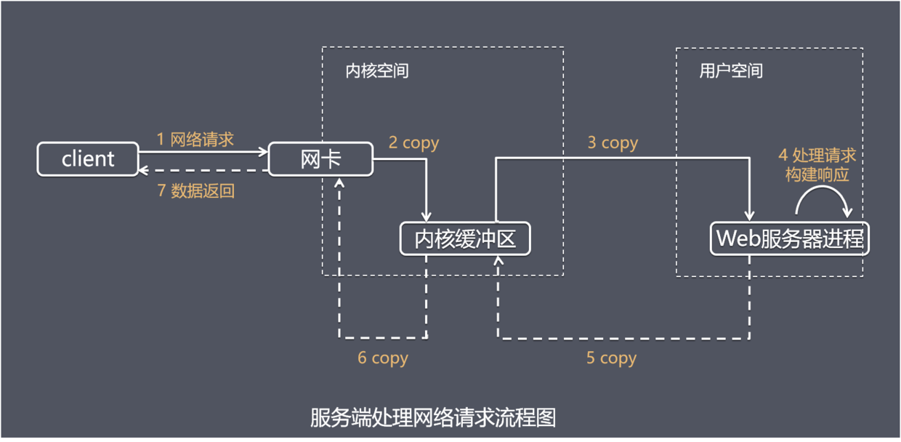
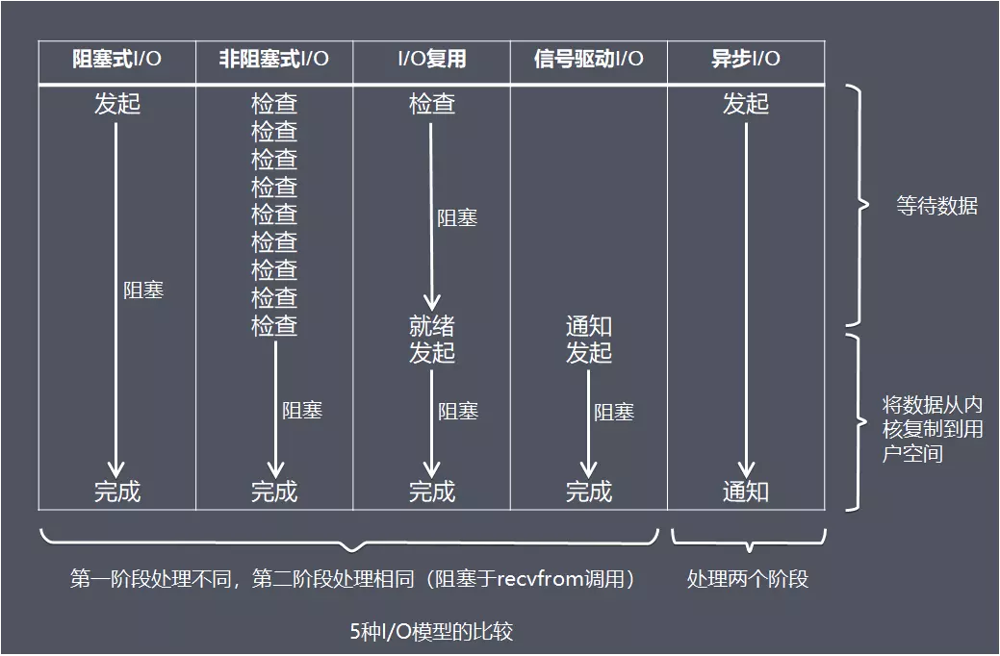

# 操作系统

## 1. ⭐️ 线程、进程、协程的区别

线程是指进程内的一个单元，也是进程内可调度的实体

### 线程与进程的区别

- 拥有资源

  进程是资源分配的基本单位

  线程不拥有资源，但**线程可以访问隶属进程的资源**。

- 调度

  线程是独立调度的基本单位，是进程的一个执行流，是 **CPU 调度和分派的基本单位**，它是比进行更小的、能独立运行的基本单位。

- 系统开销

  由于创建或撤销进程时，**系统都要为之分配或回收资源**，如内存空间、`I/O` 设备等，所付出的开销远大于创建或撤销线程时的开销。

  类似地，在进行进程切换时，涉及当前执行进程 CPU 环境的保存及新调度进度 CPU 环境的设置，而线程切换时只需要保存和设置少量寄存器内容，开销很少。

- 通信

  线程间通信可以通过**直接读写同一进程中的数据** 进行通信，但是进程通信需要借助 IPC。

### 协程与线程的区别

**协程是一种用户态的轻量级线程**，协程的调度完全由用户控制。

协程拥有自己的寄存器上下文和栈。协程切换时，将寄存器上下文和栈保存到其它地方，在切回来的时候，恢复先前保存的寄存器上下文和栈。直接操作栈则基本没有内核切换的开销，可以不加锁的访问全局变量，所以上下文的切换非常快。

1. 一个线程可以多个协程，一个进程也可以单独拥有多个协程
2. 线程进程都是同步机制，而协程则是异步
3. 协程能保留上一次调用时的状态，每次过程重入时，就相当于进入上一次调用的状态。

## 2. ⭐️ 进程间通信方式有哪些

消息队列、共享内存、无名管道、命名管道、信号量、socket

- 父子进程关系管道 pipe

  管道是一种半双工的通信方式，数据只能单向流动，而且只能在具有亲缘关系的进程间使用。进程的亲缘关系通常是指父子进程关系。

- **命名管道 FIFO** 

  命名管道也是半双工的通信方式，但是它**允许无亲缘关系的进程间通信**。

- **消息队列 MessageQueue** 

  消息队列是由消息的链表，存放在内核中并由消息队列标识符标识。

  消息队列克服了信号传递信息少、管道只能承载无格式字节流以及缓冲区大小受限等缺点

- **共享内存** 

  共享内存映射一段能被其它进程所访问的内存，这段共享内存由一个进程创建，但多个进程都可以访问。共享内容是最快的 IPC 方式，它是针对其它进程间通道方式运行效率低而专门设计的。它往往与其它通信机制（如信号量）配合使用，来实习进程间的同步和通信。

- **信号量 Semaphore** 

  信号量是一个计数器，可以用来控制多个进程对共享资源的访问。它常作为一种锁机制，防止某进程正在访问共享数据时，其它进程也访问该资源。因此，主要作为进程间以及同一进程内不同线程之间的同步手段。

- **套接字 Socket** 

  套接字与其它通信机制不同的是，它可用于不同机器间的进程通信。

- **信号 Signal** 

  信号常用于通知接收进程某个事件已经发生。

## 3. 进程调度算法

进程调度：在操作系统中调度是指一种资源分配。

调度算法: 根据系统的资源分配策略所规定的资源分配算法。

操作系统管理了系统的有限资源，当有多个进程(或多个进程发出的请求)要使用这些资源时，因为资源的有限性，必须按照一定的原则选择进程(请求)来占用资源，这就是调度。目的是控制资源使用者的数量,选取资源使用者许可占用资源或占用资源。

进程调度的任务

1. 首先要保存当前的处理机的现场信息。
2. 按某种算法选取进程。调度程序按某种算法选取进程，将其状态改为运行状态，并准备把处理机分配给它。
3. 把处理机分配给进程。将选中进程的进程控制块内有关处理机现场的信息，装入处理机相应的各个寄存器中，使进程控制处理机，让它在上次的断电出恢复。

不同环境的调度算法目标不同，因此需要针对不同环境来讨论调度算法。

### 先来先服务和短作业(进程)优先调度算法

批处理系统没有太多的用户操作，在该系统中，调度算法目标是保证吞吐量和周转时间（从提交到终止的时间）。

- 先来先服务 first-come first-serverd（FCFS）

  非抢占式的调度算法，按照请求的顺序进行调度。

  有利于长作业，但不利于短作业，因为短作业必须一直等待前面的长作业执行完毕才能执行，而长作业又需要执行很长时间，造成了短作业等待时间过长。

- 短作业优先 shortest job first（SJF）

  非抢占式的调度算法，按估计运行时间最短的顺序进行调度。

  长作业有可能会饿死，处于一直等待短作业执行完毕的状态。因为如果一直有短作业到来，那么长作业永远得不到调度。

- 最短剩余时间优先 shortest remaining time next（SRTN）

  最短作业优先的抢占式版本，按剩余运行时间的顺序进行调度。 

  当一个新的作业到达时，其整个运行时间与当前进程的剩余时间作比较。如果新的进程需要的时间更少，则挂起当前进程，运行新的进程。否则新的进程等待。

### 高优先权优先调度算法HPF（Highest Priority First）

为了照顾紧迫型作业，使之在进入系统后便获得优先处理，引入了最高优先权优先(FPF)调度算法。

此算法常被用于批处理系统中，作为作业调度算法，也作为多种操作系统中的进程调度算法，还可用于实时系统中。

当把该算法用于作业调度时，系统将从后备队列中选择若干个优先权最高的作业装入内存。

当用于进程调度时，该算法是把处理机分配给就绪队列中优先权最高的进程，这时，又可进一步把该算法分成如下两种。 

- **非抢占式优先权算法** 

  在这种方式下，系统一旦把处理机分配给就绪队列中优先权最高的进程后，该进程便一直执行下去，直至完成；或因发生某事件使该进程放弃处理机时，系统方可再将处理机重新分配给另一优先权最高的进程。

  这种调度算法主要用于批处理系统中，也可用于某些对实时性要求不严的实时系统中。 

- **抢占式优先权调度算法** 

  在这种方式下，系统同样是把处理机分配给优先权最高的进程，使之执行。

  但在其执行期间，只要又出现了另一个其优先权更高的进程，进程调度程序就立即停止当前进程(原 优先权最高的进程)的执行，重新将处理机分配给新到的优先权最高的进程。

  因此，在采用这种调度算法时，是每当系统中出现一个新的就绪进程 i 时，就将其优先权 Pi 与正在执行的进程 j 的优先权 Pj 进行比较。

  如果 Pi≤Pj，原进程 Pj 便继续执行；但如果是 Pi>Pj，则立即停止 Pj 的执行，做进程切换，使 i 进程投入执行。

  显然，这种抢占式的优先权调度算法能更好地满足紧迫作业的要求，故而常用于要求比较严格的实时系统中，以及对性能要求较高的批处理和分时系统中。

### 高响应比优先调度算法

在批处理系统中，短作业优先算法是一种比较好的算法，其主要不足是长作业的运行得不到保证。

我们为每个作业引入动态优先权，并使作业的优先级随着等待时间的增加而提高，则长作业在等待一定的时间后，必然有机会分配到处理机。

`优先权 = （等待时间 + 服务时间）/  服务时间 `。由于等待时间与服务时间之和就是系统的响应时间，故上式又表示为：`Rp = 响应时间 / 服务时间`。

可以看出随着进程等待时间增长，优先权线性增长，等待足够长时间是一定能获得处理机的；要求服务时间短，优先权线性增长，有利于短作业。进程要求服务时间相同时，等待时间长的优先级高，所以是先来先服务。

### 基于时间片的轮转调度算法

交互式系统有大量的用户交互操作，在该系统中调度算法的目标是快速地进行响应。

- **时间片轮转法** 

  在早期的时间片轮转法中，系统将所有的就绪进程按先来先服务的原则排成一个队列，每次调度时，把CPU 分配给队首进程，并令其执行一个时间片。

  时间片的大小从几 ms 到几百 ms。当执行的时间片用完时，由一个计时器发出时钟中断请求，调度程序便据此信号来停止该进程的执行，并将它送往就绪队列的末尾；然后，再把处理机分配给就绪队列中新的队首进程，同时也让它执行一个时间片。

  这样就可以保证就绪队列中的所有进程在一给定的时间内均能获得一时间片的处理机执行时间。

  换言之，系统能在给定的时间内响应所有用户的请求。

- **多级反馈队列调度算法** 

  前面介绍的各种用作进程调度的算法都有一 定的局限性。如短进程优先的调度算法，仅照顾了短进程而忽略了长进程，而且如果并未指明进程的长度，则短进程优先和基于进程长度的抢占式调度算法都将无法 使用。

  而多级反馈队列调度算法则不必事先知道各种进程所需的执行时间，而且还可以满足各种类型进程的需要，因而它是目前被公认的一种较好的进程调度算法。 

  在采用多级反馈队列调度算法的系统中，调度算法的实施过程如下所述。

  1. 应设置多个就绪队列，并为各个队列赋予不同的优先级。

     第一个队列的优先级最高，第二个队列次之，其余各队列的优先权逐个降低。

     该算法赋予各个队列中进程执 行时间片的大小也各不相同，在优先权愈高的队列中，为每个进程所规定的执行时间片就愈小。

     例如，第二个队列的时间片要比第一个队列的时间片长一倍，……， 第i+1个队列的时间片要比第i个队列的时间片长一倍。 

  2. 当一个新进程进入内存后，首先将它放入第一队列的末尾，按FCFS原则排队等待调度。

     当轮到该进程执行时，如它能在该时间片内完成，便可准备撤离系统；如果它在一个时间片结束时尚未完成，调度程序便将该进程转入第二队列的末尾，再同样地按FCFS原则等待调度执行；如果它在第二队列中运行一个时间片后仍未 完成，再依次将它放入第三队列，……，如此下去，当一个长作业(进程)从第一队列依次降到第n队列后，在第n 队列便采取按时间片轮转的方式运行。

  3. 仅当第一队列空闲时，调度程序才调度第二队列中的进程运行；仅当第1～(i-1)队列均空时，才会调度第i队列中的进程运行。

     如果处理机正在第i队列中为 某进程服务时，又有新进程进入优先权较高的队列(第1～(i-1)中的任何一个队列)，则此时新进程将抢占正在运行进程的处理机，即由调度程序把正在运行的进程放回到第i队列的末尾，把处理机分配给新到的高优先权进程。

## 4. ⭐️ 死锁和处理方法

### 死锁的必要条件

Java 死锁的条件也是这些，引申到 Java 并发

1. 互斥条件

   一个资源每次只能被一个进程使用，即在一段时间内某资源仅为一个进程所使用。

   此时如果有其他进程请求该资源，则请求进程只能等待。

2. 请求与保持条件

   一个进程因请求资源而阻塞时，对已获得的资源保持不放。

   进程中已经保持了至少一个资源，但又提出了新的资源请求，而该资源已经被其他进程占有，此时请求进程被阻塞，但对自己已经获得资源保持不放。

3. 不剥夺条件

   进程已获得的资源，在末使用完之前，不能强行剥夺。

   进程未使用完的资源在未使用完毕之前，不能被其他进程强行夺走，即只能由获得该资源的进程自己来释放。

4. 循环等待条件

   若干进程之间形成一种头尾相接的循环等待资源关系。

   在发生死锁时必然存在一个进程等待队列{P1，P2，…,Pn},其中P1等待P2占有的资源，P2等待P3占有的资源，…，Pn等待P1占有的资源，形成一个进程等待环路，环路中每一个进程所占有的资源同时被另一个申请。

这四个条件是死锁的必要条件，只要系统发生死锁，这些条件必然成立，而只要上述条件之
一不满足，就不会发生死锁。

### 处理方法 

- 鸵鸟策略

  处理死锁的办法仅仅是忽略它

- 死锁检测与恢复

  不试图阻止死锁，而是当检测到死锁发生时，采取措施进行恢复，利用抢占恢复、回滚恢复，通过杀死进程恢复。

- 死锁预防

  破坏死锁必要条件

  1. 破坏“互斥”条件

     资源互斥是固有特性无法改变的。

  2. 破坏“请求与保持”条件

     方法一：静态分配，每个进程在开始执行时就申请他所需要的全部资源。

     方法二：动态分配，每个进程在申请所需要的资源时他本身不占用系统资源。

  3. 破坏“不可剥夺”条件

     一个进程不可获得其所需要的全部资源便处于等待状态，等待期间他占用的资源将被隐式的释放重新加入到系统的资源列表中，可以被其他进程使用，而等待的进程只有重新获得自己原有的资源以及新申请的资源才可以重新启动，执行。

  4. 破坏“循环等待”条件

     采用资源有序分配的基本思想，对系统中的资源顺序进行编号，将紧缺的、稀少的资源采用较大的编号，申请资源时必须按照编号的顺序执行，一个进程只有较小编号的进程才能申请较大编号的进程。

- 死锁的避免

  系统对进程发出每一个系统能够满足的资源申请进行动态检查，并根据检查结果决定是否分配资源，如果分配后系统可能发生死锁，则不予分配，否则分配。

  这是一种动态策略。典型的避免死锁的算法是银行家算法。

死锁的预防和避免都属于事先预防策略。

其中预防死锁的限制条件较为严格，实现起来较为简单，但往往导致资源利用率低。

避免死锁的限制条件相对宽松，资源分配后需要通过算法来判断是否进入不安全状态，实现起来较为复杂。

### 什么是活锁 

活锁、死锁本质上是一样的，原因是在获取临界区资源时，并发多个进程/线程声明资源占用(加锁)的顺序不一致。死锁是加不上就死等，活锁是加不上就放开已获得的资源重试，其实单机场景活锁不太常见。

举个例子资源A和B，进程P1和P2，

start：

P1 lock A

P2 lock B

P1 lock B fail context switch

P2 lock A fail context switch

P1 release A

P2 release B

goto start

单个 core 时如果调度的不好还是有可能出现的，多 core 情况下，冲突窗口很小，很难出现两个进程的节奏碰的这么巧。

但是在分布式场景下，由于加锁失败而要释放已获得的资源再重试，这个过程涉及网络通信，冲突窗口变大，使得活锁出现概率也变大。

比如 paxos 的 prepare 和 accept，两个并发提案P1和P2，P2用更大 proposal id 的 prepare 形成多数派，将使得之前已经 prepare 成功的 P1 无法 accept。P1 只能用更更大的 proposal id 重试，而使得 P2 又无法 accept。

把 prepare和 accept 看做两个资源 A 和 B, 每个提案都是按 BAB 的顺序获取资源(因为 prepare 阶段的应答蕴含了对 accept增加了限制)，过程中存在 BA 和 AB 两种资源获取顺序，是典型的活锁场景。

## 5. ⭐️ 内存管理

[理解 Linux 的虚拟内存](https://www.cnblogs.com/zhenbianshu/p/10300769.html) 

### linux采用虚拟内存技术

虚拟内存、物理内存、页表、内存管理单元

操作系统将内存抽象成地址空间。每个程序拥有自己的地址空间，这个地址空间被分割成多个块，每一块称为一页。这些页被映射到物理内存的同时，必须把页码和存放该页映像的页框码填入一个叫做页表的表项中。其中，页表的表项中设置一些访问控制字段，用于指明对应页面中的内容允许何种操作，从而禁止非法访问。

内存管理单元(MMU)管理着虚拟内存的地址和物理内存的转换，其中的页表(Page Table)存储者页（程序地址空间）和叶框（物理内存空间）的映射表。

**虚拟内存的作用** 

1. 内存完整性

   每个进程都认为自己获取的内存是一块连续地址

2. 安全

   操作系统在页表的各个项目上添加各种访问权限标识位，就可以实现内存的权限控制。

3. 数据共享

   通过虚拟内存更容易实现内存和数据的共享

4. SWAP

   虚拟内存可以帮进程“扩充”内存。

   Linux 提出 SWAP 的概念，Linux 中可以使用 SWAP 分区，在分配物理内存，但可用内存不足时，将暂时不用的内存数据先放到磁盘上，让有需要的进程先使用，等进程再需要使用这些数据时，再将这些数据加载到内存中，通过这种”交换”技术，Linux 可以让进程使用更多的内存。

#### 请页和交换

##### 请页 

当处理器试图访问一个虚存页面时，首先到页表中去查询该页是否已映射到物理页框中，并记录在页表中。如果在，则MMU会把页码转换成页框码，并加上虚拟地址提供的页内偏移量形成物理地址后去访问物理内存；如果不在，则意味着该虚存页面还没有被载入内存，这时MMU就会通知操作系统：发生了一个页面访问错误（页面错误），接下来系统会启动所谓的“请页”机制，即调用相应的系统操作函数，判断该虚拟地址是否为有效地址。

如果是有效的地址，就从虚拟内存中将该地址指向的页面读入到内存中的一个空闲页框中，并在页表中添加上相对应的表项，最后处理器将从发生页面错误的地方重新开始运行；如果是无效的地址，则表明进程在试图访问一个不存在的虚拟地址，此时操作系统将终止此次访问。

##### 交换(SWAP)

在请页成功之后，内存中已没有空闲物理页框了。

这时系统必须启动所谓地“交换”机制，即调用相应的内核操作函数，在物理页框中寻找一个当前不再使用或者近期可能不会用到的页面所占据的页框。

找到后，就把其中的页移出，以装载新的页面。

对移出页面根据两种情况来处理：如果该页未被修改过，则删除它；如果该页曾经被修改过（“脏”页），则系统必须将该页写回辅存。

#### 页面置换算法

页面置换算法，就是要选出最合适的一个物理页框，将其淘汰或者存储到磁盘，使得置换的效率最高。

置换算法

1. 最佳置换算法 OPT
2. 先进先出算法 FIFO
3. 近期最久未用过算法 LRU（最常问，可以刷leetcode相关题目）
4. CLOCK 置换算法 NRU
5. 页面缓冲算法 PBA
6. 近期最少使用算法 LFU

页面置换算法和缓存淘汰策略类似，可以将内存看成磁盘的缓存。在缓存系统中，缓存的大小有限，当有新的缓存到达时，需要淘汰一部分已经存在的缓存，这样才有空间存放新的缓存数据。

页面置换算法的主要目标是使页面置换频率最低（也可以说缺页率最低）。

LRU 缓存淘汰算法为了实现 LRU需要在内存中维护一个所有页面的链表。

[Leetcode 中有一道实现 LRU 的题](https://leetcode-cn.com/problems/lru-cache/solution/lruhuan-cun-ji-zhi-by-leetcode-solution/)，利用 HashMap + 双向链表，map 的 key 值表示着链表中每个节点的位置

当一个页面被访问时，将这个页面转移到链表表头，这样就能保证链表表尾的页面是最久未访问的。

#### 加快分页进程

如何提高虚拟和物理地址映射的速度？快表

系统一旦访问了某一个页，那么系统就会在一段时间内稳定地工作在这个页上。所以，为了提高访问页表的速度，系统还配备了一组正好能容纳一个页表的**硬件寄存器**，这样当系统再访问虚存时，就首先到这组硬件寄存器中去访问，系统速度就快多了。这组**存放当前页表的寄存器叫做快表**。

如果页表很大怎么解决？

采用多级页表，对页表也进行分也存储，在程序运行时只要把需要的页复制到内存，而暂时不需要的页就让它留在辅存中。

### 分页与分段的比较

#### 分页存储管理

用户程序的地址空间被划分成若干固定大小的区域，称为“页”，相应地，内存空间分成若干个物理块，页和块的大小相等。可将用户程序的任一页放在内存的任一块中，实现了离散分配。

##### 页表

分页系统中，允许将进程的每一页离散地存储在内存的任一物理块中，为了能在内存中找到每个页面对应的物理块，系统为每个进程建立一张页面映射表，简称页表。页表的作用是实现从页号到物理块号的地址映射。

#### 分段存储管理

将用户程序地址空间分成若干个大小不等的段，每段可以定义一组相对完整的逻辑信息。存储分配时，以段为单位，段与段在内存中可以不相邻接，也实现了离散分配。

#### 分页与分段的区别

分页和分段有许多相似之处,比如两者都不要求作业连续存放.但在概念上两者完全不同,主要表现在以下几个方面:

1. **页是信息的物理单位**，分页是为了实现非连续分配，以便解决内存碎片问题，或者说分页是由于系统管理的需要。

   **段是信息的逻辑单位**，它含有一组意义相对完整的信息，分段的目的是为了更好地实现共享，满足用户的需要.

2. 出现的原因

   分页主要用于实现虚拟内存，从而获得更大的地址空间；

   分段主要是为了使程序和数据可以被划分为**逻辑上独立的地址空间并且有助于共享和保护**。

3. 页的大小固定，由系统确定，将逻辑地址划分为页号和页内地址是由机器硬件实现的。

   而段的长度却不固定，决定于用户所编写的程序，通常由编译程序在对源程序进行编译时根据信息的性质来划分。

4. 分页的作业地址空间是一维的，分段的地址空间是二维的。
5. 对程序员的透明性。分页透明，但是分段需要程序员显式划分每个段。

## 6. ⭐️ `IO` 管理

[高性能网络模型学习](https://liu-yt.github.io/2019/07/09/%E9%AB%98%E6%80%A7%E8%83%BD%E7%BD%91%E7%BB%9C%E6%A8%A1%E5%9E%8B%E5%AD%A6%E4%B9%A0/) 

### 网络请求处理过程

第一步通常涉及等待数据从网络中到达。当所等待的数据到达时，它被复制到内核中的某个缓冲区。第二步就是把数据从内核缓冲区复制到应用进程缓冲区。

主要步骤：

- `获取请求数据` 客户端与服务器建立链接发出请求，服务器接收请求（1-3）
- `构建响应` 当服务器接收完请求，并在用户空间处理客户端的请求，直到构建响应完成（4）
- `返回数据` 服务器将已构建好的响应再通过内核空间的网络I/O发还给客户端（5-7）

设计服务端并发模型时，主要有如下两个关键点：

- 服务器如何管理连接，获取输入数据
- 服务器如何处理请求

### `IO` 模型（与 Java 的 `IO`、`NIO`、`AIO` 一起学习）

1. 阻塞式 `I/O` 模型

   应用进程被阻塞，直到数据从内核缓冲区复制到应用进程缓冲区中才返回。

2. 非阻塞式 `I/O` 模型

   应用进程可以继续执行，但是需要不断地执行系统调用来获知 `I/O` 是否完成，这种方式被称为轮询(Polling)。

3. `I/O` 复用(select、poll、epoll)

   单个进程具有处理多个 `I/O` 事件的能力(Java 中 `NIO` 的能力)

4. 信号驱动式 `I/O` (SIGIO) 

   内核在数据到达时向应用进程发送 SIGIO 信号

5. 异步 `I/O` (`AIO`) 

   内核完成所有操作后向应用进程发送信号。

   Linux 2.6 才引入，目前 `AIO` 并不完善。因此，在 Linux 下实现高并发网络编程时都是以 `IO` 复用模型模式为主。

可从上图看出，越往后阻塞越少，理论上效率也最优。

这五种 I/O 模型中，前四种属于同步 I/O ，因为其中真正的 I/O 操作(recvfrom)将阻塞进程/线程，只有异步 I/O 模型才于[POSIX定义](用程序告知内核启动某个操作，并让内核在整个操作( 包括将数据从内核拷贝到应用程序的缓冲区)完成后通知应用程序)的异步 I/O 相匹配。

##### 引申：Java 的 `NIO` 为什么是同步的

### `IO` 复用技术

多个描述符的 `I/O` 操作都能在一个线程内并发交替地完成，这就叫 `I/O` 多路复用。这里的“复用”指的是复用同一个进程/线程。

1. select

   `int select(int nfds, fd_set *readfds, fd_set *writefds, fd_set *exceptfds, struct timeval *timeout);` 

   有三种类型的描述符：readset、writeset、excepts。分别对应读、写、异常条件的描述符集合，底层是数组实现。

2. poll

   `int poll(struct pollfd *fds, nfds_t nfds, int timeout);` 

   pollfd：链表实现

3. epoll

   poll_ctl() 用于向内核注册新的描述符或者是改变某个文件描述符的状态。已注册的描述符在内核中会被维护在一颗红黑树上，通过回调函数内核会将 `I/O` 准备好的描述符加入到一个链表中管理，进程调用 epoll_wait() 便可以得到事情完成的描述符。

   工作模式

   1. LT（电平触发）：当 epoll_wait() 检测到描述符的事件到达时，将此事件通知进程，进程可以不立即处理该事件，下次调用 epoll_wait() 会再次通知进程
   2. ET（边缘触发）：通知之后进程必须立即处理事件，减少了同一事件的触发次数，效率更高。
   3. 相对于 select 和 poll，epoll 最大的优势是采用回调的方式检测就绪实现，不需要遍历，时间复杂度为 `O(1)`。

select 和 poll 二者的区别

1. 都是采用轮询的方式去处理

2. 本质区别就是对于描述符数据结构的定义。select 是用三个事件类型，一个数组；poll 只有一个链表，每个节点含有描述和事件定义

3. select 的描述符类型使用数组实现，FD_SETSIZE 大小默认为 1024，因此默认只能监听 1024 个描述符；

   poll 的描述符类型使用链表实现，没有描述符数量的限制。而且 poll 提供了更多的事件类型，并且对描述符的重复利用上比 select 高。

