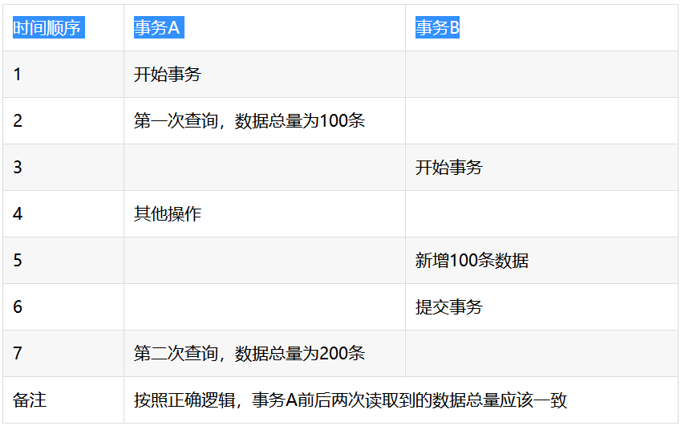
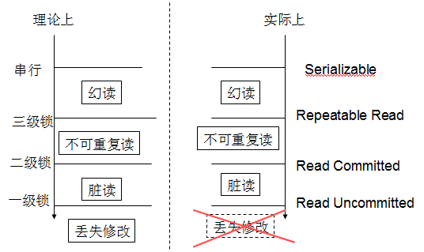
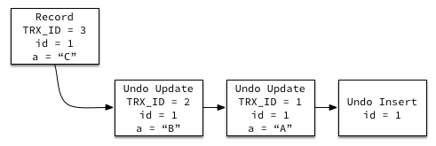
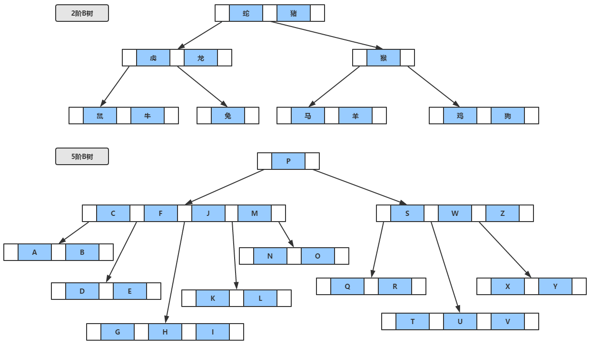
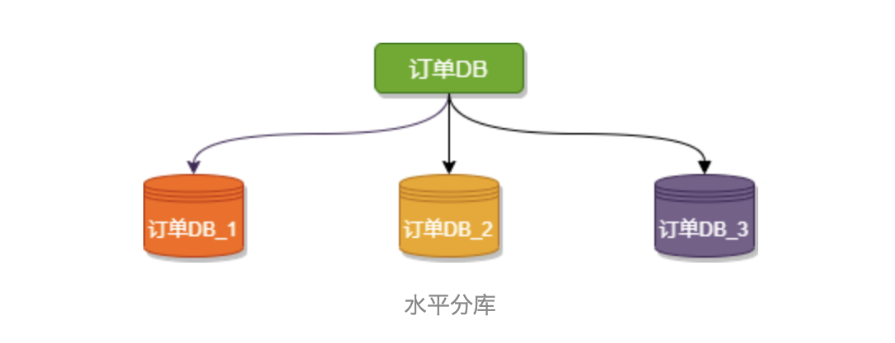
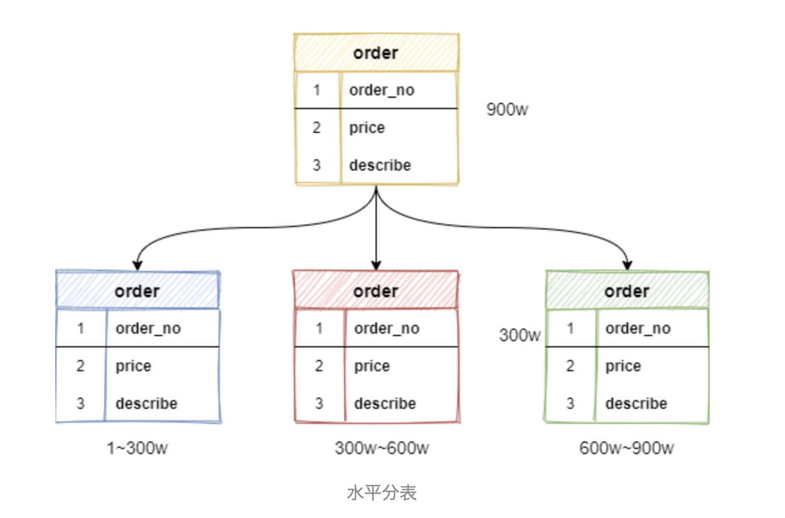
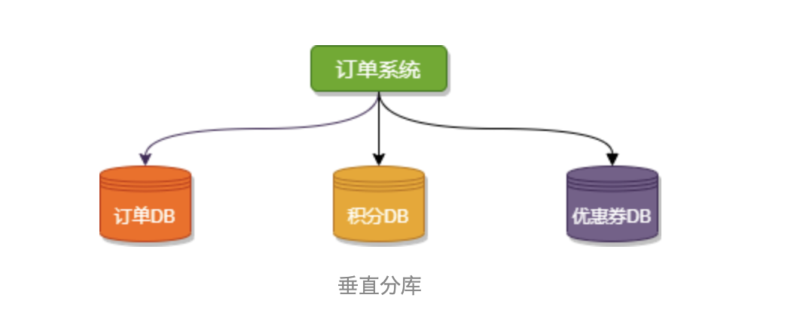
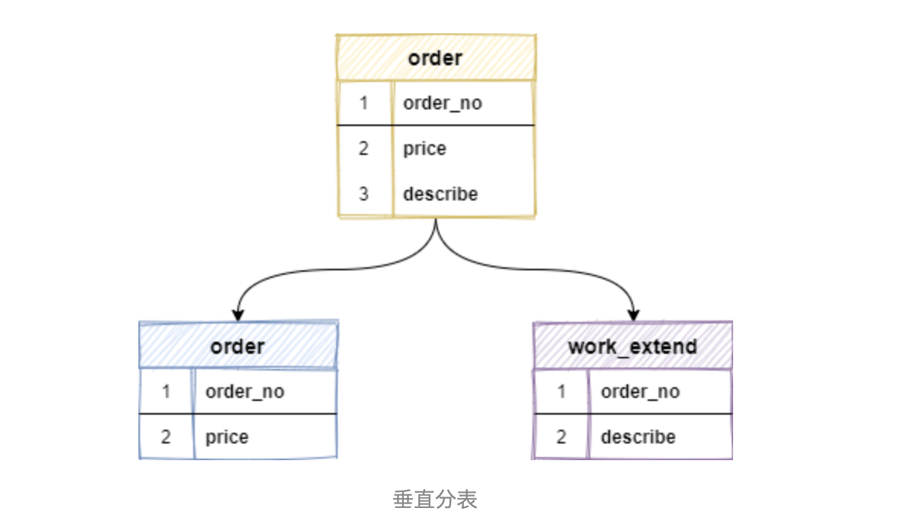
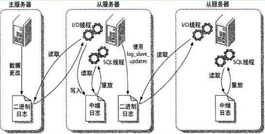

# 数据库

推荐书籍：《MySQL 必知必会》、《MySQL 技术内幕：InnoDB 存储引擎》

书籍重点划分：https://www.bilibili.com/video/BV1CJ411t7Ku

## 1. ⭐️ 数据库 ACID 特性

- **原子性(Atomicity)** 

  **事务被视为不可不可分割的最小单元，事务的所有操作要么全部提交成功、要么全部失败回滚**。

  回滚可以用回滚日志来实现，回滚日志记录着事务所执行的修改操作，在回滚时反向执行这些修改操作即可。

- **一致性(Consistency)** 

  **数据库在事务执行前后都保持一致性状态**。在一致性状态下，**所有事务对一个数据的读取结果都是相同的**。

- **隔离性(Isolation)** 

  **一个事务所作的修改在最终提交以前，对其它事务都是不可见的**。

- **持久性(Durability)** 

  **一旦事务提交，则其所做的修改将会永远保存在数据库中**。

  即使系统发生崩溃，事务执行的结果也不能丢失。


## 2. ⭐️ 四大隔离级别以及不可重复读和幻影读出现的原因

### 隔离级别

- **01 Read uncommitted**：最低级别，任何情况都会发生。

  打个比方，公司发工资了，领导把5000元打到singo的账号上，但是该事务并未提交，而singo正好去查看账户，发现工资已经到账，是5000元整，非常高 兴。可是不幸的是，领导发现发给singo的工资金额不对，是2000元，于是迅速回滚了事务，修改金额后，将事务提交，最后singo实际的工资只有 2000元，singo空欢喜一场。

  出现上述情况，即我们所说的脏读 ，两个并发的事务，“事务A：领导给singo发工资”、“事务B：singo查询工资账户”，事务B读取了事务A尚未提交的数据。

- **02 Read committed**：避免脏读的发生。

  打个比方，singo拿着工资卡去消费，系统读取到卡里确实有2000元，而此时她的老婆也正好在网上转账，把singo工资卡的2000元转到另一账户，并在 singo之前提交了事务，当singo扣款时，系统检查到singo的工资卡已经没有钱，扣款失败，singo十分纳闷，明明卡里有钱，为何......

  出现上述情况，即我们所说的**不可重复读** ，两个并发的事务，“事务A：singo消费”、“事务B：singo的老婆网上转账”，事务A事先读取了数据，事务B紧接了更新了数据，并提交了事务，而事务A再次读取该数据时，数据已经发生了改变。

  当隔离级别设置为Read committed 时，避免了脏读，但是可能会造成不可重复读。

  **大多数数据库的默认级别就是Read committed，比如Sql Server , Oracle**。

- **03 Repeated read**（可重复读）：避免脏读、不可重复读的发生。

  在对于数据库中的某个数据，一个事务范围内多次查询却返回了不同的数据值，这是由于在查询间隔，被另一个事务修改并提交了。

  当隔离级别设置为Repeatable read 时，可以避免不可重复读。当singo拿着工资卡去消费时，一旦系统开始读取工资卡信息（即事务开始），singo的老婆就不可能对该记录进行修改，也就是singo的老婆不能在此时转账。

  虽然Repeatable read避免了不可重复读，但还有可能出现**幻读** 。

  singo的老婆工作在银行部门，她时常通过银行内部系统查看singo的信用卡消费记录。有一天，她正在查询到singo当月信用卡的总消费金额 （select sum(amount) from transaction where month = 本月）为80元，而singo此时正好在外面胡吃海塞后在收银台买单，消费1000元，即新增了一条1000元的消费记录（insert transaction ... ），并提交了事务，随后singo的老婆将singo当月信用卡消费的明细打印到A4纸上，却发现消费总额为1080元，singo的老婆很诧异，以为出 现了幻觉，幻读就这样产生了。

  **注：Mysql的默认隔离级别就是Repeatable read**。

- 04 **Serializable**（串行化）：避免脏读、不可重复读、幻读的发生。

  代价花费最高、性能很低，一般很少使用。

  在该级别下，事务顺序执行，不仅可以避免脏读、不可重复读，还避免了幻读。


### 脏读、不可重复读、幻读

- **脏读(dirty read)** 

  **读取未提交数据**。

  A 事务读取 B 事务尚未提交的更改数据，并在这个数据基础上操作。

  如果 B 事务回滚，A 事务读到的数据根本不是合法的，称为脏读。

  在 oracle 中，由于有 version 控制，不会出现脏读。

  

- **不可重复读(unrepeatable read)** 

  前后多次读取，数据**内容**不一致。

  A 事务读取了 B 事务已经提交的**更改**数据。

  比如 A 事务第一次读取数据，然后 B 事务更改该数据并提交，A 事务再次读取数据，两次读取的数据不一样。

  

- **幻读(phantom read)** 

  前后多次读取，数据**总量**不一致。

  A 事务读取了 B 事务已经提交的**新增或删除**数据。

  这两种情况的对策是不一样的，**对于不可重复读，只需要采取行级锁防止该记录数据被更改，然而对于幻读必须加表级锁，防止在这个表中新增或删除一条数据**。

  


## 3. 封锁的粒度、锁的类型、MVCC

### 封锁粒度

MySQL 中提供了两种封锁粒度：行级锁以及表级锁。

在选择封锁粒度时，需要权衡锁开销和并发程度。

应该尽量只锁定需要修改的那部分数据，而不是所有的资源。在给定的资源上，锁定的数据量越少，发生锁争用的可能性就越小，**系统的并发程度就越高**。

但是加锁需要消耗资源，锁的各种操作（包括获得锁、释放锁、检查锁是否已经解除）都会增加系统开销。因此**封锁粒度越小，系统开销就越大**。


### 三级封锁协议（理论上的）

> 基本的封锁类型有两种：排它锁(X锁)和共享锁(S锁)。
>
> X锁：事务T对数据A加上X锁时，允许事务T读取和修改数据A,。
>
> S锁：事务T对数据A加上S锁时，其他事务只能再对数据A加S锁，而不能加X锁，直到T释放A上的S锁。
>
> 若事务T对数据对象A加了S锁，则T就可以对A进行读取，但不能进行更新(S锁因此又称为读锁)。
>
> 在T释放A上的S锁以前，其他事务可以再对A加S锁，但不能加X锁，从而可以读取但不能更新A。

1. 一级封锁协议：事务T中如果对数据R有写操作，必须在这个事务中对R的第一次读操作前对它加X锁，直到事务结束才释放。

   事务结束包括正常结束（COMMIT）和非正常结束（ROLLBACK）。

2. 二级封锁协议：一级封锁协议加上事务T在读取数据R之前必须先对其加S锁，读完后方可释放S锁。 

3. 三级封锁协议 ：一级封锁协议加上事务T在读取数据R之前必须先对其加S锁，直到事务结束才释放。


但三级封锁协议有个非常致命的地方，一级锁协议就要在第一次读加x锁，直到事务结束。几乎就要在整个事务加写锁了，效率非常低。

三级封锁协议只是一个理论上的东西，实际数据库常用==隔离协议==来解决事务并发问题。




### 数据操作类型分锁

#### 读写锁 （行级锁）

排它锁(Exclusive)，简写为 X 锁，又称写锁。

共享锁(Shared)，简写为 S 锁，又称读锁。

在存在行级锁和表级锁的情况下，事务 T 想要对表 A 加 X 锁，就需要先检测是否有其它事务对表 A 或者表 A 中的任意一行加了锁，那么就需要对表 A 的每一行都检测一次，这是非常耗时的。

#### 意向锁 

InnoDB 支持`多粒度锁（multiple granularity locking）`，它允许`行级锁`与`表级锁`共存，而**意向锁**就是其中的一种`表锁`。

[意向锁](https://juejin.cn/post/6844903666332368909) 是一种**不与行级锁冲突**的表级锁，**它不会与行级的共享 / 排他锁互斥**。

- 意向共享锁（intention shared lock, **IS**）：事务有意向对表中的某些行加共享锁（S锁）

  ```markdown
  -- 事务要获取某些行的 S 锁，必须先获得表的 IS 锁。
  SELECT column FROM table ... LOCK IN SHARE MODE;
  ```

- 意向排他锁（intention exclusive lock, **IX**）：事务有意向对表中的某些行加排他锁（X锁）

  ```markdown
  -- 事务要获取某些行的 X 锁，必须先获得表的 IX 锁。
  SELECT column FROM table ... FOR UPDATE;
  ```

即：`意向锁是有数据引擎自己维护的，用户无法手动操作意向锁`，在为数据行加共享 / 排他锁之前，InooDB 会先获取该数据行所在在数据表的对应意向锁。

在原来的 X/S 锁之上又引入了 IX/IS，用来表示一个事务想要在表中的某个数据行上加 X 锁或 S 锁。

有以下两个规定：

1. 一个事务在获得某个数据行对象的 S 锁之前，必须先获得表的 IS 锁或者更强的锁；
2. 一个事务在获得某个数据行对象的 X 锁之前，必须先获得表的 IX 锁。

通过引入意向锁，事务 T 想要对表 A 加 X 锁，只需要先检测是否有其它事务对表 A 加了 X/IX/S/IS 锁，如果加了就表示其它事务正在使用这个表或则会表中某一行的锁，因此事务 T 加 X 锁失败。

#### 悲观锁和乐观锁 

悲观锁，指的是对数据被外界（包括本系统当前的其他事务，以及来自外部系统的事务处理）修改持保守态度。因此，**在整个数据处理过程中，将数据处于锁定状态**。悲观锁的实现，往往**依靠数据库提供的[锁机制](https://www.huaweicloud.com/articles/9611a42cb1c711456e55cf1ff012de4a.html)**。

乐观锁，假设数据一般情况下不会造成冲突，所以只会在数据进行提交更新的时候，才会正式对数据的冲突与否进行检测。如果发现冲突了，则返回数据错误的信息，让用户决定如何去做。乐观锁的实现依靠使用版本号。当我们提交更新的时候，判断数据库表对应记录的当前版本信息与第一哦取出来的 version 值进行对比，如果数据库表当前版本号与第一次取出来的 version 值相等，则予以更新；否则认为是过期数据。实际就是并发控制中的 [CAS](当多个线程尝试使用CAS同时更新同一个变量时，只有其中一个线程能更新变量的值，而其它线程都失败，失败的线程并不会被挂起，而是被告知这次竞争中失败，并可以再次尝试。CAS有3个操作数，内存值V，旧的预期值A，要修改的新值B。当且仅当预期值A和内存值V相同时，将内存值V修改为B，否则什么都不做。) 理论。


### MVCC

[MVCC 版本控制协议](https://www.cnblogs.com/aspirant/p/6920987.html) 

多版本并发控制(Multi-Version Concurrency Control ) 是 MySQL 的 [InnoDB 存储引擎](MySQL的数据库引擎之一，现为MySQL的默认存储引擎，为MySQL AB发布binary的标准之一) 实现隔离级别的一种具体方式，用于实现**提交读和可重复读这两种隔离级别**。

而 未提交隔离级别 总是读取最新的数据行，无需使用 MVCC；可串行化隔离级别 需要对所有读取的行都加锁，单纯使用 MVCC 无法实现。

实现了对读的非阻塞，读不加锁，读写不冲突。缺点是每行记录都需要额外的存储空间，需要进行更多的行维护和检查工作。


### 主要存储结构和实现过程

- 版本号

  系统版本号：是一个递增的数字，每开始一个事务，系统版本号就会自动递增。

  事务版本号：事务开始时的系统版本号。

- 隐藏的列

  MVCC 在每行记录后面都保存着两个隐藏的列，用来存储两个版本号。

  创建版本号：指示创建一个数据行的快照时的系统版本号。

  删除版本号：如果该快照的删除版本号大于当前事务版本号，则表示该快照有效，否则表示该快照已经被删除了。

- Undo 日志

  MVCC 使用到的快照存储在 Undo 日志中，该日志通过回滚指针把一个数据行(Record) 的所有快照连接起来。

  

- 实现过程

  以下实现过程针对 可重复读隔离级别。

  当开始一个新事务时，**该新事务的版本号肯定会大于当前所有数据行快照的创建版本号**，理解这一点很关键。

  1. SELECT

     多个事务必须读取到同一个数据行的快照，并且这个快照是距离现在最近的一个有效快照。

     但也有例外，如果有一个事务正在修改该数据行，那么它可以读取事务本身所做的修改，而不用和其它事务的读取结果一致。

     把没有对一个数据行做修改的事务称为 T，T 所要读取的数据行快照的**创建版本号必须小于** T 的版本号。因为如果大于或者等于 T 的版本号，那么bails该数据行快照是其它事务的最新修改，因此不能去读取它。除此之外，T 所要读取的数据行快照的**删除版本号必须大于** T 的版本号，因为如果小于或等于 T 的版本号，那么表示该数据行快照是已经被删除的，不应该去读取它。

  2. INSERT

     将当前系统版本号作为数据行快照的创建版本号

  3. DELETE

     将当前系统版本号作为数据行快照的删除版本号

  4. UPDATE

     将当前系统版本号作为**更新前的数据行快照的删除版本号**，并将当前系统版本号作为**更新后的数据行快照的创建版本号**。可以理解为先执行 DELETE 后执行 INSERT。


## 4. ⭐️ B/B+Tree 原理、与其它查找树的比较

[MySQL索引底层实现原理](https://www.cnblogs.com/boothsun/p/8970952.html) 

数据库索引树存储在磁盘上的，当数据量大时，就不能把整个索引全部加载到内存了，只能逐一加载每一个磁盘页（对应索引树的节点）。所以要减少 `IO` 次数，对于树来说，`IO` 次数就是树的高度，而“矮胖”就是B树的特征之一，它的每一个节点最多包括 m 个子树，m 被称为B树的阶，m 的大小取决于磁盘页的大小。

m阶B树满足以下条件：

- 每个节点至多可以拥有 m 棵子树。
- 根节点，只有至少有2个节点（要么极端情况，就是一棵树就一个根节点，单细胞生物，即是根，也是叶，也是树)。
- 非根非叶的节点至少有的 `Ceil(m/2)` 个子树(Ceil表示向上取整，5阶B树每个节点至少有3个子树，也就是至少有3个叉)。
- 非叶节点中的信息包括[n,A0,K1,A1,K2,A2,…,Kn,An]，，其中n表示该节点中保存的关键字个数，K为关键字且Ki<Ki+1，A为指向子树根节点的指针。
- 从根到叶子的每一条路径都有相同的长度，也就是说，叶子节在相同的层，并且这些节点不带信息，实际上这些节点就表示找不到指定的值，也就是指向这些节点的指针为空。


### B树🌲

- 关键字（包括数据）集合分布在整棵树中；
- 任何一个关键字出现且只出现一在一个节点中；
- 搜索有可能在非叶子节点结束；
- 搜索性能等驾驭在关键字全集内做一次二分查找。




### B+树🌲

- 关键字不保存数据，只用来索引，所有数据都保存在叶子节点（B树树每个关键字都保存数据）；
- 所有的叶子节点中包含了全部关键字的信息，以及指向含这些关键字记录的指针，且叶子节点本身依关键字的大小 自小而大 顺序链接；
- 所有的非叶子节点可以看成是索引部分，节点中仅含其子树中的最大（或最小）关键字。通常在 B+ 树上有两个头指针，一个指向根节点，一个指向关键字最小的叶子节点。
- 同一个数字会在不同节点中重复出现，根节点的最大元素就是 B+ 树的最大元素。


### B+树🌲相比于B树🌲的查询优势

1. B+ 树空间利用率高，可以减少 `IO` 次数

   一般来说，索引本身也很大，不可能全部存储在内存中，因此索引往往以索引文件的形式存储在磁盘上。这样的话，索引查找过程中就要产生磁盘 `I/O` 消耗。而因为 B+ 树的内部节点只是作为索引使用，而不像 B- 树那样每个节点都需要存储硬盘指针。

   也就是说 B+ 树中**每个非叶节点没有指向某个关键字具体信息的指针**，所以每个节点可以存放更多的关键字数量，即**一次性读入内存所需要查找非关键字也就越多**，减少了 `I/O` 操作。

   e.g. 假设磁盘中的一个盘块容纳 16 bytes，而一个关键字 2 bytes，一个关键字具体信息指针 2 bytes。

   一颗 9阶 B-tree（一个节点最多 8 个关键字）的内部节点需要两个盘块；而 B+tree 内部节点只需要 1 个盘块。

   当需要把内部节点读入内存时，B-tree就比 B+tree 多一次盘块查找时间（在磁盘中是盘片旋转的时间）。

2. 增删文件（节点）时效率更高

   因为 B+ 树的叶子节点包含所有关键字，并以有序的链表结构存储，这样可以很好提供增删效率，基于范围查询更好。

3. B+ 树的查询效率更加稳定

   因为 B+ 树的每次查询过程中，都需要遍历从根节点到叶子节点的某条路径。**所有关键字的查询路径长度相同，导致每一次查询的效率相当**。


### 与红黑树的比较

红黑树等平衡树也可以用来实现索引，但是文件系统和数据库系统普遍采用 B+ Tree 作为索引结构，主要有以下两个原因：

1. 更少的查找次数

   平衡树查找操作的时间复杂度和树高 h 相关，`O(h) = O(logdN)` 其中 d 为每个节点的出度。红黑树出度为 2，而 B+ Tree 的出度一般都非常大，所以红黑树的树高 h 很明显比 B+ Tree 大非常多，查找的次数也就更多。

2. 利用磁盘预读特性

   为了减少磁盘 `I/O` 操作，磁盘往往不是严格按需读取，而是每次都会预读。预读过程中，磁盘进行顺序读取，顺序读取不需要进行磁盘寻道，并且只需要很短的旋转时间，速度会非常快。

   操作系统一般将内存和磁盘分割成固定大小的块，每一块称为一页，内存与磁盘以页为单位交换数据。数据库系统将索引的一个节点的大小设置为页的大小，使得一次 `I/O` 就能完全载入一个节点。并且可以利用预读特性，邻近的节点也能够被预先载入。 


## 5. B+树索引和 hash 索引的比较（数据结构角度看索引）

B+ 树索引和哈希索引的明显区别是：

1. **等值查询** 

   如果是等值查询，那么哈希索引有绝对优势。因为只需要经过一次算法即可找到相应的键值；当然有一个前提，键值都是唯一的。如果键值不是唯一的，就需要先找到该键所在的位置，然后再根据链表往后扫描，直到找到相应的数据。

2. **范围检索** 

   如果说范围查询检索，原先是有序的键值，经过哈希算法后，有可能变成不连续的了，就没办法再利用索引完成范围检查检索；同理，哈希索引也没办法利用索引完成排序，以及 `like 'xxx%'` 这样的部分模糊查询（这种部分模糊查询，其实本质上也是范围查询）。

3. 哈希索引也不支持多列联合索引的最左匹配规则。

4. B+ 树索引的关键字检索效率比较平均，不像 B 树那样波动幅度大，在有大量重复键值情况下，哈希索引的效率也是极低的，因为存在所谓的哈希碰撞问题。


## 6. MySQL 索引优缺点（逻辑角度看索引）

### MySQL 有哪些索引

- 单列索引
  1. 主键索引（不允许有空值）
  2. 唯一索引
  3. 普通索引
- 组合索引


### 为什么要有索引（创建索引的优点）

1. 创建索引可以大大提高系统的性能
2. 通过创建唯一性索引，可以保证数据库表中每一行数据的唯一性
3. 可以加快数据的检索速度
4. 可以加速表与表之间的连接，特别是在实现数据的参考完整性方面特别有意义
5. 在使用分组和排序子句进行数据检索时，同样可以显著减少查询中分组和排序的时间
6. 通过使用索引，可以在查询的过程中，使用优化隐藏器，提供系统的性能


### 创建索引的缺点

1. 创建索引和维护索引要耗费时间，这种时间随着数据量的增加而增加
2. 索引要占物理空间。除了数表占数据空间之外，每一个索引还要占一定的物理空间。如果要建立[聚簇索引](聚簇索引也叫簇类索引，是一种对磁盘上实际数据重新组织以按指定的一个或多个列的值排序。 由于聚簇索引的索引页面指针指向数据页面，所以使用聚簇索引查找数据几乎总是比使用非聚簇索引快。 每张表只能建一个聚簇索引，并且建聚簇索引需要至少相当该表120%的附加空间，以存放该表的副本和索引中间页。)，那么需要的空间还会更大。
3. 当对表中的数据进行增加、删除和修改的时候，索引也要动态地维护，降低了对数据的维护速度。


### 索引列的选择（哪些列适合作为索引列）

1. 在经常需要搜索的列上，可以加快搜索的速度
2. 在作为主键的列上，强制该列的唯一性和组织表中数据的排列结构
3. 在经常用在连接的列上，这些列主要是一些外键，可以加快连接的速度
4. 在经常需要排序的列上创建索引，因为索引已经排序，这样查询可以利用索引的排序，加快排序查询时间
5. 在经常使用在 WHERE 子句中的列上创建索引，加快条件的判断速度


### 哪些列不适合作为索引列

1. 对于那些在查询中很少使用或参考的列不应该创建索引

2. 对于那些只有很少数据值的列也不应该增加索引。这是因为由于这些列的取值很少（例如人事表中的性别），在查询结果中，结果集的数据行占据了表中数据行的很大比例，即需要在表中搜索的数据行比例很大。增加索引并不难明显加快检索速度。

3. 对于那些定义为 text、image 和 bit 数据类型的列不应该增加索引。这是因为这些列的数据量要么相当大，要么取值很少。

4. 经常增删改的表不应该创建索引。提高了查询速度，同时却会降低更新表的速度。因为更新表时，mysql不仅要保存数据，还要保存一下索引文件，加重了 `IO` 负担。

   也就是说，当修改性能远远大于检索性能时，不应该创建索引。

   修改性能和检索性能是互相矛盾的。当增加索引时，会提高检索性能，但是会降低修改性能。当减少索引时，会提高修改性能，降低检索性能。因此，当修改性能远远大于检索性能时，不应该创建索引。


## 7. ⭐️ MySQL 优化

### 索引优化

[索引优化](https://blog.csdn.net/CringKong/article/details/80877550) 

- **建立聚集索引** 

  首先聚集索引是提升查询速度的最有效手段。基于聚集索引的性质，我们可以了解到，数据库的物理存储顺序是按照聚集索引顺序排列的，而通过聚合索引的 B+ 树，我们可以迅速的查找到任何一行的==全部信息==。

- **常查询数据建立索引** 

- **最左前缀原则** 

- **较长的数据列建立前缀索引** 

- **不要建立无意义的索引** 

  例如 查询次数很少的语句中的字段的索引、备注描述和大字段的索引，以及日期，年月，状态位，长字符。


### 查询优化

- **使用 Explain 进行分析** 

  Explain 用来分析 SELECT 查询语句，开发人员可以通过分析 Explain 结果来优化查询语句。

  比较重要的字段有：

  1. select_type：查询类型、，有简单类型、联合查询、子查询等
  2. key：使用的索引
  3. rows：扫描的行数

- **优化数据访问** 

  1. 减少请求的数据量

     只返回必要的列：最好不要使用 `SELECT*` 语句

     只返回必要的行：使用 `LIMIT` 语句来限制返回的数据数量

     缓存重复查询的数据：使用缓存可以避免在数据库中进行查询，特别在要查询的数据经常被重复查询的情况下，缓存带来的查询性能提升非常明显。

  2. 减少服务端扫描的行数

     最有效的方式是使用索引来覆盖查询

- **重构查询方式** 

  1. 切分大查询

     一个大查询如果一次性执行的话，可能会一次锁住很多数据、占满整个事务日志、耗尽系统资源、阻塞很多小的但重要的查询。

     ```mysql
     DELEFT FROM messages WHERE create < DATE_SUB(NOW(), INTERVAL 3 MONTH);
     rows_affected = 0
     do {
         rows_affected = do_query(
         "DELETE FROM messages WHERE create  < DATE_SUB(NOW(), INTERVAL 3 MONTH) LIMIT 10000")
     } while rows_affected > 0
     
     ```

  2. 分解大连接查询

     将一个大连接查询（JOIN）分解成对每一个表进行一次单表查询，然后将结果在应用程序中进行关联。

     这样做的好处有：

     - **缓存更高效**。对于连接查询，如果其中一个表发生变化，那么整个查询缓存就无法使用。而分解后的多个查询，即使其中一个表发生变化，对其它表的查询缓存依然可以使用。
     - 分解成多个单表查询，这些单表查询的缓存结果更可能被其它查询使用到，从而**减少冗余记录的查询**。
     - **减少锁竞争**。
     - **在应用层进行连接，可以更容易对数据库进行拆分**，从而更容易做到高性能和可扩展。
     - **查询本身效率也可能会有所提升**。例如下面的例子中，使用 `IN()` 代替连接查询，可以让 MySQL 按照 ID 顺序进行查询，这可能比随机的连接要更高效。


## 8. ⭐️ InnoDB 与 MyISAM 比较

**InnoDB：**MySQL默认的事务型引擎，也是最重要和使用最广泛的存储引擎。它被设计成为大量的短期事务，短期事务大部分情况下是正常提交的，很少被回滚。

InnoDB的性能与自动崩溃恢复的特性，使得它在非事务存储需求中也很流行。除非有非常特别的原因需要使用其他的存储引擎，否则应该优先考虑InnoDB引擎。


**MyISAM：**在MySQL 5.1 及之前的版本，MyISAM是默认引擎。MyISAM提供的大量的特性，包括全文索引、压缩、空间函数（GIS）等，但MyISAM并不支持事务以及行级锁，而且一个毫无疑问的缺陷是崩溃后无法安全恢复。

正是由于MyISAM引擎的缘故，即使MySQL支持事务已经很长时间了，在很多人的概念中MySQL还是非事务型数据库。尽管这样，它并不是一无是处的。对于只读的数据，或者表比较小，可以忍受修复操作，则依然可以使用MyISAM（但请不要默认使用MyISAM，而是应该默认使用InnoDB）


1. MyISAM是 非事务安全 的，而InnoDB是 事务安全 的。
2. MyISAM 锁的粒度是表级的，而InnoDB支持行级锁。
3. MyISAM 支持全文类型索引，而InnoDB不支持全文索引。
4. MyISAM 相对简单，效率上优于 InnoDB，小型应用可以考虑使用 MyISAM。
5. MyISAM 表保存成文件形式，跨平台使用更方便
6. MyISAM 管理非事务表，提供高速存储的检索以及全文搜索能力，如果在应用中执行大量 SELECT 操作可以选择。
7. InnoDB 用于事务处理，具有 ACID 事务支持等特性，如果在应用中执行大量 INSERT 和 UPDATE 操作，可选择。
8. InnoDB 支持外键（从 A 表一个列（外键）去检索 B 表的主键）。
9. MyISAM 一般是非聚集索引，InnoDB是聚集索引。


## 9. ⭐️ 聚集索引和非聚集索引（从物理角度分析索引）


InnoDB 中索引的组织形式是 B+ 树，非叶子节点存 key，叶子节点存 key+data，叶子节点之间用指针联通。

聚集索引：data 存放是数据页

非聚集索引：data 中存放的是主键的值，得到主键后还需要在聚集索引上再查询一次（在效率方面最好使用聚集索引），并给表设定唯一主键。在数据索引存储有序的情况下，可以大大提高效率。


## 10. 水平切分和垂直切分

[分库分表常见概念解读+Sharding-JDBC实战](https://jishuin.proginn.com/p/763bfbd302e8) 

水平切分，是将同一个表中的记录拆分到多个结构相同的表中。

垂直切分，是将一张表按列切分成多个表，通常是按照列的关系密集程度进行切分，也可以利用垂直切分将经常被使用的列和不经常被使用的列切分到不同的表中。


### 水平切分

#### 水平分库

水平分库是把同一个表按一定规则拆分到不同的数据库中，每个库可以位于不同的服务器上，以此实现水平扩展，是一种常见的提升数据库性能的方式。

这种方案往往能解决单库存储量及性能瓶颈问题，但由于同一个表被分配在不同的数据库中，数据的访问需要额外的路由工作，因此系统的复杂度也被提升了。

例如下图，`订单DB_1`、`订单DB_1`、`订单DB_3` 三个数据库内有完全相同的表 `order`，我们在访问某一笔订单时可以通过对订单的订单编号取模的方式 `订单编号 mod 3 （数据库实例数）` ，指定该订单应该在哪个数据库中操作。




#### 水平分表

水平分表是在**同一个数据库内**，把一张大数据量的表按一定规则，切分成多个结构完全相同表，而每个表只存原表的一部分数据。

例如：一张 `order` 订单表有 900万数据，经过水平拆分出来三个表，`order_1`、`order_2`、`order_3`，每张表存有数据 300万，以此类推。



**水平切分的优点：**

- 解决高并发时单库数据量过大的问题，提升系统稳定性和负载能力。
- 业务系统改造的工作量不是很大。

**水平切分的缺点：**

- 跨分片的事务一致性难以保证。
- 跨库的join关联查询性能较差。
- 扩容的难度和维护量较大，（拆分成几千张子表想想都恐怖）。


### 垂直切分

#### 垂直分库

垂直分库相对来说是比较好理解的，核心理念就四个字：`专库专用`。

按业务类型对表进行分类，像订单、支付、优惠券、积分等相应的表放在对应的数据库中。开发者不可以跨库直连别的业务数据库，想要其他业务数据，对应业务方可以提供 `API` 接口，这就是微服务的初始形态。

垂直分库很大程度上取决于业务的划分，但有时候业务间的划分并不是那么清晰，比如：订单数据的拆分要考虑到与其他业务间的关联关系，并不是说直接把订单相关的表放在一个库里这么简单。

在一定程度上，垂直分库似乎提升了一些数据库性能，可实际上并没有解决由于单表数据量过大导致的性能问题，所以就需要配合水平切分方式来解决。




#### 垂直分表

`垂直分表`是基于数据表的列（字段）为依据切分的，是一种大表拆小表的模式。

例如：一张 `order` 订单表，将订单金额、订单编号等访问频繁的字段，单独拆成一张表，把 `blob` 类型这样的大字段或访问不频繁的字段，拆分出来创建一个单独的扩展表 `work_extend` ，这样每张表只存储原表的一部分字段，再将拆分出来的表分散到不同的库中。




我们知道数据库是以行为单位将数据加载到内存中，这样拆分以后核心表大多是访问频率较高的字段，而且字段长度也都较短，因而可以加载更多数据到内存中，来增加查询的命中率，减少磁盘IO，以此来提升数据库性能。

**垂直切分的优点**：

- 业务间数据解耦，不同业务的数据进行独立的维护、监控、扩展。
- 在高并发场景下，一定程度上缓解了数据库的压力。

**垂直切分的缺点**：

- 提升了开发的复杂度，由于业务的隔离性，很多表无法直接访问，必须通过接口方式聚合数据。
- 分布式事务管理难度增加。
- 数据库还是存在单表数据量过大的问题，并未根本上解决，需要配合水平切分。


## 11. ⭐️ 主从复制原理、作用、实现

[深度探索MySQL主从复制原理](https://zhuanlan.zhihu.com/p/50597960) 

- **MySQL 主从复制概念**

  MySQL 主从复制是指数据可以从一个MySQL数据库服务器主节点复制到一个或多个从节点。

  MySQL 默认采用异步复制方式，这样从节点不用一直访问主服务器来更新自己的数据，数据的更新可以在远程连接上进行，从节点可以复制主数据库中的所有数据库或者特定的数据库，或者特定的表。

- **MySQL 主从复制主要用途** 
  1. **读写分离**
     在开发工作中，有时候会遇见某个sql 语句需要锁表，导致暂时不能使用读的服务，这样就会影响现有业务，使用主从复制，让主库负责写，从库负责读，这样，即使主库出现了锁表的情景，通过读从库也可以保证业务的正常运作。
  2. **数据实时备份，当系统中某个节点发生故障时，可以方便的故障切换 ** 
  3. **高可用HA** 
  4. **架构扩展** 
     随着系统中业务访问量的增大，如果是单机部署数据库，就会导致I/O访问频率过高。有了主从复制，增加多个数据存储节点，将负载分布在多个从节点上，降低单机磁盘I/O访问的频率，提高单个机器的I/O性能。

- **MySQL 主从复制原理**

  MySQL主从复制涉及到三个线程，一个运行在主节点（log dump thread），其余两个(I/O thread, SQL thread)运行在从节点，如下图所示

  

  1. **主节点 binary log dump 线程 ** 

     当从节点连接主节点时，主节点会创建一个log dump 线程，用于发送bin-log的内容。

     在读取bin-log中的操作时，此线程会对主节点上的bin-log加锁，当读取完成，甚至在发动给从节点之前，锁会被释放。

  2. **从节点I/O线程** 

     当从节点上执行`start slave`命令之后，从节点会创建一个I/O线程用来连接主节点，请求主库中更新的bin-log。I/O线程接收到主节点binlog dump 进程发来的更新之后，保存在本地relay-log中。

  3. **从节点SQL线程** 

     SQL线程负责读取relay log中的内容，解析成具体的操作并执行，最终保证主从数据的一致性。


## 12. 数据库中 char 和 varchar 的区别

区别:

1. CHAR的长度是固定的，而VARCHAR2的长度是可以变化的。

   比如，存储字符串“abc"，对于CHAR (20)，表示你存储的字符将占20个字节(包括17个空字符)，而同样的VARCHAR2 (20)则只占用3个字节的长度，20只是最大值，当你存储的字符小于20时，按实际长度存储。 

   **ps：一个汉字两个字节，比如定义“电工材料类供应商名录”，需要char（20）** 

2. CHAR的效率比VARCHAR2的效率稍高。 

3. 目前VARCHAR是VARCHAR2的同义词。

   工业标准的VARCHAR类型可以存储空字符串，但是oracle不这样做，尽管它保留以后这样做的权利。Oracle自己开发了一个数据类型VARCHAR2，这个类型不是一个标准的VARCHAR，它将在数据库中varchar列可以存储空字符串的特性改为存储NULL值。

   如果你想有向后兼容的能力，Oracle建议使用 VARCHAR2 而不是VARCHAR。


## 13. ⭐️ 数据库的热备份和冷备份

### 冷备份（慢）

冷备份发生在数据库已经正常关闭的情况下，当正常关闭时会提供给我们一个完整的数据库。

冷备份是将关键性文件拷贝到另外位置的一种说法。对于备份数据库信息而言，冷备份是最快和最安全的方法。

冷备份的优点是：

1. 是非常快速的备份方法（只需拷贝文件） 
2. 容易归档（简单拷贝即可） 
3. 容易恢复到某个时间点上（只需将文件再拷贝回去） 
4. 能与归档方法相结合，作数据库“最新状态”的恢复。 
5. 低度维护，高度安全。 

但冷备份也有如下不足： 

1. 单独使用时，只能提供到**“某一时间点上”的恢复**。 
2. 在实施备份的全过程中，数据库必须要作备份而不能作其它工作。也就是说，在冷备份过程中，数据库必须是**关闭状态**。 
3. 若磁盘空间有限，只能拷贝到磁带等其它外部存储设备上，速度会很慢。 
4. 不能按表或按用户恢复。 

值得注意的是冷备份必须在数据库关闭的情况下进行。

当数据库处于打开状态时，执行数据库文件系统备份是无效的 ，而且在恢复后一定要把数据库文件的属组和属主改为mysql。


### 热备份（快） 

热备份是在数据库运行的情况下，**备份数据库操作的sql语句**，当数据库发生问题时，可以重新执行一遍备份的sql语句。

热备份的要求是： 

1. 热备份时不需要关闭服务。 
2. 热备份只能在数据库不使用或使用率低的情况下进行。 
3. 热备份需要大量的档案空间。 

热备份的优点是： 

1. 可在表空间或数据文件级备份，备份时间短。 
2. 备份时数据库仍可使用。 
3. 可达到秒级恢复（**恢复到某一时间点上**）。 
4. 可对几乎所有数据库实体作恢复。 
5. 恢复是快速的，在大多数情况下在数据库仍工作时恢复。 

热备份的不足是： 

1. 不能出错，否则后果严重。 
2. 若热备份不成功，所得结果不可用于时间点的恢复。 
3. 因难于维护，所以要特别仔细小心，不允许“以失败而告终”。


## 14. 数据库视图和存储过程

### 视图

视图是虚拟的表，它只包含使用时动态检索数据的查询

#### 使用视图的好处

1. 重用SQL语句。
2. 简化复杂的SQL操作。在编写查询后，可以方便地重用它而不必知道其基本查询细节。
3. 使用表的一部分而不是整个表。
4. 保护数据。可以授予用户访问表的特定部分的权限，而不是整个表的访问权限。
5. 更改数据格式和表示。视图可返回与底层表的表示和格式不同的数据。

因为视图不包含数据，所以每次使用视图都必须处理执行行所需的任何一个检索；如果使用了多个联结和过滤创建了复杂的视图或嵌套视图，性能下降比较明显。

#### 视图的规则和限制

- 与表一样，视图必须唯一命名（不能给视图取与别的视图或表相同的名字）。
- 对于可以创建的视图数目没有限制。
- 为了创建视图，必须具有足够的访问权限。这些限制通常由数据库管理人员授予。
- 视图可以嵌套，即可以利用从其他视图中检索数据的查询来构造一个视图。
- ORDER BY可以用在视图中，但如果从该视图检索数据SELECT中也含有ORDER BY，那么该视图中的ORDER BY将被覆盖。
- 视图不能索引，也不能有关联的触发器或默认值。
- 视图可以和表一起使用。例如，编写一条联结表和视图的SELECT语句。

#### 使用视图

- create view：创建视图；
- show create view viewName：查看创建视图的语句；
- drop view viewName：删除视图


### 存储过程

为了方便以后使用而保存的一条或多条 MySQL 语句的集合，可将其视为批文件（虽然其作用不仅限于批处理）

#### 为什么要使用存储过程（简单、安全、高性能）

1. 在容易使用的单元中封装处理过程，简化了复杂的操作；
2. 不要求建立一些列处理步骤，保证了数据的完整性；
3. 简化对变动的管理，这一点的延伸就是“安全性”。（如果表名、列名或业务逻辑变更，只需要更改存储过程的代码）
4. 提高性能。使用存储过程比使用单独的 SQL 语句要快。


## 15. 数据库操作（加索引、加锁）

### 创建索引

#### 创建表指定索引（空间索引）

空间索引可以更高效地对数据类型为“geometry”或“geography”的列（空间数据列）执行特定操作。 可对空间数据列指定多个空间索引。 这非常有用，例如，对单一列中的不同分割参数建立索引时，就是如此。

```mysql
create table list(
id int(11) primary key auto_increment not null,
goods geometry not null,
SPATIAL INDEX listinfo (goods) # 这里goods字段有非空约束，符合条件 goods字段设为空间索引，并赋予新名字listinfo
)engine=MyISAM;
```

#### 添加表索引

1. 添加PRIMARY KEY（主键索引）

   mysql>ALTER TABLE `table_name` ADD PRIMARY KEY ( `column` )

2. 添加UNIQUE(唯一索引)
   mysql>ALTER TABLE `table_name` ADD UNIQUE (`column`)
3. 添加INDEX(普通索引)
   mysql>ALTER TABLE `table_name` ADD INDEX index_name ( `column` )
4. 添加FULLTEXT(全文索引)
   mysql>ALTER TABLE `table_name` ADD FULLTEXT ( `column`)
5. 添加多列索引
   mysql>ALTER TABLE `table_name` ADD INDEX index_name ( `column1`, `column2`, `column3` )


### InnoDB 如何加锁

- 意向锁

  意向锁是 InnoDB 自动加的，不需要用户干预。对于 UPDATE、DELETE 和 INSERT 语句，InnoDB 会自动给涉及的数据集加排他锁(X锁)；对于普通 SELECT 语句，InnoDB 不会加任何锁；事务可以通过以下语句显示给记录集加共享锁(S锁)或排他锁(X锁)。

- 共享锁(S锁)

  `SELECT * FROM table_name WHERE ... LOCK IN SHARE MODE` 

- 排他锁(X锁)

  `SELECT * FROM table_name WHERE ... FOR UPDATE` 

通过 `SELECT * FROM table_name WHERE ... LOCK IN SHARE MODE`  来获得共享锁的方法，主要用于需要数据依存关系时来**确认某行记录是否存在，并确保没有人对这个记录进行 UPDATE 或 DELETE 操作**。

但如果当前事务也需要对该记录进行更新操作，则很有可能造成死锁，对于锁定行记录后需要进行更新操作的应用，应该使用 `SELECT * FROM table_name WHERE ... FOR UPDATE`  获得排他锁。


### InnoDB 如何解决死锁

实际上在 InnoDB 发现死锁之后，会计算出两个事务各自插入、更新或删除的数据量来判定两个事务的大小，哪个事务所改变的记录条数越多，在死锁中越不好被回滚掉。


## 16. SQL 实战练习

刷题链接：https://www.nowcoder.com/ta/sql

==全部关键字顺序==：

- `select--from--where--group by--having--order by--limit` 

### 常用关键字演示

`user表结构(id,name,age,sex) –编号,姓名, 年龄,性别` 

| 名称       | 关键字       | 用法示例                                                     |
| ---------- | ------------ | ------------------------------------------------------------ |
| 增加       | **insert**   | **insert** into user(name,age,sex) values(值1,值2,值3)；     |
| 删除       | **delete**   | **delete** from user where 条件;                             |
| 修改       | **update**   | **update** user set 字段1=值1，字段2=值2 where 条件;         |
| 查询       | **select**   | **select** * from user;                                      |
| 去重       | **distinct** | select **distinct** 去重字段 from user;                      |
| 在···之间  | **between**  | select * from user where age **between** 20 and 30; （**查询年龄在20-30之间的用户**） |
| 模糊匹配   | **like**     | select * from user where name **like** `张_%`; （**其中_匹配 一个字符，%匹配 一个或多个**） |
| 分页查询   | **LIMIT**    | SELECT * FROM user **LIMIT** 5; （**查询前 5 个记录行**）    |
| 记录条数   | **count**    | select **COUNT**(*) from user; (**查询user表所有记录条数**)  |
| 求和       | **sum**      | select **sum**(age) from user;(**查询所有的年龄和**)         |
| 最大最小值 | **max、min** | select **max**(age) from user;(**最大的年龄最小同理**)       |
| 平均值     | **avg**      | select **avg**(age) from user;(**所有人年龄的平均值**)       |
| 排序       | **order by** | select * from user **order by** age **asc**;(**默认从小到大的正序， asc 正序，desc倒序**) |
| 分组       | **group by** | select sex,count(*) from user **group by** sex;（**分组查询男女总人数**） |
| 分组后筛选 | **having**   | 其实**与where用法相似**，having后能用聚合函数where不行，分组筛选后建议用having关键字 |


子查询第一种类型

```mysql
SELECT cust_id
FROM Orders
WHERE order_num In (SELECT order_num
                   FROM OrderItems
                   WHERE prod_id = 'RGAN01');
```

子查询第二种类型

```mysql
SELECT cust_name, cust_state, (SELECT COUNT(*) 
                               FROM Orders 
                               WHERE Orders.cust_id = Customers.cust_id)
                               AS orders
                               FROM Customers
                               ORDER BY cust_name;
                               
```


