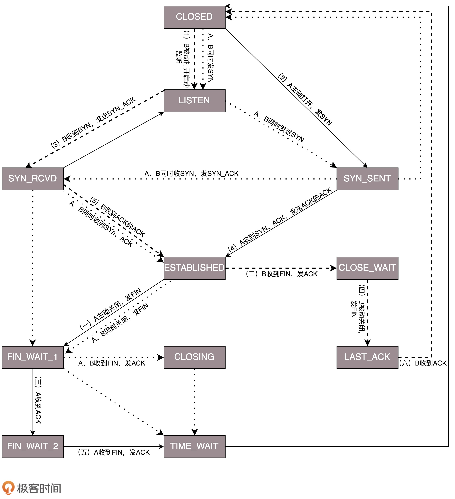

# 计算机网络

将参考 https://www.kancloud.cn/luoyoub/network-programming/1890746 进行重编

## 1. ⭐️ 计算机网络分层

计算机网络如果是 OSI 模型，分为 7 层；TCP/IP 模型，分为 4 层。

- 应用层

  **为特定应用程序提供数据传输服务**，例如，HTTP、DNS 等协议。数据单位为报文。

  1. 超文本传输协议（HTTP）:万维网的基本协议；
  2. 文件传输（TFTP简单文件传输协议）；
  3. 远程登录（Telnet），提供远程访问其它主机功能, 它允许用户登录internet主机，并在这台主机上执行命令；
  4. 网络管理（SNMP简单网络管理协议），该协议提供了监控网络设备的方法， 以及配置管理,统计信息收集,性能管理及安全管理等；
  5. 域名系统（DNS），该系统用于在internet中将域名及其公共广播的网络节点转换成IP地址。

- 传输层

  **为进程提供通用数据传输服务**。由于应用层协议很多，定义通用的传输层协议就可以支持不断增多的应用层协议。

  运输层包括两种协议

  1. **传输控制协议 TCP** 

     提供面向连接、可靠的数据连接服务，数据单位为报文段。

  2. **用户数据协议 UDP** 

     提供无连接、尽最大努力的数据传输服务，数据的单位为用户数据报。

  TCP 主要提供完整性服务，UDP 主要提供及时性服务

- 集线器工作在物理层，交换机工作在数据链路层，路由器工作在网络层。

## 2. ⭐️ TCP 与 UDP 的区别

### UDP

UDP协议全称是用户数据报协议，在网络中它与TCP协议一样用于处理数据包，是一种无连接的协议。在OSI模型中，在第四层——传输层，处于IP协议的上一层。UDP有不提供数据包分组、组装和不能对数据包进行排序的缺点，也就是说，当报文发送之后，是无法得知其是否安全完整到达的。

它有以下几个特点：

1. 面向**无连接** 

   首先 UDP 是不需要和 TCP一样在发送数据前进行三次握手建立连接的，想发数据就可以开始发送了。并且也只是数据报文的搬运工，不会对数据报文进行任何拆分和拼接操作。

   具体来说就是：

   - 在发送端，应用层将数据传递给传输层的 UDP 协议，UDP 只会给数据增加一个 UDP 头标识下是 UDP 协议，然后就传递给网络层了
   - 在接收端，网络层将数据传递给传输层，UDP 只去除 IP 报文头就传递给应用层，不会任何拼接操作

2. 有单播、多播、广播的功能

   UDP 不止支持一对一的传输方式，同样支持一对多，多对多，多对一的方式，也就是说 UDP 提供了单播，多播，广播的功能。

3. UDP**是面向报文的** 

   发送方的UDP对应用程序交下来的报文，在添加首部后就向下交付IP层。UDP对应用层交下来的报文，既不合并，也不拆分，而是保留这些报文的边界。因此，应用程序必须选择合适大小的报文

4. **不可靠性** 

   首先不可靠性体现在无连接上，通信都不需要建立连接，想发就发，这样的情况肯定不可靠。

   并且收到什么数据就传递什么数据，并且也不会备份数据，发送数据也不会关心对方是否已经正确接收到数据了。

   再者网络环境时好时坏，但是 UDP 因为没有拥塞控制，一直会以恒定的速度发送数据。即使网络条件不好，也不会对发送速率进行调整。这样实现的弊端就是在网络条件不好的情况下可能会导致丢包，但是优点也很明显，在某些实时性要求高的场景（比如电话会议）就需要使用 UDP 而不是 TCP。

5. **头部开销小**，传输数据报文时是很高效的

   

   UDP 头部包含了以下几个数据：

   - 两个十六位的端口号，分别为源端口（可选字段）和目标端口
   - 整个数据报文的长度
   - 整个数据报文的检验和（IPv4 可选 字段），该字段用于发现头部信息和数据中的错误

### TCP

TCP协议全称是传输控制协议是一种面向连接的、可靠的、基于字节流的传输层通信协议。

TCP相对于UDP来说，是**面向连接、字节流和可靠传输**的流协议。流就是指不间断的数据结构，你可以把它想象成排水管中的水流。

1. 面向连接

   使用TCP通信的双方必须先建立起连接，然后才能开始数据的读写。

   建立连接后双方的系统内核会为该连接分配必要的系统资源，用来管理连接的状态和传输在连接上的数据。

   **TCP连接是全双工的，即双方的读写操作可以在同一连接上执行**。

   数据交换完成后，通信双方都需要关闭该连接以释放系统资源。

   TCP的连接是一对一的，所以需要广播或多播(目标是多个主机)的应用程序不能使用TCP服务，而是使用无连接的UDP服务。

2. 字节流服务

   跟**字节流服务**经常放在一起的还有**数据报服务**，它们的区别在形式上体现为**通信双方是否需要指向相同次数的读/写操作**。

   对于使用字节流服务的TCP的通信双方来讲，当发送端应用程序连续执行多次写操作时，(系统内核空间的)TCP模块会先将这些数据放入(内核空间的)TCP发送缓冲区中。

   当TCP模块需要真正发出数据时，发送缓冲区中待发送的数据会被封装成一个或者多个TCP报文段发出。

   由此可见，**TCP模块发送出的TCP报文段的个数跟与应用程序执行写操作的次数之间没有固定的数量关系**。

   同理，TCP接收端具有接收缓冲区，当接收端接收到一个或者多个TCP报文段之后，TCP模块将报文携带的发送端应用程序数据按照TCP报文段的序号放入该缓冲区，并通知应用程序来读取数据。

   接收端应用程序可以一次性将接收缓冲区的内容读出，也可以分多次读取，这取决于用户指定的应用程序读缓冲区的大小。

   由此可见，**TCP模块接收到的TCP报文段的个数与应用程序执行读操作的次数之间没有固定的数量关系**。

   综上所述，**发送端的写操作和接收端的读操作之间没有固定的数量关系，这就是字节流服务，应用程序对数据的发送和接收是没有边界限制的**。

   UDP则不然，它是属于数据报服务，发送端应用程序每执行一次写操作，UDP模块就会将之封装成一个UDP数据报并发送出去，接收端必须及时针对每一个UDP数据报执行读操作，否则就会出现丢包现象，另外，如果接收端没有足够的应用程序来读取数据，UDP数据就会被截断。

3. 可靠传输

   - TCP采用**发送应答机制**，即发送端发送的每个TCP报文段都必须得到接收方的应答后才认为TCP报文段传输成功。

   - TCP具有**超时重传机制**，发送端在发出一个TCP报文段之后启动定时器，若在超时时间范围后还没收到接收端的应答信号，它将重发该数据报文。

   - TCP报文段最终是以**IP数据报**发送的，IP数据报到达接收端可能是重复/乱序的，所以**TCP模块还会对接收到的TCP报文段重排、整理，再交付应用程序**。

     **UDP协议与IP协议一致，提供的是不可靠服务，数据确认和超时重传都需要在上层应用实现**。

### TCP和UDP的区别

- TCP 是面向连接的，UDP 是面向无连接的。

 - 什么是建立连接？

   所谓的建立连接，是为了在客户端和服务端维护连接，而建立一定的数据结构来维护双方交互的状态，用这样的数据结构来保证所谓的面向连接的特性。

- TCP 是一个有状态服务，UDP 则是无状态服务。

 - TCP 提供可靠交付。通过 TCP 连接传输的数据，无差错、不丢失、不重复、并且按序到达。而 UDP 继承了 IP 包的特性，不保证不丢失，不保证按顺序到达。

 - TCP 是面向字节流的。而 UDP 继承了 IP 的特性，基于数据报的，一个一个地发，一个一个地收。

 - TCP 是可以有拥塞控制的。UDP 根据应用命令发送数据包。

比喻：TCP更好的比喻是在码头上增加了记录人员，核查人员和督导人员，至于IP层和数据链路层，它没有任何改造。

## 3.  TCP 头部结构

1. 16位的源端口号/目的端口号

   告知目的机器报文段来自哪里(源端口号)以及传给传递给哪个上层协议或者应用程序(目的端口号)。进行TCP通讯时，客户端通常使用系统自动选择的临时端口号，而服务器则使用知名端口号。

   在Linux系统中，一些知名服务使用的端口号定义在/etc/services中。

2. 32位序号

   一次TCP通讯(从TCP连接的建立到断开)整个过程中，一个传输方向上的字节流的每一个报文的编号。

   例如主机A和主机B进行TCP通讯，A发送给B的第一个TCP报文中，序号值就被系统设置为某个随机值(ISN, Initial Sequence Number)，在该传输方向(A->B)的后续TCP报文的序号子将被系统设置为ISN加上该报文所携带的第一个字节在整个字节流的偏移。

   假设某个TCP报文段传输的数据是整个字节流中的第1024~2048字节，那么该报文的序号值为ISN+1025，下一个报文为ISN+2049。

3. 32位的确认号

   用于对对方发来的TCP报文段的响应，其值为收到的TCP报文段的序号值加1。

4. 4位头部长度

   标志该TCP头部具有多长，单位为字(4字节)，可见TCP头部最长为60字节。

5. 6位保留

6. 6个标志位

   -  URG: 表示紧急指针是否有效
   - ACK: 表示确认号是否有效(携带ACK标志的TCP报文段称为确认报文段)
   - PSH: 提示接收端应用程序要立即从TCP接收缓冲区读走数据，以腾出空间接收后续的数据。(若应用程序不读走数据，数据会一直留在TCP模块的接收缓冲区)
   - RST: 表示要求对方重新建立连接(携带RST标志的TCP报文段为复位报文段)
   - SYN: 表示请求建立一个连接(携带SYN标志的TCP报文段称为同步报文段)
   - FIN: 表示通知对方要关闭连接(携带FIN标志的TCP报文段为结束报文段)

7. 16位窗口大小

   这是TCP流量控制的一个手段。此处的窗口指的是接收通告窗口，用于告诉对方本端的TCP接收缓冲区还能容纳多少字节的数据，这样对方就可以控制发送数据的速度。

8. 16位校验和

   由发送端填充，接收端对TCP报文段执行CRC算法以检验TCP报文段在传输过程中是否损坏。作为TCP可靠传输的重要保障，这个校验不仅包括TCP头部，也包括数据部分。

9. 16位紧急指针

   存放着一个正的偏移值，该值加上当前报文的序号将得到紧急指针，紧急指针处存放的是紧急数据，是发送端向接收端发送紧急数据的方法。

10. TCP头部选项

    TCP头部选项存放着至多40字节的可变长的可选信息(因为TCP头部结构最长为60字节，除去前面的固定部分)。

## 4. IP 头部结构

IP协议是TCP/IP协议族的动力，它为上层协议提供无状态、无连接、不可靠的服务。

优点：简单，高效。

- 无状态指：IP通信双方不同步传输数据的状态信息，所有的IP数据报的传输都是独立的。所以容易发生重复和乱序的情况并且IP层不予处理。

  然后将这些乱序的交给上层传输层（TCP/UDP等）来处理，将其处理成有序的，正确的。再交给应用层。

- 不可靠指：IP协议不能保证IP数据报准确到达。所以它提供ICMP报文来辅助，一旦检测到IP数据报发送失败，通知上层协议。

IP头部信息：

头部长度：通常20字节，有选项时更长，总共不超过60字节。

IP数据报长度：65535字节。

- 4位版本号：IP协议（IPv4）版本号位4
- 4位头部长度：标识头部有多少个4字节，即最大共15*4个字节
- 8位服务类型：包含一个4位优先权字段：最小延时，最大吞吐量，最高可靠性和最小费用。
- 16位总长度：表示整个IP数据报的长度，最大表示65535，但由于MTU限制，一般无法到达这个值。
- 16位标识：唯一的标识数据报。系统采用加1的式边发送边赋值。
- 3位标识（保留，DF禁止分片，MF更多分片）：所以这个标志是为分片存在，DF设置时禁止分片所以如果数据报太大则发送失败。MF设置时，如果产生分片，除了最后一个分片，其他此片置1。
- 13位分片偏移：分片相对原始IP数据报开始处的偏移。
- 8位生存时间（TTL）：数据报到达目的地之前允许经过的路由跳跳数。跳一下减1，得0丢弃。
- 8位协议：用来区分上层协议（ICMP为1，TCP为6，UDP为17）。
- 16位头部校验和：仅以CRC算法检验数据报头部在传输过程中是否损坏。
- 32位源端口IP地址和目的端口地址很明白。
- 选项（可变长）：记录路由，告诉途径得所有路由把IP填进来。 时间戳，告诉每个路由器都将数据报被转发的时间传进来。松散路由选择，指定一个路由器IP地址列表，必须按这个表发送，严格路由选择，数据报经过路由表。

## 5. ⭐️ TCP 三次握手、四次挥手

### TCP的三次握手（开始传输）

##### 三次握手的目的是什么

三次握手是用来确认**通信双方数据原点的序列号，**相当于同步两端的数据时钟起始位置。

- TCP可以确认双方`数据原点的序列号`
  - ==面试错误点==：比方说：服务器收到客户端发起的2次TCP开始请求，服务器不知道哪一个是新的，那么服务器都将回应给客户端，客户端根据返回的ACK序号，确定正确的TCP连接，返回二次握手。
  - `todo`序列号是如何生成的？
- 根据规则生成的序列号可以保证不同时刻开始的连接，使用不同的序列号。
  1. 可以保证建立连接的过程不会收到延迟包序号的影响。
  2. 可以保证新连接的数据传输不会收到延迟包序号的影响
     - 因为序号差距很大，而TCP是强顺序协议

#### TCP三次握手的过程

1. 客户端发送SYN请求到服务器端，
   1. 设置状态位为SYN
   2. 携带序号Sequence Number = x
      - x为**客户端**接收**服务器**的数据包序列开始的位置。
2. 服务器收到请求后，响应SYN请求到客户端
   1. 设置状态位为SYN, ACK
   2. 携带序号Sequence Number = y
      - y为**服务器**接收**客户端**的数据包序列开始的位置。
   3. 携带确认序号Acknowledge Number = x+1
      - 确认已经收到请求的序列号
3. 客户端响应服务器端，建立连接
   1. 设置状态位为SYN, ACK
   2. 携带Sequence Number=x+1
      - x+1当前包在数据流中的位置
   3. 携带确认序号Acknowledge Number = y+1
      - 确认已经收到请求的序列号

#### 一些思考题：

##### TCP协议如何探测客户端下线？

1. 使用keepalive机制，要求定期发送探活包。
2. 服务端使用策略主动断开不活跃客户端。

##### 为什么不是两次握手？

两次握手无法确认建立连接的有效性。丢包，延迟转发包都可能错误开启连接。

分为两种情况，发送一次或多次

1. 场景一，传输过程中丢包，服务器未收到请求，没有建立连接。
2. 场景二，之前的数据连接结束，服务器突然收到延迟包（上一次开始连接的数据包），开启了新会话。

##### 为什么不是四次握手？

四次挥手中，ACK和SEQ的步骤可以被合并。

##### 为什么Sequence Number不从1开始？

SEQ的生成机制可以保证，两个应用在不同时间点建立的连接，不会收到先前连接延迟包的影响

##### ACK为什么➕1？

ACK加一，代表ACK+1前面的内容已经收到了。

### TCP的四次挥手（结束传输）

#### TCP四次挥手的过程

1. 客户端发送第一次挥手
   - 设置状态位为FIN
   - seq为p
   - **客户端进入FIN_WAIT_1**，此时开始不再处理和发送应用层用户的数据。 
2. 客户端发送第二次挥手
   - 设置状态位为ACK
   - ack为p+1，确认客户端到服务器传输关闭完成
   - **服务器进入CLOSE_WAIT状态**
   - **客户端进入FIN_WAIT_2**，此时只接收服务器传输数据。
3. 服务器发送第三次挥手
   - 设置状态位为FIN，ACK
   - seq为q
   - ack为p+1，请求服务器到客户端传输关闭完成
   - **客户端进入ClOSE_WAIT状态**，并等待2MSL
     - MSL 是 Maximum Segment Lifetime，报文最大生存时间，它是任何报文在网络上存在的最长时间，超过这个时间报文将被丢弃。
4. 客户端发送第四次挥手
   - 设置状态位为FIN，ACK
   - ack为q+1，确认服务器到客户端传输关闭完成

### 场景题

1. 第一次挥手后，服务端收到直接下线怎么办?

   通过配置tcp_orphan_retries的最大重试数目，0不重试

2. 第二次挥手后，客户端收到直接下线怎么办?

   在LINUX中配置FIN_WAIT2等待超时，超时自动关闭

3. 第二次挥手后，服务端已离线怎么办?

   在TIME_WAIT状态下，等待超过2MSL后自动关闭

4. TIME_WAIT为什么是2MSL？

   2MSL的时间足够长，允许服务器发现发出的第三次挥手没有得到反馈，会重新发送请求。

5. 如果TIME_WAIT超时后接收到最后一个ACK，客户端会做出什么反应？

   客户端返回RST，要求重新建立连接。

#### 一些思考题

##### 为什么需要三次握手，两次不可以吗？

这个问题的本质是，**信道不可靠但通信双方需要就某个问题达成一致**。

而要解决这个问题，无论你在消息中包含什么信息，三次通信是理论上的最小值。

所以三次握手不是TCP本身的要求，而是为了满足"在不可靠信道上可靠地传输信息"这一需求所导致的。

请注意这里的本质需求：信道不可靠，数据传输要可靠。

三次达到了，那后面你想接着握手也好，发数据也好，跟进行可靠信息传输的需求就没关系了。

因此，如果信道是可靠的，即无论什么时候发出消息，对方一定能收到；或者你不关心是否要保证对方收到你的消息，那就能像UDP那样直接发送消息就可以了。

这可视为对“三次握手”目的的另一种解答思路。

##### 为什么需要四次挥手？两次不可以吗？

因为TCP是全双工通信的。

全双工通信，又称为双向同时通信，即通信的双方可以同时发送和接收信息的信息交互方式。

1. 第一次挥手

   因此当主动方发送断开连接的请求（即FIN报文）给被动方时，仅仅代表主动方不会再发送数据报文了，但主动方仍可以接收数据报文。

2. 第二次挥手

   被动方此时有可能还有相应的数据报文需要发送，因此需要先发送ACK报文，告知主动方“我知道你想断开连接的请求了”。这样主动方便不会因为没有收到应答而继续发送断开连接的请求（即FIN报文）。

3. 第三次挥手

   被动方在处理完数据报文后，便发送给主动方FIN报文；这样可以保证数据通信正常可靠地完成。发送完FIN报文后，被动方进入LAST_ACK阶段（超时等待）。

4. 第四挥手

   如果主动方及时发送ACK报文进行连接中断的确认，这时被动方就直接释放连接，进入可用状态。

##### 为什么不是三次挥手？可以变为三次挥手吗？

可以的，实际上在启用延迟确认的情况下就是三次挥手。

> 然而，如果 B 稍微延迟它的 ACK（并且如果它没有更多的数据要发送），那么 B 的 ACK 和 FIN 有可能 - 事实上并不少见 - 一起发送。延迟 ACK 是一种常见的策略。

## 6. TCP 状态机

### 简述 TIME_WAIT 和 CLOSE_WAIT

**TIME_WAIT（主动关闭连接）** 

客户端接收到服务器端的 FIN 报文后进入此状态，此时并不是直接进入 CLOSED 状态，还需要等待一个时间计时器设置的时间。

这么做有两个理由：

1. 确保最后一个确认报文段能够到达。如果 B 没收到 A 发送来的确认报文段，那么就会重新发送连接释放请求报文段，A 等待一段时间就是为了处理这种情况的发生。
2. 可能存在“已失效的连接请求报文段”，为了防止这种报文段出现在本次连接之外，需要等待一段时间。

**CLOSE_WAIT（被动关闭连接）**

CLOSE_WAIT是被动关闭连接是形成的。

根据TCP状态机，服务器端收到客户端发送的FIN，则按照TCP实现发送ACK，因此进入CLOSE_WAIT状态。但如果服务器端不执行close()，就不能由CLOSE_WAIT迁移到LAST_ACK，则系统中会存在很多CLOSE_WAIT状态的连接。

此时，可能是系统忙于处理读、写操作，而未将已收到FIN的连接，进行close。此时，recv/read已收到FIN的连接socket，会返回0。

## 7. ⭐️ TCP 协议如何保证传输可靠

TCP 协议保证数据传输可靠性的方式主要有：

- [校验和](https://blog.csdn.net/qq_15437629/article/details/79183076) 

  TCP校验和（Checksum）是一个端到端的校验和，由发送端计算，然后由接收端验证。

  其目的是为了发现TCP首部和数据在发送端到接收端之间发生的任何改动。如果接收方检测到校验和有差错，则TCP段会被直接丢弃。

- 超时重传

  简单理解就是发送方在发送完数据后等待一个时间，时间到达没有接收到ACK 报文，那么刚才发送的数据进行重新发送

- 连接管理

  三次握手🤝和四次挥手👋

- 流量控制

  TCP 根据接收端对数据的处理能力，决定发送端的发送速度，这个机制就是流量控制。

  TCP 协议的报头信息当中，有一个 16 位字段的窗口大小，发送方根据 ACK 报文里窗口的大小改变进而改变自己的发送速度。

  [滑动窗口机制及其三种协议](https://blog.csdn.net/ShWe_yayaya/article/details/81433631) 

- 拥塞控制

  慢开始、拥塞避免、快重传、快回复

  慢开始算法的思路就是，不要一开始就发送大量的数据，先探测网络的拥塞程度，也就是说由小到大逐渐增加拥塞窗口的大小。

  拥塞避免算法的让拥塞窗口缓慢增长，即每经过一个往返时间 RTT 就把发送方的拥塞窗口 [CWnd](拥塞窗口（congestion window）的简写) ➕1，而不是加倍。这样拥塞窗口按线性规律增长缓慢。

  

  快重传和快恢复：发送方只要一连收到三个重复确认就应当立即重传对方尚未收到的报文段，而不必继续等待设置的重传计时器时间到期。

  

## 8. DNS 域名解析

DNS 占用 53 号端口，同时使用 TCP 和 UDP 协议

**DNS 区域传输的时候使用 TCP 协议** 

- 辅域名服务器会定时（一般 3 小时）向主域名服务器进行查询以便了解数据是否有变动。如果有变动，会执行一次区域传送，进行数据同步。

  区域传送使用 TCP 而不是 UDP，因为数据同步传送的数据量比一个请求应答的数据量要多得多。

- TCP 是一种可靠连接，保证了数据的准确性

**域名解析时使用 UDP 协议** 

- 客户端向 DNS 服务器查询域名，一般返回的内容都不超过 512 字节，用 UDP 传输即可。不用经过 3 次握手，这样 DNS 服务器负载更低、响应更快。理论上说，客户端也可以指定向 DNS 服务器查询时使用 TCP，但事实上，很多 DNS 服务器进行配置的时候，仅支持 UDP 查询包。

## 9. HTTP 报文结构和状态码

请求格式：请求行、请求头、空行、请求数据

返回格式

状态行、消息报头、响应正文

| 状态码 | 类别                           | 含义                       |
| ------ | ------------------------------ | -------------------------- |
| 1XX    | Information(信息性状态码)      | 接受的请求正在处理         |
| 2XX    | Success(成功状态码)            | 请求正常处理完毕           |
| 3XX    | Redirection(重定向状态码)      | 需要进行附加操作以完成请求 |
| 4XX    | Client Error(客户端错误状态码) | 服务器无法处理请求         |
| 5XX    | Sever Error(服务器错误状态码)  | 服务器处理请求出错         |

### ⭐️ 常见状态

1. 200 OK：客户端请求成功

2. 301 Moved Permanently：永久重定向

3. 302 Found：临时性重定向

4. 400 Bad Request：客户端请求有语法错误，不能被服务器所理解

5. 403 Forbidden：服务器收到请求，但是拒绝提供服务

6. 404 Not Found：请求资源不存在。举个例子，输入了错误的 url

7. 500 Internal Sever Error：服务器发送不可预期的错误

8. 503 Sever Unavailable：服务器当前不能处理客户端的请求，一段时间后可能恢复正常。

   举个例子：HTTP/1.1 200 OK (CRLF)

### HTTP/1.1 新特性 默认长连接

- 支持流水线
- 支持同时打开多个 TCP 连接
- 新增状态码 100：目前为止都很正常，客户端可以继续发送请求或者忽略这个响应
- 支持分块传输代码：可以把数据分割成多块，让浏览器逐步显示页面
- 新增缓存处理指令： max-age：有效期来指定 cookie 的持久性问题。

### 缓存问题

[轻松理解HTTP缓存策略](https://segmentfault.com/a/1190000038562294) 

缓存流程

## 10. ⭐️ GET 与 POST 比较

1. 作用

   - GET用于获取资源

   - POST用于传输实体主体

2. 参数

   - GET的参数是以查询字符串出现在URL中
   - POST的参数存储在实体主体中。

3. 安全性

   > 安全的HTTP方法不会改变服务器状态，也就是说它是可读的。

   - GET方法是安全的

   - POST方法不是安全的

4. 幂等性

   > 幂等的HTTP方法，同样的请求被执行一次与连续执行多次的效果是一样的，服务器的状态也是一样的。
   >
   > 换句话说就是，幂等方法不应该就有副作用（统计用途除外），所有的安全方法也都是幂等的

   - GET、HEAD、PUT和DELETE等方法都是幂等的
   - POST方法不是幂等等

5. 可缓存

   GET 可缓存（响应状态码和 Cache-Control 保证是可缓存），POST 不可缓存

6. 底层

   - 对于 GET 请求，浏览器会把 HTTP header 和 data 一并发出去，服务器响应 200 ok（返回数据）

   - 对于 POST 请求，浏览器先发送 header，服务器响应 100 continue，浏览器再发送 data，服务器响应 200 ok（返回数据）

## 11. ⭐️ cookie 作用、安全性问题和 session 的比较

cookie 是一种发送到客户浏览器的文本串句柄，并保存在客户机硬盘上，可以用来在某个WEB站点会话间持久的保持数据。

 session 指的就是访问者从到达某个特定主页到离开为止的那段时间。

 session 其实是利用 cookie进行信息处理的，当用户首先进行了请求后，服务端就在用户浏览器上创建了一个 cookie，当这个 session 结束时，其实就是意味着这个 cookie 就过期了。
注：为这个用户创建的 cookie 的名称是 aspsessionid。这个 cookie 的唯一目的就是为每一个用户提供不同的身份认证。

cookie 和 session 的共同之处在于：cookie 和 session 都是用来跟踪浏览器用户身份的会话方式。

### Session 和 cookie 的适用场景

- Cookie 只能存储 ASCII 码字符串，而 Session 则可以存储任何类型的数据，因此在考虑数据复杂性时首选 Session；
- Cookie 存储在浏览器中，容易被恶意查看。如果非要将一些隐私数据存在 Cookie 中，可以将 Cookie 值进行加密，然后在服务器进行解密；
- 对于大型网站，如果用户所有的信息都存储在 Session 中，那么开销是非常大的，因此不建议将所有的用户信息都存储到 Session 中。

### Cookies和Session区别

1. 存储的位置不同

   cookie：存放在客户端

   session：存放在服务端。session 存储的数据比较安全

2. 存储的数据类型不同两者都是key－value的结构，但针对value的类型是有差异的

   cookie：value只能是 字符串 类型

   session：value是 Object 类型

3. 存储的数据大小限制

   cookie：大小受浏览器的限制，很多是 4KB 大小，浏览器中 cookie 的个数也有限制

   session：理论上受当前内存的限制

4. 生命周期
   - cookie的生命周期是累计的，可以设置的（默认是一次会话的时间），关闭浏览器也会造成周期结束
   - session的生命周期是间隔的，关闭服务器会造成周期结束

#### 拓展 token

##### session与token

1. 生成方式

   - token

     浏览器第一次访问服务器，根据传过来的唯一标识userId，服务端会通过一些算法，如常用的HMAC-SHA256算法，然后加一个密钥，生成一个token。通过BASE64编码一下之后，再将这个token发送给客户端；

   - session

     浏览器第一次访问服务器，服务器会创建一个session，然后同时为该session生成一个唯一的会话的key，也就是sessionid。接着将sessionid及对应的session分别作为key和value保存到缓存中，也可以持久化到数据库中，最后服务器再把sessionid，以cookie的形式发送给客户端。

2. 有无状态

   - session有状态；

   - token无状态

3. 是否存储

   - session要存储；
   - token无存储

##### token与cookie

cookie 是不允许垮域访问的，但是 token 是支持的，前提是传输的用户认证信息通过HTTP头传输。

token 就是令牌，比如你授权（登录）一个程序时，他就是个依据，判断你是否已经授权该软件；

cookie 就是写在**客户端**的一个txt文件，里面包括你登录信息之类的，这样你下次在登录某个网站，就会自动调用 cookie 自动登录用户名；

session 和cookie 差不多，只是 session 是写在**服务器端**的文件，也需要在客户端写入 cookie 文件，但是文件里是你的浏览器编号.Session的状态是存储在服务器端，客户端只有 session id；而 Token 的状态是存储在客户端。

## 12. 短连接与长连接、流水线

### 短连接与长连接

当浏览器访问一个包含多张图片的 HTML 页面时，除了请求访问的 HTML 页面资源，还会请求图片资源。如果每进行一次 HTTP 通信就要新建一个 TCP 连接，那么开销会很大。

长连接只需要建立一次 TCP 连接就能进行多次 HTTP 通信。

- 从 HTTP/1.1 开始默认是长连接的，如果要断开连接，需要由客户端或者服务器端提出断开，使用`Connection : close`；
- 在 HTTP/1.1 之前默认是短连接的，如果需要使用长连接，则使用`Connection : Keep-Alive`

### 流水线（管线化）

默认情况下，HTTP 请求是按顺序发出的，下一个请求只有在当前请求收到响应之后才会被发出。由于受到网络延迟和带宽的限制，在下一个请求被发送到服务器之前，可能需要等待很长时间。

持久连接使得多数请求以管线化（pipelining）方式发送成为可能。从前发送请求后需等待并收到响应，才能发送下一个请求。管线化技术出现后，不用等待响应亦可直接发送下一个请求

## 13. HTTP 的安全性问题

HTTP 有以下安全性问题：

- 使用明文进行通信，内容可能会被窃听；
- 不验证通信方的身份，通信方的身份有可能遭遇
- 无法证明报文的完整性，报文有可能遭篡改

### HTTPs 加密

==HTTPs = HTTP+加密+认证+完整性保护== 

HTTPs 并非是应用层的一种新协议，只是HTTP通信接口部分用 SSL(Secure Socket Layer) 和 TLS (Transport Layer Security)  协议替代而已。

通常，HTTP 直接和 TCP 通信，当使用SSL时，演变成了先和SSL通信，再由SSL和TCP通信了。

简而言之，所谓HTTPS，其实就是身披SSL协议的这层外壳的HTTP。

**在采用 SSL 后，HTTP 就拥有了 HTTPs 的加密（防监听）、认证（防伪装）和完整性保护（防篡改）这些功能**。

SSL 是独立于 HTTP 的协议, 所有不光是 HTTP 协议，其他运行在应用层的 SMTP(邮件协议) 和 Telnet 等协议均可配合 SSL 协议使用。可以说 SSL 是当今世界上应用最广泛的网络安全技术。

#### 加密过程

HTTPS 采用混合的加密机制，使用**非对称密钥加密用于传输对称密钥来保证传输过程的安全性** ，之后使用**对称密钥加密进行通信来保证通信过程的效率** 。

确保传输安全过程（其实就是rsa原理）：

1. Client给出**协议版本号** 、一个客户端生成的**随机数** （Client random），以及客户端支持的**加密方法** 。
2. Server确认双方使用的**加密方法** ，并给出**数字证书** 、以及一个服务器生成的**随机数** （Server random）。
3. Client确认**数字证书有效** ，然后生成一个新的**随机数** （Premaster secret），并使用**数字证书中的公钥，加密这个随机数** ，发给Server。
4. Server使用自己的**私钥，获取Client发来的随机数** （Premaster secret）。
5. Client和Server根据约定的加密方法，使用前面的**三个随机数，生成”对话密钥”** （session key），用来加密接下来的整个对话过程。

#### 认证

通过使用 **证书** 来对通信方进行认证。

数字证书认证机构（CA，Certificate Authority）是客户端与服务器双方都可信赖的第三方机构。

服务器的运营人员向 CA 提出公开密钥的申请，CA 在判明提出申请者的身份之后，会对已申请的公开密钥做数字签名，然后分配这个已签名的公开密钥，并将该公开密钥放入公开密钥证书后绑定在一起。

进行 HTTPS 通信时，服务器会把证书发送给客户端。客户端取得其中的公开密钥之后，先使用数字签名进行验证，如果验证通过，就可以开始通信了。

[加密全套流程](https://www.cnblogs.com/handsomeBoys/p/6556336.html)

https://www.cnblogs.com/xdyixia/p/11610102.html

#### HTTPS的缺点

- 因为需要进行加密解密等过程，因此速度会更慢；
- 需要支付证书授权的高额费用。

## 14. HTTP 与 FTP 

### HTTP 与 FTP 的异同点

1. HTTP 协议是用来浏览网站的，而 FTP 是用来访问和传输文件的，FTP 文件传输有点批量上传和维护网站的意思，而 HTTP 文件传输更多的是为终端用户提供文件传输，比如电影、图片、音乐之类。
2. HTTP 和 FTP 客户端：通常的 HTTP 客户端就是浏览器，而 FTP 服务可以通过命令行或者用户自有的图形界面客户端。
3. HTTP 头：HTTP 头包含了 metadata ，比如说最后更改的日期、编码方式、服务器名称版本还有其他的一些信息，而这些在 FTP 中是不存在的。
4. FTP 要比 HTTP 早出现 10 年左右。
5. 数据格式：FTP 能传输 ACSII 数据或者二进制格式的数据，而 HTTP 只用二进制格式。
6. HTTP 中的流水线：HTTP 支持流水线，这就意味着客户端可以在上一个请求处理完之前，发出下一个请求，其结果就是多次请求数据之前省掉了部分服务器客户端往返时延。而 FTP 并没有这项支持。
7. HTTP 中的动态端口：FTP 一个最大的问题就是它使用两个连接，第一个连接用来发送控制指令，当接受或者发送数据的时候，又打开第二个 TCP 连接。而 HTTP 在双向传输中使用动态端口
8. HTTP 中的持久连接：对一个 HTTP 会话来讲，客户端可以维护一个单个的连接并使用它进行任意数量的数据传输。FTP 每次有数据的需要时都创建一个新的连接。重复的创建新的连接带来的体验并不好，因为每次创建连接都必须让双方握手验证，这消耗了很多时间。
9. HTTP 中的压缩算法：HTTP 提供了一个在一些压缩算法中客户端和服务器共同协商选择的办法。其中 gzip 可以说是最有影响力的一种，而 FTP 中并不存在这种复杂的算法。
10. HTTP 支持代理：HTTP 一个很大的特点就是支持代理，这种功能是构建在协议里的，而 FTP 并不支持。
11. 而 FTP 也能脱颖而出的一点是这个协议是直接面向文件级别的。这以为着 FTP 有例如可以通过命令列出远程服务器上的目录列表，而 HTTP 没有这个概念。
12. 速度：可能最通常的问题了：哪一个传输更快？

### 什么使 FTP 服务更快？

- 没有在发出的数据中加入 meta-data，仅传输原二进制文件
- 没有过度的分块编码

### 什么使 HTTP 服务更快？

- 重用已存在的持久连接，从而有更好的 TCP 表现。
- 流水线的支持使得从同一个服务器上请求多个文件更快。
- 自动的压缩机制使得传输的数据更少。
- 没有命令/应答机制最大限度的减少了往返时延。

总结：当然最终的结果会因具体的情况而异。单次传输一个静态的文件，是很难衡量两者区别的。对单个的小文件来说，FTP 传输更快；当传输多个文件时，HTTP 更快。

## 15. ⭐️ 处理网址

[当在浏览器中输入一个网址并按下回车后发生的事情](https://www.cnblogs.com/yushuo1990/p/5984232.html) 

1. **第一步 浏览器查找该域名的 IP 地址** 

   DNS 递归查询：DNS 域名解析，浏览器缓存，系统缓存，路由器缓存，ISP的缓存DNS服务器，根域名服务器

   如果用 CDN 内容分发网络，本质是在现有网络结构中增加了一层（客户端 + CDN + 服务器），CDN 包括高速缓存和整体负载均衡（GSLB），主要缓存静态资源。

   个人理解：当发送一个网址时，先去 DNS 域名解析道 CDN 均衡负载系统，然后把响应最快的 IP 缓存节点服务器返回给用户。（第一次访问得向源服务器请求内容进行缓存）

2. **第二步 浏览器根据解析得到的 IP 地址向 web 服务器发送一个 HTTP 请求** 

   建立 socket 通信的过程。HTTP 请求的协议：请求行、请求头、请求体、状态码

3. **第三步 服务器收到请求并进行处理** 

   负载均衡：对工作任务进行平衡，如图片服务器、应用服务器，分为链路负载均衡、集群负载均衡、操作系统负载均衡

   反向代理：代理服务器将从服务器上得到的结果返回给internet上请求的客户端

4. 第四步 服务器返回一个响应
5. 第五步 浏览器对该响应进行解码，渲染显示
6. 第六步 页面显示完成后，浏览器发送异步请求

（持续更新一些页面信息）

