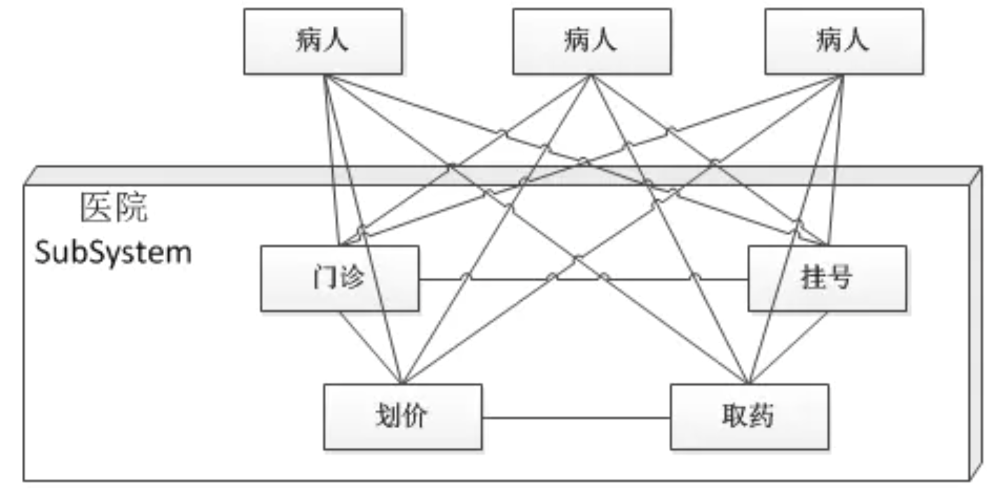
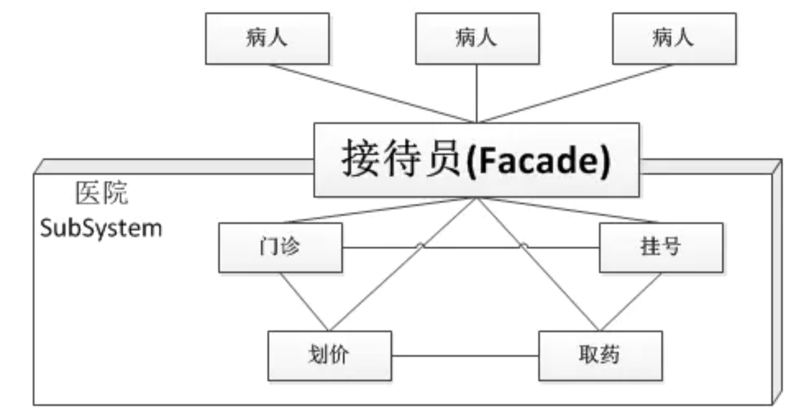
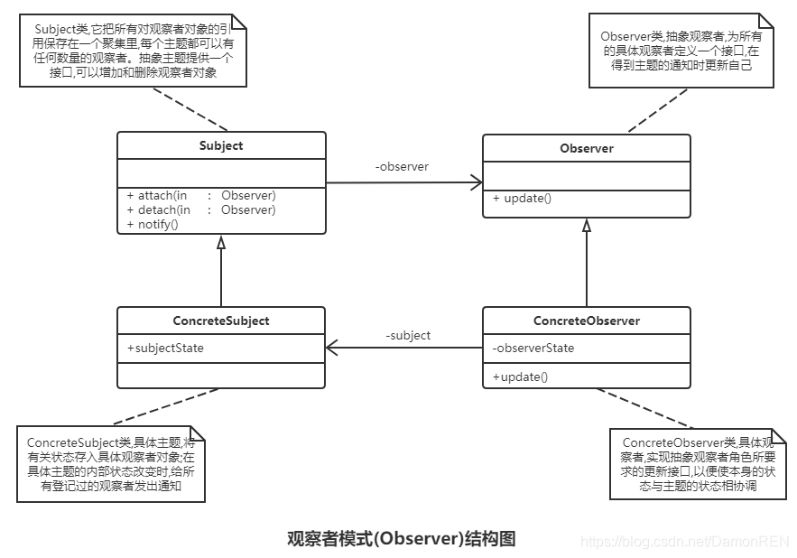
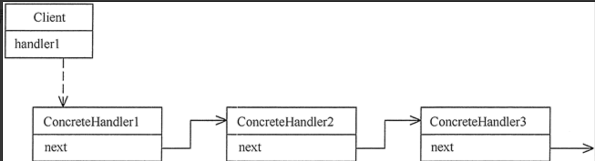

# 设计模式

推荐书籍：《大话设计模式》

最好的理解方式是结合框架源码学习，比如 Spring/HDFS 等框架中利用很多非常优秀的设计模式思想，只有先看别人如何利用，字节在设计大型业务代码的时候才会使用。


## 设计模式总述

下面是十种常见的设计模式，其它的看书了解即可。最好在项目上有用到或者在看源码的时候总结过，证明实践过。比如之前写的项目用到了模版设计的方法，然后展开怎么用到的；或者在看源码的时候看到了某种设计模式。这样来展现能力。

Java 的33种设计可以被分为四大类：加粗为常见使用的设计模式，结合案例代码理解更佳。

1. **创建性模式** （5种）

   这些设计模式提供了一种在创建对象的同时隐藏创建逻辑的方式，而不是使用 new 运算符直接实例化对象。这使得程序在判断针对某个给定实例需要创建哪些对象时更加灵活。

   - **工厂模式（Factory Pattern）** 
   - **抽象工厂模式（Abstract Factory Pattern）** 
   - **单例模式（Singleton Pattern）** 
   - 建造者模式（Builder Pattern）
   - 原型模式（Prototype Pattern）

2. **结构型模式** （8种）

   这些设计模式关注类和对象的组合。继承的概念被用来组合接口和定义组合对象获得新功能的方式。

   - **适配器模式（Adapter Pattern）** 
   - 桥接模式（Bridge Pattern）
   - 过滤器模式（Filter、Criteria Pattern）
   - 组合模式（Composite Pattern）
   - **装饰器模式（Decorator Pattern）** 
   - **外观模式（Facade Pattern）** 
   - 享元模式（Flyweight Pattern）
   - **代理模式（Proxy Pattern）** 

3. **行为型模式** （12种）

   这些设计模式特别关注对象之间的通信。

   - **责任链模式（Chain of Responsibility Pattern）** 
   - 命令模式（Command Pattern）
   - 解释器模式（Interpreter Pattern）
   - 迭代器模式（Iterator Pattern）
   - 中介者模式（Mediator Pattern）
   - 备忘录模式（Memento Pattern）
   - **观察者模式（Observer Pattern）** 
   - 状态模式（State Pattern）
   - 空对象模式（Null Object Pattern）
   - **策略模式（Strategy Pattern）** 
   - **模板模式（Template Pattern）** 
   - 访问者模式（Visitor Pattern）

4. **J2EE 模式** （8种）

   这些设计模式特别关注表示层。这些模式是由 Sun Java Center 鉴定的。

   - MVC 模式（MVC Pattern）
   - 业务代表模式（Business Delegate Pattern）
   - 组合实体模式（Composite Entity Pattern）
   - 数据访问对象模式（Data Access Object Pattern）
   - 前端控制器模式（Front Controller Pattern）
   - 拦截过滤器模式（Intercepting Filter Pattern）
   - 服务定位器模式（Service Locator Pattern）
   - 传输对象模式（Transfer Object Pattern）


## 设计模式的六大原则

1. **开闭原则（Open Close Principle）**

   开闭原则的意思是：**对扩展开放，对修改关闭**。在程序需要进行拓展的时候，不能去修改原有的代码，实现一个热插拔的效果。

   简言之，是为了使程序的扩展性好，易于维护和升级。想要达到这样的效果，我们需要使用接口和抽象类，后面的具体设计中我们会提到这点。

2. **里氏代换原则（Liskov Substitution Principle）**

   里氏代换原则中说，任何基类可以出现的地方，子类一定可以出现。

   LSP 是继承复用的基石，只有当派生类可以替换掉基类，且软件单位的功能不受到影响时，基类才能真正被复用，而派生类也能够在基类的基础上增加新的行为。

   里氏代换原则是对开闭原则的补充。

   实现开闭原则的关键步骤就是抽象化，而基类与子类的继承关系就是抽象化的具体实现，所以里氏代换原则是对实现抽象化的具体步骤的规范。

3. **依赖倒转原则（Dependence Inversion Principle）**

   这个原则是开闭原则的基础，具体内容：针对接口编程，依赖于抽象而不依赖于具体。

4. **接口隔离原则（Interface Segregation Principle）**

   这个原则的意思是：使用多个隔离的接口，比使用单个接口要好。

   它还有另外一个意思是：降低类之间的耦合度。

   由此可见，其实设计模式就是从大型软件架构出发、便于升级和维护的软件设计思想，它强调降低依赖，降低耦合。

5. **迪米特法则，又称最少知道原则（Demeter Principle）**

   最少知道原则是指：一个实体应当尽量少地与其他实体之间发生相互作用，使得系统功能模块相对独立。

6. **合成复用原则（Composite Reuse Principle）**

   合成复用原则是指：尽量使用合成/聚合的方式，而不是使用继承。


[Java设计模式：23种设计模式全面解析（超级详细）](http://c.biancheng.net/design_pattern/) 

## 1. ⭐️ 单例设计模式 Singleton

**概念** 

保证一个类在内存中的对象唯一性。指一个类只有一个实例，且该类能自行创建这个实例的一种模式。

**步骤** 

1. 私有化该类的构造函数（private）
2. 在本类中创建一个本类对象（private static）或者在方法中创建
3. 定义一个公有的方法，将创建的对象返回（public static）

**单例设计模式的内存情况** 

在堆中只有一个对象；方法区保存着构造函数和公有方法等。

**懒汉式和饿汉式的单例设计模式** 

- 懒汉式：延迟加载对象形式，对象在公有方法建立；存在多线程安全隐患。
- 饿汉式：只要一加载类就创建对象；多用于开发。

一般情况不建议使用饿汉方式，如果有线程安全等需求，可以考虑使用双检锁方式。

**代码示例** 

- 懒汉式

  优点：第一次调用才初始化，避免内存浪费

  缺点：必须加锁 synchronized 才能保证线程安全，但加锁会影响效率

  **线程不安全的懒汉式** 

  ```java
  public class Singleton {
      private static Singleton instance;
      private Singleton(){}
      public static Singleton getInstance(){
          if (instance == null){
              instance = new Singleton();
          }
          return instance;
      }
  }
  ```

  可以看到，当我们getInstance时，首先要经过if判断，在多线程场景下，就可能存在多个线程同时进入if判断，此时对象还未创建，那么就会多个线程都去创建对象，这样单例模式就被破坏了。

- 饿汉式（线程安全）

  优点：没有加锁，执行效率高

  缺点：类加载时就初始化，浪费内存

  该式的特点是类一旦加载就创建一个单例，保证在调用 getInstance 方法之前单例已经存在了。

  ```java
  public class HungrySingleton {
      private static final HungrySingleton instance = new HungrySingleton();
      private HungrySingleton() {
      }
      public static HungrySingleton getInstance() {
          return instance;
      }
  }
  ```

- 双检锁/双重校验锁（DCL， double-checked locking）

  ```java
  public class Singleton2 {
      private static volatile Singleton2 instance;
      private Singleton2(){}
      public static Singleton2 getInstance(){
          if (instance == null){
              synchronized (Singleton2.class){
                  if (instance == null){
                      instance = new Singleton2();
                  }
              }
          }
          return instance;
      }
  }
  ```

  用两次判断加同步代码块实现线程安全

  用双重检查实现的懒汉式，在多线程场景中getIntance时，首先要进行一次对象是否已创建的判断。

  如果已创建就直接返回实例，当首次加载需要创建对象时，假设有线程A和线程B两个线程同时通过第一层判断，那么它们需要排队进入同步代码块。

  假设线程A先进入同步代码块，则实例由线程A创建，那么当线程B进入同代码块时便不能通过第二层检查，即直接返回实例。

  这样便实现了线程安全的懒加载。

  **关于volatile关键字** 

   volatile有两个作用：保证可见性和防止指令重排。

  什么是保证可见性呢，就是当一个线程在对主内存的某一份数据进行更改时，改完之后会立刻刷新到主内存。并且会强制让缓存了该变量的线程中的数据清空，必须从主内存重新读取最新数据。意思就是所有线程都可以得到最新的数据，这样一来就保证了可见性。

  什么是指令重排呢，当new一个对象时，用字节码指令分析是三条指令(new、dup、invokespecial)，这三条指令可能会发生重排序，引用指向分配地址，但对象还未创建，导致判空校验不准确。

  因为创建对象的过程都在同步代码块中，所以此处使用volatile的作用主要是保证可见性。

- **静态内部类** 

  ```java
  public class Singleton3 {
      private Singleton3(){}
      private static class SingletonInstance{
          private static final Singleton3 INSTANCE = new Singleton3();
      }
      public static Singleton3 getInstance(){
          return SingletonInstance.INSTANCE;
      }
  }
  ```

  静态内部类：

  当外部类被装载时，内部类并不会被装载 当使用到时才会被装载，且只装载一次。

- **枚举**

  ```java
  enum Singleton4 {
      INSTANCE;
      public void method(){
          System.out.println("枚举实现单例");
      }
  }
  ```

  使用：
   `Singleton4.INSTANCE.method();`
   枚举是最简单也是最好用的实现方式，枚举的实际是用final修饰的实现enum接口的类，因为枚举构造只能私有，所以枚举是天生的单例模式
   因为枚举类是在第一次访问时才被实例化，所以它也是懒加载的。

- **补充** 

  除枚举方式外，其他方法都会通过反射的方式破坏单例。

  反射是通过调用构造方法生成新的对象，所以如果我们想要阻止单例破坏，可以在构造方法中进行判断，若已有实例,，则阻止生成新的实例。

  如果单例类实现了序列化接口Serializable，就可以通过反序列化破坏单例，所以我们可以不实现序列化接口。如果非得实现序列化接口，可以重写反序列化方法readResolve()，反序列化时直接返回相关单例对象。


## 2. ⭐️ 三种工厂设计模式

**概念** 

工厂模式就是用来生产对象的。

如果创建的时候直接 new 该对象，就会对该对象耦合严重；假如我们要更换对象，所有 new 对象的地方都需要修改一遍，这显然违背了软件设计的开闭原则。

如果我们使用工厂来生产/更换对象，我们就只需要和工厂打交道即可，彻底和对象解耦。

工厂模式最大的优点就是**解耦**。


工厂顾名思义就是创建产品。根据产品是具体产品还是具体工厂，可分为简单工厂模式和工厂方法模式；根据工厂的抽象程度，可分为工厂方法模式和抽象工厂模式。

该模式用于封装和管理对象的创建，是一种创建型模式。


### 简单工厂模式 Simple Factory

**定义** 

一个工厂方法，依据传入的参数，生成对应的产品对象。

**角色** 

- **抽象产品**
- **具体产品**
- **具体工厂**
- **产品使用者** 

**使用说明** 

先将产品类抽象出来，比如苹果和梨都是水果，抽象出来一个水果类，苹果和梨就是具体的产品类，然后创建一个水果工厂，分别用来创建苹果和梨。

水果接口

```java
public interface Fruit{
  void whatIn();
}
```

具体类 苹果

```java
public class Apple implements Fruit{
  @Override
  public void whatIn(){
    // 苹果
  }
}
```

具体类 梨

```java
public class Pear implements Fruit{
  @Override
  public void whatIn(){
    // 梨
  }
}
```

具体工厂 水果工厂

```java
public class FruitFactory {
  public Fruit createFruit(String type) {
    if(type.equals("apple")){ // 生产苹果
      return new Apple();
    } else if { // 生产梨
      return new Pear{}
    }
    return null;
  }
}
```

产品使用

```java
FruitFactory mFactory = new FruitFactory();
Apple apple = (Apple) mFactory.createFruit("apple"); // 获得苹果
Pear pear = (Pear) mFactory.createFruit("pear"); // 获得梨
```

一个非常简单的工厂设计模式就完成了，但是有没有发现什么问题？

对，那就是如果我想吃香蕉，想吃橘子呢，我万一什么都想吃呢？？

所以，以上的这种方式，每当我想添加一种水果，就必然要修改工厂类，这显然违反了开闭原则，亦不可取；

综上，简单工厂只适合于产品对象较少，且产品固定的需求，对于产品变化无常的需求来说显然不合适，那么我们来看下一种方式。


### 工厂方法模式 Factory

**定义** 

将工厂提取成一个接口或抽象类，具体生产什么产品由子类决定；

**角色** 

- **抽象产品类**
- **具体产品类**
- **抽象工厂类**
- **具体工厂类（区别简单工厂）**

使用说明：和上例中一样，产品类抽象出来，这次我们把工厂类也抽象出来，生产什么样的产品由子类来决定；

工厂接口

```java
public interface FruitFactory {
    Fruit createFruit();//生产水果
}
```

苹果工厂

```java
public class AppleFactory implements FruitFactory {
    @Override
    public Fruit createFruit() {
        return new Apple();
    }
}
```

梨工厂

```java
public class PearFactory implements FruitFactory {
    @Override
    public Fruit createFruit() {
        return new Pear();
    }
}
```

使用结果

```java
AppleFactory appleFactory = new AppleFactory();
PearFactory pearFactory = new PearFactory();
Apple apple = (Apple) appleFactory.createFruit();//获得苹果
Pear pear = (Pear) pearFactory.createFruit();//获得梨
```

以上这种方式，虽然解耦了，也遵循了开闭原则，但是问题根本还是没有解决啊，换汤没换药，如果我需要的产品很多的话，需要创建非常多的工厂，所以这种方式的缺点也很明显。

note:开闭原则：开闭原则（OCP）是面向对象设计中“可复用设计”的基石，是面向对象设计中最重要的原则之一，其它很多的设计原则都是实现开闭原则的一种手段。**对于扩展是开放的，对于修改是关闭的，这意味着模块的行为是可以扩展的。当应用的需求改变时，我们可以对模块进行扩展，使其具有满足那些改变的新行为。也就是说，我们可以改变模块的功能。对模块行为进行扩展时，不必改动模块的源代码或者二进制代码**。模块的二进制可执行版本，无论是可链接的库、DLL或者.EXE文件，都无需改动。


### 抽象工厂方法模式 Abstract Factory

[抽象工厂代码链接](https://www.cnblogs.com/Hermioner/p/9989902.html) 

**定义** 

为创建一组相关或者是相互依赖的对象提供的一个接口，而不需要指定它们的具体类。

**角色**

和工厂方法一样

抽象工厂和工厂方法的模式基本一样，区别在于，工厂方法是生产一个具体的产品，而抽象工厂可以用来生产一组相同，有相对关系的产品；重点在于**一组，一批，一系列**；

**举个例子：**

假设目前你的程序里面有两个对象，苹果(apple)和香蕉(banana),那么你使用工厂模式就已经足够了，因为她们属于同一个品类，都属于水果，如果在添加一个菠萝产品，也只需要把菠萝加入到你的

水果工厂里面就够了。

但是如果你程序里面有四个对象，苹果汁，苹果派，香蕉汁，香蕉派，这四个对象正好有明确的层级关系，可以抽象为两个层级，苹果，香蕉，或者果汁，派。这时候你怎么来创建这些对象呢？

这时候工厂模式明显已经不适用了，因为**工厂模式是对象都实现了同一个接口，这时候就可以使用抽象工厂模式了。**

具体怎么做呢？

就是把对象抽象一下，把这四个对象抽象为两个接口，一个果汁接口，一个派的接口。

然后再设计一个抽象的工厂（抽象类）abstractFactory，里面生产抽象的对象（也就是接口）Juice，Pie，单看这个结构就是一个工厂模式，但是我们要用生产的是对象而不是接口。

所以我们还需要两个具体工厂：

一个AppleFactory继承abstractFactory，实现生成Pie的方法和生成Juice的方法，实际上就是生成对象AppleJuice和ApplePie，

一个BananaFactory继承abstractFactory，实现生成Pie的方法和生成Juice的方法，实际上就是生成对象BananaJuice和BananaPie，

这样的话，对于调用者来说，我在开发过程中，只需要知道我操作的对象是Pie或者是Juice就够了，这样降低了耦合。


### 总结对比

三种工厂方式总结：

- 对于简单工厂和工厂方法来说，两者的使用方式实际上是一样的，如果对于产品的分类和名称是确定的，数量是相对固定的，推荐使用简单工厂模式；
- 抽象工厂用来解决相对复杂的问题，适用于一系列、大批量的对象生产；


## 3. 装饰设计模式 Decorator

**概念** 

对一组对象的功能进行增强时，就可以使用该模式。

**继承与装饰设计磨的区别** 

如果只是为了添加功能而使用继承，那么功能多了以后就会使继承体系变得臃肿；

装饰设计模式就是为了将对象的功能增强，比如缓冲区的原理就是装饰设计模式，为了将读取操作变得高效。缓冲区的读取操作中，将流操作进行了装饰，使读取功能变成缓冲区的方法，提高了读取效率。

**装饰类和被装饰类都在同一接口或父类**。

Java.io.Reader

|———— Java.io.FileReader 被装饰对象，基本流操作

|———— Java.io.BufferedReader 装饰设计的对象，将基本流操作装饰成缓冲区方法，高效

总结：二者属于同一体系，装饰为了让原先的对象功能增强。


## 4. 适配器模式 Adapter

[Java 适配器模式](https://www.cnblogs.com/binarylei/p/9005148.html) 

**概述** 

将一个类的接口转换成客户希望的另一个接口，从而使原本因接口不匹配而无法在一起工作的两个类能够在一起工作。

适配器的形式分为：类的适配器模式和对象的适配器模式（比如：源接口是 220v 的，现在目标接口是 5v 的，所以需要适配器去实现 5v 接口，内部组合 220v 接口进行转换）。

**优势** 

其实适配器为了统一调用接口，但是其实是亡羊补牢之举，把已经有的类的接口进行转换。

**组成** 

- 目标 (Target) 角色：这就是所期待得到的接口。注意：由于这里讨论的是类适配器模式，因此目标不可以是类。
- 源 (Adaptee) 角色：现在需要适配的接口。
- 适配器 (Adapter) 角色：适配器类是本模式的核心。适配器把源接口转换成目标接口。显然，这一角色不可以是接口，而必须是具体类。

### 类适配器 

1. 创建 Target 接口

   ```java
   public interface Target{
     // 这是源类 Adaptee 没有的方法
     public void Request(); 
   }
   ```

2. 创建源类 Adaptee

   ```java
   public class Adaptee{
     public void SpecificRequest(){
       
     }
   }
   ```

3. 创建适配器类 Adapter

   ```java
   // 适配器 Adapter 继承自 Adaptee，同时又实现了目标接口
   public class Adapter extends Adaptee implements Target{
     // 目标接口要求调用 Request() 这个方法名
     // 但源类没有方法 Request()
     // 因此适配器补充上这个方法名
     // 但实际上 Request() 只是调用源类 Adaptee 的 SpecificRequest() 方法的内容
     // 所以适配器只是将 SpecificRequest() 方法做了一层封装，封装成 Target 可以调用的 Request() 而已
     public void Request(){
       this.specificRequest();
     }
   }
   ```

4. 定义具体使用目标类，并通过 Adapter 类调用所需要的方法从而实现目标。

   ```java
   public class AdapterPattern{
     public static void main(String[] args){
       Target mAdapter = new Adapter();
       mAdapter.Request();
     }
   }
   ```


### 对象适配器 

与类的适配器模式一样，对象的适配器模式把被适配的类的 API 转换成为目标类的 API。

与类的适配器模式不同的是，**对象的适配器模式不是使用继承关系连接到 Adaptee 类，而是使用委派关系连接到 Adaptee 类**。

1. 创建 Target 接口

   ```java
   public interface Target{
     // 这是源类 Adaptee 没有的方法
     public void Request(); 
   }
   ```

2. 创建源类 Adaptee

   ```java
   public class Adaptee{
     public void SpecificRequest(){
       
     }
   }
   ```

3. 创建适配器类 Adapter，**不使用继承而使用委派** 

   ```java
   // 适配器 Adapter 继承自 Adaptee，同时又实现了目标接口
   public class Adapter implements Target{
     // 直接关联被适配类
     private Adaptee adaptee;
     
     // 可以通过构造函数传入具体需要适配的被适配对象
     public Adapter (Adaptee adaptee){
       this.adaptee = adaptee;
     }
     
     @Override
     public void Request(){
       // 这里是使用委托的方式完成特殊功能
       this.adaptee.specificRequest();
     }
   }
   ```

4. 定义具体使用目标类，并通过 Adapter 类调用所需要的方法从而实现目标。

   ```java
   public class AdapterPattern{
     public static void main(String[] args){
       // 需要先创建一个被适配类的对象作为参数
       Target mAdapter = new Adapter(new Adapter());
       mAdapter.Request();
     }
   }
   ```

建议：**尽量使用对象的适配器模式，多合成/聚合，少用继承**。


## 5. ⭐️ 代理模式 Proxy

**概念** 

指客户端并不直接调用实际的对象，而是通过调用代理，来间接的调用实际的对象。代理模式有两种实现的方式，一种是静态代理类，另一种是各大框架都喜欢的动态代理。


### 静态代理

Subject 接口的实现

```java
public interface Subject{
  void visit();
}
```

实现 Subject 接口的两个类

```java
public class RealSubject implements Subject{
  private String name = "byheig";
  @Override
  public void visit(){
    System.out.println(name);
  }
}
```

```java
public class ProxySubject implements Subject{
  private Subject subject;
  
  public ProxySubject(Subject subject){
    this.subject = subject;
  }
  
  @Override
  public void visit(){
    subject.visit();
  }
}
```

具体的调用

```java
public class Client{
  public static void main(String[] args){
    ProxySubject subject = new ProxySubject(new RealSubject());
    subject.visit();
  }
}
```

通过上面的代理代码，我们可以看出代理模式的特点，代理类接受一个 Subject 接口的对象，都任何实现该接口的对象都可以通过代理类进行代理，增加了通用性。

但是也有缺点，每一个代理类都必须实现一遍委托类（也就是 realsubject）的接口。如果接口增加方法，则代理类也必须更这修改。其次，代理类的每一个接口对象对应一个委托对象，如果委托对象非常多，则静态代理会非常臃肿。


### 动态代理

动态代理利用**反射机制**生成任意类型的动态代理，当委托类发生变化后，代理类可以不需要改变。

代码实现

1. 编写一个委托类的接口，即静态代理的 Subject 的接口

2. 实现一个真正的委托类，即静态代理的 RealSubject 接口

3. 创建一个动态代理类，实现 InvocationHandler 接口

   ```java
   public class DynamicProxy implements InvocationHandler{
     private Object object;
     public DynamicProxy(Object object){
       this.object = object;
     }
     
     @Override
     public Object invoke(Object proxy, Method method, Object[] args) throws Throwable {
       Object result = method.invoke(object, args);
       return result;
     }
   }
   ```

4. 创建动态代理的对象

   ```java
   Subject realSubject = new RealSubject();
   DynamicProxy proxy = new DynamicProxy(realSubject);
   ClassLoader classLoader = realSubject.getClass().getClassLoader();
   Subject subject = (Subject) Proxy.newProxyInstance(classLoader, new Class[]{Subject.class}, proxy);
   subject.visit();
   ```

   创建动态代理的对象，需要借助 Proxy.newProxyInstance。该方法的三个参数分别是：

   - `ClassLoader loader` 表示当前使用到的 appClassLoader；
   - `Class<?>[] interfaces` 表示目标对象实现的一组接口；
   - `InvocationHandler h` 表示当前 InvocationHandler 实现实例对象。


## 6. 外观设计模式 Facade

**概述** 

为子系统中的一组接口提供一个更高层次的接口，利用这次高层接口使各个子系统更加容易使用。


[**医院的例子** ](https://www.jianshu.com/p/b52db22657f3) 

现在的软件系统都是比较复杂的，设计师处理复杂问题的一个常见方法就是将其“分而治之”，把一个系统拆分成几个较小的子系统。如果把一个医院作为一个软件系统，按照部门职能，这个系统可以划分为挂号、门诊、划价、化验、收费、取药等多个子系统。看病的病人需要同这些部门打交道，就如同一个系统的客户端与系统的各个类打交道一样，不是一件容易的事情。

首先病人必须先挂号，然后门诊。如果医生要求化验，则病人需要先划价，然后缴费，才能到化验部门进行化验检查。拿到化验结果后，再回到门诊室。

  


上图描述的是病人在医院里的体验，图中的方框代表医院。

解决这种不变的方法就是引进门面模式，医院可以设置一个接待员的位置，由接待员负责代为挂号、划价、缴费、取药等过程。这个接待员就是门面模式的体现，病人只需要接触接待员，由接待员与各个部门打交道。



**优势** 

为复杂子系统提供一个简单的接口，降低客户端和子系统的耦合

**应用** 

FSDirectory 是门面设计类，为操作目录树子系统提供更高层次的接口


**示例代码** 

子系统角色中的类

```java
 public class ModuleA {
    public void testA() {
        System.out.println("调用了ModuleA中的testA方法。");
    }
}
```

```java
 public class ModuleB {
    public void testB() {
        System.out.println("调用了ModuleB中的testB方法。");
    }
}
```

```java
 public class ModuleC {
    public void testC() {
        System.out.println("调用了ModuleC中的testC方法。");
    }
}
```

门面角色类

```java
public class Facade {
    public void test() {
        ModuleA moduleA = new ModuleA();
        moduleA.testA();
        ModuleB moduleB = new ModuleB();
        moduleB.testB();
        ModuleC moduleC = new ModuleC();
        moduleC.testC();
    }
}
```

客户端角色类

```java
public class Client {
    public static void main(String[] args) {
        Facade facade = new Facade();
        facade.test();
    }
}
```

`Facade`类其实相当于A、B、C模块的外观界面，有了这个`Facade`类，那么客户端就不需要亲自调用子系统中的A、B、C模块了，也不需要知道系统内部的实现细节，甚至都不需要知道A、B、C模块的存在，客户端只需要跟`Facade`类交互就好了，从而更好的实现了客户端和子系统中A、B、C模块的解耦，让客户端更容易的使用系统。


## 7. 策略模式 Strategy

**概念** 

一个类的行为或其算法可以在运行时更改。这种类型的设计模式属于行为型模式。

在策略模式中，我们创建表示各种策略的对象和一个行为随着策略对象改变而改变的 context 对象。策略对象改变 context 对象的执行算法。

**意图** 

定义一系列的算法,把它们一个个封装起来, 并且使它们可相互替换。

**主要解决** 

在有多种算法相似的情况下，使用 if…else 所带来的复杂和难以维护。

**何时使用**

一个系统有许多许多类，而区分它们的只是他们直接的行为。

**如何解决** 

将这些算法封装成一个一个的类，任意地替换。

**关键代码 **

实现同一个接口。

**应用实例**  

1. 诸葛亮的锦囊妙计，每一个锦囊就是一个策略。 
2. 旅行的出游方式，选择骑自行车、坐汽车，每一种旅行方式都是一个策略。 
3. JAVA AWT 中的 LayoutManager。

**优点**  

1. 算法可以自由切换。 
2. 避免使用多重条件判断。 
3. 扩展性良好。

**缺点**  

1. 策略类会增多。 
2. 所有策略类都需要对外暴露。

**使用场景** 

1. 如果在一个系统里面有许多类，它们之间的区别仅在于它们的行为，那么使用策略模式可以动态地让一个对象在许多行为中选择一种行为。 
2. 一个系统需要动态地在几种算法中选择一种。 
3. 如果一个对象有很多的行为，如果不用恰当的模式，这些行为就只好使用多重的条件选择语句来实现。

**注意事项** 

如果一个系统的策略多于四个，就需要考虑使用混合模式，解决策略类膨胀的问题。


**代码实现** 

我们将创建一个定义活动的 Strategy 接口和实现了 Strategy 接口的实体策略类。Context 是一个使用了某种策略的类。

StrategyPatternDemo，我们的演示类使用 Context 和策略对象来演示 Context 在它所配置或使用的策略改变时的行为变化。

1. 创建一个接口

   ```java
   public interface  {
      public int doOperation(int num1, int num2);
   }
   ```

2. 创建实现接口的实体类

   ```java
   public class OperationAdd implements Strategy{
      
      public int doOperation(int num1, int num2) {
         return num1 + num2;
      }
   }
   ```

   ```java
   public class OperationSubstract implements Strategy{
      @Override
      public int doOperation(int num1, int num2) {
         return num1 - num2;
      }
   }
   ```

   ```java
   public class OperationMultiply implements Strategy{
      @Override
      public int doOperation(int num1, int num2) {
         return num1 * num2;
      }
   }
   ```

3. 创建 Context 类

   ```java
   public class Context {
      private Strategy strategy;
    
      public Context(Strategy strategy){
         this.strategy = strategy;
      }
    
      public int executeStrategy(int num1, int num2){
         return strategy.doOperation(num1, num2);
      }
   }
   ```

4. 使用 Context 来查看当它改变策略 Strategy 时的行为变化

   ```java
   public class StrategyPatternDemo {
      public static void main(String[] args) {
         Context context = new Context(new OperationAdd());    
         System.out.println("10 + 5 = " + context.executeStrategy(10, 5));
    
         context = new Context(new OperationSubstract());      
         System.out.println("10 - 5 = " + context.executeStrategy(10, 5));
    
         context = new Context(new OperationMultiply());    
         System.out.println("10 * 5 = " + context.executeStrategy(10, 5));
      }
   }
   ```

5. 执行进程，输出结果

   ```markdown
   10 + 5 = 15
   10 - 5 = 5
   10 * 5 = 50
   ```


## 8. ⭐️ 模版方法模式 Template

**概述** 

包括抽象模版（父类）和具体模版（子类）实现。抽象模块包含基本方法和模版方法，模版方法中可以对基本方法实现逻辑调度。在具体模版中，继承抽象模版的的基本方法并进行特定的实现。

```java
public abstract class AbstractPerson{
  // 
  public void prepareGotoSchool(){
    dressUp();
    eatBreakfast();
    takeThings();
  }
  // 以下是不同子类根据自身特性完成的具体步骤
  protected abstract void dressUp();
  protected abstract void eatBreakfast();
  protected abstract void takeThings();
}
```

**优势** 

把不变的行为版移到父类，去除子类的重复。

**应用** 

namenode 在 INode 类及其子类 INodeWithAdditionalFields 中采用了模版方法设计模式。


## 9. 观察者模式 Observer

观察者模式(Observer Pattern)：定义对象间的一种一对多依赖关系，使得每当一个对象状态发生改变时，其相关依赖对象皆得到通知并被自动更新。zookeeper 的 watcher 监听机制。

观察者模式又叫做发布-订阅（Publish/Subscribe）模式、模型-视图（Model/View）模式、源-监听器（Source/Listener）模式或从属者（Dependents）模式。

[观察者模式(Observer Factory)](https://blog.csdn.net/DamonREN/article/details/84958060) 

- Observable（抽象被观察者角色）

  可理解为主题或抽象通知者，一般用一个抽象类或一个接口实现。

  它把所有对观察者对象的引用保存在一个集合中，每个主题都可以有任何数量的观察者。抽象主题提供一个接口，可以增加和删除观察者对象。

- Observer（抽象观察者角色）

  抽象的观察者，为所有的具体观察者定义一个接口。

  在得到主题的通知时更新自己，这个接口也叫做更新接口。

  抽象观察者一般用一个抽象类或者一个接口实现。

  更新接口通常包含一个update()方法，这个方法叫做更新方法。

- ConcreteObservable（具体被观察者角色）

  具体主题或具体通知者，将有关状态存入具体的观察者对象；

  在具体主题的内部状态改变时，给所有登记过的观察者发出通知。

  具体主题角色通常用一个具体的子类实现。

- ConcreteObserver（具体观察者角色）

  具体观察者，实现抽象观察者角色所要求的的更新接口，以便使本身的状态与主题的状态相协调。

  具体观察者角色可以保存一个指向具体主题对象的引用。

  具体观察者角色通常用一个具体子类实现。





## 10. 责任链模式 Chains of Responsibility Pattern

**在 [HDFS](Hadoop分布式文件系统(HDFS)是指被设计成适合运行在通用硬件(commodity hardware)上的分布式文件系统（Distributed File System）) 源码中使用过该模式** 

[责任链模式](https://segmentfault.com/a/1190000040450513) 

责任链（Chain of Responsibility）模式的定义 

**为了避免请求发送者与多个请求处理者耦合在一起，于是将所有请求的处理者通过前一对象记住其下一个对象的引用而连成一条链；当有请求发生时，可将请求沿着这条链传递，直到有对象处理它为止。** 

在责任链模式中，客户只需要将请求发送到责任链上即可，无须关心请求的处理细节和请求的传递过程，请求会自动进行传递。所以责任链将请求的发送者和请求的处理者解耦了





**责任链结构** 

1. 抽象处理者（Handler）角色：定义一个处理请求的接口，包含抽象处理方法和一个后继连接。
2. 具体处理者（Concrete Handler）角色：实现抽象处理者的处理方法，判断能否处理本次请求，如果可以处理请求则处理，否则将该请求转给它的后继者。
3. 客户类（Client）角色：创建处理链，并向链头的具体处理者对象提交请求，它不关心处理细节和请求的传递过程。


**责任链模式是一种对象行为型模式，其主要优点如下。**

1. 降低了对象之间的耦合度。该模式使得一个对象无须知道到底是哪一个对象处理其请求以及链的结构，发送者和接收者也无须拥有对方的明确信息。
2. 增强了系统的可扩展性。可以根据需要增加新的请求处理类，满足开闭原则。
3. 增强了给对象指派职责的灵活性。当工作流程发生变化，可以动态地改变链内的成员或者调动它们的次序，也可动态地新增或者删除责任。
4. 责任链简化了对象之间的连接。每个对象只需保持一个指向其后继者的引用，不需保持其他所有处理者的引用，这避免了使用众多的 if 或者 if···else 语句。
5. 责任分担。每个类只需要处理自己该处理的工作，不该处理的传递给下一个对象完成，明确各类的责任范围，符合类的单一职责原则。

**其主要缺点如下。**

1. 不能保证每个请求一定被处理。由于一个请求没有明确的接收者，所以不能保证它一定会被处理，该请求可能一直传到链的末端都得不到处理。
2. 对比较长的职责链，请求的处理可能涉及多个处理对象，系统性能将受到一定影响。
3. 职责链建立的合理性要靠客户端来保证，增加了客户端的复杂性，可能会由于职责链的错误设置而导致系统出错，如可能会造成循环调用。


